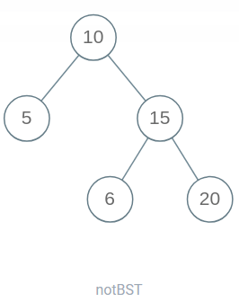
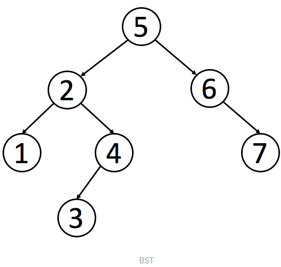
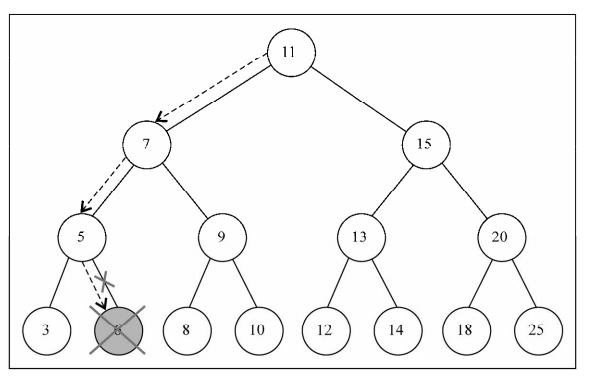
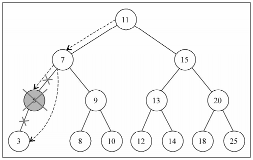
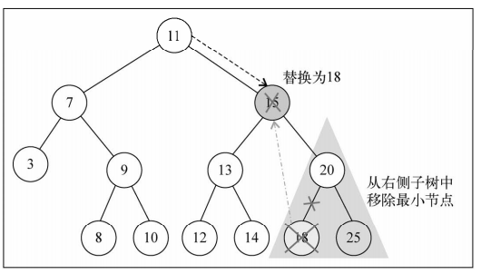

# 二叉树基础篇 —— 操作

## 思想总结

### 1. 二叉树递归遍历框架

本质思想就是：`root` 需要做什么，在他该做的地方做，其他不需要关心，交给这个框架。

```js
// 普通二叉树
function TreeNode(val){
  this.val = val;
  this.left = null;
  this.right = null;
}
// 递归遍历
function traverse(root){
  // 前序遍历，在这里操作当前节点
  traverse(root.left);
  // 中序遍历，在这里操作当前节点
  traverse(root.right);
  // 后序遍历，在这里操作当前节点
}
```

举两个简单例子

**1. 把二叉树所有的节点中的值加一**

```js
function pluseOne(root){
  if(!root) return;
  root.val += 1;
  pluseOne(root.left);
  pluseOne(root.right);
}
```


**2. 如何判断两棵二叉树是否完全相同？**

```js
function isSameTree(root1, root2){
  if(!root1 && !root2) return true; // 如果都为空，也是完全相同
  if(!root1 || !root2) return false; // 一个为空，一个非空，显然不同
  if(root1.val !== root2.val) return false;
  // 以上就是对root的判断操作，下面就是框架里的递归
  
  // 两边同时开始遍历会更节省时间
  return isSameTree(root1.left, roo2.left) && isSameTree(roo1.right, roo2.right);
}
```


### 2. 二叉搜索树

二叉搜索树（Binary Search Tree，简称 BST）是一种很常用的的二叉树。它的定义是：一个二叉树中，任意节点的值要大于等于左子树所有节点的值，且要小于等于右边子树的所有节点的值。

#### 2.1 判断 BST 的合法性

因为要求高了，所以需要在增删改查的基础上**判断 BST 的合法性**。

比如这么判断合法性就是**错误**的：

```js
function isValidBST(root){
  if(!root) return true; // 这一条是想说，如果递归能走到最后都是true说明满足了条件
  if(root.left && root.val <= root.left.val) return false;
  if(root.right && root.val >= root.right.val) return false;
  return isValidBST(root.left) && isValidBST(root.right);
}
```

为什么是错的呢？ **这样不是一个 BST ！** 正确的应该是右边的！

                          


所以是某个细节出现问题了！BST 要求整个左子树和右子树所有节点进行比较。这种情况下，我们要使用辅助函数，增加函数的参数列表，在参数中携带额外信息，就能做更多的判断操作：

```js
// 判断 BST 的合法性
function isValidBST(root){
  return isValid(root, null, null);
  
  function isValid(root, min, max){
    if(!root) return true;
    if(min && root.val <= min.val) return false;
    if(max && root.val >= max.val) return false;
    return isValid(root.left, min, root) && isValid(root.right, root, max);
  }
}
```


#### 2.2 `找` 查找一个数是否存在

正常思路，但不是最简单！就用框架来解：

```js
function isInBST(root, target){
  if(!root) return false;
  if(root.val === target) return true;
  return isInBST(root.left, target) || isInBST(root.right, target)
}
```

我们要充分利用二叉搜索树的特性，来用二分法解答。根据 target 和 root.val 大小比较就能排除另一边：

```js
function isInBST(root, target){
  if(!root) return false;
  if(root.val === target) return true;
  if(root.val < target) return isInBST(root.right, target);
  if(root.val > target) return isInBST(root.left, target);
}
```

#### 2.3 `插` BST 中插入一个数

数据结构的操作就是遍历 + 访问，遍历就是“找”， 访问就是“改”。所以插入一个数就是先找到插入位置，然后再插入操作。2.2 就是“找”的问题，，在 2.2 的基础上找到然后“改”就可以，要注意“改”的操作都是返回 Node 节点类型，并且要对递归调用的返回值进行接收。

```js
function insertIntoBST(root, val){
  if(!root) return new TreeNode(val); // 空位置插入这个新节点
  // if(root.val === val) 一般不会进行插入已存在元素的操作
  if(root.val < val) root.right = insertIntoBST(root.right, val);
  if(root.val > val) root.left = insertIntoBST(root.left, val);
  return root;
}
```

#### 2.4 `删` 删除一个数

也就是先“找”再“改”：

```js
function deleteNode(root, key){
  if(root.val === key){
    // 找到了，进行删除
  } else if(root.val > key){
    root.left = deleteNode(root.left, key)
  }else if(root.val < key){
    root.right = deleteNode(root.right, key)
  }
  return root;
}
```

这里的删除是个难点：

1. 要删除的节点没有子节点，它当场去世就可以：



```js
if(!root.left && !root.right) return null; // 相当于迭代中 5.right = null
```


2. 只有一个子节点，子节点接替他的位置就行：



```js
if(!root.left) return root.right;
if(!root.right) return root.left;
```


3. 第三种情况较麻烦，有两个子节点时候，为了不破换 BST 的规则，需要找到它左子树中最大的节点或者右子树中最小的节点来接替自己。所以一共有三个动作：1. 找到右子树的最小节点；2. 把它的值放在被替换的位置就行；3. 把子节点进行删除操作。



```js
if(root.left && root.right){
  // 找最小节点的函数
  function getMin(node){
    // 注意 BST 一定是左边最小，所以直接遍历左边，这就转化成类似链表的遍历操作了，找到最左下角的节点
    while(node.left) node = node.left;
    return node;
  }
  
  const minNode = getMin(root.right);
  root.val = minNode.val;
  root.right = deleteNode(root.right, minNode.val); // 从被删节点.right往下找到对应val删除
}
```

**注意：**这种删除操作其实也有小问题。因为我们一般不会通过 root.val = minNode.val 修改节点内部的值来交换节点，而是通过一系列略微复杂的链表操作交换 root 和 minNode 两个节点。因为具体应用中，**val 域可能会很大，修改起来很耗时**，而链表操作无非改一改指针，而不会去碰内部数据。

**完整Code**

```js
function deleteNode(root, key){
  if(!root) return null;
  if(root.val === key){
    if(!root.left && !root.right) return null; // 1
    
    if(!root.left) return root.right;
		if(!root.right) return root.left; // 2
    
    const minNode = getMin(root.right);
  	root.val = minNode.val;
 		root.right = deleteNode(root.right, minNode.val); // 3
    
  } else if(root.val > key){
    root.left = deleteNode(root.left, key)
  }else if(root.val < key){
    root.right = deleteNode(root.right, key)
  }
  return root;
  
  // 找最小值函数
  function getMin(node){
    while(node.left) node = node.left;
    return node;
  }
}
```


### 3. 总结

1. 核心就是递归框架进行遍历，我们关心单个节点的操作就可以
2. 如果当前节点对下面的子节点有影响的时候，我么能通过辅助函数来控制
3. BST 遍历框架：

```js
function traverseBST(root, target){
	if(root.val === target){
    // 进行具体操作
  }else if(root.val < target){
    traverseBST(root.right, target)
  }else if(root.val > target){
    traverseBST(root.left, target)
  }
}
```

4. 相关题目

   - [450.删除二叉搜索树中的节点](https://leetcode-cn.com/problems/delete-node-in-a-bst)

   - [701.二叉搜索树中的插入操作](https://leetcode-cn.com/problems/insert-into-a-binary-search-tree)

   - [700.二叉搜索树中的搜索](https://leetcode-cn.com/problems/search-in-a-binary-search-tree)

   - [98.验证二叉搜索树](https://leetcode-cn.com/problems/validate-binary-search-tree)

     


