# 二叉树刷题

## 1. 二叉树的重要性

举个例子，比如说我们的经典算法「快速排序」和「归并排序」，对于这两个算法，你有什么理解？**如果你告诉我，快速排序就是个二叉树的前序遍历，归并排序就是个二叉树的后续遍历，那么我就知道你是个算法高手了**。

快速排序的逻辑：若要对 `nums[lo..hi]` 进行排序，我们先找一个分界点 `p`，通过交换元素使得 `nums[lo..p-1]` 都小于等于 `nums[p]`，且 `nums[p+1..hi]` 都大于 `nums[p]`，然后递归地去 `nums[lo..p-1]` 和 `nums[p+1..hi]` 中寻找新的分界点，最后整个数组就被排序了。

**快速排序代码框架**：

```js
function quickSort(nums, lo, hi){
  const p = partition(nums, lo, hi); // 这一步是快速排序里面的划分算法，找到中间临界点
  quickSort(nums, lo, p-1);
  quickSort(nums, p+1, hi);
}
```


归并算法的逻辑：若要对 `nums[lo..hi]` 进行排序，我们先对 `nums[lo..mid]` 排序，再对 `nums[mid+1..hi]` 排序，最后把这两个有序的子数组合并，整个数组就排好序了。

**归并算法代码框架**：

```js
function mergeSort(nums, lo, hi){
  const mid = (lo + hi) / 2;
  mergeSort(nums, lo, mid);
  mergeSort(nums, mid+1, hi);
  // 合并两个排好序的子数组
  merge(nums, lo, mid, hi);
}
```

这两种算法的框架不就是二叉树的遍历操作么？


## 2. 写递归算法的秘诀

**写递归算法的关键是要明确函数的「定义」是什么，然后相信这个定义，利用这个定义推导最终结果，绝不要跳入递归的细节**。

例如：计算一棵二叉树共有几个节点

```js
function countNode(root){
  if(!root) return 0;
  return 1 + countNode(root.left) + count(root.right);
}
```

**其实只需要关心root做什么，递归的时候子节点会做相同的事情**


## 3. 算法实践

[原文1](https://mp.weixin.qq.com/s?__biz=MzAxODQxMDM0Mw==&mid=2247487126&idx=1&sn=4de13e66397bc35970963c5a1330ce18&chksm=9bd7f09eaca0798853c41fba05ad5fa958b31054eba18b69c785ae92f4bd8e4cc7a2179d7838&scene=21#wechat_redirect)  [原文2](https://mp.weixin.qq.com/s?__biz=MzAxODQxMDM0Mw==&mid=2247487270&idx=1&sn=2f7ad74aabc88b53d94012ceccbe51be&chksm=9bd7f12eaca078384733168971147866c140496cb257946f8170f05e46d16099f3eef98d39d9&mpshare=1&scene=1&srcid=1029WszdVQMGPx9PC8LBwwCK&sharer_sharetime=1603965912743&sharer_shareid=df5934c076155773d71076bd56afb49a&key=71834269ba733bc9e1008be4287fa785e76dad923b03bffb50d88f2fe7124e346d6fb106d515fe27568cb04078b51fcae96e76fe69e2f160603ac2682ce9768795b50b5be1f84511f82e21b7e05bb4740249832c25109dda87245e2fd3f9622da85d914702e0f7c0b918d2f657913b26498a431f2927caeb51206ff77cc23053&ascene=1&uin=NzAwNDM3NTIx&devicetype=Windows+10+x64&version=6300002f&lang=zh_CN&exportkey=AQ3KqgWJG3o6DbbNRqK08cY%3D&pass_ticket=T0ulhMnfnzYStZIebbnSyz5RqB4eXK2VLn85j0NGdyZcy6aaM7bgVUgfrOqbImx6&wx_header=0)

- [226 翻转二叉树]()

- [116 填充二叉树节点的右侧指针](https://leetcode-cn.com/problems/populating-next-right-pointers-in-each-node/)
- [114 二叉树展开为链表]()


### 116 填充二叉树节点的右侧指针

题目：简单来说就是 left 节点多了一个 next 指针指向 right 节点，如果没有right，就指向null。

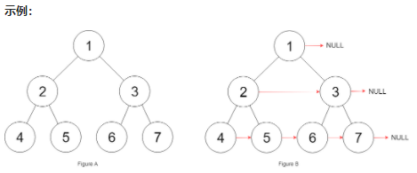

想得到但是**错误**的方法：

```js
function connect (root){
  if(!root || root.left){
    return root;
  }
  root.left.next = root.right;
  connect(root.left);
  connect(root.right);
  return root;
}
```

**有很大的问题，因为图中 5→6 他俩不属于同一个父节点，这样没办法满足**。所以要求更加细化每个节点需要做的事情，需要「跨父节点」对 5 和 6 进行连接。所以要想到增加函数参数，「将每一层二叉树节点连接起来」可以细化成「将每两个相邻节点都连接起来」：

```js
function connect(root){
  // 注意这个root不需要去有所指向，因为题目定义了这个TreeNode里面本身就有this.next=null
  if(!root) return null; 
  connecTwoNode(root.left, root.right);
  return root;
  
  // 输入两个节点，将他俩连接起来的函数
  function connectTwoNode(node1, node2){
    if(!node || !node2){
      return;
    }
    node1.next = node2; // 连接
    connectTwoNode(node1.left, node1.right);
    connectTwoNode(node2.left, node2.right);
    connectTwoNode(node1.right, node2.left); // 跨越节点连接
    // 同样最右边的节点不需要next=null，因为题目定义过TreeNode自带this.next=null
  }
}
```


### ⭐114 二叉树展开为链表

题目：

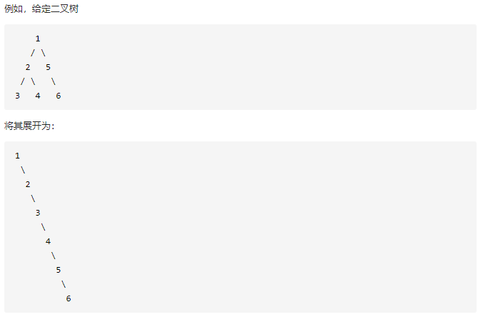

思路很简单，

1. 将 `root` 的左子树和右子树拉平 → 其实就是用递归
2. 将 `root` 的右子树接到左子树的下方，整个就是一个链表了

过程：3 移动到 4 的前一位，也就是 2.right = 3。

**注意：**这次是要用后序遍历，因为是自下而上的遍历，子节点操作之后，再操作根节点。

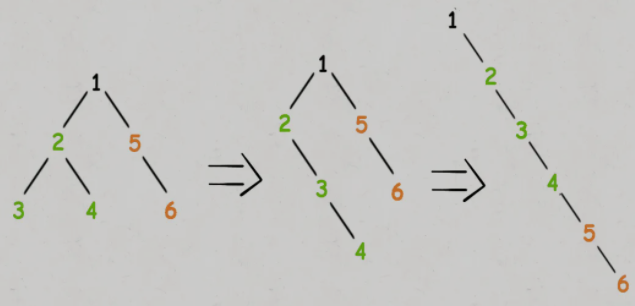

```js
function flatten(root){
    if(!root) return;
  flatten(root.left);
  flatten(root.right);

  /* root节点操作 注意后序遍历对于root来说，左右子树已经拉成了链表 */
  // 1. 将左子树部分放在右子树上面，注意用tmp保存右子树
  let right = root.right; // 保存原右子树
  root.right = root.left; 
  root.left = null; // 左子树为空
  // 2. 原先右子树接在当前后面
  let p = root;
  while(p.right){
    p = p.right
  }; // 采用链表迭代方式
  p.right = right;
}
```


### 654 数组要求转化成二叉树

题目

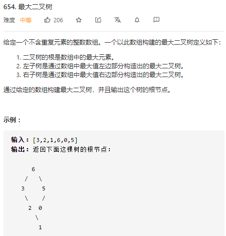


对于 `root` 节点：1. 找到当前 `nums` 中的最大值；2. 递归作用调用新数组构造左右子树。


```js
var constructMaximumBinaryTree = function(nums) {
  if(nums.length === 0) return null;
  let maxVal = Math.max(...nums); // 求数组最大值
  let root = new TreeNode(maxVal);
  root.left=constructMaximumBinaryTree(nums.slice(0, nums.indexOf(maxVal))); 
  root.right=constructMaximumBinaryTree(nums.slice(nums.indexOf(maxVal)+1));
  return root;
};
```


#### ⭐**关于ES6扩展运算符的插话：**

- **在函数调用时使用：**

  ```js
  // 以前将数组元素迭代作为函数参数用Function.prototype.apply
  function myFunction(x, y, z) { 
    console.log(x+""+y+""+z);
  } 
  let args = [0, 1, 2]; 
  myFunction.apply(null, args);
  
  // 现在用扩展运算符 ...args
  function myFunction(x, y, z) { 
    console.log(x+""+y+""+z); 
  } 
  
  let args = [0, 1, 2]; 
  myFunction(...args); // ...args返回的时各个数组的值
  ```

- **数组和对象的拷贝（浅拷贝）:**

  ```js
  var arr1 = [1,2,3];
  var arr2 = [...arr1];
  console.log(arr1 === arr2);  // false
  
  // 与Object.assign()语法一致，都是浅拷贝
  var obj1 = {a:1, b:2};
  var obj2 = {...obj1};
  console.log(obj2); //{ a:1, b:2}
  console.log(obj1 === obj2);// false
  ```

- **合并数组：**

  ```js
  var arr1 = [1,2,3];
  var arr2 = [4,5,...arr1];
  console.log(arr2); // [4,5,1,2,3]
  
  var arr1 = [1,2,3];
  var arr2 = [4,5,6];
  arr1 = [...arr2,...arr1];
  console.log(arr1);//  [1, 2, 3, 4, 5, 6] 相当于代替了unshift()方法
  ```

- **字符串转数组：**

  ```js
  var demo = "hello"
  var str = [...demo];
  console.log(str); // ["h", "e", "l", "l", "o"]
  ```

- **用于数组的不定参数：**

  ```js
  var demo = function (...arg){
     for (let item of arg){
         console.log(item);
     }
  }
  demo(1,2,3);
  // 1
  // 2
  // 3
  
  var demo = function (a,...arg){
    console.log(a);
    console.log(arg);
  }
  demo(1,2,3,4);
  // 1
  // [2, 3, 4]
  ```

- **配合解构一起使用：**

  ```js
  // 数组解构
  var [a,...rest] = [1,2,3,4];
  console.log(a); // 1
  console.log(rest); // [2,3,4]
  
  // 对象解构
  var obj = {a:1, b:2, c:3}
  var {a,...demo} = obj;
  console.log(a); // 1
  console.log(demo); // {b:2,c:3}
  
  // 函数参数解构 ⭐⭐⭐
  function f(...[a, b, c]) {
    console.log(a);
    return a + b + c;
  }
  console.log(f(1)); // 1, NaN
  console.log(f(1, 2)); // 1, NaN
  console.log(f(1, 2, 3)); // 1, 6
  console.log(f(1, 2, 3, 4)); //1, 6
  ```

#### ⭐关于js数组截取的插话：

`splice()`：删除和插入操作同时进行。**⚠ 直接对原数组进行操作，返回值是被删除部分**

- 传一个参数表示删除 a 数组后面的所有，返回值 b 是被删除的部分：

  ```js
  let a = [1, 2, 3, 4, 5];
  let b = a.splice(2);
  console.log(a); // [ 1, 2 ]
  console.log(b); // [ 3, 4, 5 ]
  ```

- 传两个参数，第二个表示删除几个

  ```js
  var a = [1, 2, 3, 4, 5]; //定义数组
  var b = a.splice(2, 1); //起始值大于length属性值不进行删除操作
  console.log(a); //返回[ 1, 2, 4, 5 ]
  console.log(b); // [3]
  ```

- 传多个参数表示，删除后在那个位置添加后面的

  ```js
  var a = [1, 2, 3, 4, 5]; //定义数组
  var b = a.splice(2, 1, 0, 0); //起始值大于length属性值不进行删除操作
  console.log(a); //返回[ 1, 2, 0, 0, 4, 5 ]
  console.log(b); // [3]
  
  // ES6扩展运算符
  var a = [1, 2, 3, 4, 5]; //定义数组
  let c = [0, 0, 0, 0, 0];
  var b = a.splice(2, 2, ...c);
  console.log(a); //返回[1, 2, 0, 0, 0, 0, 0, 5]
  console.log(b); // [3,4]
  ```

  


`slice()`：**注意返回值是截取后的数组，本身数组不变**

- 传对应索引截取

  ```js
  var a = [1, 2, 3, 4, 5]; //定义数组
  var b = a.slice(2, 4); // 下标 2 到 4
  console.log(a); // [ 1, 2, 3, 4, 5 ]
  console.log(b); //返回[3,4]
  
  var a = [1, 2, 3, 4, 5]; //定义数组
  var b = a.slice(2); // 下标 2 到最后
  console.log(b); //返回[3,4,5]
  
  var a = [1, 2, 3, 4, 5];
  var b = a.slice(-4, -2); //截取倒数第四个元素到倒数第二个元素前的元素
  console.log(b); //返回[2,3]
  ```


### ⭐⭐105 常考题

题目：


**还是要考虑根节点应该做什么**，要想办法确定根节点的值，把根节点找出来然后递归左右子树。

先要找到前序遍历和中序遍历的特点：

```js
function traverse(TreeNode root) {
  // 前序遍历
  preorder.add(root.val);
  traverse(root.left);
  traverse(root.right);
}

function traverse(TreeNode root) {
  traverse(root.left);
  // 中序遍历
  inorder.add(root.val);
  traverse(root.right);
}
```


所以 `preorder` 和  `inorder`  的数组元素分布有以下的特点：

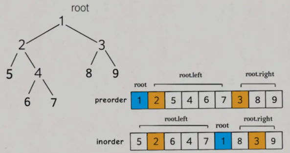


`root.val` 很好找，就是前序遍历的第一个值 `preorder[0]`

```js
function buildTree(preorder, inorder){
  
  // 这些表示数组的索引，用来传入left和right，控制找到left和right的区域
	function build(preorder, inorder){
    const rootVal = preorder[0];
    let root = new TreeNode(rootVal);
    // 找到root在中序中的索引位置
    let inIndex = inorder.indexOf(rootVal);
    
    // 递归
    root.left = build(传入处理过的preorder和inorder);
    root.right = build(传入处理过的preorder和inorder)
  }
}
```


所以这个处理很关键，**也就是找到对应 left 和 right 那一段的数组**。`preorder` 里 left 就是 `[2,5,4,6,7]` , `inorder` 中 left就是 `[5,2,6,4,7]`。

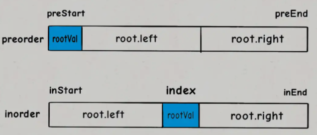

```js
// inorder比较好确定 就是index-1和index+1
let leftInorder = inorder.slice(0, inorder.indexOf(rootVal));
let rightInorder = inorder.slice(inorder.indexOf(rootVal)+1);
```

对于 `preorder` 来说，我们要用一些推导技巧来解答： `preorder` 是 根-左-右 遍历，`inorder` 是 左-根-右 遍历。**所以 **`inorder` **的 left + root =**  `preorder` **的root + left**。通过这个就能找到对应索引了！

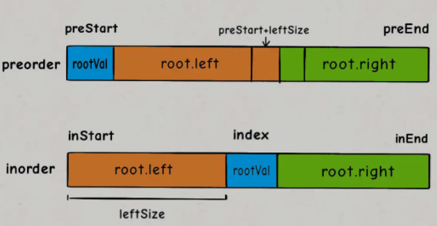


```js
// 通过inorder可以求出左子树的节点数leftSize
let leftSize = inIndex;
let leftPreorder = preorder.slice(1, 1eftSize+1);
let rightPreorder = preorder.slice(leftSize+2)
```

**完整代码**

```js
// 传入数组的头和尾的索引更高效，不用改变数组本身，省内存
var buildTree = function (preorder, inorder){
  return build(preorder, 0, preorder.length - 1, inorder, 0,inorder.length - 1);

  function build(preorder, preStart, preEnd, inorder, inStart, inEnd){
    if(preStart > preEnd) return null;
    let rootVal = preorder[preStart];
    let index = inorder.indexOf(rootVal);
    let leftSize = index - inStart;
    let root = new TreeNode(rootVal);
    root.left = build(preorder, preStart+1, preStart+leftSize, inorder, inStart, index-1);
    root.right = build(preorder, preStart+leftSize+1, preEnd, inorder, index+1, inEnd);
    return root
  }
}
```

### ⭐⭐106 常考题

题目：

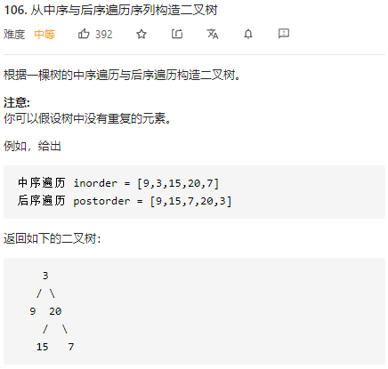


思路：和 105 题类似，分析一下 

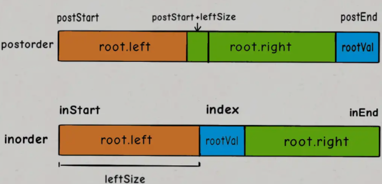


所以利用这一点。

```js
var buildTree = function(inorder, postorder) {
  return build(inorder,0,inorder.length-1,postorder,0,postorder.length-1);
  function build(inorder,inStart,inEnd,postorder,postStart,postEnd){
    if(inStart > inEnd) return null;
    let rootVal = postorder[postEnd];
    let root = new TreeNode(rootVal);
    let index = inorder.indexOf(rootVal); // 根在中序中的位置
    let rightSize = inEnd-index;
    root.left = build(inorder,inStart,index-1,postorder,postStart,postEnd-rightSize-1);
    root.right = build(inorder,index+1,inEnd,postorder,postEnd-rightSize,postEnd-1);
    return root;
  }
};
```


### ⭐⭐⭐ 297 二叉树序列化与反序列化

题目：这道题其实就和 JSON 格式和字符串互相转化类似，字符串占内存更小。

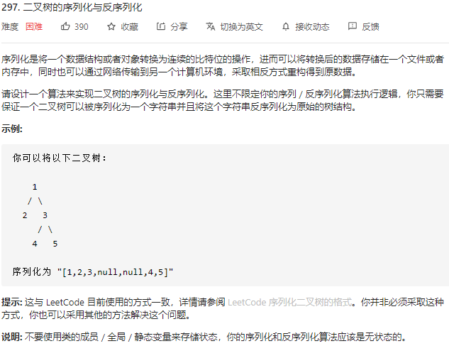

这种序列化其实就是**考察二叉树的遍历方式**。

二叉树的遍历方式有哪些？递归遍历方式有前序遍历，中序遍历，后序遍历；**迭代方式一般是层级遍历**（题目的示例是这种层级遍历，但题目没有规定用上面算法逻辑执行，只要求变成字符串且字符串能变回二叉树）。本文就把这些方式都尝试一遍，来实现 `serialize` 方法和 `deserialize` 方法。

#### 1. 前序遍历解法

前序遍历会做的事情：

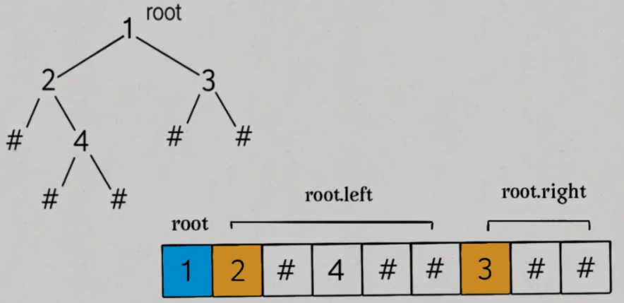

```js
// 把二叉树序列化成字符串
function serialize(root) {
  const SEP = ","; // 分割逗号
  const NULL = "null"; // 空指针字符
  let treeStr = "";
  return TreeString(root, treeStr);
  function TreetoString(root, treeStr){
    if(!root) {
      treeStr += NULL + SEP; 
      return;
    }
    treeStr += root.val + SEP;
    TreetoString(root.left, treeStr);
    TreetoString(root.right, treeStr);
    return treeStr;
  }
};
```

反序列化的过程也要先确定 `root` ，


##### 关于字符串操作的插话：

参考文章：[js字符串操作大全](https://www.cnblogs.com/guoyeqiang/p/8178336.html)

1. 字符串转化

   ```js
   // 1.toString()
   var num=24;
   var mystr=num.toString(); //"24"
   ⭐var mystr=String(num);    //"24"
   // ⭐2.
   var num=24;
   var mystr="" + num;    //"24"
   ```

2. 字符串分割：`split(分割的字符，分割的数组长度)` 

   ```js
   var mystr="qing,cheng";
   var arr1=mystr.split(","); // [ 'qing', 'cheng' ]
   var arr2=mystr.split(""); // ['q', 'i', 'n', 'g', '，', 'c', 'h', 'e', 'n', 'g'];
   // 第二个参数
   var mystr = 'qing,cheng';
   var arr1 = mystr.split(',', 2); // [ 'qing，cheng' ]
   var arr2 = mystr.split('', 3); // [ 'q', 'i', 'n' ]
   ```

3. 字符串替换： `replace(被替换的地方，替换成什么)` 

4. 字符串长度：`length()`

5. 查询字符串：`indexOf(要查的字串)`返回第一次出现的索引；`lastIndexOf()`返回最后一次出现的索引

6. 查询值或 ACSⅡ 值：`str.charAt(索引)`：返回结果； `str.charCodeAt(索引)`：返回对应ACSⅡ的值

7. **字符串切割和提取**：

   - `str.slice(开始索引，结束索引)`：索引可以为负或为正

     ```js
     var mystr="hello world!";
     var sliceStr1=mystr.slice(-3);    //ld!
     var sliceStr2=mystr.slice(-3,-1);    //ld
     var sliceStr3=mystr.slice(3);    //lo world!
     var sliceStr4=mystr.slice(3,7);    //lo w
     ```

   - `str.substring()`：和 `slice()` 同，但是所有只能是非负整数

   - `str.substr(开始索引，截取的长度)`：第二个参数不传到末尾

     ```js
     var mystr = 'hello world!';
     var sliceStr1 = mystr.substr(3); // lo world!
     var sliceStr2 = mystr.substr(3, 7); // lo worl
     ```


