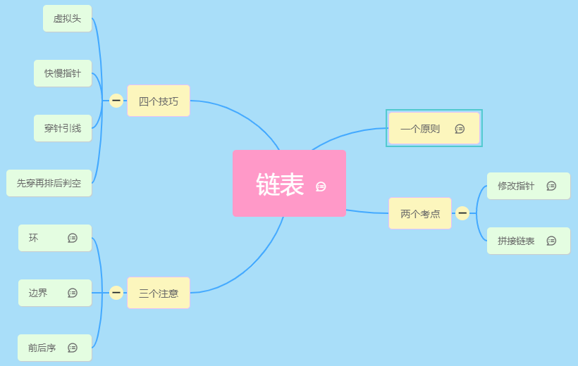

# 链表题型终极总结

参考原文：[luicker](https://mp.weixin.qq.com/s?__biz=MzI4MzUxNjI3OA==&mid=2247485582&idx=1&sn=eff845460e91be97026c937b229c2989&chksm=eb88c497dcff4d81e08ac30951b160f0083bc9fe5a2b64b8e1ea9e0988e14a9df2b56515f508&mpshare=1&scene=1&srcid=1109nHvmqYOfv8qMsFnT6VvS&sharer_sharetime=1604917912300&sharer_shareid=887d04566c34e5f38ff4fd051a5b689e&clicktime=1604918543&enterid=1604918543&ascene=1&devicetype=iOS14.1&version=17001227&nettype=WIFI&abtest_cookie=AAACAA%3D%3D&lang=zh_CN&fontScale=100&exportkey=AWmVcwHMIiwrei30Q5VVhQo%3D&pass_ticket=KHTSlUEJeyrX70No%2FdJRwHBBpdiiwSrSVymbMXbXtfnVLvE6MajjjTVnhsOXqWwN&wx_header=1)

具体参见： [blink-mind](./ListNode2.assets/linked-list.blinkmind)

