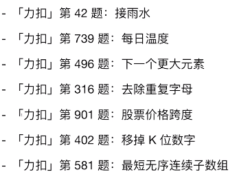
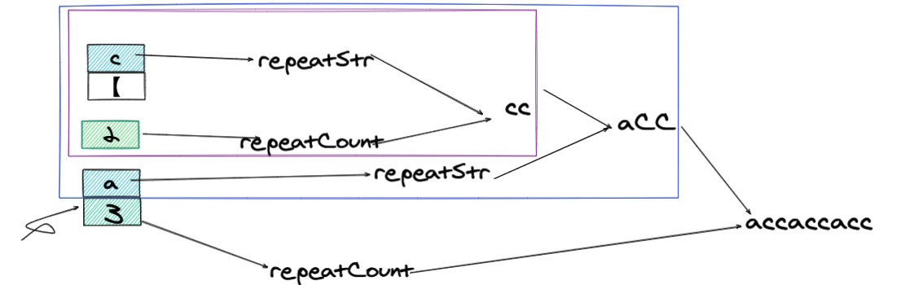
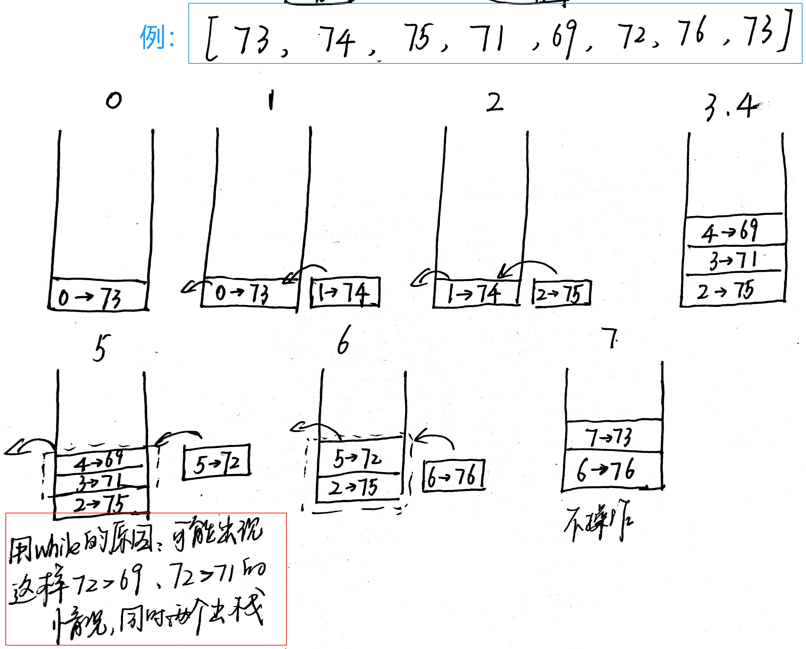
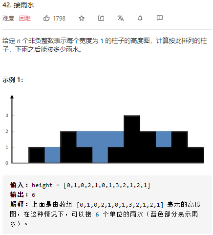
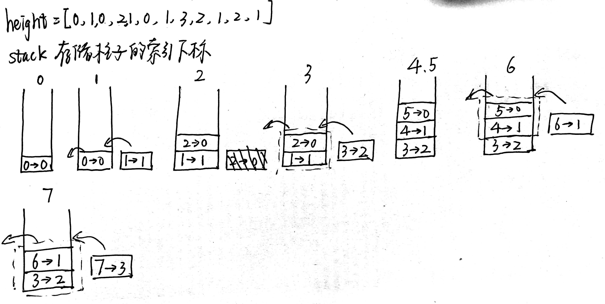
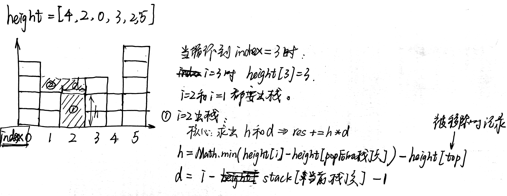
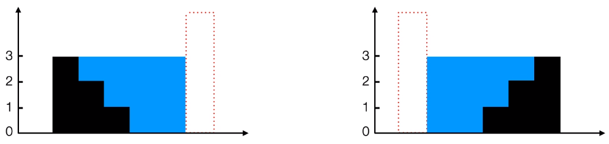
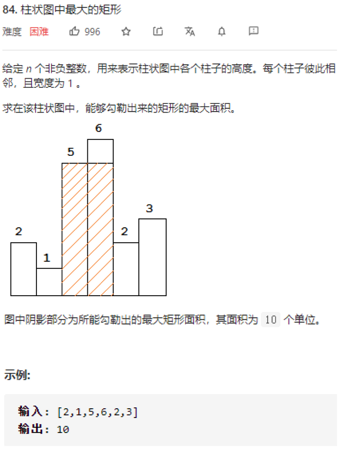
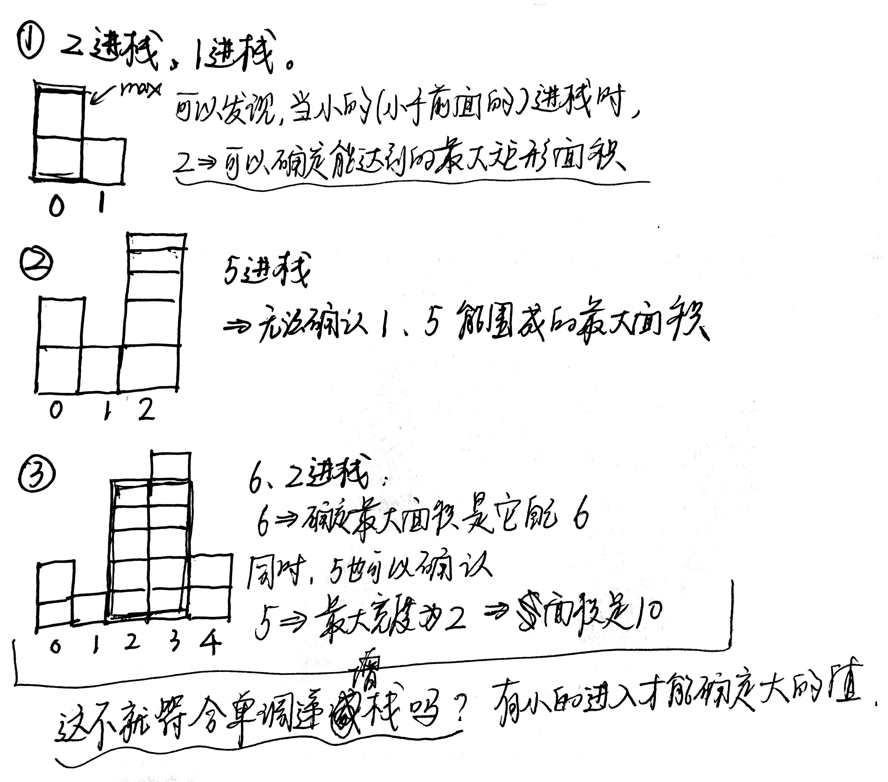
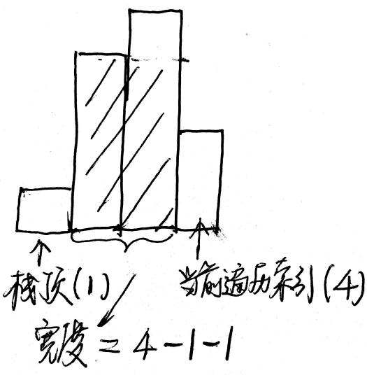

# 栈相关题目总结



## 1. 394 字符串解码

**[题目](https://leetcode-cn.com/problems/decode-string/)：**


**思路：**

题目给的条件只会出现四种可能的字符：字母、数组、[ 、]。且 [ ] 要成对出现。 

所以我们利用栈实现这样的操作：

- 如果是字母 => 添加到 stack 当中
- 如果是数字 => 先不急着添加，因为可能有多位数字
- 如果是 [ => 说明字符串开始 => 将数字入栈 => 并且将数字清零
- 如果是 ] => 说明字符串结束 => 将重复字符串重复前一步存储的数字遍数 => 出栈

以  `s = "3[a 2[c] ]"` 举例：



1. **采用迭代做法**：

   **⭐易错点：**判断数字的时候要注意 => **字符串遍历后的字符属于 String 类型**。所以只能采用 `isNaN()` 方法。 `+“3”` 也不行，因为 `typeof +"a" => number` 所以这个方法失效。

   ```js
   var decodeString = function(s) {
     let stack = [];
     for(let k of s){ // k of str => k是item；k in str => k是index ！！！数组同
       if(k=="]"){
         let repeatStr=""; let repeatCount="";
         // 遍历到 [ 的位置，把字符串都出栈且存在respeatStr中
         while(stack.length!==0 && stack[stack.length-1] !== "["){
           repeatStr = stack.pop() + repeatStr
         }
         stack.pop(); // pop掉"["
         // 遍历完数字，存入repeatCount
         /*
         * 问题出在这！！！
         * 字符串遍历之后的每个字符k是string类型！！！不是number类型！！
         * isNaN()的具体含义：内容能否被转化成数值！"3"可以但是"a"不行
         */
         while(stack.length!==0 && !isNaN(stack[stack.length-1])){
           repeatCount = stack.pop() + repeatCount
         }
         stack.push(repeatStr.repeat(parseInt(repeatCount)))
       }else{
         stack.push(k)
       }
     }
     return stack.join("")
   };
   ```

   复杂度分析：时间复杂度：O(n)，有一遍循环(内部的算部分循环); 空间复杂度：O(n)，新建了 `stack` 数组

2. **递归**

   想法：碰到 [ 就进入递归。

   ```python
   class Solution:
     def decodeString(self, s: str) -> str:
       def dfs(start):
         repeat_str = repeat_count = ''
         while start < len(s):
           if s[start].isnumeric():
             repeat_count += s[start]
           elif s[start] == '[':
             # 更新指针
             start, t_str = dfs(start + 1)
             # repeat_count 仅作用于 t_str，而不作于repeat_str
             repeat_str = repeat_str + t_str *(repeat_count)
             repeat_count = ''
           elif s[start] == ']':
             return start, repeat_str
           else:
             repeat_str += s[start]
           start += 1
       return repeat_str
       return dfs(0)
   ```


## 2. 232 用栈实现队列

**题目：**

```js
使用栈实现队列的下列操作：

push(x) -- 将一个元素放入队列的尾部。
pop() -- 从队列首部移除元素。
peek() -- 返回队列首部的元素。
empty() -- 返回队列是否为空。
示例:

MyQueue queue = new MyQueue();

queue.push(1);
queue.push(2);
queue.peek(); // 返回 1
queue.pop(); // 返回 1
queue.empty(); // 返回 false
说明:

你只能使用标准的栈操作 -- 也就是只有 push to top, peek/pop from top, size, 和 is empty 操作是合法的。
你所使用的语言也许不支持栈。你可以使用 list 或者 deque（双端队列）来模拟一个栈，只要是标准的栈操作即可。
假设所有操作都是有效的、 （例如，一个空的队列不会调用 pop 或者 peek 操作）。
```

**思路：**用到第二个栈来存储出栈的元素。

```js
var MyQueue = function() {
  this.stack=[];
  this.helpStack=[];
};

MyQueue.prototype.push = function(x) {
  let current = null;
  while((current=this.stack.pop())){ // 会进行重复执行工作并赋给current
    this.helpStack.push(current)
  }
  this.helpStack.push(x);
  while((current=this.helpStack.pop())){
    this.stack.push(current)
  }
};

MyQueue.prototype.pop = function() {
  return this.stack.pop()
};

MyQueue.prototype.peek = function() {
  return this.stack[this.stack.length-1];
};

MyQueue.prototype.empty = function() {
  return this.stack.length === 0
};
```

**注意：**

```js
while((current=stack.pop())){
  console.log(current);
  // 这样循环会执行stack.pop()至stack为空！记住！
}
```


## 3. ⭐768 最多能完成排序的块Ⅱ

**题目：**

```js
这个问题和“最多能完成排序的块”相似，但给定数组中的元素可以重复，输入数组最大长度为2000，其中的元素最大为108。

arr是一个可能包含重复元素的整数数组，我们将这个数组分割成几个“块”，并将这些块分别进行排序。之后再连接起来，使得连接的结果和按升序排序后的原数组相同。

我们最多能将数组分成多少块？

示例 1:

输入: arr = [5,4,3,2,1]
输出: 1
解释:
将数组分成2块或者更多块，都无法得到所需的结果。
例如，分成 [5, 4], [3, 2, 1] 的结果是 [4, 5, 1, 2, 3]，这不是有序的数组。
示例 2:

输入: arr = [2,1,3,4,4]
输出: 4
解释:
我们可以把它分成两块，例如 [2, 1], [3, 4, 4]。
然而，分成 [2, 1], [3], [4], [4] 可以得到最多的块数。
注意:

arr的长度在[1, 2000]之间。
arr[i]的大小在[0, 108]之间。
```

**思路：**

```js

```

**复杂度分析：**


## 4. 739 每日温度

**[题目](https://leetcode-cn.com/problems/daily-temperatures/)：**


**思路：**

首先，暴力遍历法很简单，就是两层遍历，每次都去向后找大于该数，找到就 break。

```js
funtion dailyTemperatures(T){
  let res = new Array(T.length).fill(0);
    for(let i = 0; i < T.length; i++){
        for(let j = i + 1; j < T.length; j++){
            if(T[j] > T[i]){
                res[i] = j - i;
                break;
            }
        }
    }
    return res;
}
```

**单调递减栈做法：**相当于空间换时间。

res 数组存的是结果；栈 stack 数组存的是每个要存进去的**索引**，存索引会更加方便计算结果！



```js
funtion dailyTemperatures(T){
  let stack=[]; // 注意这里存的是T的index，去具体指再用T[stack[0]]
  let res=new Array(T.length).fill(0); // 保存index的差值
  for(let i=0;i<T.length;i++){
    while(stack.length !==0 && T[stack[stack.length-1]]<T[i]){ 
      // 栈顶元素存的是T的index! 如果小与T[i]就pop出来
      res[stack[stack.length-1]] = i - stack[stack.length-1]; 
      // res存入现在的索引值减去栈顶的索引值
      stack.pop();
    }
    stack.push(i)
  }
  return res;
}
```


## 5. ⭐接雨水问题

**[题目：](https://leetcode-cn.com/problems/trapping-rain-water/)**



### 思路

**这种题不能考虑整体，就得考虑局部。**所以这道题的局部就是每个位置的雨水量应该是多少。应该是 Math.min("左边雨水最大值", "右边雨水最大值") 和当前雨水量的差值。

#### 1. 暴力法

遍历 => 找到左最大、右最大，能积的雨水时两者之间的减去每个柱子的高度。

```js
function trap(height) {
	let res = 0;
  for(let i=1;i<height.length-1;i++){
    let max_left = 0, max_right = 0;
    // 找到左边最高的柱子
    for(let j=i;j>=0;j--){
      max_left = Math.max(max_left, height[j]);
    }
    // 找到右边最高的柱子
    for(let j=i;j<height.length;j++){
      max_right = Math.max(max_right, height[j])
    }
    res += Math.min(max_left, max_right) - height[i]
  }
  return res;
};
```

时间复杂度：O(n^2)；空间复杂度：O(1)，没有额外空间。


#### 2. 备忘录优化

肯定是有算过重复的。就用备忘录记录一下！

我们可以换一种思路。两次遍历：左向右遍历和右向左遍历，用 `r_max` 和 `l-max` 两个数组来存储具体每个 i 位置左边最大高度和右边最大高度。=> 两层遍历变成了三个同时进行的遍历。

```js
function trap(height){
  if(!height.length) return 0;
  let res = 0;
  let left_max=[], right_max=[];
  left_max[0]=height[0], right_max[height.length-1]=height[height.length-1];
  // 左向右遍历，找出每个index的最大左高度
  for(let i=1;i<height.length;i++){
    left_max[i] = Math.max(height[i], left_max[i-1])
  }
  // 右向左遍历，找出每个index的最大右高度
  for(let i=height.length-2;i>=0;i--){
    right_max[i] = Math.max(height[i], right_max[i+1])
  }
  // 再遍历一次找到最大左高度和最大右高度的最小值 - 当前柱子高度
  for(let i=1;i<height.length-1;i++){ // 为什么从1到倒数第二个呢？因为头和尾没办法存储雨水的！
    res+=Math.min(left_max[i], right_max[i]) - height[i]
  }
  return res
}
```

**复杂度分析：**其实就是避免了一些重复计算，思路没有本质改变。用空间换时间。空间复杂度变成O(n)，时间复杂度降为O(n)。


#### 3. ⭐栈方法！

**当后面的柱子高度比前面低时，无法接到雨水。所以我们用单调递减栈存储可能储水的柱子。当找到一根比前面高的柱子，就可以计算接到的雨水了。**



**一定要画图理解一下：**



```js
function trap(height){
	let res=0;
  let stack=[];
  for(let i=0;i<height.length;i++){
    while(stack.length && height[i]>height[stack[stack.length-1]]){ // 当前值大于栈顶值
      const top = stack.pop(); // 移除顶部的值
      if(!stack.length) break; // 栈为空说明左边没有高柱子了，直接跳出循环
      const width = i-stack[stack.length-1]-1; // 积水面积的宽度
      const bounded_height = Math.min(height[i], height[stack[stack.length-1]])-height[top]; //积水高度
      res += width * bounded_height;
    }
    stack.push(i);
  } 
  return res
}
```

**复杂度分析：**时间复杂度O(n)，空间复杂度O(n)


#### 4. ⭐双指针

**这个方法是从 2 方法的动态规划中优化过来的。**动态规划本质是边走边算。

**积水的高度由 `Math.min(左最大高，右最大高)` 这个式子来决定。换句话说，谁小谁决定了积水高度。**



所以我们要用到双指针 `left` 和 `right` ，一左一右开始遍历，如果遇到更高的柱子，就要从存储过的次高度开始计算积水面积。所以用这种方式计算积水量应该是到达位置后：**left_max/right_max(谁小用谁) - height[i]**。

```js
function trap(height){
  let left = 0, right = height.length-1; // 指针来滑动索引值
  let left_max = 0, right_max = 0, res = 0;
  while(left < right){
    if(height[left]<height[right]){
      if(height[left]>left_max){ // 当前更大，更新最大值
        left_max = height[left]
      }else{ // 不大说明形成低洼了！我们只计算该点下的积水量
        res += left_max - height[left];
      }
      left++;
    }else{
      if(height[right]>right_max){
        right_max = height[right]
      }else{
        res += right_max - height[right]
      }
      right--
    }
  }
  return res
}
```

**复杂度分析：**空间复杂度 => 只使用了额外的变量没有额外空间，所以O(1)；时间复杂度O(n)。


## 6. 接雨水Ⅱ

**二维变空间！后议**


## 7. ⭐柱状图中的最大矩形

**[题目：](https://leetcode-cn.com/problems/largest-rectangle-in-histogram/)**




### 思路

#### 1.暴力法

对于计算面积，要么固定宽度变高度，要么固定高度变宽度。

1. **固定高度的做法**：固定高度下，要注意向两边延伸没找到能达到这个高度的最长宽度。所以采用 `left` 和 `right` 两个指针。

   ```js
   var largestRectangleArea = function(heights) {
     let res = 0;
     for(let i=0;i<heights.length;i++){
       let height = heights[i];
       let left=i, right=i;
       while(left-1>=0 && heights[left-1]>=height){
         left--
       }
       while(right+1<heights.length && heights[right+1]>=height){
         right++
       }
       res = Math.max(res, (right-left+1)*height)
     }
     return res
   };
   ```

2. **固定宽度的做法**：固定宽度下，第二层遍历，找到每个宽度下的最大能达到的高度，然后进行计算。

   ```js
   var largestRectangleArea = function(heights) {
     let res = 0;
     for(let i=0;i<heights.length;i++){
       let minHeight = heights[i];
       for(let j=i;j<heights.length;j++){
         minHeight = Math.min(minHeight, heights[j]); // 记录每个固定宽度下的最大能达到的高度
         res = Math.max(res, minHeight*(j-i+1))
       }
     }
     return res
   };
   ```

**复杂度分析**：时间复杂度 => 两层遍历 O(n^2)；空间复杂度：O(1)。


#### 2. 栈

**为什么能用栈？？**以 [2, 1, 5, 6, 2, 3] 为例，我们研究一下。




**所以是想了解每一个索引位置上，他能在他自身高度上取到的最大宽度 => 转化成栈。**

**本质上：**能出栈说明我已经知道能勾勒出来的最大面积，不能出栈说明还不能确定。

**深度解析：**

1. 遍历 heights 数组的过程中：满足后一个小于前一个，就进行操作。

   - 高度：就是它本身的高度很好求

   - 宽度：你可以换个想法，具体到要出栈的最后一次出栈情况。它属于要出栈的里面最矮的，所以相应他的宽度要最多。应该是当前索引 - 删除完自己后剩下顶层索引 - 1。 下图就是最后一次的情况：

     

2. 遍历完成 heights 数组后，栈内还有剩下的元素，也有三种情况。我们就以示例来分析一下：

   - 栈顶的，现在是 `heights[5]` 元素，它相当于是场上最高的块了(栈内的相比)，所以他只能用自己高度 * 宽度，因为没办法拓展，很简单，但是算起来，宽度 = heights.length - 删除后栈顶索引 - 1
   - 场上第二矮，现在是 `heights[4]` 元素，它可以拓展，高度肯定是他自己没问题。宽度：作为场上第二矮的元素，是不是最多能延伸的第一矮的地方，所以左边被 `heights[2]` 挡着，右边没人挡着， width = heights.length - 第一矮的索引 - 1，第一矮的索引不就是删除后栈顶那个索引么
   - 场上第一矮，它的宽度必然是整个 heights.length，那它属于 pop 之后 stack 为空的情况，所以正好满足了 if 条件

   所以这三种情况都合并在一起了。**其实本质上可以想象成，在 `height[height.length]` 上面多了一个0，挡住了所有退路。这样 遍历里面的 i 就顺利成章的替换成了 len 。**

```js
var largestRectangleArea = function(heights) {
  const len = heights.length;
  if(!len) return 0;
  if(len === 1) return heights[0];

  let res = 0;
  let stack = []; // 递增栈：遇到小的就出栈
  for(let i=0;i<len;i++){
    while(stack.length && heights[stack[stack.length-1]]>heights[i]){
      let height = heights[stack.pop()]; // 存栈顶的高度然后删除
      let width=0;
      if(!stack.length){
        width = i
      }else{
        width = i-stack[stack.length-1]-1;
      }
      res = Math.max(res, width*height);
    }
    stack.push(i);
  }

  while(stack.length){
    let height = heights[stack.pop()]; 
    let width=0;
    if(!stack.length){
      width = len
    }else{
      width = len-stack[stack.length-1]-1;
    }
    res = Math.max(res, width*height);
  }
  return res;
};
```


#### 3. 哨兵思想

**经过了上面一大串分析，我们发现，如果想合并两个 while，其实可以在 `heights` 数组头和尾加上两个 0 就行，这就是哨兵思想，链表里用的多。**

换个角度想想，在头加上个 0 ，相当于高度为0，后面所有的元素都大于 0 ，所以面积都不确定。在尾巴加上 0 ，前面所有的元素都大于 0 ，所以满足条件，所有的元素都能出栈。

```js
var largestRectangleArea = function(heights) {
  if(!heights.length) return 0;
  if(heights.length === 1) return heights[0];
  heights.unshift(0);
  heights.push(0);
  const len = heights.length;

  let res = 0;
  let stack = []; // 递增栈：遇到小的就出栈
  for(let i=0;i<len;i++){
    while(stack.length && heights[stack[stack.length-1]]>heights[i]){
      let height = heights[stack.pop()]; // 存栈顶的高度然后删除
      let width=0;
      if(!stack.length){
        width = i
      }else{
        width = i-stack[stack.length-1]-1;
      }
      res = Math.max(res, width*height);
    }
    stack.push(i);
  }
  return res;
};
```


