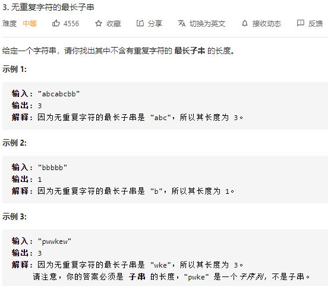
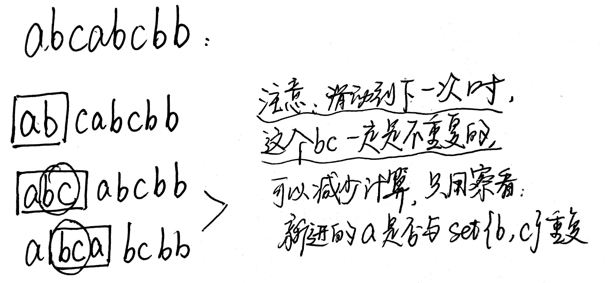
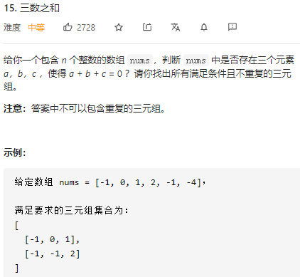

# 字符串相关问题


## 字符串全排列问题

### 1. [按字典序排列](https://www.nowcoder.com/practice/fe6b651b66ae47d7acce78ffdd9a96c7?tpId=188&tqId=36164&rp=1&ru=%2Factivity%2Foj&qru=%2Fta%2Fjob-code-high-week%2Fquestion-ranking)

**题目**：输入一个字符串，打印出该字符串中字符的所有排列。例如输入字符串abc，则输出由字符a，b，c所能排列出来的所有字符串abc，acb，bac，bca，cab和cba

**这题考察字符串的[全排列算法](https://blog.csdn.net/wzy_1988/article/details/8939140)**。

#### 思路1：递归

为什么能用递归？

**递归的特点**：

- 必须有可达到的终止条件，否则程序陷入死循环
- 子问题在规模上比原问题小
- 子问题可通过再次递归调用求解
- 子问题的解应能组合成整个问题的解


## 刷题

### 字节跳动真题

#### 1.  3 [无重复字符的最长子串](https://leetcode-cn.com/problems/longest-substring-without-repeating-characters/)

**题目：**



**思路：滑动窗口**

滑动窗口对于这道题的优势在于：



所以，我们用 `Set()` 存储来看每个字符是否出现过。

注意几点：1. left 不在最头头的时候，我们要记得每次新遍历的时候删除滑动的起始位置。

```js
var lengthOfLongestSubstring = function(s) {
  const set = new Set();
  const len = s.length;
  let right = -1; // 右指针来模拟移动窗口的右端，左端用遍历来表示就好
  let res = 0;
  for(let left=0;left<len;left++){
    if(left!=0){
      set.delete(s.charAt(left-1))
    }
    while(right+1<len && !set.has(s.charAt(right+1))){
      set.add(s.charAt(right+1));
      right++
    }
    res = Math.max(res, right-left+1)
  }
  return res
};
```


#### 2. 15 [三数之和](https://leetcode-cn.com/problems/3sum/)

**题目：**



**思路：尽可能去重**

暴力法肯定是三重循环 + 结果去重。为了优化：

1. 将 nums 进行排序，这样循环的时候不用每次从头。**并且，当第一层循环的 i>0 时，一定中止循环，因为后面的都比 i 大，不可能凑成等于 0**
2. 用双指针将三重循环将为二重。实际上也是夹逼求和的过程
3. 进一步去重：如果 nums[i]=nums[i-1] / nums[left] = nums[left+1] /  nums[right] = nums[right+1] ，这三种情况都应该 continue

```js
var threeSum = function(nums) {
  let res = [];
  const len = nums.length;
  if(nums === null || len < 3) return res
  nums.sort((a,b)=>a-b);
  for(let i=0;i<len;i++){
    if(nums[i]>0) break; // 大于0，三数之和肯定大于0
    if(i>0 && nums[i] === nums[i-1]) continue; // 去重
    let left = i+1;
    let right = len-1;
    while(left<right){
      const sum = nums[i]+nums[left]+nums[right];
      if(sum === 0){
        res.push([nums[i],nums[left],nums[right]]);
        while(left<right && nums[left] === nums[left+1]) left++; // 去重
        while(left<right && nums[right]===nums[right-1]) right--; // 去重
        left++;
        right--;
      }else if(sum < 0) {
        left++;
      }else if(sum > 0) right--;
    }
  }
  return res
};
```


