# 动态规划系列

## 1. 概述和框架

**动态规划问题的一般形式就是求最值**。动态规划其实是运筹学的一种最优化方法，只不过在计算机问题上应用比较多，**比如说让你求最长递增子序列呀，最小编辑距离呀等等。**

求最值 → 核心问题就是：**穷举**。

但是动态规划的穷举有几个特点：

1. 一般穷举都会**存在「重叠子问题」**，暴力穷举效率低下。
2. 动态规划问题一定**具备「最优子结构」**
3. 只有列出**正确的「状态转移方程」**才能正确地穷举。

所以，以上提到的**重叠子问题**、**最优子结构**、**状态转移方程**就是动态规划三要素。**写出状态转移方程是最困难的**

辅助你思考状态转移方程的思路：

**明确 base case -> 明确「状态」-> 明确「选择」 -> 定义 dp 数组/函数的含义**。

```c++
# 初始化 base case
dp[0][0][...] = base
# 进行状态转移
for 状态1 in 状态1的所有取值：
    for 状态2 in 状态2的所有取值：
        for ...
            dp[状态1][状态2][...] = 求最值(选择1，选择2...)
```

下面用几道经典题来理解框架。

### 1.1 斐波那契数列

#### 1. 暴力递归

```js
function fib(n){
  if(n === 1 || n === 2) return 1;
  return fib(n -1) + fib(n - 2);
}
```

假设 n=20，画出递归树：

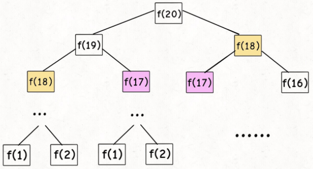

**递归算法的时间复杂度该怎么计算？就是用子问题个数 × 解决一个子问题的时间。**

首先，可以看到递归树中节点的总数为指数级别。子问题个数为 O(2^n)。

其次，题解中没有循环，只有一个加法，所以操作时间是 O(1)。

所以，整个时间复杂度就是二者相乘， O(2^n)，指数级别。

递归树低效的原因：比如 `f(18)` 被计算了两次，且 `f(18)` 这颗递归树体量巨大，多算一次很费劲。

所以要想办法解决动态规划问题的第一个性质：**重叠子问题**。

#### 2. 带备忘录的递归解法

即然耗时的原因是重复计算，那么我们可以造一个「备忘录」，每次算出某个子问题的答案后别急着返回，先记到「备忘录」里再返回；每次遇到一个子问题先去「备忘录」里查一查，如果发现之前已经解决过这个问题了，直接把答案拿出来用，不要再耗时去计算了。

一般使用一个数组充当这个「备忘录」，当然你也可以使用哈希表（字典），思想都是一样的。

```java
int fib(int N){
  if(N < 1) return 0;
  int[] memo = new int[N+1];
  return helper(memo, N);
}
int helper(int[] memo, int n){
  if(n == 1 || n==2) return 1;
  if(memo[n] != 0) return memo[n]; // 不是0说明存储了东西
  memo[n] = helper(memo, n-1) + helper(memo, n-2);
  return memo[n];
}
```

备忘录 `memo` ，记录了每一次递归的值。递归树被简化成了这个样子。

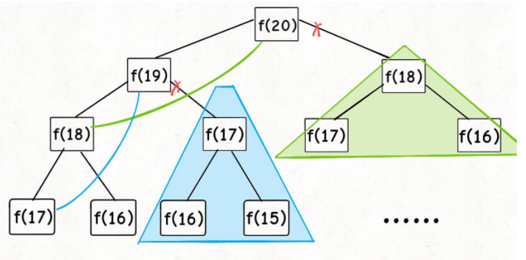

所以，实际上每个节点只计算了一次。所以时间复杂度变成了O(n)。

- 自顶向下：画递归树的时候是从上向下延伸，直至 `f(1)` 和 `f(2)` 这两个base case。然后逐层返回答案。
- 自底向上：我们直接从最底下，最简单，问题规模最小的 `f(1)` 和 `f(2)` 开始往上推，直到推到我们想要的答案 `f(20)`，这就是动态规划的思路，这也是为什么动态规划一般都脱离了递归，而是由循环迭代完成计算。

#### 3. DP 数组的迭代解法

有了上一步「备忘录」的启发，我们可以把这个「备忘录」独立出来成为一张表，就叫做 DP table 。**这张表上完成「自底向上」。**

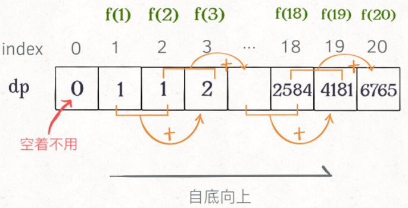

```java
int fib(int N){
  if(N == 0) {
      return 0;
  }else if(N == 1 || N == 0){
      return 1;
  };
  int[] dp = new int[N+1];
  dp[1] = dp[2] = 1; //base case
  for(int i = 3;i <= N; i++){
		dp[i] = dp[i-1] + dp[i-2];
  };
  return dp[N];
}
```

为啥叫「状态转移方程」？其实就是为了听起来高端。你把 `f(n)` 想做一个状态 `n`，这个状态 `n` 是由状态 `n - 1` 和状态 `n - 2` 相加转移而来，这就叫状态转移。

**动态规划问题最困难的就是写出这个暴力解，即状态转移方程**。只要写出暴力解，优化方法无非是用备忘录或者 DP table，再无奥妙可言。

**这道题还能进行优化的点：**这题状态转移方程只和前两个状态相关，所以不需要那么长的 DP table 来存储所有的状态，只需要存储之前的两个状态就行，空间复杂度降为 O(1)：

```java
int fib(int n){
  if(n == 0) return 0;
  if(n==2||n==1) return 1;
  int prev = 1,curr = 1;
  for(int i=3;i<=n;i++){
    int sum = prev + curr;
    prev = curr;
    curr = sum;
  }
  return curr;
}
```

斐波那契数列的例子严格来说不算动态规划，因为没有涉及求最值，以上旨在说明重叠子问题的消除方法，演示得到最优解法逐步求精的过程。下面，看第二个例子，凑零钱问题。

### 1.2 凑零钱问题

**题目**：给你 `k` 种面值的硬币，面值分别为 `c1, c2 ... ck`，每种硬币的数量无限，再给一个总金额 `amount`，问你**最少**需要几枚硬币凑出这个金额，如果不可能凑出，算法返回 -1 。

#### 1. 暴力递归

首先，这个问题是动态规划问题，因为它具有「最优子结构」的。**要符合「最优子结构」，子问题间必须互相独立**。为什么这题属于子问题互相独立呢？比如你想求 `amount = 11` 时的最少硬币数（原问题），如果你知道凑出 `amount = 10` 的最少硬币数（子问题），你只需要把子问题的答案加一（再选一枚面值为 1 的硬币）就是原问题的答案。因为硬币的数量是没有限制的，所以子问题之间没有相互制，是互相独立的。

比如 `amount = 11, coins = {1,2,5}` 时，画出递归树看看：

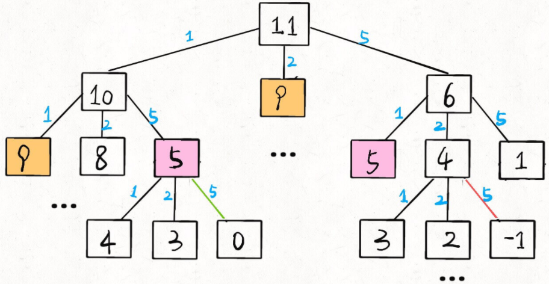

**重点：列出正确的状态转移方程。**

1. **base case**：目标金额 `amount` 为 0 时算法返回 0
2. **确定「状态」：也就是原问题和子问题中会变化的变量**。唯一的「状态」就是目标金额 `amount`。
3. **确定「选择」：也就是导致「状态」产生变化的行为**。目标金额为什么变化呢，因为你在选择硬币，你每选择一枚硬币，就相当于减少了目标金额。所以说所有硬币的面值，就是你的「选择」。
4. **明确** **`dp`** **函数/数组的定义**。`dp(n)` 的定义：输入一个目标金额 `n`，返回凑出目标金额 `n` 的最少硬币数量。

`dp(n)` 状态转移方程思路如下：

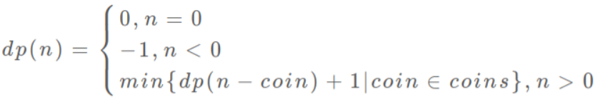

**伪码：**

```c++
def coinChange(coins: List[int], amount: int):

		# 定义：要凑出金额 n，至少要 dp(n) 个硬币
    def dp(n):
        # base case
        if n == 0: return 0
        if n < 0: return -1
        # 求最小值，所以初始化为正无穷
        res = float('INF')
        # 做选择，选择需要硬币最少的那个结果
        for coin in coins:
            subproblem = dp(n - coin)
            # 子问题无解，跳过
            if subproblem == -1: continue
            res = min(res, 1 + subproblem)

        return res if res != float('INF') else -1
		# 题目要求的最终结果是 dp(amount)
    return dp(amount)
```


JS 代码（在题解里提交会超时），所以必须去优化重复的计算。

```java
let res = Infinity;
var coinChange = function (coins, amount) {
  return dp(amount);
  function dp(amount) {
    // base case
    if (amount == 0) return 0;
    if (amount < 0) return -1;
    for (let coin of coins) {
      let subProblem = dp(amount - coin);
      if (subProblem == -1) continue; // 说明此路不通，退出这次循环
      res = Math.min(res, subProblem + 1);
    }
    return res != Infinity ? res : -1;
  }
};

```

分析以下复杂度。每个子问题都要有一次 for 循环，所以子问题的时间复杂度是 O(n)，但是递归树的个数实际上是 O(2^n)，所以 O(n) × O(2^n) = O(2^n) 的复杂度。

#### 2. 带备忘录的递归解法

**只需要加一个memo哈希表就好。**

```js
var coinChange = function(coins, amount) {
  let memoMap = {};
  return dp(amount);
  function dp(amount){
    // 先用备忘录查看是否已经计算过
    if(memoMap[amount]) return memoMap[amount];
    // base case
    if(amount == 0) return 0;
    if(amount < 0) return -1;
    let res = Infinity;
    for(let coin of coins){
      let subProblem = dp(amount - coin);
      if(subProblem == -1) continue; // 说明此路不通，退出这次循环
      res = Math.min(res, subProblem + 1);
    }
    memoMap[amount] = (res !== Infinity ? res : -1);
    return memoMap[amount];
  }
};
```

分析以下复杂度，这一次递归树的节点数量立马减少到每个节点只用计算一次所以就是 O(n)，处理问题仍然是 O(n)，所以是O(n)复杂度。

#### 3. DP数组自下而上迭代

其实可以看作问题的逆向思维。`dp` 数组的定义和刚才 `dp` 函数类似，也是把「状态」，也就是 `amount` 作为变量。不过 `dp` 函数体现在函数参数，而 `dp` 数组体现在数组索引。

**可以这样理解，我们不要从头看起。随便选择比如下标 11 的索引位置。从这个位置出发，为了最小，我可以这么想：**

在 11 之前的位置找到 `[1, 2, 5]` 这三种硬币加一次就能达到 `amount = 11` ，这样才是最小的次数。所以索引位置分别为 `[11-1, 11-2, 11-5]` ，只需要找到这三个里面次数的最小值 + 1，就是 11 位置上的最小值！

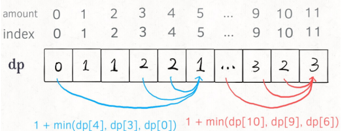


```js
import java.util.Arrays;
class Solution {
  public int coinChange(int[] coins, int amount) {
    int[] dp = new int[amount + 1];
    Arrays.fill(dp, amount + 1);
    dp[0] = 0; // 关键
    for(int i = 0;i<dp.length;i++){
      for(int coin : coins){
        if(i-coin < 0) continue; // 关键
        dp[i] = Math.min(dp[i], dp[i-coin] + 1);
      }
    }
    return dp[amount] == amount + 1 ? -1 : dp[amount];
  }
}
```


## 2. 进阶解析

**最优子结构详解**

首先，要明确之前说的：**想满足最优子结，子问题之间必须互相独立**。

举例 1：学校有 10 个班，已知每个班的最高分，求全校的最高成绩。这个问题**符合最优子结构**。子问题是**每个班的最优成绩**，是相互独立的。

举例 2：学校有 10 个班，已知每个班的最大分数差（只知道差值），求全校学生的最大分数差。这个问题**不符合最优子结构**。因为不独立，最大分数差可能跨班，所以每个班的分数差不是独立的子问题。

找最优子结构的过程，其实就是证明状态转移方程正确性的过程，方程符合最优子结构就可以写暴力解了，写出暴力解就可以看出有没有重叠子问题了，**有则优化，无则 OK**。这也是套路，经常刷题的朋友应该能体会。


### 题目1：[键盘打印最大值](https://mp.weixin.qq.com/s?__biz=MzAxODQxMDM0Mw==&mid=2247484469&idx=1&sn=e8d321c8ad62483874a997e9dd72da8f&chksm=9bd7fa3daca0732b316aa0afa58e70357e1cb7ab1fe0855d06bc4a852abb1b434c01c7dd19d6&scene=21#wechat_redirect)

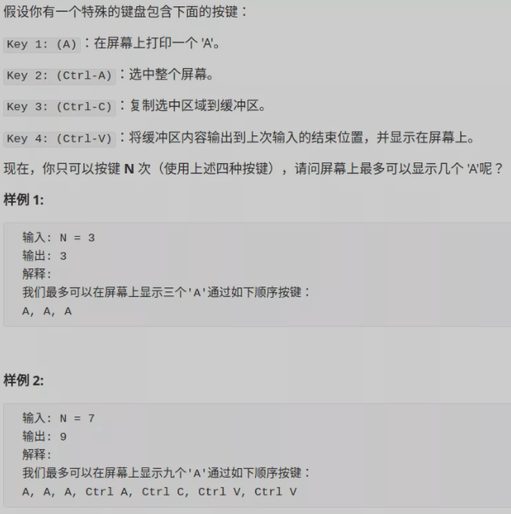

我们穷举呗，对于每次按键，我们可以穷举四种可能，**很明显就是一个动态规划问题**。


**思路一：自上而下**

分析一下：**对于动态规划问题，首先要明白有哪些「状态」，有哪些「选择」**。

- 「选择」：4 种，就是题目中提到的四个按键，分别是`A`、`C-A`、`C-C`、`C-V`（`Ctrl`简写为`C`）。
- 「状态」：**或者换句话说，我们需要知道什么信息，才能将原问题分解为规模更小的子问题**？

你看我这样定义三个状态行不行：第一个状态是剩余的按键次数，用 `n `表示；第二个状态是当前屏幕上字符 A 的数量，用 `a_num `表示；第三个状态是剪切板中字符 A 的数量，用 `copy `表示。

所以 base case：当剩余次数 `n `为 0 时，`a_num` 就是我们想要的答案。

```c++
dp(n - 1, a_num + 1, copy),    # A
解释：按下 A 键，屏幕上加一个字符
同时消耗 1 个操作数

dp(n - 1, a_num + copy, copy), # C-V
解释：按下 C-V 粘贴，剪切板中的字符加入屏幕
同时消耗 1 个操作数

dp(n - 2, a_num, a_num)        # C-A C-C
解释：⭐全选和复制必然是联合使用的，
剪切板中 A 的数量变为屏幕上 A 的数量
同时消耗 2 个操作数
```

详细代码：

**这其实就是自上而下的过程。我们从递归树顶端来看。**消耗一个操作 => n-1，相应 a_num 和 copy 发生对应变化，剩下的交给递归！

```js
// n:剩余按键次数；a_num:当前屏幕上A的数量；copy：剪切板中A的数量
function maxA(N) {
  function dp(n, a_num, copy) {
    if (n <= 0) return a_num; // base case
    return Math.max(
      dp(n - 1, a_num + 1, copy),
      dp(n - 1, a_num + copy, copy),
      dp(n - 2, a_num, a_num)
    );
  }
  return dp(N, 0, 0);
}
```


**思路二：dp 数组**

注意：这里的状态有三个，dp 数组得写成三维，这样复杂度变成了 O(N^3)。所以这么定义肯定不好。

```js
dp[n][a_num][copy]
# 状态的总数（时空复杂度）就是这个三维数组的体积
```

所以整体思路需要换一下。继续走流程，「选择」肯定还是那 4 个，但是这次我们只定义一个「状态」，也就是剩余的敲击次数 `n`。

这个算法基于这样一个事实，**最优按键序列一定只有两种情况**：

要么一直按`A`：A,A,…A（当 N 比较小时）。

要么是这么一个形式：A,A,…C-A,C-C,C-V,C-V,…C-V（当 N 比较大时）。

```js
function maxA(N) {
  let dp = new Array(N + 1); // 每次按键造成下一次状态改变，所以会错位一下
  dp[0] = 0;
  for (let i = 1; i < N + 1; i++) {
    dp[i] = dp[i - 1] + 1; // 只按A的情况
    for (let j = 2; j < i; j++) {
      dp[i] = Math.max(dp[i], dp[j - 2] * (i - j + 1));
    }
  }
  return dp[N];
}
```

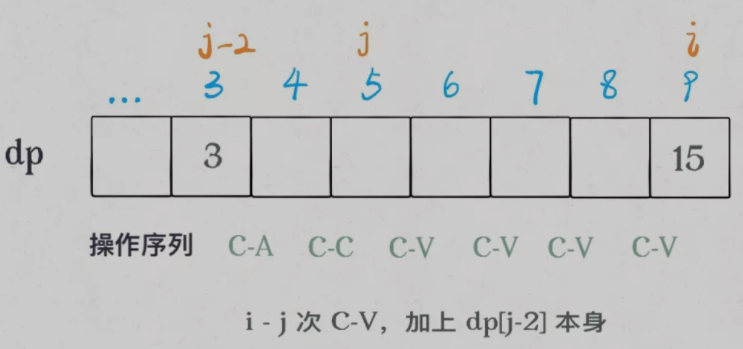

这样的时间复杂度 O(N^2)，空间复杂度 O(N)。

**总结：**为什么第一种思路复杂度会很高呢？因为我们复杂了子问题的个数。实际上只有两种操作，A 或者复制粘贴，第一种思考分成了三种情况，所以才会变得复杂。


### 题目2：[腾讯面试题—编辑距离](https://mp.weixin.qq.com/s?__biz=MzAxODQxMDM0Mw==&mid=2247484484&amp;idx=1&amp;sn=74594297022c84952162a68b7f739133&source=41#wechat_redirect)

题目：

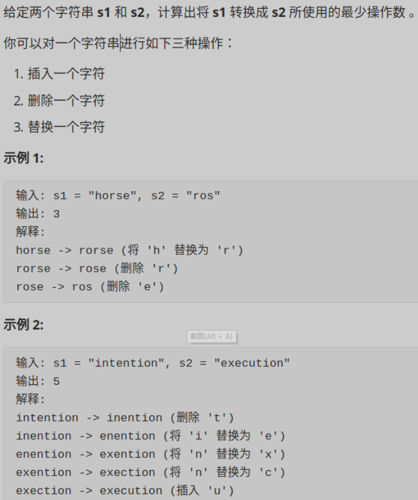

通过另一道题前文 [最长公共子序列]() 知道**，解决两个字符串的动态规划问题，一般都是用两个指针 `i,j `分别指向两个字符串的最后，然后一步步往前走，缩小问题的规模**。 s1 => s2 问题的思路如下：


1. 遇到 `s1[i] != s2[j]` 就插入 `s2[j]` 的值。
2. 遇到 `s1[i] == s2[j]` 时候就进行跳过操作。
3. 当 `s2` 走完的时候，把剩下 `s1` 没走完的部分都删掉就可以了。

所以这道题，我们也可以类似的方法进行考虑。要注意 我们有四种操作：skip、插入、替换、删除。

**注意了：这题只让你输出最小编辑距离，没让你真的走一遍进行转化，所以我们应该之操作字符串的索引才是最高效的！！！**

```js
# base case 就是i走完了s1 或者 j走完了s2
if(s1[i] === s2[j]){
  (skip操作);
  i, j想前移动
}else{
  三选一操作
}
```

**暴力法：穷举三选一的操作**

```js
function minDistance(s1, s2) {
  function dp(i, j) {
    // base case: 如果其中一个字符串走完了，就返回另一个字符串剩下的长度！因为要一个一个删除或者插入
    // 1. s1先走完，就得把剩下的s2全插入s1中；s2先走完就把剩下的s1删除掉
    if (i === -1) return j + 1;
    if (j === -1) return i + 1;
    if (s1[i] === s2[j]) return dp(i - 1, j - 1); // skip操作
    return Math.min(
      dp(i, j - 1) + 1, // 插入操作
      dp(i - 1, j) + 1, // 删除
      dp(i - 1, j - 1) + 1 // 替换
    );
  }
  return dp(s1.length - 1, s2.length - 1);
}
```

思考一下，存在哪些重复的子问题呢？

```js
def dp(i, j):
    dp(i - 1, j - 1) #1
    dp(i, j - 1)     #2
    dp(i - 1, j)     #3
```

比如 `dp(i, j) -> #1 `和 `dp(i,j)->#2->#3 `。一旦发现一条重复路径，就说明存在巨量重复路径，也就是重叠子问题。

**加备忘录**可以减少重复计算。

**DP table解法：**

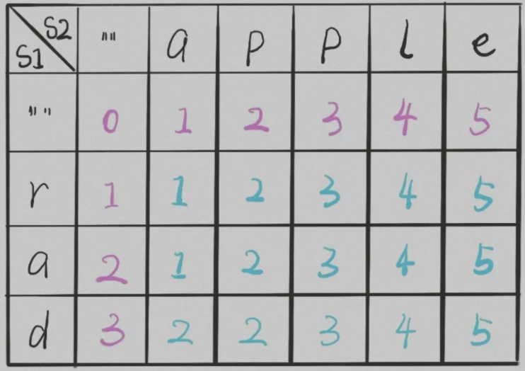

**DP 数组中存什么？**交换的次数。

**base case：**有了最长公共子序列的题目可知，dp 数组初始化应该是 [m+1] [n+1]。

**状态转移：**还是上面的几种操作。

**因为js没有专门针对二维数组的API，所以初始化过程比较繁琐。**

```js
function minDistance(s1, s2) {
  const m = s1.length;
  const n = s2.length;
  let dp = [];
  for (let i = 0; i < m + 1; i++) {
    // 多一组用来存放空串
    dp[i] = [];
    for (let j = 0; j < n + 1; j++) {
      dp[i][j] = 0;
    }
  } // base case:初始化一个m+1*n+1的二维数组
  for (let i = 1; i <= m; i++) {
    dp[i][0] = i;
  }
  for (let j = 1; j <= n; j++) {
    dp[0][j] = j;
  }

  for (let i = 1; i <= m; i++) {
    for (let j = 1; j <= n; j++) {
      if (s1[i - 1] === s2[j - 1]) {
        dp[i][j] = dp[i - 1][j - 1]; // 等于就skip
      } else {
        dp[i][j] = Math.min(dp[i - 1][j] + 1, dp[i][j - 1] + 1, dp[i - 1][j - 1] + 1);
      }
    }
  }
  return dp[m][n];
}
```

**思考：**一般来说，处理两个字符串的动态规划问题，都是按本文的思路处理，建立 DP table。为什么呢，因为易于找出状态转移的关系，比如编辑距离的 DP table：

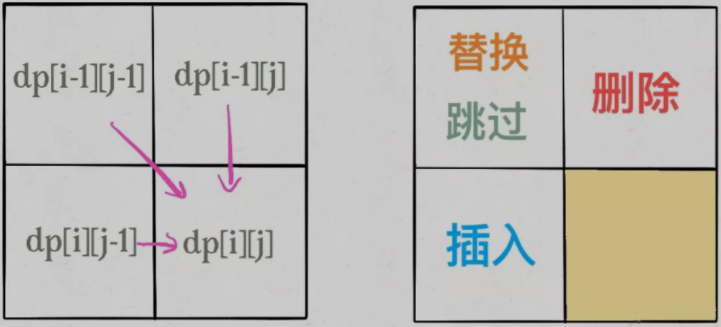


### 题目3：[1143 最长公共子序列](https://mp.weixin.qq.com/s?__biz=MzAxODQxMDM0Mw==&mid=2247484486&amp;idx=1&amp;sn=0bdcb94c6390307ea32427757ec0072c&source=41#wechat_redirect)

题目：

```js
输入: str1 = "abcde", str2 = "ace" 
输出: 3  
解释: 最长公共子序列是 "ace"，它的长度是 3
```

为啥这个问题就是动态规划来解决呢？因为子序列类型的问题，穷举出所有可能的结果都不容易，而动态规划算法做的就是穷举 + 剪枝，它俩天生一对儿。**所以可以说只要涉及子序列问题，十有八九都需要动态规划来解决，往这方面考虑就对了。**

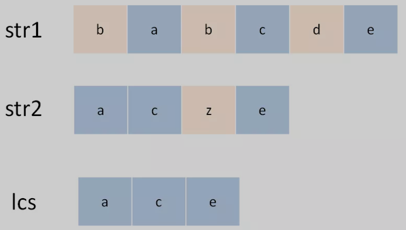

用两个指针`i`和`j`从后往前遍历`s1`和`s2`，如果`s1[i]==s2[j]`，那么这个字符**一定在`lcs`中**；否则的话，`s1[i]`和`s2[j]`这两个字符**至少有一个不在`lcs`中**，需要丢弃一个。先看一下递归解法，比较容易理解：

**注意：它也是只要求出子序列的长度，所以操作索引就可以，不用输出具体 lcs 的值**

**暴力递归方法：**

```js
function longestCommonSubsequence(str1, str2) {
	function dp(i,j){
    // # base case:如果从后往前遍历到头了
    if(i === -1||j === -1) {
      return 0;
    }
    // # 找到了一个lcs之后要继续递归找，并且数量+1
    if(text1[i] === text2[j]) {
      return dp(i-1, j-1)+1;
    }else{
      // # 接下来的扫描中，谁能让lcs最长就听谁的
      return Math.max(dp(i-1, j), dp(i, j-1));
    }
  }
  return dp(text1.length-1, text2.length-1);
};
```

**用 DP table 优化**

首先思考一下 DP 数组里面存点什么呢？**应该存转移的状态。**这种状态可以通过子问题一个一个按条件迭加上去。

其次，DP 数组应该是自下而上的迭代。所以应该是把字符串拆分成一个一个字符来逐个判断。可以画出这个 DP table。

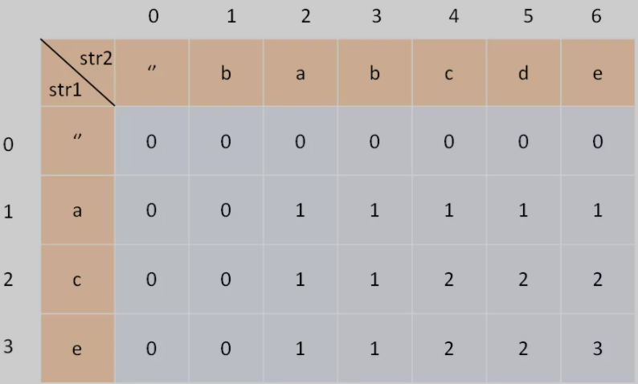

这个表的含义是：对于 `s1[1..i]` 和 `s2[1..j]`，它们的 LCS 长度是 `dp[i][j]`。d[2] [4] 的含义就是：对于 `"ac" `和 `"babc"`，它们的 LCS 长度是 2。

**定义 base case：**我们专门让索引为 0 的行和列表示空串，`dp[0][..]`和`dp[..][0]`都应该初始化为 0，这就是 base case。比如说，按照刚才 dp 数组的定义，`dp[0][3]=0`的含义是：对于字符串`""`和`"bab"`，其 LCS 的长度为 0。因为有一个字符串是空串，它们的最长公共子序列的长度显然应该是 0。

**找状态转移方程：**就如暴力递归同样的思路，如果相等，就在前一个的基础上 +1 就好。

```js
function longestCommonSubsequence(text1, text2) {
  // 构建一个二维的 DP table
  const m = text1.length;
  const n = text2.length;
  let dp = [];
  for (let i = 0; i < m + 1; i++) {
    // 多一组用来存放空串
    dp[i] = [];
    for (let j = 0; j < n + 1; j++) {
      dp[i][j] = 0;
    }
  } // base case:初始化一个m+1*n+1的二维数组
  // 进行状态转移
  for (let i = 1; i < m + 1; i++) {
    for (let j = 1; j < n + 1; j++) {
      if (text1[i - 1] === text2[j - 1]) {
        dp[i][j] = 1 + dp[i - 1][j - 1];
      } else {
        dp[i][j] = Math.max(dp[i - 1][j], dp[i][j - 1]);
      }
    }
  }
  return dp[m][n];
}
```

### 题目4：[最长递增子序列](https://mp.weixin.qq.com/s?__biz=MzAxODQxMDM0Mw==&mid=2247484498&amp;idx=1&amp;sn=df58ef249c457dd50ea632f7c2e6e761&source=41#wechat_redirect)

题目：

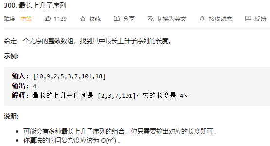

注意「子序列」和「子串」这两个名词的区别，子串一定是连续的，而子序列不一定是连续的。


**dp 数组：**这里是存储，每一个索引地方，比他大的那个子串。例如 `dp[4]` 应该是只有 1、2，所以存入2。

**状态转移：**依靠前面序列的字串长度，如果有比它小的值，就+1。

```js
var lengthOfLIS = function(nums) {
  if(nums.length===0) return 0;
  let dp= new Array(nums.length).fill(1); // 最小是1，它本身
  for(let i=0;i<dp.length;i++){
    for(let j =0;j<i;j++){
      if(nums[j]<nums[i]) dp[i] = Math.max(dp[i], dp[j]+1);
    }
  }
  // 找到dp数组中的最大值
  let res=1;
  for(let num of dp){
    res=Math.max(num, res)
  }
  return res
};
```


### 题目5：[动态规划之正则表达式](https://mp.weixin.qq.com/s?__biz=MzAxODQxMDM0Mw==&mid=2247484513&amp;idx=1&amp;sn=e5fc3cce76c1b916195e1793122c28b8&source=41#wechat_redirect)

题目：

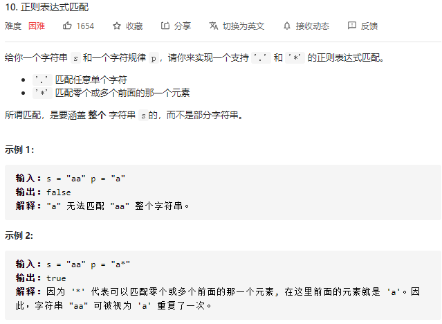

我们采用循序渐进的思路，首先，两个字符串是否相同怎么写？

```js
function isMatch(str1, str2){
  if(str1.length !== str2.length) return false;
  for(let i=0;i<str1.length;i++){
    if(str1[i] !== str2[i]) return false
  }
  return true
}
```

这很容易理解。我们继续改写成递归的写法。理解这个递归才能进行下一步

```js
function isMatch(str1, str2){
  if(str2.length===0) return str1.length===0;
  first_match = str1.length!==0 && str1[0]===str2[0];
  return first_match && isMatch(str1.slice(1), str2.slice(1));
}
```

**处理点号「.」通配符：**

点号可以匹配任意一个字符，万金油嘛，其实是最简单的。

```js
function isMatch(text, pattern){
  if(pattern.length===0) return text.length===0;
  first_match = text.length
}
```


​	


