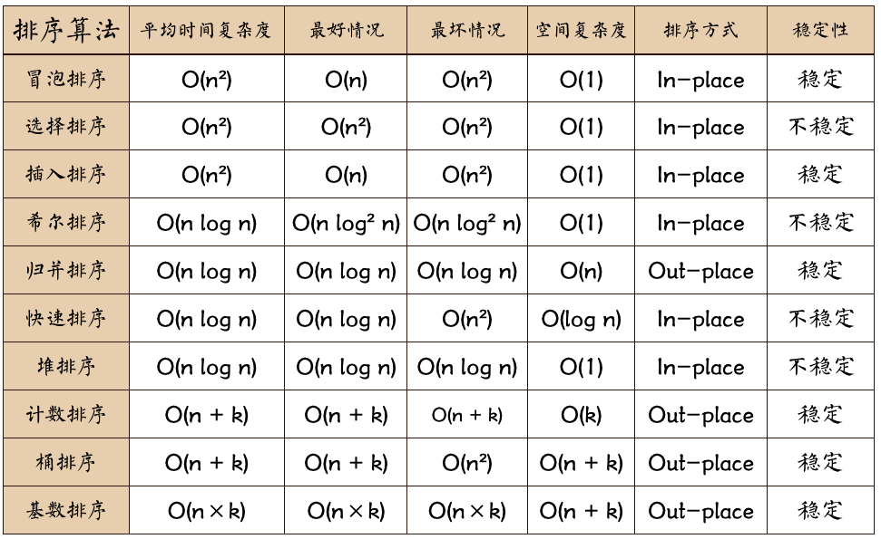
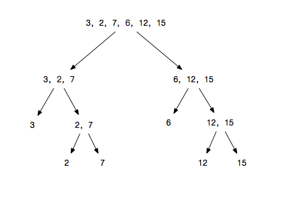
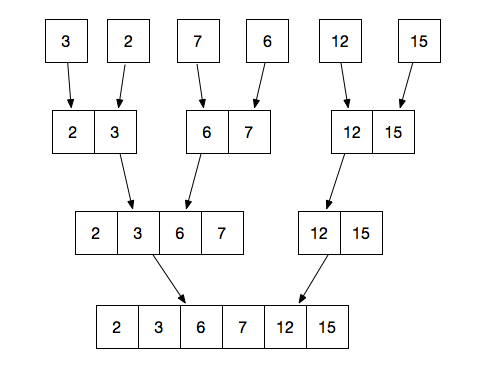
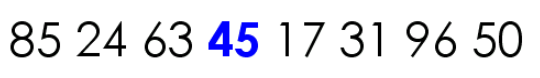
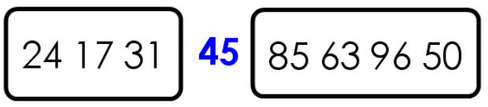
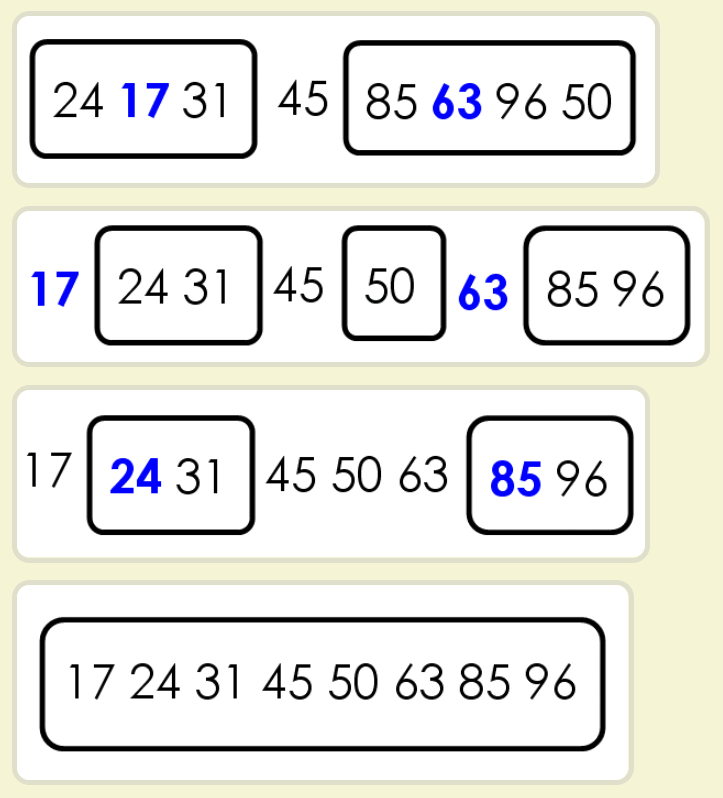

# 十大排序算法

**参考：[阮一峰的排序算法](https://javascript.ruanyifeng.com/library/sorting.html)**

**参考2：[博客日志](https://www.cnblogs.com/AlbertP/p/10847627.html)**

**后三个不太重要**。**快速排序和归并排序要多练几次！**




## 1. 冒泡排序（Bubble Sort）

**两层遍历，两两交换**。

**基本思想：**

1. 依次比较相邻的两个数，如果不符合排序规则，则调换两个数的位置。这样一遍比较下来，能够保证最大（或最小）的数排在最后一位。
2. 再对最后一位以外的数组，重复前面的过程，直至全部排序完成。


```js
function bubbleSort(arr) {
  let len = arr.length;
  for (let i = 0; i < len; i++) {
    for (let j = 0; j < len - 1 - i; j++) {
      if (arr[j] > arr[j + 1]) {
        //相邻元素两两对比
        let temp = arr[j + 1]; //元素交换
        arr[j + 1] = arr[j];
        arr[j] = temp;
      }
    }
  }
  return arr;
}
```

**时间复杂度：O(n^2)**

**注意：**冒泡排序还有一种优化算法，就是立一个flag，当在一趟序列遍历中元素没有发生交换，则证明该序列已经有序。但这种改进对于提升性能来说并没有什么太大作用。。。


## 2.选择排序（Selection Sort）

**两层遍历，第一层保存当前为最小值的索引。第二层遍历谁小保存谁为索引并且和之前的最小值交换位置。**

在时间复杂度上表现最稳定的排序算法之一，因为无论什么数据进去都是O(n²)的时间复杂度。。。**所以用到它的时候，数据规模越小越好**。唯一的好处可能就是不占用额外的内存空间了吧。

**思路：**其实是冒泡的延伸版。第一层遍历每个元素，第二层每次循环**保存最小值的索引**，然后和第一层正在循环的数进行交换位置。

> **对数组 `[3, 2, 4, 5, 1]`  进行从小到大排序为例，步骤如下：**
>
> 1. 假定第一位的“3”是最小值。
> 2. 最小值“3”与第二位的“2”进行比较，2小于3，所以新的最小值是第二位的“2”。
> 3. 最小值“2”与第三位的“4”进行比较，2小于4，最小值不变。
> 4. 最小值“2”与第四位的“5”进行比较，2小于5，最小值不变。
> 5. 最小值“2”与第五位的“1”进行比较，1小于2，所以新的最小值是第五位的“1”。
> 6. 第五位的“1”与第一位的“3”互换位置，数组变为[1, 2, 4, 5, 3]。


```js
function selectionSort(arr) {
  for (let i = 0; i < arr.length - 1; i++) {
    let minIndex = i;
    for (let j = i + 1; j < arr.length; j++) {
      if (arr[j] < arr[minIndex]) {
        minIndex = j; // 谁小保存谁
      }
    }
    let tmp = arr[i];
    arr[i] = arr[minIndex];
    arr[minIndex] = tmp;
  }
  return arr;
}
```

**时间复杂度： O(n^2) **


## 3. 插入排序（Insertion Sort）

原理：就是打扑克牌时候一开始按大小整理牌的样子。

插入排序（insertion sort）比前面两种排序方法都更有效率。它将数组分成“已排序”和“未排序”两部分，一开始的时候，“已排序”的部分只有一个元素，然后将它后面一个元素从“未排序”部分插入“已排序”部分，从而“已排序”部分增加一个元素，“未排序”部分减少一个元素。以此类推，完成全部排序。

> **以对数组 `[3, 2, 4, 5, 1]`  进行从小到大排序为例，步骤如下：**
>
> 1. 将数组分成[3]和[2, 4, 5, 1]两部分，前者是已排序的，后者是未排序的。
> 2. 变成[2, 3]和[4, 5, 1]两部分。
> 3. 变成[2, 3, 4]和[5, 1]两部分。
> 4. 变成[2, 3, 4, 5]和[1]两部分。
> 5. 变成[1, 2, 3, 4, 5]。


```js
function insertionSort(arr) {
  for (let i = 0; i < arr.length; i++) {
    let preIndex = i - 1;
    let current = arr[i];
    while (preIndex >= 0 && arr[preIndex] > current) {
      arr[preIndex + 1] = arr[preIndex]; // 往前寻找的时候一个一个换数组的值
      preIndex--;
    }
    arr[preIndex + 1] = current; 
  }
  return arr;
}
```

**时间复杂度：O(n^2)**


## 4. 希尔排序（Shell Sort）

希尔排序是插入排序的一种更高效率的实现。**它与插入排序的不同之处在于，它会优先比较距离较远的元素。希尔排序的核心在于间隔序列的设定。**既可以提前设定好间隔序列，也可以动态的定义间隔序列。动态定义间隔序列的算法是《算法（第4版》的合著者Robert Sedgewick提出的。在这里，我就使用了这种方法。

具体来说，把数组按下标的一定增量分组，然后对每组使用直接插入排序。


## 5. ⭐⭐⭐归并排序（Merge Sort）

作为一种典型的分而治之思想的算法应用，归并排序的实现由两种方法：

1. 自上而下的递归（所有递归的方法都可以用迭代重写，所以就有了第2种方法）
2. 自下而上的迭代


**归并排序的步骤：**

1. **先拆分，一直拆分到只有一个数**



拆分是将数组两两拆分到只有一个数。我们可以用中间的指针 p，将数组拆分成 `(start, p)` 和 `(p, end)` 两个部分。

```js
// start 和 end 是数组开始结束的下标索引
function divide(start, end){
  return Math.floor((start + end) / 2);
}
```


2. **然后再合并**



合并就是遍历两组数据，小的放在前面位置。

```js
function merge(arr, start, mid, end){
  const left = arr.slice(start, mid);
  const right = arr.slice(mid);
  // 注意：为了防止left或right里面的值整体都比对方小，导致最后一次遍历某个数组没有值，我们要push进去一个最大值
  left.push(Number.MAX_SAFE_INTEGER);
	right.push(Number.Max_SAFE_INTEGER);
  
  // 循环作比较 li/ri是左右两边的索引
  let li = 0, ri = 0;
  for(let i=start;i<=end;i++){
    if(left[li]<right[ri]){
      arr[i] = left[li];
      li++;
    }else{
      arr[i] = right[ri];
      ri++;
    }
  }
}
```

然后就是交给递归。 自上而下递归

```js
function mergeSort(arr){
  let lens = arr.length;
  if(lens<2) return arr;
  // 把 divider 方法放在这里
  let middle = Math.florr(lens/2);
  let left = arr.slice(0, middle);
  let right = arr.slice(middle);
  return merge(mergeSort(left), mergeSort(right));
  
  function merge(left, right) {
  	let result = [];
  	while (left.length || right.length) {
    	if (left.length && right.length) {
      	if (left[0] < right[0]) {
       		result.push(left.shift());
      	} else {
        	result.push(right.shift());
      	}
    	} else if (left.length) {
      	result.push(left.shift());
    	} else {
      	result.push(right.shift());
    	}
  	}
  	return result;
	}
}
```


## 6. ⭐⭐⭐快速排序（Quick Sort）


**思想：**举例 `[85, 24, 63, 45, 17, 31, 96, 50]`

1. 在数据集之中，选择一个元素作为"基准"（`pivot`）。任意选择，一般选择中间的值。

   

2. 所有小于"基准"的元素，都移到"基准"的左边；所有大于"基准"的元素，都移到"基准"的右边。形成两个子集，一个"小于45"，另一个"大于等于45"。

   

3. 对两个子集重复第一步和第二步。**这一步就是交给递归**

   

   ```js
   function quickSort(arr){
     if(arr.length<1) return arr;
     let pivotIndex = Math.floor(arr.length/2); // 基准点的索引
     let pivot = arr[pivotIndex];
     let left = [], right = [];
     for(let i=0;i<arr.length;i++){
       arr[i]<pivot ? left.push(arr[i]) : right.push(arr[i])
     };
     return quickSort(left).concat([pivot], quickSort(right));
   }
   ```

   


