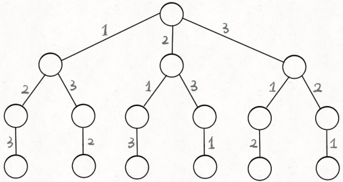

# 回溯算法套路全集

## 套路总结

**解决一个回溯问题，实际上就是一个决策树的遍历过程**。只需要思考3个问题：

1、路径：也就是已经做出的选择。

2、选择列表：也就是你当前可以做的选择。

3、结束条件：也就是到达决策树底层，无法再做选择的条件。

回溯算法的框架：

```js
let results = [];
function backtrack(path, choiceList){
  if (满足结束条件){
    results.add(path);
    return
  };
  for(choose in choiceList){
    做选择；
    backtrack(path, choiceList)
    撤销选择
  }
}
```

**其核心就是 for 循环里面的递归，在递归调用之前「做选择」，在递归调用之后「撤销选择」**。


## 一、全排列问题

### 1. 母题

`[1, 2, 3]` 进行枚举。

**思路**：我们可以画出一颗回溯树：




所以自然而然**变成了遍历树的问题**！**我们把这棵树称为决策树**。为什么要叫决策树呢？比如我们站在红色节点上，就在做决策是选择 1 还是 3 。为什么只能选择 1 和 3 呢，因为 2 的上一级已经做好决定了，全排列不允许重复。

所以在这里：

- 2 就是路径path，用来记录你已经做过的选择
- [1, 3] 就是选择列表choiceList，表示当前你可以做的选择
- 结束条件就是遍历到这颗树的底层，即可以选择的列表为空时


