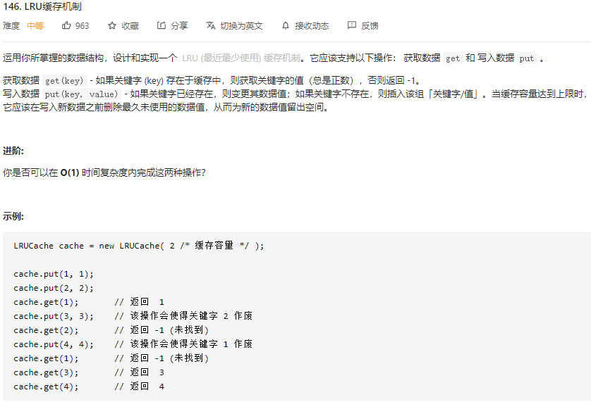

<div align="center"><h1>LeetCode链表题汇总</h1></div>

主要的思想方法有：

- 递归
- 双指针
- 双链表 + 哈希表


# 反转链表题型

## 1. 反转单链表 

**[LeetCode206](https://leetcode-cn.com/problems/reverse-linked-list/)**：


```js
// 递归
var reverseList = function(head) {
  let current = head;
  let prev = null;
  while(current){
    let tmp = current.next;
    current.next = prev;
    prev = current;
    current = tmp;
  }
  return prev; // 注意prev才是现在的current, 并且head已经变成链尾的1了
};
```


## 2. 反转m到n段链表

**[LeetCode92](https://leetcode-cn.com/problems/reverse-linked-list-ii/)**：


```js
var reverseBetween = function(head, m, n) {
  // 设置链表头的原因：如果是[5]这个链表，没办法取到h.next.next会报错，设置链表头可以避免这个问题
  let hair = new ListNode(0);
  hair.next = head;
  let h = hair;
  for(let i=0;i<m-1;i++){
    h = h.next;
  }
  let current = h.next;
  let prev = null;
  for(let i=0;i<=n-m;i++){
    let tmp = current.next;
    current.next = prev;
    prev = current;
    current = tmp;
  }
  h.next.next = current;
  h.next = prev;
  return hair.next
};
```


## 3. K个一组反转链表

[LeetCode25](https://leetcode-cn.com/problems/reverse-nodes-in-k-group/)：


```javascript
var reverseKGroup = function (head, k) {
  // 计算长度是否满足k
  let p = head; // 用来计算是否满足k的节点p
  let count = 1;
  while (count <= k) {
    if (!p) return head; // 不满足就返回原node
    p = p.next;
    count += 1;
  }
  // 对k个进行翻转, k以外的进行迭代
  let current = head; // 用来翻转的tmp
  let prev = null;
  for (let i = 1; i <= k; i++) {
    let tmp = current.next;
    current.next = prev;
    prev = current;
    current = tmp;
  }
  head.next = reverseKGroup(current, k); // current已经变成了next
  return prev; // prev才是current
};
```


# 环形链表

## 1. 找到入环点

[LeetCode142](https://leetcode-cn.com/problems/linked-list-cycle-ii/)：


### 思路1：`Set()`

`Set()`能存储不重复的集合，如果有环就会迭代到重复的节点上，用`Set.has(value)`来判断
#### `Set()` 对象
- 对象中key就是value，所以传值用`Set.add(value)`
- `Set.has(value)`: return false/true
- `Set.delete(value)`
- `Set.clear()`: 清空
- 对象内元素不重复，所以可以用做数组去重：
```javascript
arr = [new Set([1, 2, 5, 3, 2, 3, 4])];  // [ Set { 1, 2, 5, 3, 4 } ]
arr = [...new Set([1, 2, 5, 3, 2, 3, 4])];  // [ 1, 2, 5, 3, 4 ]
```
#### Code
```javascript
var detectCycle = function(head) {
    const visited = new Set();
    while (head) {
        if (visited.has(head)) {
            return head;
        }
        visited.add(head);
        head = head.next;
    }
    return null;
};
```
#### 复杂度分析
- 时间复杂度O(n)
- 空间复杂度O(n): 多创建了一个Set对象来报错所有的节点


### 思路2：快慢指针

**思路较复杂**

用快慢指针来进行迭代，如果能相遇表示链表有环。但要注意从相遇点推导出入环点的位置。

-  `fast ` 走过的距离时 `slow ` 的2倍：a+n(b+c)+b=2(a+b)
- 所以可得：a=c+(n−1)(b+c)。即从相遇点到入环点的距离加上 n-1 圈的环长，恰好等于从链表头部到入环点的距离。
- 令n=1：所以当相遇时，我们再let一个指针从head出发，相遇点到入环点距离 c 就等于表头到入环点距离 a
#### Code
```javascript
var detectCycle = function(head) {
  let slow=head, fast=head;
  while(fast){
    slow=slow.next;
    if(fast.next){
      fast=fast.next.next
    }else{
      return null
    }
    // 快慢指针相遇时
    if(slow === fast){
      // 新指针从tmp出发
      let tmp = head;
      while(tmp !== slow){
        tmp=tmp.next;
        slow=slow.next
      }
      return slow
    }
  }
  return null
}
```
#### 复杂度分析
时间复杂度：O(n)。slow指针走过的距离不会超过链表的总距离，tmp新指针也不会走超过总距离。所以 O(n)+O(n)=O(n)。
空间复杂度：O(1)。我们只使用了`slow`, `fast`, `tmp` 三个指针。


# 双链表

## 1. LRU缓存机制

[LeetCode146](https://leetcode-cn.com/problems/lru-cache/)：



### 思路1：双链表 + 哈希表

- **查找**：哈希表O(1)。
- **插入**：双链表O(1)。用双链表因为缓存要更新活跃度放在表头，且有删除最不活跃的表尾操作，所以用到队列思想。
- **易错点**：被访问和被添加或修改都需要移动对应节点到表头表示活跃。

```javascript
实现哈希表
实现双链表
let LRUCache = function(capacity) {
    初始化容量，用于判断LRU是否已满
    初始化哈希表映射，用于查找节点
    初始化双链表，用于插入、删除节点
};
LRUCache.prototype.get = function(key) {
    if(哈希查找 不存在){
        return -1;
    }else{
        将此节点置于开头，为最近访问节点
        return 节点值
    }
}
LRUCache.prototype.put = function(key, value) {
    if(哈希查找 已经存在){
        删除旧的数据
        
    }else{
        if(LRU 即 双链表已满){
            删除尾节点
            更新哈希映射值，并将更新后的节点置于开头
        }
        将新节点置于开头
        新建新节点的哈希映射
    }
}
```
#### Code
```javascript
function ListNode(key, value) {
  this.key = key;
  this.value = value;
  this.next = null;
  this.prev = null;
}

class LRUCache {
  constructor(capacity) {
    this.capacity = capacity;
    this.hashTable = {}; // 存入对应key的链表节点
    this.count = 0;
    this.doubleHead = new ListNode();
    this.doubleTail = new ListNode();
    this.doubleHead.next = this.doubleTail;
    this.doubleTail.prev = this.doubleHead;
  }
  // 节点状态改变时添加到头部，作为活跃节点
  addToHead(node) {
    node.prev = this.doubleHead;
    node.next = this.doubleHead.next;
    this.doubleHead.next.prev = node;
    this.doubleHead.next = node;
  }
  // 更新活跃度到链头
  moveToHead(node) {
    // 首先删除原位置
    node.prev.next = node.next;
    node.next.prev = node.prev;
    // 然后添加节点到表头
    this.addToHead(node);
  }

  put(key, value) {
    let tmp = this.hashTable[key]; // 获取节点
    if (!node) {
      let newNode = new ListNode(key, value);
      this.hashTable[key] = newNode;
      this.addToHead(newNode);
      this.count++;
      if (this.count > this.capacity) {
        // 删除表尾最不活跃的节点
        let tail = this.doubleTail.prev;
        this.doubleTail.prev = tail.prev;
        tail.prev.next = this.doubleTail;
        delete this.hashTable[tail.key]; // 删除对应哈希表位置
        this.count--;
      } // 超过容量删除最末尾不活跃节点
    } else {
      node.value = value; // 更新value
      this.moveToHead(node); // 活跃度升到链头
    }
  }
  get(key) {
    let node = this.hashTable[key];
    if (!node) return -1; // node不存在返回-1
    this.moveToHead(node); // 被访问后活跃到表头
    return node.value;
  }
}
```


### 思路2：`Map()`
Map对象是有序的且能用 `Map.size()` 访问得到元素个数。
#### `Map()`对象
- 键值对是有序的，插入方法 `Map.set(key, value)`
- 头部元素第一个添加，最不活跃，满足队列的思想。
头部元素能用 `Map.keys().next().value` 访问到：
```javascript
let map = new Map();
map.set('a', '1');
map.set('b', '2');
map.set('c', '3');
let key = map.keys();
console.log(map); // Map { 'a' => '1', 'b' => '2', 'c' => '3' }
console.log(map.keys()); // [Map Iterator] { 'a', 'b', 'c' }
console.log(key.next().value); // { value: 'a', done: false }
console.log(key.next().value); // { value: 'b', done: false }
```
- `Map.get(key)`：return value
- `Map.delete(key)`
- `Map.has(key)`: return true/false
- `Map.size()`: 查看对象个数


#### Code
```javascript
class LRUCache {
  constructor(capacity) {
    this.capacity = capacity;
    this.cache = new Map();
  }
  put(key, value) {
    if (this.cache.has(key)) {
      this.cache.delete(key); // 存在也删除，相当于更新活跃度
    } else {
      if (this.cache.size == this.capacity) {
        this.cache.delete(this.cache.keys().next().value); // 删除Map的首个对象
      }
    }
    this.cache.set(key, value);
  }
  get(key) {
    if (this.cache.has(key)) {
      let value = this.cache.get(key);
      this.cache.delete(key); // 删除来更新位置
      this.cache.set(key, value);
      return value;
    } else {
      return -1;
    }
  }
}
```


