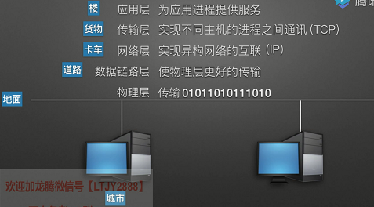
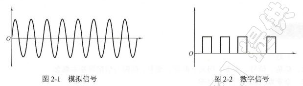
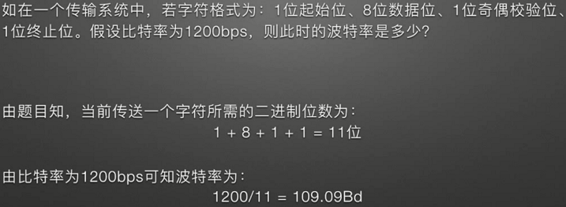
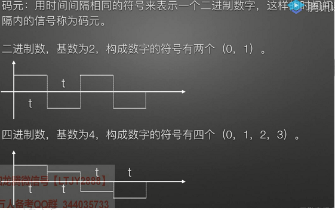
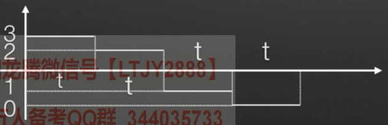
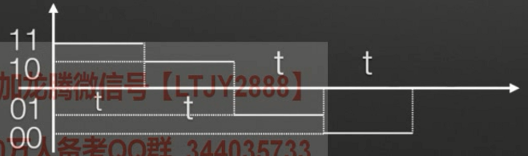
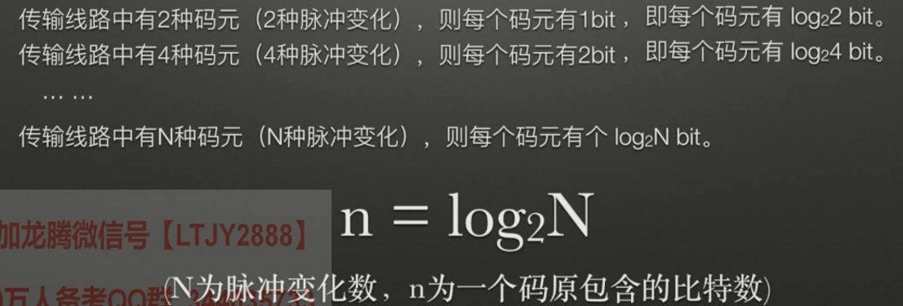
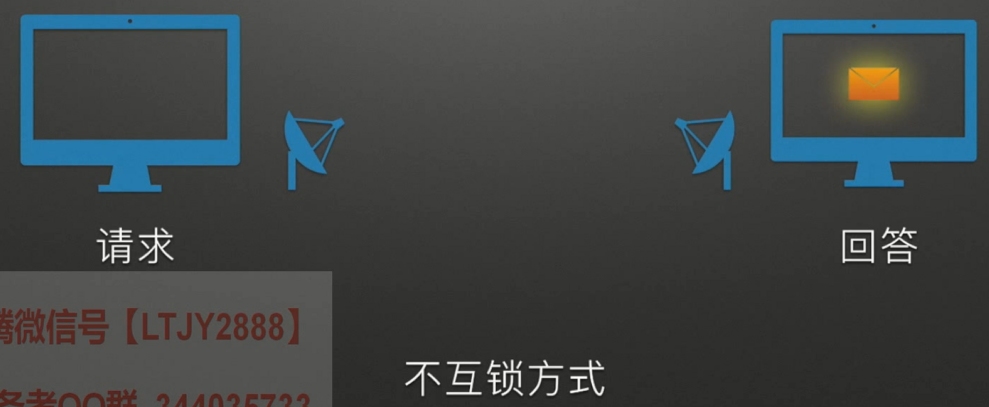

# 计算机网络概述

可以把网络类比成快递员送货。

所以，网络分为这些层：

## 关键词汇

### 1. 协议

协议是规定，规定各个层面的通信规则。由三个部分组成：

1. 语义：讲什么
2. 语法：怎么讲
3. 同步：规定事件的执行顺序

### 2. 接口

接口即服务访问点，没有接口就不能提供服务

### 3. 服务

下层向上层通过接口提供服务。

**协议是水平的，服务是垂直的。**

# 物理层

**传输010101数据比特流的层级。**

这一层规定接口形状，引线数目；规定高电压表示1，低电压表示0；规定电压范围。

传输比特流 => **依靠电压强弱表示0101**

## 关键词汇

### 1. 信号

传输通道中传输信息的载体。数字信号是离散的，模拟信号是连续的（人耳听到的是模拟）。

### 2. 信道

信号传输的媒介，一个方向的信息传输媒介。**所以一段通信有两个信道，来回。**

### 3. 比特率和波特率

**注意区分：**

**波特率：**又称码元传输速率。单位时间内数字通信系统所传输的码元个数，也可以称为脉冲个数或者信号变化次数。就像题目里一样，把11个作为一个单位码元。相当于信号里，11为一个周期，11个为一组码元。

**比特率：**又称信息传输速率。单位时间内数字通信系统所传输的**二进制码元个数**。每比特只能表示两种信号变化（0或1），可看成二进制。

### 4. 码元

**时间间隔相同的符号表示的一组信号。**

但是向第二个四进制有0，1，2，3，需要转化成二进制。

    

### 5. 通信

在一点精确或者近似的再生另一点的信息。

### 6. 信源和信宿

信源：发送源头

信宿：接收信号者

## 传输介质和设备

### 1. 数据通信方式

> - 单向通信： A => B   **单工 **      例子：广播
> - 双向交替通信：t0：A => B ；t1：B => A    **半双工 **      例子：对讲机
> - 双向同时通信：A <=> B    **全双工 **     例子：电话，边说边听

>- 并行通信
>- 串行通信

>- 同步通信：A B 两方盯着时间，定时发送和接收，不管对方收到没
>- 异步通信：交互式，采用应答方式，观察对方的反应来决定。 **联络方式：不互锁，半互锁，全互锁**

**不互锁方式：**两方都是不管你有没有收到，我过一会都会撤销信号，不理你了。**不太可靠，无法得到回答**，有以下几种可能性：

1. 设备1发送请求，设备2收到；设备2发送回答，设备1收到 => 握手成功
2. 设备1发送请求，设备2没收到；设备2也无法给出回答 => 握手失败
3. 设备1发送请求，设备2收到；设备2发送回答，但设备1没收到 => 握手失败

**半互锁方式：** 只对发送方有所规定。如果发送方等不到回答信号，就一直发。也会存在失败情况：

1. 设备1发送请求，**设备2一定会收到**；设备2发送回答，但是设备1不一定能收到

**全互锁方式：**发送方和接收方都有限制。**注意：发送方在收到接收方回复后，还会再发一个撤销信号，代表告诉了接收方，我收到你的回复消息了（不然接收方一直会发回复消息） 注意：撤销信号其实只发送一次，有可能有接收方收不到的情况，这种情况问题不大，重点关注的是发送方收到了回复。**

### 2. 传输介质

**双绞线**

