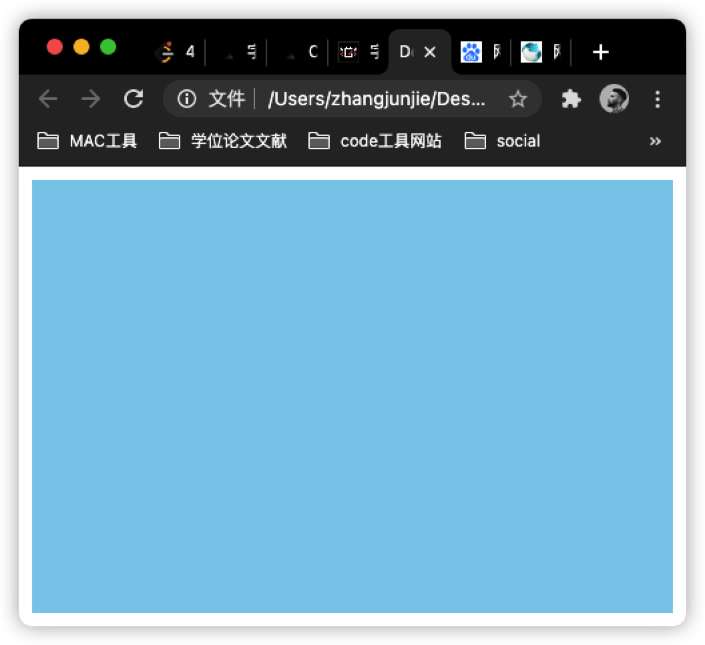

# 两种盒模型

`box-sizing` 属性可以声明元素的盒模型。有 `content-box` 、`border-box` 、`inherit` 三种。

## content-box

属于默认值。计算盒子宽高时，不计算 `border` 和 `padding` 。盒子宽高表现为内容高度

## border-box

css3 新增。盒子的宽高包括了 `border` 和 `padding` 。

width/height = border + padding + 内容


上面的方式都不会计算 margin。

**实现撑满页面且有 margin 的盒子的方法：**

利用到 `calc` 函数：

```html
<style>
  * {
    margin: 0;
    padding: 0;
  }
  #app {
    box-sizing: border-box; /* 指定计算方式 */
    background: skyblue;
    margin: 10px; /* 外边距 */
    /* 利用 css3 的 calc */
    width: calc(100vw - 2 * 10px);
    height: calc(100vh - 2 * 10px);
  }
</style>
<body>
  <div id="app"></div>
</body>
```



