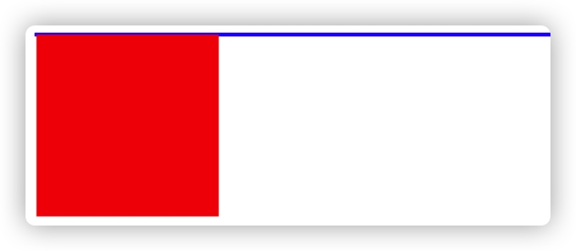
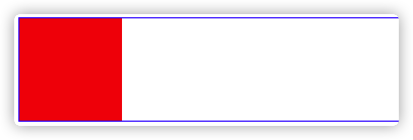
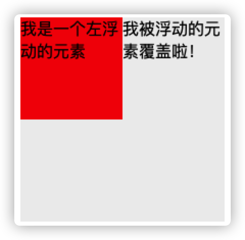
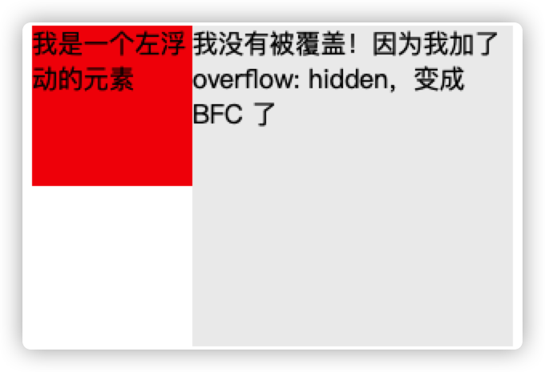

# 常见定位方案

**在讲 BFC 之前，我们需要了解一下常见的定位方案，主要有普通流、浮动、绝对定位。**

- 普通流：

  普通流指在 HTML 中按**先后顺序自上而下**的布局方式。其中：

  - 行内元素：`<span>` `<a>` `<br>` `<b>` 。水平排列直至当行被占满，然后换行。**特点：宽高设置无效；margin 仅对左右方向有效；padding 对上下左右都有效 => 会撑大空间。**
  - 块级元素：`<h1>` `<p>` `<hr>` `ul` `ol` `dl` ...。独占一行。
  - 行内块元素：`` `input` `textarea` `select`。不自动换行。**自身可以设置宽高，水平排列。**

- 浮动：

  浮动布局中，元素先按照普通流排序，根据浮动的方向尽可能向左或向右偏移，**效果类似于排版汇总的文本环绕。**

- 绝对定位：

  元素会脱离普通流，绝对定位元素不会对其兄弟元素造成影响，位置由设置的坐标决定。

# BFC 定义

**BFC(Block formatting context) **直译为"块级格式化上下文"。它是一个独立的渲染区域，只有 Block-level box 参与， 它规定了内部的 Block-level Box 如何布局，并且与这个区域外部毫不相干。**它属于普通流。**

# 触发 BFC

- body 根元素
- 浮动元素：float 除 none 以外的值
- 绝对定位元素：position (absolute、fixed)
- display 为 inline-block、table-cells、flex
- overflow 除了 visible 以外的值 (hidden、auto、scroll)

# BFC 的功能

## 1. 避免 margin 被折叠

```html
<head>
div{
    width: 100px;
    height: 100px;
    background: lightblue;
    margin: 100px;
}
</head>
<body>
    <div></div>
    <div></div>
</body>
```

**实际两个盒子的 margin 只显示为 100px。**

**这不是 bug。**这要理解为一种规范，如果想避免这个问题，可以放在不同的 BFC 容器中。

```html
<div class="container">
	<p></p>
</div>
<div class="container">
	<p></p>
</div>
```


## 2. 清除浮动

**利用第 4 条，overflow 设置为除了 visible 的值。**

浮动的元素会脱离普通文档流：

```html
<style>
  .box1 {
    border: 1px solid blue;
  }
  .box2 {
    width: 100px;
    height: 100px;
    background: red;
    float: left;
  }
</style>
<body>
  <div class="box1">
    <div class="box2"></div>
  </div>
</body>
```



由于元素浮动，导致脱离文档流，只剩下 1px 的边框高度。

**给 box1 加样式：`overflow: hidden `** ，变为 BFC 容器模型。




## 3. 阻止元素被浮动遮盖

普通文档流中：浮动元素遮盖正常的盒子。

```html
<style>
  .left {
    height: 100px;
    width: 100px;
    float: left;
    background: red;
  }
  .right {
    width: 200px;
    height: 200px;
    background: #eee;
  }
</style>
<body>
  <div class="left">我是一个左浮动的元素</div>
  <div class="right">我被浮动的元素覆盖啦！</div>
</body>
```



**通过第 4 条，设置右边盒子一个 `overflow: hidden ` 可以避免被遮盖。**



**这个方法可以实现两列自适应布局！=> 左侧宽度固定，右侧内容自适应宽度（去掉右侧宽度达到自适应）。**


# 总结

上述的三个例子，都体现了 BFC 是一个独立的隔离容器。**设置成 BFC 后，容器内外的元素之间互相不影响。**

1. 当 BFC 内部有浮动时：为了不影响外部元素布局，BFC 计算高度时会包括浮动的高度。=> **清除浮动**
2. 当 BFC 外部有浮动时：外部不影响内部的布局，BFC 会自动变窄来不与浮动有重叠。=> **避免被浮动遮盖**
3. 两个 BFC 盒子之间，互相不影响。 => **避免 margin 被重叠**


