# IDEA学习

**快捷键：**

- 快速生成语句： 
  - `main()`: `psvm` 回车
  - 输出语句：`sout` 回车
- 内容快捷键
  - ctrl + alt + space ：内容提示，代码补全等
  - ctrl + alt + L: 格式化


# 基础语法

编译和运行

- 编译：javac 文件名.java

- 执行：java 类名（文件中要执行模块的类名）

## 1. 数据类型

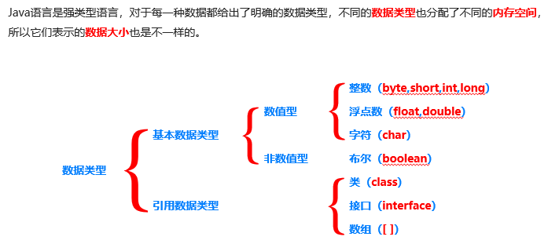

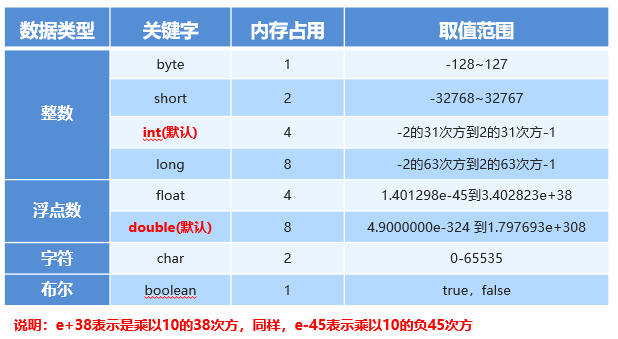

**变量定义：** int a = 10；

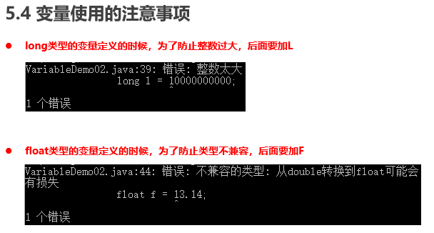

整数默认是int，即使加了 long 关键字也默认int，所以超过 int 的范围就报错，为了防止错误，在 1000000L

在后面加个 L 就能转化成 long 类型。同样的 float 也是，要在13.14f，后面加个f才能成功转化。

## 2. 类型转换

- 自动类型转换：把一个表示数据**范围小的数值**或者**变量**赋值给另一个表示数据**范围大的变量**。

  例如：double d = 10;

  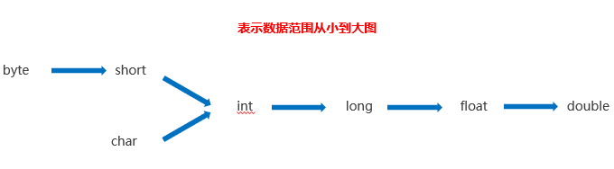

  ```java
  public class HelloWorld {
    public static void main(String[] args) {
  	// 自动类型转化
  	double d=10;
  	System.out.println(d); // 10.0 即转化成了float类型，省空间
    }
    // byte转化为short或int
  	byte b=10;
  	short a=b;
  	int i=b;
  	System.out.println(i); // 10 说明可以向高类型转化，但byte不能转为char！看箭头顺序
  }
  ```

  

- 强制类型转换：把一个表示数据**范围大的数值**或者**变量**赋值给另一个表示数据**范围小的变量**（上面的图倒过来）。**一般不建议使用！**

  格式：**目标数据类型 变量名** **= (****目标数据类型****)****值或者变量****;**

  范例：int k = (int)88.88;

  ```java
  public class HelloWorld {
    public static void main(String[] args) {
  	int k = (int)88.88;
  	System.out.println(k); // 88
    }
  }
  ```


## 3. 运算符

整数 a/b 只能得到整数商，浮点数参与才有完整结果

```java
int a = 6;
int b = 4;
System.out.println(a/b); // 1
System.out.println(6.0/b); // 1.5
```


### 字符的 "+" 操作

1. 拿字符在 **ACSⅡ** 对应的数值来进行计算的,

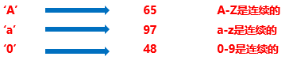				

```
int a = 0;
char b = 'a';
System.out.println(a + b); // 97
char c = '0';
System.out.println(a + c); // 48
```


2. 字符串之间 + 操作是字符串连接符

   ```java
   System.out.println("lala"+66+"sd"); // lala66sd
   ```


### 赋值运算

| **符号** | **作用**       | **说明**                 |
| -------- | -------------- | ------------------------ |
| =        | 赋值           | a=10，将10赋值给变量a    |
| +=       | 加后赋值       | a+=b，将a+b的值给a       |
| -=       | 减后赋值       | a-=b，将a-b的值给a       |
| ***=**   | **乘后赋值**   | **a*=b，将a×b的值给a**   |
| **/=**   | **除后赋值**   | **a/=b，将a÷b的商给a**   |
| **%=**   | **取余后赋值** | **a%=b，将a÷b的余数给a** |

⭐**注意事项：**扩展的赋值运算符**隐含**了强制类型转换


### ++ 和 --

| **符号** | **作用**               |
| -------- | ---------------------- |
| a++      | 先让a去操作，然后a+1   |
| ++a      | 先让a+1，再让a+1去操作 |
| a--      |                        |
| --a      |                        |

### 逻辑运算符

- 逻辑与**&**，无论左边真假，右边都要执行。
- 短路与**&&**，如果左边为真，右边执行；如果**左边为假，右边不执行**。
- 逻辑或**|**，无论左边真假，右边都要执行。
-  短路或**||**，如果左边为假，右边执行；如果**左边为真，右边不执行**。


### 数据输入

```java
import java.util.Scanner; // 导入包Scanner
// Scanner作用：键盘录入数据，然后按指令操作后返回想要的结果
public class HelloWorld {
  public static void main(String[] args) {
	Scanner sc = new Scanner(System.in); // 创建对象
	int x = sc.nextInt(); // 接收数据
	int y = sc.nextInt();
	int z = sc.nextInt();
	int larger = x >= y ? x : y;
	larger = larger >= z ? larger : z;
	System.out.println(larger);
  }
}
```


## 4. 判断和循环语句

### if 语句

案例：判断奇偶。

```java
import java.util.Scanner; 
public class HelloWorld {
  public static void main(String[] args) {
	Scanner sc = new Scanner(System.in); // 创建对象
	System.out.println("请输入一个整数");
	int x = sc.nextInt(); // 接收数据
	if(x % 2 == 0){
		System.out.println(x + "是偶数");
	}else{
		System.out.println(x + "是奇数");
	}
  }
}
```

### switch 语句

```java
格式：
switch(表达式) {
  case 值1：
	  语句体1;
	  break;
  case 值2：
	  语句体2;
	  break;
    …
  default：	
	  语句体n+1;
	  [break;]
}
```

格式说明：

- 表达式：取值为byte、short、int、char，JDK5以后可以是枚举，JDK7以后可以是String。

- case：后面跟的是要和表达式进行比较的值。

- break：表示中断，结束的意思，用来结束switch语句。

- default：表示所有情况都不匹配的时候，就执行该处的内容，和if语句的else相似。


### for 语句

```java
for(int i=0;i<5;i++){
	System.out.println(i);
}
```


### Random 随机数包

用于产生一个随机数，范围是[0, 10）。

```java
import java.util.Random; 

Random r = new Random();
int number = r.nextInt(10); // 就会[0, 10) 如果是参数是100 就是[0, 100)
System.out.println(number);
// 即使number规定为double 也是返回13.0 24.0 这样子
```


## 5. 数组

**声明一个数组：** 

- `int[] arr`
- `int arr[]`;

**初始化：**

### 动态初始化

动态初始化：只指定数组长度   `int[] arr = new int[3]`; 代表的是 `arr = [0, 0, 0]`

- 整数：默认值0

- 浮点数：默认值0.0

- 布尔值：默认值false

- 字符：默认值是空字符

- 引用数据类型：默认值是null

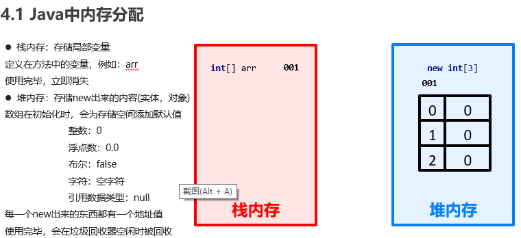

**注意：**多个数组指向相同，即如果arr2 = arr时，是地址相同，浅拷贝！从java语言可以很好看出。打印 arr 输出的是内存地址，arr2 = arr 是把 arr 的地址赋给了 arr2。

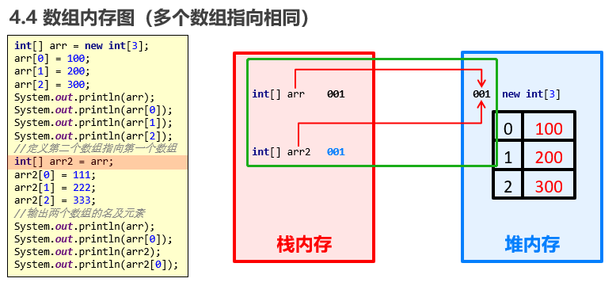

**当两数组指向相同时，任何数组修改都是可以修改的**

### 静态初始化

初始化时指定每个数组元素的初始值，由系统决定数组长度。`int[] arr = new int[]{1, 2, 3}` 

或者 `int[ ] arr = {1, 2, 3}`

### 两个常见小问题

- 索引越界：**直接报错**，因为只申明了固定长度。
- 空指针异常：访问的数组已经不再指向堆内存的数据，造成空指针异常，**报错**。

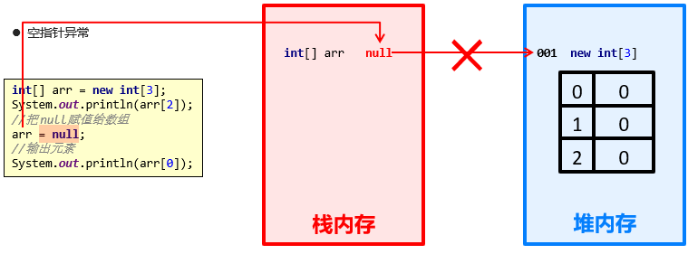

- null：空值，引用数据类型的默认值，表示不指向任何有效对象


### 常用操作API

- 遍历数组：for / forEach

  ```java
  int arr[] = new int[]{1, 2, 3, 5, 8};
  	for (int i : arr) {
  	  System.out.println(i + ",");
  	}
  ```

- `Arrays.fill` 填充数组：记得要导包！Java.util.Arrays

  ```java
  int arr[] = new int[]{1, 2, 3, 5, 8};
  Arrays.fill(arr, 10);
  System.out.println(Arrays.toString((arr))); // [10, 10, 10, 10, 10]
  Arrays.fill(arr, 1, 3, 9); // [10, 9, 9, 10, 10] 索引1到3改为9
  ```

- `Arrays.toString(arr)` 打印 arr 的内容，是字符串类型！

- 排序：`Arrays.sort(arr)`

  ```java
  int[] arr = new int[]{3, 7, 8, 2, 1, 9};
  Arrays.sort(arr, 2, 5); // 2到5排序 [3, 7, 1, 2, 8, 9]
  System.out.println(Arrays.toString(arr));
  Arrays.sort(arr);    //全排序[1, 2, 3, 7, 8, 9]
  System.out.println(Arrays.toString(arr));
  ```

- `Arrays.copyOf()`  `Arrays.copyofRange` 复制数组：

  **注意：**这个属于**深拷贝**， 像 arr2 = arr 这种才是浅拷贝

  ```java
  int[] arr = new int[]{3, 7, 8, 2, 1, 9};
  int[] arr1 = Arrays.copyOf(arr, 3); // [3, 7, 8]第二个参数是newLength必传！
  int[] arr2 = Arrays.copyOfRange(arr, 2, 5); // [8, 2, 1]
  ```

- 检查数组中是否包含某个值：

  1. **先用 `Arrays.asList(arr)` 方法把 Arrays 类型转化为 List 类型**
  2. 再用 List 对象里面的 `contains("a")` 方法查找 

  ```java
  String[] arr = {"a", "b", "c", "d", "e"};
  // asList()方法将Array转化为List<String>类型，这是一个对象，想当与js的Map(),想存啥存啥，方便查找。
  // contains()方法就是List类型里的，用来查找是否存在
  // List.indexOf(str) 可以查看str在arr中的索引
  boolean b = Arrays.asList(arr).contains("a"); // true
  ```

- 连接两个数组（要用 apache 的 jar 包） 后面再说

- 数组翻转（要用 apache 的 jar 包）


## 6. 方法（函数）

```java
public static void 方法名 ( ) {
	      //方法体
}
```

方法的调用：

```java
public static void main(String[] args) {
	isEvenNumber();
  }

public static void isEvenNumber() {
  int num = 10;
	if (num % 2 == 0) {
	  System.out.println(true);
	} else {
	  System.out.println(false);
	}
}
```

### ⭐方法重载

方法重载指同一个类中定义的多个方法之间的关系，满足下列条件的多个方法相互构成重载

- 多个方法在同一个类中

- 多个方法具有相同的方法名

- 多个方法的参数不相同，类型不同或者数量不同

```java
public static void main(String[] args) {
	System.out.println(nums(3, 4)); // 7
	System.out.println(nums(3, 4, 5)); // 12
}
public static int nums(int a, int b) {
	return a + b;
}
public static int nums(int a, int b, int c) {
	return a + b + c;
}
```

**相当与对nums方法的补充说明**，类似的，也能去补充，float a，float b；float nums 等等。

### ⭐方法的参数传递（基本类型）

**基本类型不进入堆内存，只在栈内存！**

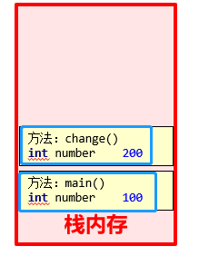

```java
public static void main(String[] args) {
	int number = 1;
	System.out.println(number); // 1
	change(number);
	System.out.println(number); // 1
}
public static void change(int number) {
	number = 200;
}
```

上面的代码，注意，虽然change函数进入了num = 1的参数，但是不会改变change函数的实际参数的值。并且change函数里的number和main里的number是不一样的，两个人在不同的栈内存。

### ⭐方法的参数传递（引用类型）

**要进入堆内存了，所以是对地址引用的赋值**：

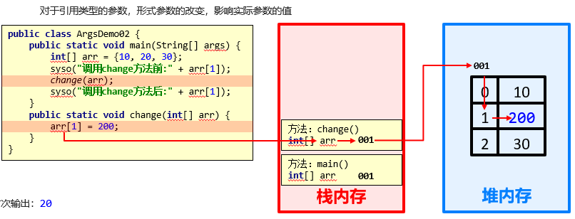

```java
public static void main(String[] args) {
	int[] arr = {0, 1, 2};
	System.out.println(arr[1]); // 1
	change(arr);
	System.out.println(arr[1]); // 200
}
public static void change(int[] arr) {
	arr[1] = 200;
}
```

**输出语句换行与不换行：**

```java
System.out.println(“内容”); //输出内容并换行
System.out.print(“内容”); //输出内容不换行
System.out.println(); //起到换行的作用
```

遍历数组打印出来[11, 22, 33, 44, 55]

```java
public static void main(String[] args) {
	int[] arr = {11, 22, 33, 44, 55};
	System.out.print("["); // 1
	for (int i = 0; i < arr.length; i++) {
	  if (i == arr.length - 1) {
		System.out.print(arr[i]);
	  } else {
		System.out.print(arr[i] + ", ");
	  }
	}
	System.out.print("]"); 
	// [11, 22, 33, 44, 55]
}
```


## 7. Debug

**Debug**：**是供程序员使用的程序调试工具，它可以用于**查看程序**的**执行流程**，也可以用于追踪程序执行过程来**调试程序。**就是设置断点。**


## 8. 类和对象

**成员变量：**理解为类的属性；

**局部变量：**就是类的方法里面的变量；

| **区别**       | **成员变量**                               | **局部变量**                                       |
| -------------- | ------------------------------------------ | -------------------------------------------------- |
| 类中位置不同   | 类中方法外                                 | 方法内或者方法声明上                               |
| 内存中位置不同 | 堆内存                                     | 栈内存                                             |
| 生命周期不同   | 随着对象的存在而存在，随着对象的消失而消失 | 随着方法的调用而存在，随着方法的调用完毕而消失     |
| 初始化值不同   | 有默认的初始化值                           | 没有默认的初始化值，**必须先定义，赋值，才能使用** |

```java
public class HelloWorld {
  String name;
  int age;
  public void study() {
	System.out.println("study");
  }
  
  public static void main(String[] args) {
	HelloWorld xiaomin = new HelloWorld(); // new一个对象的方式
	System.out.println(xiaomin.name + "," + xiaomin.age);
	xiaomin.study();
  }
}
```

### 8.1 封装

对象里成员变量都是隐藏在对象内部的，**外界是无法直接操作的**。

**封装原理：**将类的某些信息隐藏在类内部，不允许外部程序直接访问，而是通过该类提供的方法来实现对隐藏信息的操作和访问成员变量 **private**，提供对应的**getXxx()**/**setXxx()**方法。

1. **private**

- 是一个权限修饰符

- 可以修饰成员（成员变量和成员方法）

- 作用是保护成员不被别的类使用，被 **private** 修饰的成员只在本类中才能访问

针对**private**修饰的成员变量，如果需要被其他类使用，提供相应的操作

- 提供**get变量名()**方法，用于获取成员变量的值，方法用**public**修饰

- 提供**set变量名(参数)**方法，用于设置成员变量的值，方法用**public**修饰

```java
public class Student {
  String name;
  //  int age;
  private int age;
  //具体对象只能用get和set方法访问
  public void setAge(int a) {
	// 这样的好处是，可以作判断，让赋予的值更安全
	if (a < 0 || a > 120) {
	  System.out.println("你给的年龄有误");
	} else {
	  age = a;
	}
  }
  public int getAge() {
	return age;
  }
  public void show() {
	System.out.println(name + "," + age);
  }
}

public class StudentDemo {
  public static void main(String[] args) {
	Student s = new Student();
	s.name = "zjj";
	s.setAge(-52);
	System.out.println(s.getAge());
	s.show();
  }
}
// 输出：你给的年龄有误   age还是默认值0
```


2. **this**

**解决局部变量隐藏成员变量**

```java
public class Student {
  private String name;
  private int age;
  public void setAge(int a) {
	if (a < 0 || a > 120) {
	  System.out.println("你给的年龄有误");
	} else {
	  this.age = a;
	}
  }
  public void setName(String name) {
		this.name = name;
  }
  public String getName() {
		return this.name;
  }
  public int getAge() {
		return this.age;
  }
  public void show() {
		System.out.println(name + "," + age);
  }
}
```


### 8.2 构造方法

完成初始化操作，应该就是 contructor(){};

```java
public class Student {
  private String name;
  private int age;
  // 构造方法
  public Student(String name, int age) {
	this.name = name;
	this.age = age;
  }
  public void show() {
		System.out.println(name + "," + age);
  }
}
```

**如果想定义一个可以有参可以无参的构造方法，需要重载**

```java
public Student() {} // 不传参就是默认值
public Student(String name, int age) {
	this.name = name;
	this.age = age;
}
```

### 8.3 继承

`super` 访问的是父亲的属性；`this` 访问自己的属性。

#### 构造方法的访问特点

**子类中所有的构造方法默认都会访问父类中无参的构造方法**

为什么呢？

- 因为子类会继承父类中的数据，可能还会使用父类的数据。所以，子类初始化之前，一定要先完成父类数据的初始化
- l每一个子类构造方法的第一条语句默认都是：**super()**

如果父类中没有无参构造方法，只有带参构造方法，该怎么办呢？

- 通过使用super关键字去显示的调用父类的带参构造方法

- 在父类中自己提供一个无参构造方法

#### 成员方法的访问特点

通过子类对象访问一个方法

- 子类成员范围找

- 父类成员范围找

- 如果都没有就报错

#### 方法重写

子类出现和父类一样的方法，但不满足于此，想多一些功能。就用 `super.call(参数)` 来重写

```java
// Father
public class Fu {
  public void call(String name) {
	System.out.println("给" + name + "打电话");
  }
}
// Son
public class Son extends Fu {
  @Override
  public void call(String name) {
	System.out.println("----我比父亲多的功能写在这---");
	⭐super.call(name);⭐
	System.out.println("----还能有个更多功能");
  }
}
// 调用
public class Demo {
  public static void main(String[] args) {
	Son zjj = new Son();
	Fu zq = new Fu();
	zjj.call("wl");
	// ----我比父亲多的功能写在这---
	//给wl打电话
	//----还能有个更多功能
	zq.call("wl"); //给wl打电话
  }
}
```

⭐`@Override` 可以帮助我们检查重写方法的方法声明的正确性

**注意：**

- 私有方法不能被重写(父类私有成员子类是不能继承的)
- 子类方法访问权限不能更低(public > 默认 > 私有)

#### 继承的注意事项

1. 不能多继承，只能继承一个父类
2. 支持多层继承，可以访问到爷爷的方法！！！


### 8.4 ⭐多态

多态的前提和体现 

- 有继承/实现关系

- 有方法重写

- 有父类引用指向子类对象

  ```java
  Animal a = new Cat(); // 父类引用指向子类对象！
  ```

#### 成员访问特点

- **成员变量**：编译看左边，执行看左边

- **成员方法**：编译看左边，执行看右边    成员方法有重写！

```java
Animal a = new Cat(); // 父类引用指向子类对象！
	// 成员变量：编译和运行都看左边的父类
	System.out.println(a.age); // 40 Animal里面有才能访问到且是Animal里的
//	System.out.println(a.weight); // 报错
	// 成员方法：编译看左边父类，运行看右边子类！
	a.eat(); // 但是输出的是🐟的内容！！！
//	a.playGame(); // 报错
```


#### 多态的好处和弊端

- 多态的好处：提高了程序的扩展性

  具体体现：定义方法的时候，使用父类型作为参数，将来在使用的时候，使用具体的子类型参与操作

- 多态的弊端：不能使用子类的特有功能

例子：

#### 多态中的转型

- 向上转型：子到父，父类的引用指向子类对象

  ```java
  Animal a = new Cat();
  a.eat(); // 只能调用子类里面重写父类的方法，并且这个子类方法
  ```

- 向下转型：父到子，父类的引用转为子类对象

  ```java
  Cat c = (Cat)a; // 父类引用a变成了子类c
  c.eat();
  c.playGame(); // 完全变成子类了
  ```

  

### 8.5 抽象类

像动物类，如果有个方法 eat() 打印吃东西。如果Cat 和 Dog 都继承它，且没有重写这个方法时，调用这个方法都打印吃东西，没能具体说明Cat 和 Dog 吃的是啥。所以 Animal 这个类没办法具体，他就被定义为抽象类。用关键字 `abstract` , 这个 eat() 方法也是抽象方法 也用 `abstract` 申明。

#### 抽象类的特点

1. 抽象类不能直接创建对象，只能通过多态创建。

   ```java
   public abstract class Animal{
     public abstract void eat();
     public void sleep(){
   		System.out.println("睡觉")
     } // 可以定义具体方法
   }
   // Cat 里面重写eat方法
   // Test.java
   Animal a = new Cat();
   a.eat();
   a.sleep(); // 可以调用一切 Animal 的方法和abstract中在Cat中重写的方法
   ```

2. 抽象类和抽象方法必须使用 **abstract** 关键字修饰

3. 抽象类的子类：要么重写抽象类中的所有抽象方法，**要么是抽象类**

**抽象类最重要的作用！：**限定子类必须要重写一些方法，不重写 `abstract` 定义的方法会报错。


## 9.集合

**本质是对象。**比如 `ArrayList<E>` 是一个可调整大小的数组实现，`<E>` 是泛型。

### 9.1 ArrayList

| **方法名**                             | **说明**                               |
| -------------------------------------- | -------------------------------------- |
| public ArrayList()                     | 创建一个空的集合对象                   |
| public boolean  add(E e)               | 将指定的元素追加到此集合的末尾         |
| public void  add(int index,E  element) | 在此集合中的指定位置插入指定的元素     |
| public boolean  remove(Object o)       | 删除指定的元素，返回删除是否成功       |
| public E  remove(int  index)           | 删除指定索引处的元素，返回被删除的元素 |
| public E  set(int index,E  element)    | 修改指定索引处的元素，返回被修改的元素 |
| public E  get(int  index)              | 返回指定索引处的元素                   |
| public int  size()                     | 返回集合中的元素的个数                 |


## 10. 字符串

### 构造方法

| **方法名**                 | **说明**                                  |
| -------------------------- | ----------------------------------------- |
| public  String()           | 创建一个空白字符串对象，不含有任何内容    |
| public  String(char[] chs) | 根据字符数组的内容，来创建字符串对象      |
| public  String(byte[] bys) | 根据字节数组的内容，来创建字符串对象      |
| String s =  “abc”;         | 直接赋值的方式创建字符串对象，内容就是abc |

```java
String s1 = new String(); // ""
char[] chs = {'a', 'b', 'c'}; // 这是字符数组
String s2 = new String(chs); // "abc"
byte[] bys = {97, 98, 99}; // 字节数组，只能传数字
String s3 = new String(bys);
System.out.println(s3); // "abc" 它十八97 98 99 的转为ACS值了
String s4 = "abc";
```

### String 对象的特点

1. 通过 new 创建的字符串对象，每一次 new 都会申请一个内存空间，虽然内容相同，但是地址值不同

   ```java
   char[] chs = {'a', 'b', 'c'};
    String s1 = new String(chs);
    String s2 = new String(chs);
   ```

   每一次new的时候都会有一个新的地址，只不过s1和s2参考的字符串内容是相同的

2. **以“ ”方式给出的字符串，只要字符序列相同(顺序和大小写)，无论在程序代码中出现几次，**

   **JVM 都只会建立一个 String 对象，并在字符串池中维护**

   ```java
    String s3 = "abc";
    String s4 = "abc";
   ```

   在上面的代码中，针对第一行代码，JVM 会建立一个 String 对象放在字符串池中，并给 s3 参考；

   第二行则让 s4 直接参考字符串池中的 String 对象，也就是说**它们本质上是同一个对象**


### 字符串的比较

用 `==` 作比较

- 基本类型：比较的是数据值
- 引用类型：比较的是地址值

所以。**字符串是对象**。用 `==` 比较的是引用地址是否相同。所以上面字符串特点可以用代码看得出来：

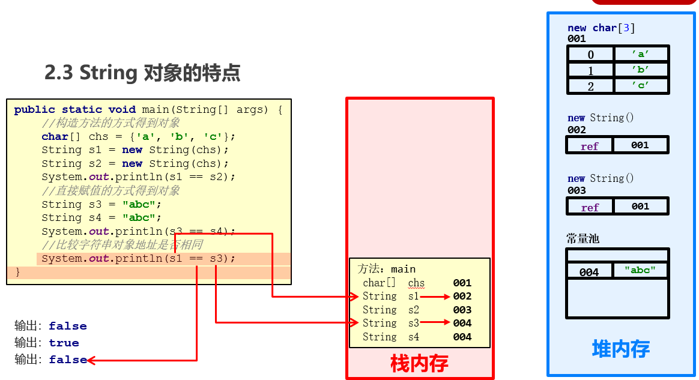

s3 和 s4 是用赋值声明的，所以他们是同一个对象，输出 true。s1 和 s2 和 s3 用 == 判断都是false。

**如果想单纯判断值是否相等呢？**

 字符串有个 `equals()` 方法。

### API

- `str.charAt(i)`: 指定索引处的字符值

- `str.length()`: 记得加括号！字符串长度

  **注意 char 类型能进行加减，就是 ACS 加减再转义**

  ```java
  char ch = 'A';
  ch += 1;
  System.out.println(ch); // 'B'
  ```

- 


### StringBuilder

  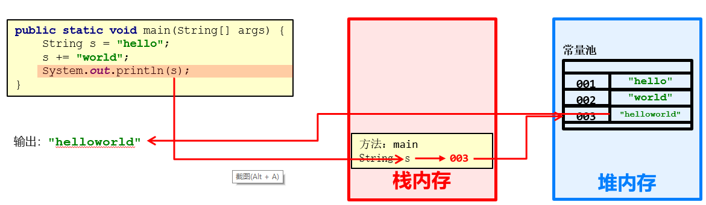

如果对字符串进行拼接操作，每次拼接，都会构建一个新的 String 对象，既耗时，又浪费内存空间，而这种操作还不可避免。那么有没有一种比较好的方式可以解决这个问题呢？答案是肯定的，我们可以通过 Java 提供的 **StringBuilder** 类就来解决这个问题。

**两者的关系：**其实相当于数组和数组集合。**字符串本身内容不可变！**更新就会分配新空间，和数组一样，申明后空间不可变。但是 StringBuilder 内容可变，就是一个容器。

| **方法名**                                 | **说明**                                   |
| :----------------------------------------- | :----------------------------------------- |
| public StringBuilder()                     | 创建一个空白可变字符串对象，不含有任何内容 |
| public StringBuilder(String  str)          | 根据字符串的内容，来创建可变字符串对象     |
| public StringBuilder  **append(任意类型)** | 添加数据，并返回对象本身                   |
| public StringBuilder  **reverse()**        | 返回相反的字符序列                         |
| public String toString()                   | StringBuilder 转为 String                  |
| public StringBuilder(String s)             | String 转为 StringBuilder                  |


## 11. 修饰符

### 包

其实就是文件夹，进行管理分类。

- 包的格式定义：
  - 格式：**package** **包名**; (多级包用.分开)
  - 范例：**package** com.itheima；

- 如何建包

  - **手动建包**：把 `class` 文件挪到 `com/itheima` 里面去,然后执行 `java com.itheima.HelloWorld`
  - **自动建包**：命令行 `javac -d . HelloWorld.java` 然后执行 `java com.itheima.HelloWorld`

  ```java
  // com.itheima.HelloWorld
  package com.itheima;
  
  public class HelloWorld {
      public static void main (String[ ] args) {
          System.out.println("Hello, World");
      }
  }
  // 手动建包：把class文件挪到com/itheima里面去,然后执行 java com.itheima.HelloWorld
  // 自动建包：命令行 javac -d . HelloWorld.java 然后执行 java com.itheima.HelloWorld
  ```

- 导包

  ```java
  // 1.较复杂
  zjj.Teacher t = new zjj.Teacher();
  t.teach();
  // 上方导入包 import zjj.Teacher;
  Teacher t = new Teacher();
  t.teach();
  ```


### 权限修饰符

| **修饰符** | **同一个类中** | 同一个包中子类和无关类 | 不同包的子类 | **不同**包的无关类 |
| :--------: | :------------: | :--------------------: | :----------: | :----------------: |
|  private   |       √        |           ❌            |      ❌       |         ❌          |
|    默认    |       √        |           √            |      ❌       |         ❌          |
| protected  |       √        |           √            |      √       |         ❌          |
|   public   |       √        |           √            |      √       |         √          |

**总结：**

- `private` 私有，谁都访问不到。
- 默认：同一个包里都能访问，出包不行。
- `protected`: 同一个包里任何 + 出包子类。
- `public`: 啥都能访问


### 状态修饰符

- `static`： 相当于给了变量默认值！注意不要用具体对象来设定默认值，在最上面设置。

  ```java
  Static.university = "SJTU";
  	Static s1 = new Static();
  	s1.name = "zjj";
  	s1.print();
  	Static s2 = new Static();
  	s2.name = "zym";
  	s2.print();
  ```

**注意：** 如果你再用具体对象 s1 设定 university 的值，s2 的university 也会改变！！！注意一下 不是严格意义上的默认值。

**特点！** 静态成员方法只能访问静态成员！非静态成员方法啥都能访问


- `final`: 就相当于 const。但注意，基本类型是值不可变，引用类型是地址不可变内容可以变。

  ```java
  // 1.final修饰基本类型变量
  	final int age = 20; // 不可再修改，会报错
  	System.out.println(age);
  	// 2.final修饰引用类型变量
  	final Final f = new Final();
  	f.age = 100;
  	System.out.println(f.age); // 100 可以修改！
  	// 其实就是 f 的内容可以变，地址不能变
  	f = new Final(); // 报错！新地址了
  ```

  

## 12. 接口

**其实和抽象类差不多样子**，都是用来规定必须重写的方法的，子类用 implements 来”继承” 这个接口。并且一定要重写方法。申明一个具体对象也要用多态方式。

**多态的形式：**具体类多态，抽象类多态，**接口多态**

#### 接口成员特点

- 接口里面的成员变量只能是常量，并且是静态修饰。

- 方法：不能有构造方法，只能有抽象方法。

  ```java
  // 没有构造方法，子类为什么可以在构造方法写 super()???
  // 这是因为所有的类都继承自根 Object ，和 js 的原型链一样。所以这个子类找到了 Object 自带的无参初始化构造方法，相当于这样：
  public class InterImp extends Object implements Inter{ // 完整写法
    public InterImp(){
      super();
    }
  }
  ```

   

#### 类和接口的关系

- 类和类：继承关系，只能单继承，但是可以多层继承

- 类和接口：实现关系，可以单实现，也可以多实现，还可以在继承一个类的同时实现多个接口

- 接口和接口：继承关系，可以单继承，也可以多继承
- **类和接口设计理念的区别：**抽象类是对类的抽象，包括属性和行为。接口是对行为的抽象，**主要是行为。**

```java
// 抽象类
public abstract class Door{
  public abstract void open();
}
// 接口
public interface Door{
  void open();
}
```


