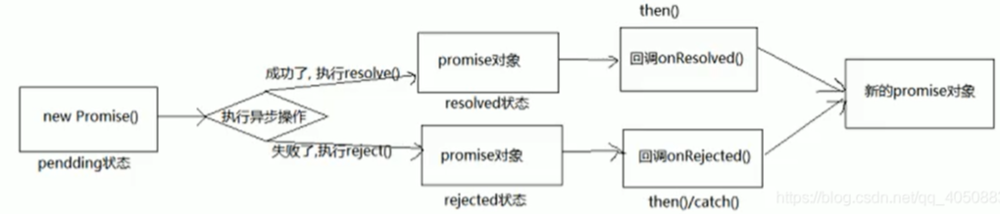

# Promise总结

参考：[blog](http://www.woc12138.com/article/43)

## 1. 准备工作

### 1.1 实例对象和函数对象

1. 实例对象：new 函数产生的对象，称为实例对象，简称为对象
2. 函数对象：将函数作为对象使用时，称为函数对象

```js
function Fn() { // Fn只能称为函数
}
const fn = new Fn() // Fn只有new过的才可以称为构造函数
//fn称为实例对象
console.log(Fn.prototype)// Fn作为对象使用时，才可以称为函数对象
Fn.bind({}) //Fn作为函数对象使用
$('#test') // $作为函数使用
$.get('/test') // $作为函数对象使用
```

**() 的左边必然是函数，点的左边必然是对象**

### 1.2 回调函数

#### 同步回调

定义：立即执行，完全执行完了才结束，不会放入回调队列中

举例：数组遍历相关的回调 / Promise的 excutor 函数

```js
const arr = [1, 3, 5];
arr.forEach(item => { // 遍历回调，同步回调，不会放入队列，一上来就要执行
  console.log(item);
})
console.log('forEach()之后')
// 1
// 3
// 5
// "forEach()之后"
```

#### 异步回调

定义：不会立即执行，会放入回调队列中将来执行

举例：定时器回调 / ajax回调 / Promise成功或失败的回调

```js
// 定时器回调
setTimeout(() => { // 异步回调，会放入队列中将来执行
  console.log('timeout callback()')
}, 0)
console.log('setTimeout()之后')
// “setTimeout()之后”
// “timeout callback()”
// Promise 成功或失败的回调
new Promise((resolve, reject) => {
  resolve(1)
}).then(
  value => {console.log('value', value)},
  reason => {console.log('reason', reason)}
)
console.log('----')
// ----
// value 1
```

**js 引擎是先把初始化的同步代码都执行完成后，才执行回调队列中的代码**

### 1.3 JS 的 error 处理

#### 错误的类型

Error：所有错误的父类型

**ReferenceError**：引用的变量不存在

```js
console.log(a) // ReferenceError:a is not defined
```

**TypeError**：数据类型不正确

```js
let b
console.log(b.xxx)
// TypeError:Cannot read property 'xxx' of undefined
let b = {}
b.xxx()
// TypeError:b.xxx is not a function
```

**RangeError**：数据值不在其所允许的范围内

```js
function fn() {
  fn()
}
fn()
// RangeError:Maximum call stack size exceeded
```

**SyntaxError**：语法错误

```js
const c = """"
// SyntaxError:Unexpected string
```


#### 错误处理

捕获错误：try ... catch

抛出错误：throw error

```js
function something() {
  if (Date.now()%2===1) {
    console.log('当前时间为奇数，可以执行任务')
  } else { //如果时间为偶数抛出异常，由调用来处理
    throw new Error('当前时间为偶数，无法执行任务')
  }
}

// 捕获处理异常
try {
  something()
} catch (error) {
  alert(error.message)
}
```

#### 错误对象的方法

message 属性：错误相关信息

stack 属性：函数调用栈记录信息

```js
try {
  let d
  console.log(d.xxx)
} catch (error) {
  console.log(error.message)
  console.log(error.stack)
}
console.log('出错之后')
// Cannot read property 'xxx' of undefined
// TypeError:Cannot read property 'xxx' of undefined
// 出错之后
```

**因为错误被捕获处理了，后面的代码才能运行下去，打印出‘出错之后’**


## 2. Promise 的理解和使用

### 2.1 Promise 是什么

#### 2.1.1 Promise 的理解

抽象表达：Promise 是 JS 中进行异步编程的新的解决方案

具体表达：

1. 语法上：Promise 是一个构造函数
2. 功能上：Promise 对象用来封装一个异步操作并可以获取其结果

#### 2.1.2 Promise 的状态改变

1. pending 变为 resolved
2. pending 变为 rejected

只有这两种，且一个 promise 对象只能改变一次。无论成功还是失败，都会有一个结果数据。成功的结果数据一般称为 **value**，而失败的一般称为 **reason**。

#### 2.1.3 Promise 的基本流程



#### 2.1.4 Promise 的基本使用

```js
// 创建一个新的p对象promise
const p = new Promise((resolve, reject) => { // 执行器函数
  // 执行异步操作任务
  setTimeout(() => {
    const time = Date.now() 
    // 如果当前时间是偶数代表成功，否则失败
    if (time % 2 == 0) {
      // 如果成功，调用resolve(value)
      resolve('成功的数据，time=' + time)
    } else {
      // 如果失败，调用reject(reason)
      reject('失败的数据，time=' + time)
    }
  }, 1000);
})

p.then(
  value => { // 接收得到成功的value数据 onResolved
    console.log('成功的回调', value)
  },
  reason => { // 接收得到失败的reason数据 onRejected
    console.log('失败的回调', reason)
  }
)
```

### 2.2 为什么要用 Promise

#### 1. 指定回调函数的方式更加灵活

旧的：必须在启动异步任务前指定

promise：启动异步任务 => 返回promise对象 => 给promise对象绑定回调函数(甚至可以在异步任务结束后指定)


#### 2. 支持链式调用，可以解决回调地狱问题

##### 什么是回调地狱？

回调函数嵌套调用，**外部回调函数**异步执行的结果是其**内部嵌套的回调函数**执行的条件

```js
doSomething(function(result) {
  doSomethingElse(result, function(newResult) {
    doThirdThing(newResult, function(finalResult) {
      console.log('Got the final result:' + finalResult)
    }, failureCallback)
  }, failureCallback)
}, failureCallback)
```

##### 回调地狱的缺点？

不便于阅读 / 不便于异常处理

##### 解决方案？

promise 链式调用

##### 终极解决方案？

async/await

##### 使用 promise 的链式调用解决回调地狱

```
doSomething()
  .then(result => doSomethingElse(result))
  .then(newResult => doThirdThing(newResult))
  .then(finalResult => {
  console.log('Got the final result:' + finalResult)
})
  .catch(failureCallback)
```

回调地狱的终极解决方案 async/await

```
async function request() {
  try{
    const result = await doSomething()
    const newResult = await doSomethingElse(result)
    const finalResult = await doThirdThing(newResult)
    console.log('Got the final result:' + finalResult)
  } catch (error) {
    failureCallback(error)
  }
}
```


### 2.3 如何使用 Promise

#### ⭐⭐API

1. Promise 构造函数：Promise(excutor) { }

   excutor 执行器函数：同步执行 (resolve, reject) => { }

   resolve 函数：内部定义成功时调用的函数 resove(value)

   reject 函数：内部定义失败时调用的函数 reject(reason)

   说明：excutor 是执行器，会在 Promise 内部立即同步回调，异步操作 `resolve/reject` 就在 excutor 中执行

2. `Promise.prototype.then` 方法：p.then(onResolved, onRejected)

   1）onResolved 函数：成功的回调函数 (value) => {}

   2）onRejected 函数：失败的回调函数 (reason) => {}

   说明：指定用于得到成功 value 的成功回调和用于得到失败 reason 的失败回调，返回一个新的 promise 对象

3. `Promise.prototype.catch` 方法：p.catch(onRejected)

		1）onRejected 函数：失败的回调函数 (reason) => {}。**then() 的语法糖**，相当于 then(undefined, onRejected)
		
		```js
		new Promise((resolve, reject) => { // excutor执行器函数
		 setTimeout(() => {
		   if(...) {
		     resolve('成功的数据') // resolve()函数
		   } else { 
		     reject('失败的数据') //reject()函数
		    }
		 }, 1000)
		}).then(
		 value => { // onResolved()函数
		  console.log(value)
		}
		).catch(
		 reason => { // onRejected()函数
		  console.log(reason)
		}
		)
		```
		
4. `Promise.resolve` 方法：Promise.resolve(value)

5. `Promise.reject` 方法：Promise.resolve(reason)     reason：失败的原因。返回一个失败的 promise 对象

    ```js
    //产生一个成功值为1的promise对象
    new Promise((resolve, reject) => {
     resolve(1)
    })
    //相当于
    const p1 = Promise.resolve(1)
    const p2 = Promise.resolve(2)
    const p3 = Promise.reject(3)
    
    p1.then(value => {console.log(value)}) // 1
    p2.then(value => {console.log(value)}) // 2
    p3.catch(reason => {console.log(reason)}) // 3
    ```

    `Promise.resolve()/Promise.reject()` 方法就是一个**语法糖**

6. ⭐⭐`Promise.all` 方法：`Promise.all(iterable)`

    iterable：包含 n 个 promise 的可迭代对象，如 `Array` 或 `String`

    说明：返回一个新的 promise，**只有所有的 promise 都成功才成功，只要有一个失败了就直接失败**

    ```js
    // 接上面p1、p2、p3(失败)
    const pAll = Promise.all([p1, p2, p3])
    const pAll2 = Promise.all([p1, p2])
    //因为其中p3是失败所以pAll失败
    pAll.then(
    value => {
       console.log('all onResolved()', value)
     },
    reason => {
       console.log('all onRejected()', reason) 
     }
    ) // all onRejected() 3
    pAll2.then(
    values => {
       console.log('all onResolved()', values)
     },
    reason => {
       console.log('all onRejected()', reason) 
     }
    ) // all onResolved() [1, 2]
    ```

7. `Promise.race` 方法：`Promise.race(iterable)`

    iterable：包含 n 个 promise 的可迭代对象，如 `Array` 或 `String`

    说明：返回一个新的 promise，第一个完成的 promise 的结果状态就是最终的结果状态 => **谁先完成就输出谁，不管失败还是成功**

    ```js
    const pRace = Promise.race([p1, p2, p3])
    // 谁先完成就输出谁(不管是成功还是失败)
    const p1 = new Promise((resolve, reject) => {
     setTimeout(() => {
       resolve(1)
     }, 1000)
    })
    const p2 = Promise.resolve(2)
    const p3 = Promise.reject(3)
    
    pRace.then(
    value => {
       console.log('race onResolved()', value)
     },
    reason => {
       console.log('race onRejected()', reason) 
     }
    ) //race onResolved() 2
    ```


#### Promise 的几个关键问题

##### 1.如何改变 promise 的状态？

(1) resolve(value)：如果当前是 pending 就会变为 resolved

(2) reject(reason)：如果当前是 pending 就会变为 rejected

(3) 抛出异常：如果当前是 pending 就会变为 rejected

```js
const p = new Promise((resolve, reject) => {
  //resolve(1) // promise变为resolved成功状态
  //reject(2) // promise变为rejected失败状态
  throw new Error('出错了') // 抛出异常，promise变为rejected失败状态，reason为抛出的error
})
p.then(
  value => {},
  reason => {console.log('reason',reason)}
)
// reason Error:出错了
```

##### 2.一个 promise 指定多个成功/失败回调函数，都会调用吗？

当 promise 改变为对应状态时都会调用，所以是链式调用！

```js
const p = new Promise((resolve, reject) => {
  //resolve(1)
  reject(2)
})
p.then(
  value => {},
  reason => {console.log('reason',reason)}
)
p.then(
  value => {},
  reason => {console.log('reason2',reason)}
)
// reason 2
// reason2 2
```

##### 3.改变 promise 状态和指定回调函数谁先谁后？

1. 都有可能，常规是先指定回调再改变状态，但也可以先改状态再指定回调

2. 如何先改状态再指定回调？

   (1) 在执行器中直接调用 resolve()/reject()

   (2) 延迟更长时间才调用 then()

3. 什么时候才能得到数据？

   (1) 如果先指定的回调，那当状态发生改变时，回调函数就会调用得到数据

   (2) 如果先改变的状态，那当指定回调时，回调函数就会调用得到数据

```js
new Promise((resolve, reject) => {
  setTimeout(() => {
    resolve(1) // 改变状态
  }, 1000)
}).then( // 指定回调函数
  value => {},
  reason =>{}
)
```

**此时，先指定回调函数，保存当前指定的回调函数；后改变状态(同时指定数据)，然后异步执行之前保存的回调函数。**

```js
new Promise((resolve, reject) => {
  resolve(1) // 改变状态
}).then( // 指定回调函数
  value => {},
  reason =>{}
)
```

**这种写法，先改变的状态(同时指定数据)，后指定回调函数(不需要再保存)，直接异步执行回调函数**

```js
new Promise((resolve, reject) => {
  resolve(1);
})
  .then(
    value => {
      console.log('onResolved1()', value);
    },
    reason => {
      console.log('onRejected1()', reason);
    }
  )
  .then(
    value => {
      console.log('onResolved2()', value);
    },
    reason => {
      console.log('onRejected2()', reason);
    }
  );
// onResolved1() 1
// onResolved2() undefined
new Promise((resolve, reject) => {
  resolve(1);
})
  .then(
    value => {
      console.log('onResolved1()', value);
      //return 2                   // onResolved2() 2
      //return Promise.resolve(3)  // onResolved2() 3
      //return Promise.reject(4)   // onRejected2() 4
      //throw 5                    // onRejected2() 5
    },
    reason => {
      console.log('onRejected1()', reason);
    }
  )
  .then(
    value => {
      console.log('onResolved2()', value);
    },
    reason => {
      console.log('onRejected2()', reason);
    }
  );
// onResolved1() 1
// 对应输出如上所示
```

##### 4.promise.then() 返回的新 promise 的结果状态由什么决定？

(1)简单表达：由 then() 指定的回调函数执行的结果决定

(2)详细表达：

 ① 如果抛出异常，新 promise 变为 rejected，reason 为抛出的异常

 ② 如果返回的是非 promise 的任意值，新 promise 变为 resolved，value 为返回的值

 ③ 如果返回的是另一个新 promise，此 promise 的结果就会成为新 promise 的结果

```js
new Promise((resolve, reject) => {
  resolve(1)
}).then(
  value => {
    console.log('onResolved1()', value)
  },
  reason => {
    console.log('onRejected1()', reason)
  }
).then(
  value => {
    console.log('onResolved2()', value)
  },
  reason => {
    console.log('onRejected2()', reason)
  }
)
// onResolved1() 1
// onResolved2() undefined
new Promise((resolve, reject) => {
  resolve(1)
}).then(
  value => {
    console.log('onResolved1()', value)
    //return 2                   // onResolved2() 2
    //return Promise.resolve(3)  // onResolved2() 3
    //return Promise.reject(4)   // onRejected2() 4
    //throw 5                    // onRejected2() 5
  },
  reason => {
    console.log('onRejected1()', reason)
  }
).then(
  value => {
    console.log('onResolved2()', value)
  },
  reason => {
    console.log('onRejected2()', reason)
  }
)
// onResolved1() 1
// 对应输出如上所示
```

##### 5.promise 如何串联多个操作任务？

(1) promise 的 then() 返回一个新的 promise，可以并成 then() 的链式调用

(2) 通过 then 的链式调用串联多个同步/异步任务

```js
new Promise((resolve, reject) => {
  setTimeout(() => {
    console.log('执行任务1(异步)')
    resolve(1)
  }, 1000)
}).then(
  value => {
    console.log('任务1的结果', value)
    console.log('执行任务2(同步)')
    return 2 // 同步任务直接return返回结果
  }
).then(
  value => {
    console.log('任务2的结果', value)
    return new Promise((resolve, reject) => { // 异步任务需要包裹在Promise对象中
      setTimeout(() => {
        console.log('执行任务3(异步)')
        resolve(3)
      }, 1000)
    })
  }
).then(
  value => {
    console.log('任务3的结果', value)
  }
)
// 执行任务1(异步)
// 任务1的结果 1
// 执行任务2(同步)
// 任务2的结果 2
// 执行任务3(异步)
// 任务3的结果 3
```


##### 6.Promise 异常穿透(传透)？

(1)当使用 promise 的 then 链式调用时，可以在最后指定失败的回调

(2)前面任何操作出了异常，都会传到最后失败的回调中处理

```
new Promise((resolve, reject) => {
   //resolve(1)
   reject(1)
}).then(
  value => {
    console.log('onResolved1()', value)
    return 2
  }
).then(
  value => {
    console.log('onResolved2()', value)
    return 3
  }
).then(
  value => {
    console.log('onResolved3()', value)
  }
).catch(
  reason => {
    console.log('onRejected1()', reason)
  }
)
// onRejected1() 1
```

相当于这种写法：

```
new Promise((resolve, reject) => {
   //resolve(1)
   reject(1)
}).then(
  value => {
    console.log('onResolved1()', value)
    return 2
  },
  reason => {throw reason} // 抛出失败的结果reason
).then(
  value => {
    console.log('onResolved2()', value)
    return 3
  },
  reason => {throw reason}
).then(
  value => {
    console.log('onResolved3()', value)
  },
  reason => {throw reason}
).catch(
  reason => {
    console.log('onRejected1()', reason)
  }
)
// onRejected1() 1
```

所以失败的结果是一层一层处理下来的，最后传递到 catch 中。

或者，将 `reason => {throw reason}` 替换为 `reason => Promise.reject(reason)` 也是一样的

##### 7.中断 promise 链？

当使用 promise 的 then 链式调用时，在中间中断，不再调用后面的回调函数

办法：在回调函数中返回一个 pending 状态的 promise 对象

```
new Promise((resolve, reject) => {
   //resolve(1)
   reject(1)
}).then(
  value => {
    console.log('onResolved1()', value)
    return 2
  }
).then(
  value => {
    console.log('onResolved2()', value)
    return 3
  }
).then(
  value => {
    console.log('onResolved3()', value)
  }
).catch(
  reason => {
    console.log('onRejected1()', reason)
  }
).then(
  value => {
    console.log('onResolved4()', value)
  },
  reason => {
    console.log('onRejected2()', reason)
  }
)
// onRejected1() 1
// onResolved4() undefined
```

为了在 catch 中就中断执行，可以这样写：

```
new Promise((resolve, reject) => {
   //resolve(1)
   reject(1)
}).then(
  value => {
    console.log('onResolved1()', value)
    return 2
  }
).then(
  value => {
    console.log('onResolved2()', value)
    return 3
  }
).then(
  value => {
    console.log('onResolved3()', value)
  }
).catch(
  reason => {
    console.log('onRejected1()', reason)
    return new Promise(() => {}) // 返回一个pending的promise
  }
).then(
  value => {
    console.log('onResolved4()', value)
  },
  reason => {
    console.log('onRejected2()', reason)
  }
)
// onRejected1() 1
```

在 catch 中返回一个新的 promise，且这个 promise 没有结果。

由于，返回的新的 promise 结果决定了后面 then 中的结果，所以后面的 then 中也没有结果。

这就实现了中断 promise 链的效果。


