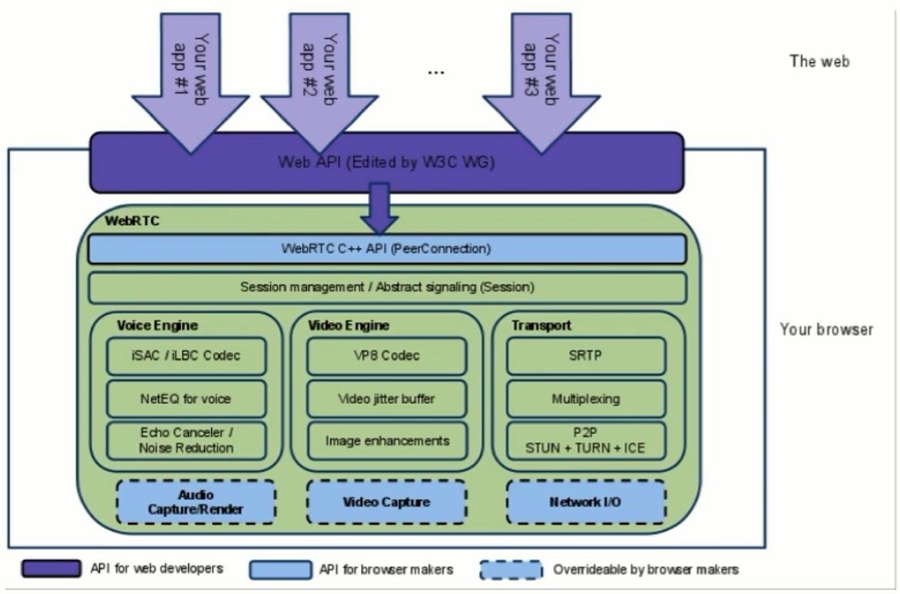
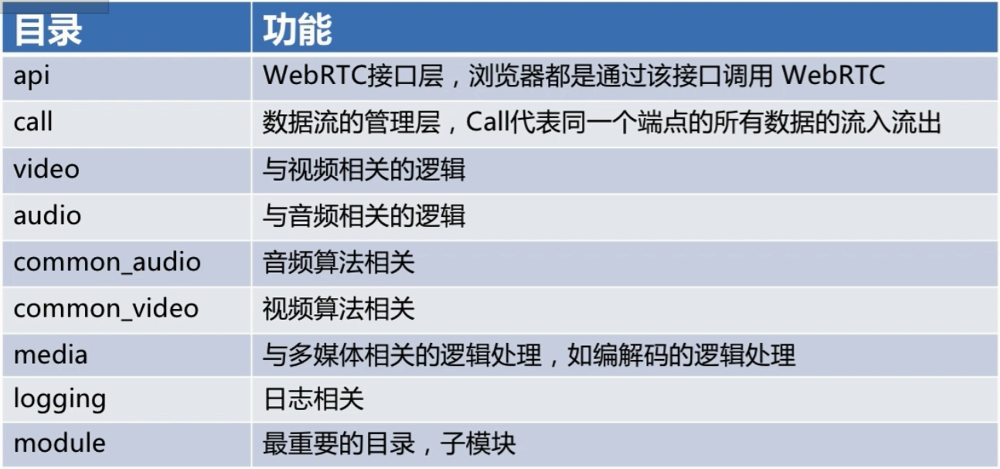
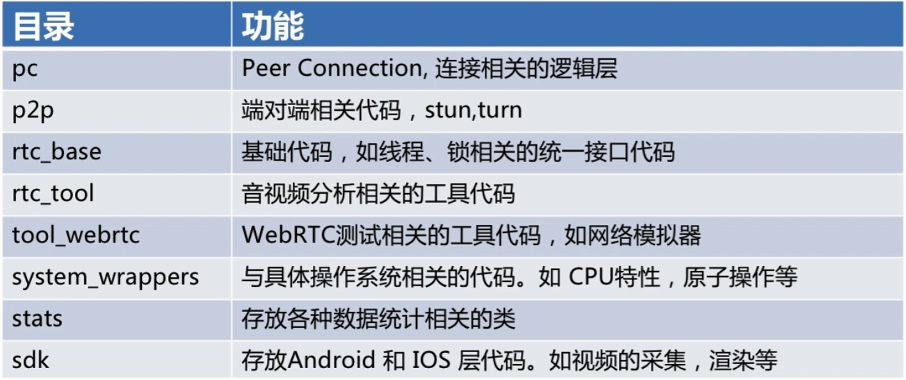

# 一、WebRTC概述

**音视频处理 + 即使通讯的开源库**

能做什么呢？

- 音视频实时互动
- 游戏、即时通讯、文件传输等
- 百宝箱：传输、音视频处理（回音消除、降噪等等）

能学到什么？

- 音视频设备访问与管理 —— 跨平台
- 音视频数据的采集
- 数据的传输与实时互动

- WebRTC的工作机制

互动demo：appr.tc

# 二、WebRTC的架构

## WebRTC的目录结构

 

