# 飞书训练营笔记

飞书技术栈：Electron -> WebRTC音视频通信

## 1. Electron开发桌面客户端

- 跨平台（write once，run everywhere）
- 丰富的原生UI定制能力（如：托盘，原生菜单）
- 可以通过native add-on提供原生能力

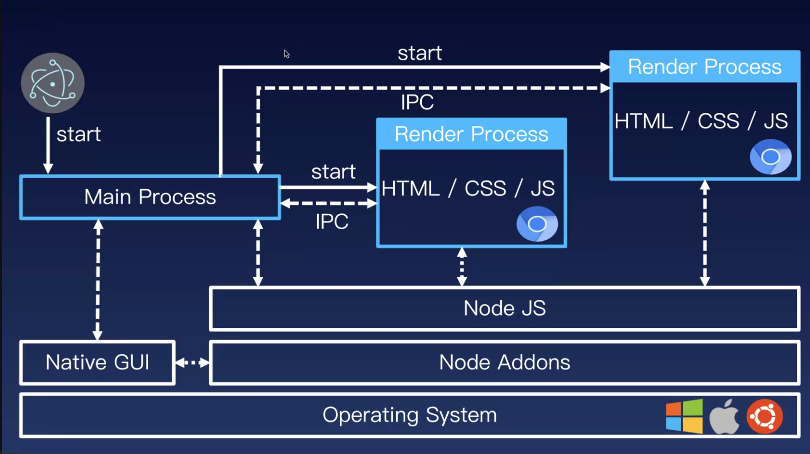

## 2. 初识WebRTC

### WebRTC的信令协商过程

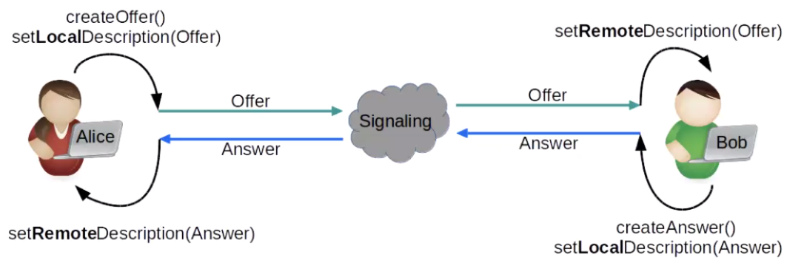

# 一、WebRTC概述

**音视频处理 + 即使通讯的开源库**

能做什么呢？

- 音视频实时互动
- 游戏、即时通讯、文件传输等
- 百宝箱：传输、音视频处理（回音消除、降噪等等）

能学到什么？

- 音视频设备访问与管理 —— 跨平台
- 音视频数据的采集
- 数据的传输与实时互动

- WebRTC的工作机制

互动demo：appr.tc

# 二、WebRTC的架构

## 目录结构

 

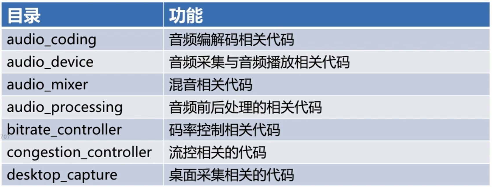

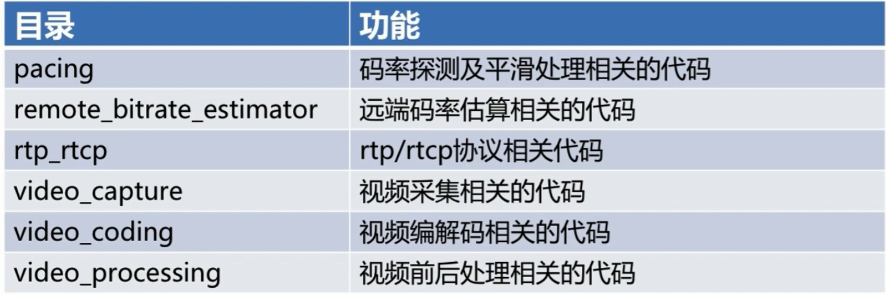

## 运行机制

### 轨与流

- **Track**
- **MediaStream**

### 重要类

- **MediaStream**

- ⭐ **RTCPeerConnection**
- **RTCDataChannel**

底层原理：

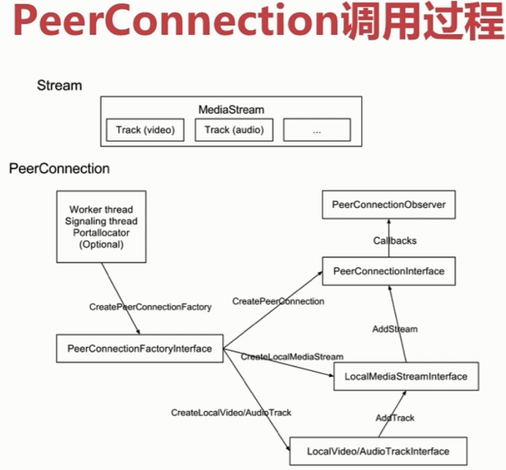

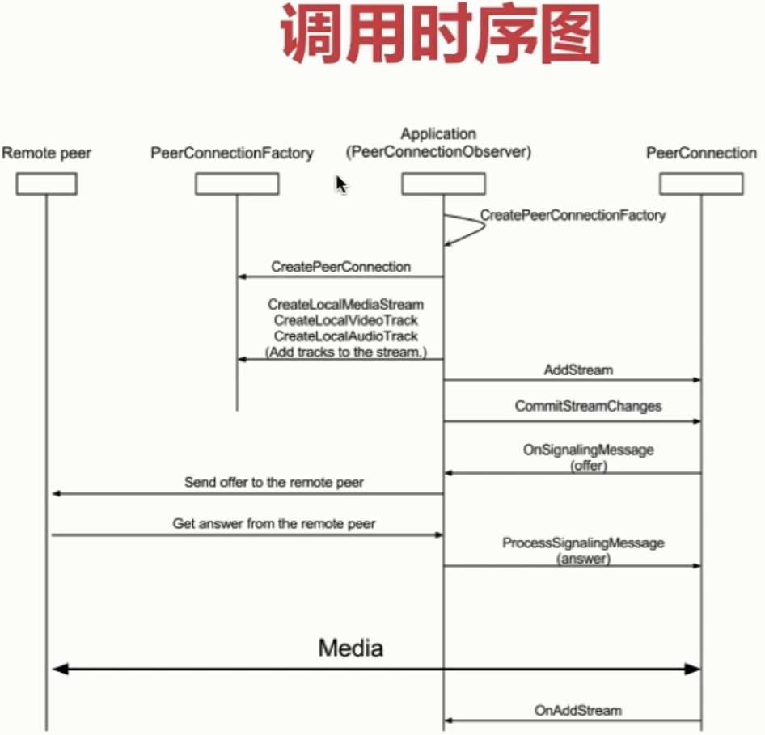

# 三、环境搭建

## Web服务器

- Nodejs
- Nginx
- Apache

## Web服务工作原理

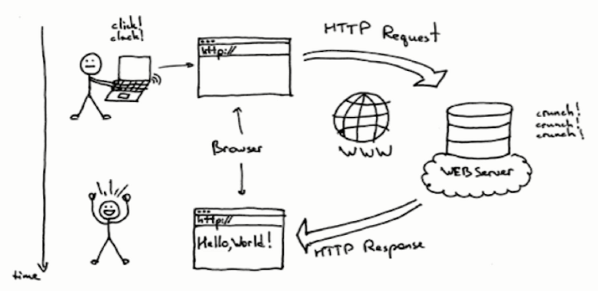

## Nodejs工作原理

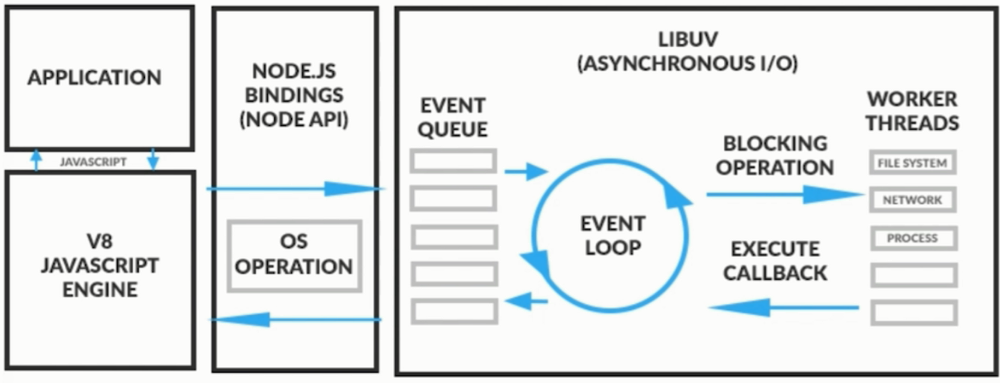

**Javascript解析过程**

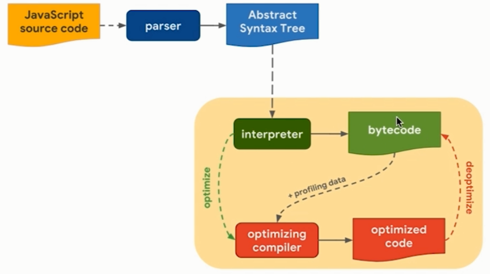

**Nodejs时间处理**

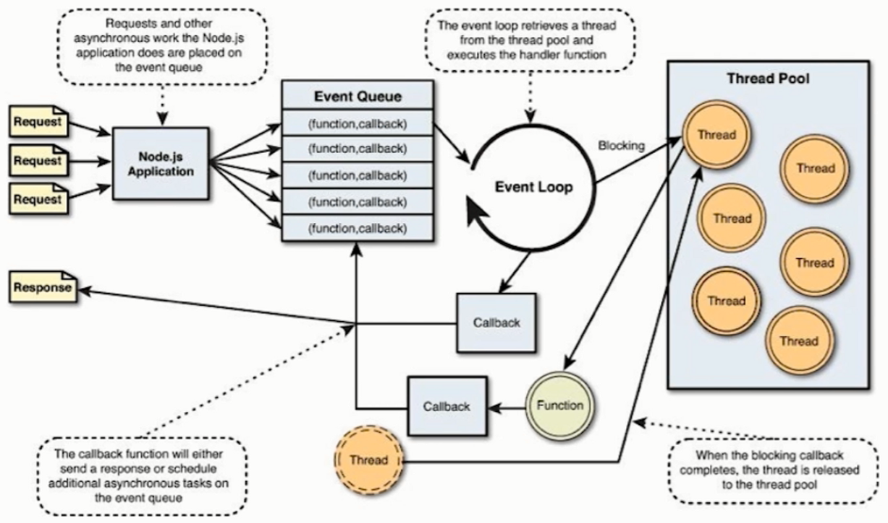

**两个V8引擎**

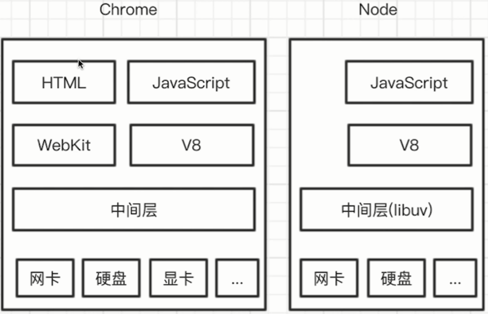

## HTTPS服务

不是 https 服务，chorme 不允许打开摄像头等操作。

HTTPS = HTTP + TLS/SSL (加密)

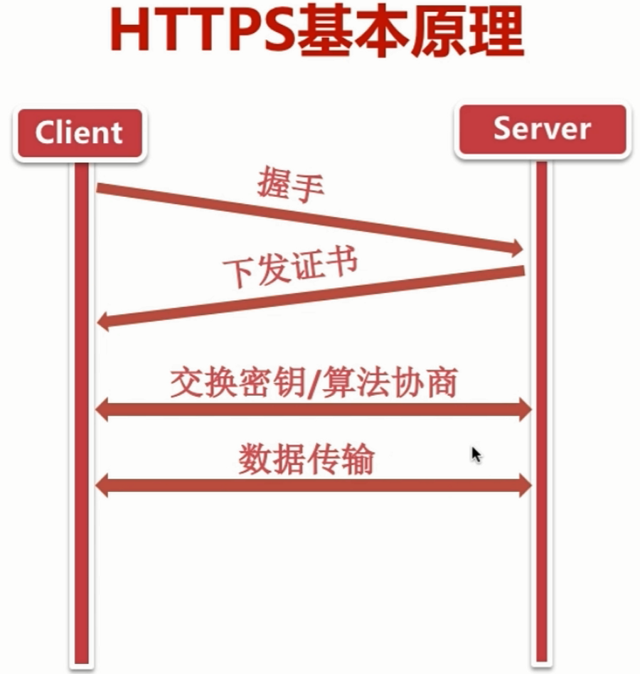

### Nodejs搭建HTTPS服务

- 生成 HTTPS 证书
- 引入 HTTPS 模块
- 指定证书位置，创建 HTTPS 服务

