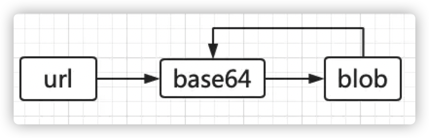

**图片在后端有两种存储方式：**

1. 将图片以独立文件的形式存储在服务器的制定文件夹中，再将路径存入到数据库字段
2. 将文件转换成二进制流，直接存储到数据库的 `Image` 类型字段中 => **在前端将图片二进制流交给 blob 对象处理，然后通过 blob 的 API 生成临时的 URL 赋给 src 属性来显示。**

**转换过程如下：**



# 响应的类型

### multipart/form-data

1. 既可以提交普通键值对，也可以提交(多个)文件键值对。

2. HTTP规范中的Content-Type不包含此类型，只能用在POST提交方式下，属于http客户端(浏览器、java httpclient)的扩展

3. 通常在浏览器表单中，或者http客户端(java httpclient)中使用。

### application/octet-stream

1. 只能提交二进制，而且只能提交一个二进制，如果提交文件的话，只能提交一个文件,后台接收参数只能有一个，而且只能是流（或者字节数组）

2. 属于HTTP规范中Content-Type的一种

3. 很少使用

```js
let blob = new Blob([resp.body], { type: "application/octet-stream" });
```

### application/x-www-form-urlencoded

1. 不属于http content-type规范，通常用于浏览器表单提交，数据组织格式:name1=value1&name2=value2,post时会放入http body，get时，显示在在地址栏。

2. 所有键与值，都会被urlencoded，请查看urlencoder

```js
POST http://www.xx.com/myproject/service HTTP/1.1
Host: 192.168.0.201:8694
Content-Type: application/json
Cache-Control: no-cache
Postman-Token: f5f6240c-08d3-8695-9473-607038f71eaa
 
name11=file1&name2=value2
```


# Blob对象

JS都没有比较好的可以直接处理二进制的方法。而Blob的存在，允许我们可以通过JS直接操作二进制数据。

`Blob`（Binary Large Object）对象代表了一段二进制数据，提供了一系列操作接口。其他操作二进制数据的 API（比如 File 对象），都是建立在 Blob 对象基础上的，继承了它的属性和方法。


`Blob` 对象的使用：

1. 接受两个参数。第一个参数是一个包含实际数据的数组，第二个参数是数据的类型，这两个参数都不是必需的。

   ```js
   var a = ["hello", "world"];
   var myBlob = new Blob(a, { "type" : "text/xml" });
   ```

2. Blob 对象的 slice 方法，将二进制数据按照字节分块，返回一个新的 Blob 对象。

   ```js
   var a = ["hello", "world"];
   var myBlob = new Blob(a, { "type" : "text/xml" });
var newBlob = myBlob.slice(0, 5);
   console.log(newBlob);
   ```
   
3. 有两个只读属性

   ```js
   size：二进制数据的大小，单位为字节。（文件上传时可以在前端判断文件大小是否合适）
   type：二进制数据的 MIME 类型，全部为小写，如果类型未知，则该值为空字符串。（文件上传时可以在前端判断文件类型是否合适）
   ```

4. 将 `Blob` 或者 `file` 转成 url：通过window的方法就能实现，生成一个链接。下面的代码会对二进制数据生成一个 URL，这个 URL 可以放置于任何通常可以放置 URL 的地方，比如 img 标签的 src 属性。需要注意的是，即使是同样的二进制数据，每调用一次 URL.createObjectURL 方法，就会得到一个不一样的 URL。

   ```js
   var objecturl =  window.URL.createObjectURL(blob);
   ```

   **这个 URL 的存在时间，等同于网页的存在时间，一旦网页刷新或卸载，这个 URL 就失效。（File 和 Blob 又何尝不是这样呢）除此之外，也可以手动调用 `URL.revokeObjectURL` 方法，使 URL 失效。**

   


## 分片上传

分片上传的逻辑：

通过 `Blob.slice()` 方法将大文件分片，轮循向后台提交各文件的片段，实现分片上传。

1. 获取上传文件的 `File` 对象，根据 `chunk` （每片大小）对文件进行分片。

   

2. 通过 post 方法轮循上传每片文件，其中 url 中拼接 querystring 用来描述当前上传的文件信息；post body 中存放本次要上传的二进制数据片段。

   **MIME类型（Multipurpose Internet Mail Extensions）：即多用途互联网邮件扩展类型。MIME是一个互联网标准，扩展了电子邮件标准，使其能够支持：非ASCII字符文本；非文本格式附件（二进制、声音、图像等）；由多部分（multiple parts）组成的消息体；包含非ASCII字符的头信息（Header information）。**

   

3. 接口每次返回 offset，用于执行下一次上传

<br/>

<br/>

```js
initUpload();

//初始化上传
function initUpload() {
  var chunk = 100 * 1024; //每片大小
  var input = document.getElementById('file'); //input file
  input.onchange = function (e) {
    var file = this.files[0];
    var query = {};
    var chunks = [];
    if (!!file) {
      var start = 0;
      //文件分片
      for (var i = 0; i < Math.ceil(file.size / chunk); i++) {
        var end = start + chunk;
        chunks[i] = file.slice(start, end);
        start = end;
      }
      // 采用post方法上传文件
      // url query上拼接以下参数，用于记录上传偏移
      // post body中存放本次要上传的二进制数据
      query = {
        fileSize: file.size,
        dataSize: chunk,
        nextOffset: 0,
      };
      upload(chunks, query, successPerUpload);
    }
  };
}

// 执行上传
function upload(chunks, query, cb) {
  var queryStr = Object.getOwnPropertyNames(query)
    .map(key => {
      return key + '=' + query[key];
    })
    .join('&');
  var xhr = new XMLHttpRequest();
  xhr.open('POST', 'http://xxxx/opload?' + queryStr);
  xhr.overrideMimeType('application/octet-stream');
  //获取post body中二进制数据
  var index = Math.floor(query.nextOffset / query.dataSize);
  getFileBinary(chunks[index], function (binary) {
    if (xhr.sendAsBinary) {
      xhr.sendAsBinary(binary);
    } else {
      xhr.send(binary);
    }
  });
  xhr.onreadystatechange = function (e) {
    if (xhr.readyState === 4) {
      if (xhr.status === 200) {
        var resp = JSON.parse(xhr.responseText);
        // 接口返回nextoffset
        // resp = {
        //     isFinish:false,
        //     offset:100*1024
        // }
        if (typeof cb === 'function') {
          cb.call(this, resp, chunks, query);
        }
      }
    }
  };
}

// 每片上传成功后执行
function successPerUpload(resp, chunks, query) {
  if (resp.isFinish === true) {
    alert('上传成功');
  } else {
    //未上传完毕
    query.offset = resp.offset;
    upload(chunks, query, successPerUpload);
  }
}

// 获取文件二进制数据
function getFileBinary(file, cb) {
  var reader = new FileReader();
  reader.readAsArrayBuffer(file);
  reader.onload = function (e) {
    if (typeof cb === 'function') {
      cb.call(this, this.result);
    }
  };
}
```


## 通过 url 下载文件

window.URL对象可以为Blob对象生成一个网络地址，结合a标签的download属性，可以实现点击url下载文件

```js
createDownload("download.txt","download file");

function createDownload(fileName, content){
    var blob = new Blob([content]);
    var link = document.createElement("a");
    link.innerHTML = fileName;
    link.download = fileName;
    link.href = URL.createObjectURL(blob);
    document.getElementsByTagName("body")[0].appendChild(link);
}
```

## 通过 url 显示图片

我们知道，img的src属性及background的url属性，都可以通过接收图片的网络地址或base64来显示图片，同样的，我们也可以把图片转化为Blob对象，生成URL（URL.createObjectURL(blob)），来显示图片。


# Base64、Blob、File三种类型转换

## Base64

[Base64](https://developer.mozilla.org/zh-CN/docs/Web/API/WindowBase64/Base64_encoding_and_decoding) 是一组相似的二进制到文本（binary-to-text）的编码规则，使得二进制数据在解释成 radix-64 的表现形式后能够用 ASCII 字符串的格式表示出来。Base64 这个词出自一种 MIME 数据传输编码。

## Blob

[Blob](https://developer.mozilla.org/zh-CN/docs/Web/API/Blob) 对象表示一个不可变、原始数据的类文件对象。Blob 表示的不一定是JavaScript原生格式的数据。File 接口基于Blob，继承了 blob 的功能并将其扩展使其支持用户系统上的文件。


## File

[File](https://developer.mozilla.org/zh-CN/docs/Web/API/File) 接口提供有关文件的信息，并允许网页中的 JavaScript 访问其内容。

通常情况下， File 对象是来自用户在一个 元素上选择文件后返回的 FileList 对象,也可以是来自由拖放操作生成的 DataTransfer 对象，或者来自 HTMLCanvasElement 上的 mozGetAsFile() API。在Gecko中，特权代码可以创建代表任何本地文件的File对象，而无需用户交互（有关详细信息，请参阅注意事项。

***File 对象是特殊类型的 Blob，且可以用在任意的 Blob 类型的 context 中。比如说， FileReader, URL.createObjectURL(), createImageBitmap(), 及 XMLHttpRequest.send() 都能处理 Blob 和 File。***


## File转Base64

**应用场景：图片预览**

```js
<!DOCTYPE html>
<html lang="en">
  <head>
    <meta charset="UTF-8" />
    <meta http-equiv="X-UA-Compatible" content="IE=edge" />
    <meta name="viewport" content="width=device-width, initial-scale=1.0" />
    <title>File转base64｜图片预览</title>
  </head>
  <body>
    <input type="file" id="fileInput" multiple />
    <button id="transBtn">File 转 base64</button>
    
    <script>
      function fileToBase64(file, callback) {
        const reader = new FileReader();
        reader.onload = e => {
          if (typeof callback === 'function') callback(e.target.result);
          else console.log('我是base64:', e.target.result);
        };
        reader.readAsDataURL(file);
      }

      const transBtn = document.querySelector('#transBtn');
      const img = document.querySelector('#img');
      const files = document.querySelectorAll('#fileInput')[0];
      transBtn.addEventListener('click', e => {
        e.preventDefault();
        const _file = files.files[0];
        const base64 = fileToBase64(_file, base64 => {
          console.log('base64:', base64);
          img.setAttribute('src', base64);
        });
      });
    </script>
  </body>
</html>
```


## Base64转File

```js
// Base64格式：data:image/heic;base64,AAA(正文)
// Base64 转 File
const base64ToFile = (base64, fileName) => {
	let arr = base64.split(','), type = arr[0].match(/:(.*?);/)[1], bstr = atob(arr[1]), n = bstr.length, u8arr = new Uint8Array(n);
	while(n--){
		u8arr[n] = bstr.charCodeAt(n);
	}
	return new File([u8arr], fileName, {type});
};
```


## File转Blob

**应用场景：文件上传**

```js
function fileToBlob(file, callback) {
  const type = file.type;
  const reader = new FileReader();
  reader.onload = e => {
    // 关键代码：转成blob对象形式！
    const blob = new Blob([e.target.result], { type });
    if (typeof callback === 'function') callback(blob);
    else console.log('blob', blob);
  };
  reader.readAsDataURL(file);
}
```


## Blob转File

```js
const blobToFile = (blob, fileName) => {
	const file = new File([blob], fileName, {type: blob.type});
	return file;
}
```


## Base64转Blob

```js
// Base64 转 Blob
const base64ToBlob = base64 => {
  let arr = base64.split(','),
    type = arr[0].match(/:(.*?);/)[1],
    bstr = atob(arr[1]),
    n = bstr.length,
    u8arr = new Uint8Array(n);
  while (n--) {
    u8arr[n] = bstr.charCodeAt(n);
  }
  return new Blob([u8arr], { type });
};
```


 ## 总结

Blob 和 File 都有自己的对象形式，所以转换过去就是 new 一个对象出来。Base64 就是 `FileReader` 对象的`readAsDataURL` 方法转换过去的。


# ajax请求上传文章

```js
<!DOCTYPE html>
<html lang="en">
  <head>
    <meta charset="UTF-8" />
    <meta http-equiv="X-UA-Compatible" content="IE=edge" />
    <meta name="viewport" content="width=device-width, initial-scale=1.0" />
    <title>ajax上传文件</title>
    <style>
      .progress {
        width: 300px;
        height: 20px;
        border: 1px solid hotpink;
        border-radius: 20px;
        overflow: hidden;
      }
      .step {
        height: 100%;
        width: 0;
        background: greenyellow;
      }
    </style>
  </head>
  <body>
    <form class="form">
      <input type="file" name="file" id="filesInput" multiple />
      <input type="button" id="uploadBtn" value="上传文件" />
    </form>
    <!-- 文件上传进度预览 -->
    <div class="progress">
      <div class="step"></div>
    </div>
    <script>
      // axios请求方式
      // function changefile() {
      //   const file = document.querySelectorAll('#filesInput')[0].files[0];
      //   var forms = new FormData();
      //   var configs = {
      //     headers: { 'Content-Type': 'multipart/form-data' },
      //   };
      //   forms.append('file', file);

      //   axios.post('http://127.0.0.1:3002/article/uploadTest', forms, configs).then(res => {
      //     console.log(res);
      //   });
      // }

      // 原生ajax请求方式
      function uploadFile(file, callback) {
        var forms = new FormData();
        forms.append('file', file);
        const xhr = new XMLHttpRequest();
        xhr.open('POST', 'http://127.0.0.1:5001/upload', true);
        // xhr.setRequestHeader('Content-Type', 'multipart/form-data');
        xhr.send(forms);
        xhr.onload = function () {
          if (typeof callback === 'function') callback(xhr.responseText);
          else console.log(xhr.responseText);
        };
        xhr.onprogress = e => {
          let processRate = (e.loaded / e.total) * 100 + '%';
          const step = document.querySelector('.step');
          step.style.width = processRate;
        };
      }

      const btn = document.querySelector('#uploadBtn');
      btn.addEventListener('click', () => {
        const file = document.querySelectorAll('#filesInput')[0].files[0];
        uploadFile(file, res => console.log(res));
      });
    </script>
  </body>
</html>
```


# 服务器接受并存储文件

```js
router.post('/upload', async ctx => {
  // 在ctx.request.body.files中获取文件;
  console.log('文件', ctx.request.files.file);
  const file = ctx.request.files.file;
  const reader = fs.createReadStream(file.path);
  const writer = fs.createWriteStream(path.join(__dirname, 'static', 'upload', file.name));
  reader.pipe(writer);
  ctx.body = '保存成功';
});
```


参考文章

1. https://blog.csdn.net/baymaxcsdn/article/details/108077233


