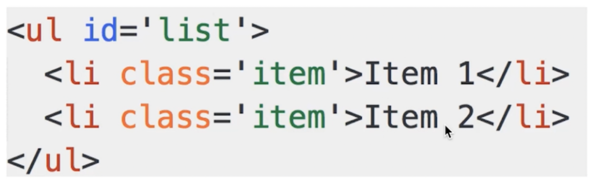
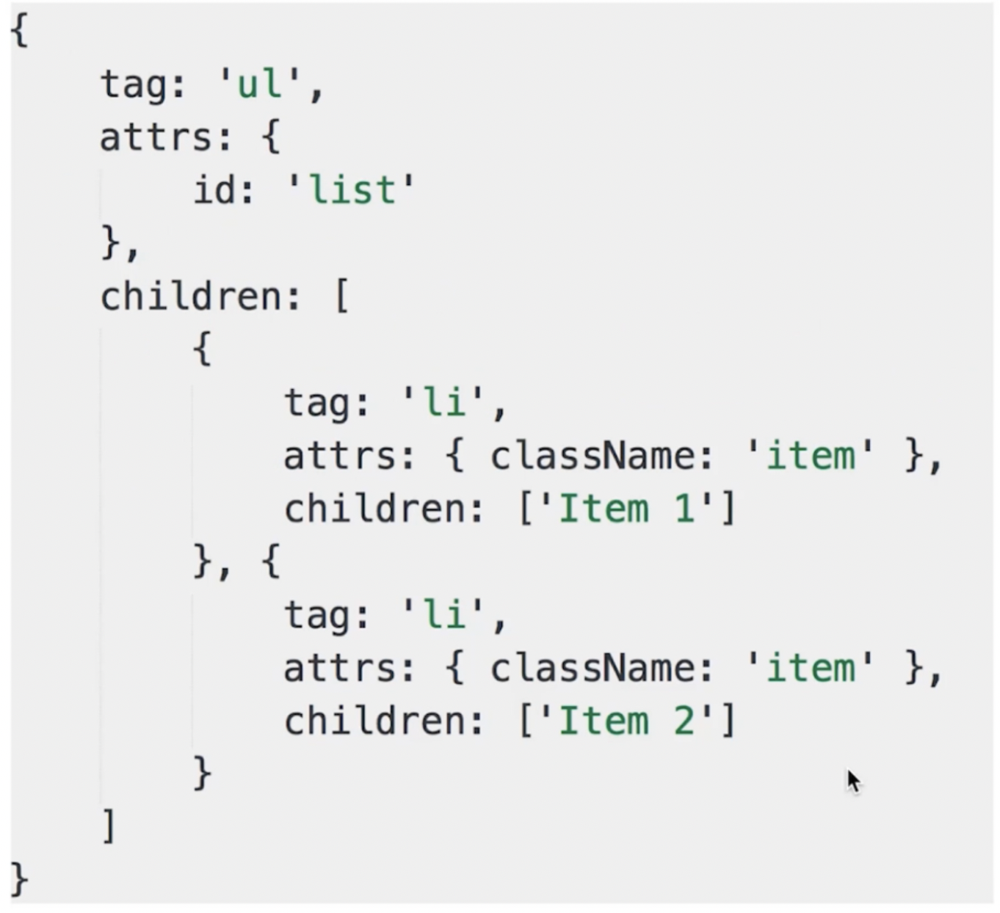
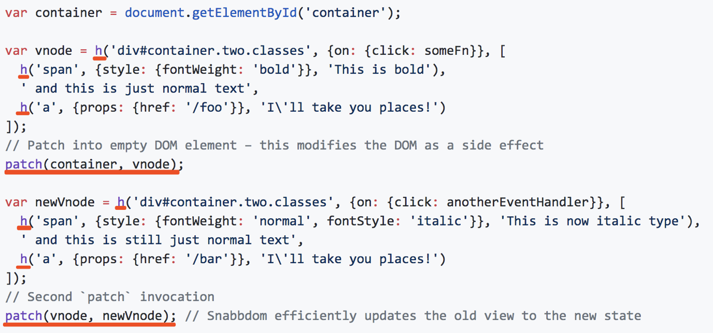

# 常见问题

- vdom 是什么？为什么会存在 vdom？
- vdom 如何应用，核心 API 是什么？
- 介绍一下 diff 算法。

# vdom 简述

- 用 js 模拟 DOM 结构，DOM 变化的对比，放在 js 层来做（图灵完备语言 => 能实现算法、逻辑等完备的语言）。
- 优势：**提高重绘性能**
- **为什么这样性能好？浏览器最消耗性能的事情就是操作 DOM，js 操作不怎么耗费性能。**

**如何模拟？**

  =>   


1. `class` => `className`
2. 第一层：标签；第二层：标签；**最后一层：文本**
3. 重绘时：再生成一个相似对象，比较两个对象不一样的地方 => 发现不一样的地方，进行更改


# 传统方式重绘

```html
<body>
  <div class="container"></div>
  <button id="changeBtn">change</button>
  <script src="https://cdn.bootcdn.net/ajax/libs/jquery/3.5.1/jquery.js"></script>
  <script>
    let data = [
      { name: 'zjj', age: '20', address: 'beijing' },
      { name: 'zym', age: '15', address: 'yibin' },
      { name: 'wyy', age: '26', address: 'shanghai' },
    ];
    function render(data) {
      let $container = $('.container');
      // 清空所有内容
      $container.html('');
      // 拼接table
      let $table = $('<table>');
      $table.append($('<tr><td>name</td><td>age</td><td>address</td></tr>'));
      data.forEach(item =>
        $table.append(
          $(`<tr><td>${item.name}</td><td>${item.age}</td><td>${item.address}</td></tr>`)
        )
      );
      $container.append($table);
    }
    $('#changeBtn').click(() => {
      data[1].age = 30;
      data[2].address = '深圳';
      // re-render 再次渲染
      render(data);
    });
    render(data);
  </script>
</body>
```


# vdom 如何存在

**snabbdom 库 —— vue 2.0 使用该库**

[snabbdom库地址](https://github.com/snabbdom/snabbdom)



## API

**h**

用来定义 vdom 节点的函数 (标签, 函数, 文本) 。


**上述图片转化为 vnode**

```js
let vnode = h('ul#list', {(属性)}, [
  h('li.item', {}, 'Item 1'),
  h('li.item', {}, 'Item 2')
])
```

最终生成一个 vnode 节点。

**patch**

用来把 vnode 添加到 container 中。

**具体使用方法：**

```html
<body>
  <div class="container"></div>
  <button id="changeBtn">change</button>
  <script src="https://cdn.bootcss.com/snabbdom/0.7.4/snabbdom.js"></script>
  <script src="https://cdn.bootcss.com/snabbdom/0.7.4/snabbdom-class.js"></script>
  <script src="https://cdn.bootcss.com/snabbdom/0.7.4/snabbdom-props.js"></script>
  <script src="https://cdn.bootcss.com/snabbdom/0.7.4/snabbdom-style.js"></script>
  <script src="https://cdn.bootcss.com/snabbdom/0.7.4/snabbdom-eventlisteners.js"></script>
  <script src="https://cdn.bootcss.com/snabbdom/0.7.4/h.js"></script>
  <script>
    var snabbdom = window.snabbdom;
    // 定义 patch和h
    var patch = snabbdom.init([
      snabbdom_class,
      snabbdom_props,
      snabbdom_style,
      snabbdom_eventlisteners,
    ]);
    var h = snabbdom.h;
    let container = document.querySelector('.container');
    // 1.生成 vnode
    var vnode = h('ul#list', {}, [
      h('li.item', {}, 'Item 1lalallalal'),
      h('li.item', {}, 'Item 2'),
    ]);
    patch(container, vnode);
    document.querySelector('#changeBtn').addEventListener('click', () => {
      // 生成 newVnode
      var newVnode = h('ul#list', {}, [
        h('li.item', {}, 'Item 1'),
        h('li.item', {}, 'Item B'),
        h('li.item', {}, 'Item 3'),
      ]);
      patch(vnode, newVnode);
    });
  </script>
</body>
```


## 利用snabbdom重绘表格

```js
<body>
  <div id="container"></div>
  <button id="btn-change">change</button>
  <script src="https://cdn.bootcss.com/snabbdom/0.7.4/snabbdom.js"></script>
  <script src="https://cdn.bootcss.com/snabbdom/0.7.4/snabbdom-class.js"></script>
  <script src="https://cdn.bootcss.com/snabbdom/0.7.4/snabbdom-props.js"></script>
  <script src="https://cdn.bootcss.com/snabbdom/0.7.4/snabbdom-style.js"></script>
  <script src="https://cdn.bootcss.com/snabbdom/0.7.4/snabbdom-eventlisteners.js"></script>
  <script src="https://cdn.bootcss.com/snabbdom/0.7.4/h.js"></script>
  <script type="text/javascript">
    var snabbdom = window.snabbdom;
    // 定义关键函数 patch
    var patch = snabbdom.init([
      snabbdom_class,
      snabbdom_props,
      snabbdom_style,
      snabbdom_eventlisteners,
    ]);
    // 定义关键函数 h
    var h = snabbdom.h;
    // 原始数据
    var data = [
      {
        name: '张三',
        age: '20',
        address: '北京',
      },
      {
        name: '李四',
        age: '21',
        address: '上海',
      },
      {
        name: '王五',
        age: '22',
        address: '广州',
      },
    ];
    // 把表头也放在 data 中
    data.unshift({
      name: '姓名',
      age: '年龄',
      address: '地址',
    });
    var container = document.getElementById('container');
    // 渲染函数
    var vnode;
    function render(data) {
      var newVnode = h(
        'table',
        {},
        data.map(function (item) {
          var tds = [];
          var i;
          for (i in item) {
            if (item.hasOwnProperty(i)) {
              tds.push(h('td', {}, item[i] + ''));
            }
          }
          return h('tr', {}, tds);
        })
      );
      if (vnode) {
        // re-render
        patch(vnode, newVnode);
      } else {
        // 初次渲染
        patch(container, newVnode);
      }
      // 存储当前的 vnode 结果
      vnode = newVnode;
    }
    // 初次渲染
    render(data);
    var btnChange = document.getElementById('btn-change');
    btnChange.addEventListener('click', function () {
      data[1].age = 30;
      data[2].address = '深圳';
      // re-render
      render(data);
    });
  </script>
</body>
```


## 总结


# Diff 算法

- 什么是 diff 算法
  - 它是 linux 的基本命令，可以用 git diff 来进行比较两个文件
- 🌟**vdom 为何使用 diff 算法**
- **diff 算法实现流程**


## Diff 概述


**通过 diff 可以查看到文本文件之间的异同。**


## Diff 实现过程

**vnode 的格式如下：**


### patch(container, vnode)

**就是 createElement 的过程。**

1. 通过遍历把元素的属性都添加上。
2. 通过迭代把子元素都添加在父元素上。
3. 最终把 vnode 返回的 element，append 追加到 container 中。

```js
function createElement(vnode) {
    var tag = vnode.tag  // 'ul'
    var attrs = vnode.attrs || {}
    var children = vnode.children || []
    if (!tag) {
        return null
    }

    // 创建真实的 DOM 元素
    var elem = document.createElement(tag)
    // 属性
    var attrName
    for (attrName in attrs) {
      	// hasOwnProperty 返回的是是否存在自身（非继承 => 原型链上的属性也返回false）属性
        if (attrs.hasOwnProperty(attrName)) {
            // 给 elem 添加属性
            elem.setAttribute(attrName, attrs[attrName])
        }
    }
    // 子元素
    children.forEach(function (childVnode) {
        // 给 elem 添加子元素
        elem.appendChild(createElement(childVnode))  // 递归
    })

    // 返回真实的 DOM 元素
    return elem
}
```


### Patch(vnode, newVnode)

**就是 updateChildren 的过程**

```js
function updateChildren(vnode, newVnode) {
    var children = vnode.children || []
    var newChildren = newVnode.children || []

    children.forEach((childVnode, index) => {
        var newChildVnode = newChildren[index]
        if (childVnode.tag === newChildVnode.tag) {
            // 深层次对比，递归
            updateChildren(childVnode, newChildVnode)
        } else {
            // 替换
            replaceNode(childVnode, newChildVnode)
        }
    })
}
var Container; // 容器
function replaceNode(vnode, newVnode) {
    var elem = vnode.elem  // 真实的 DOM 节点
    var newElem = createElement(newVnode)

    // 替换
    Container.replaceChild(newElem, elem)
}
```


