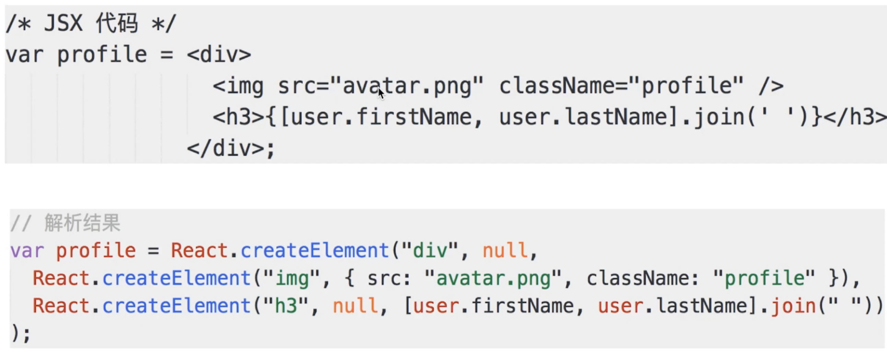
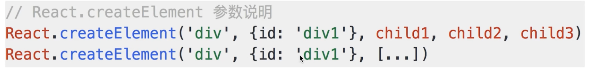
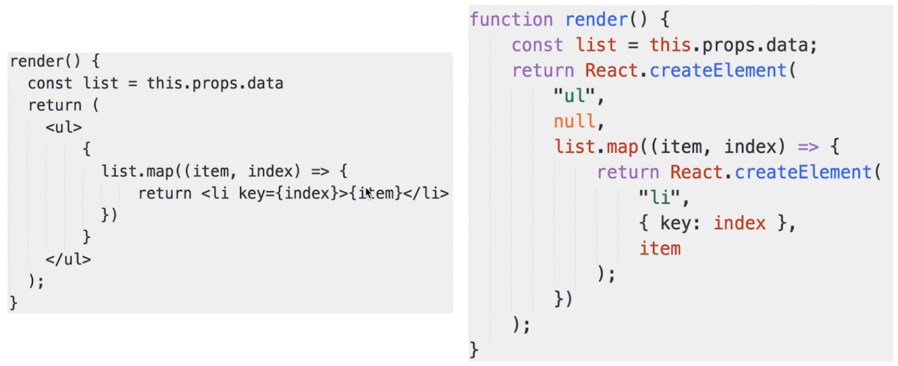
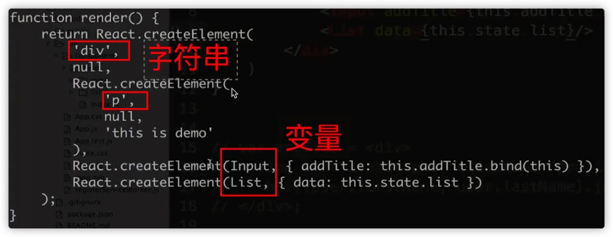
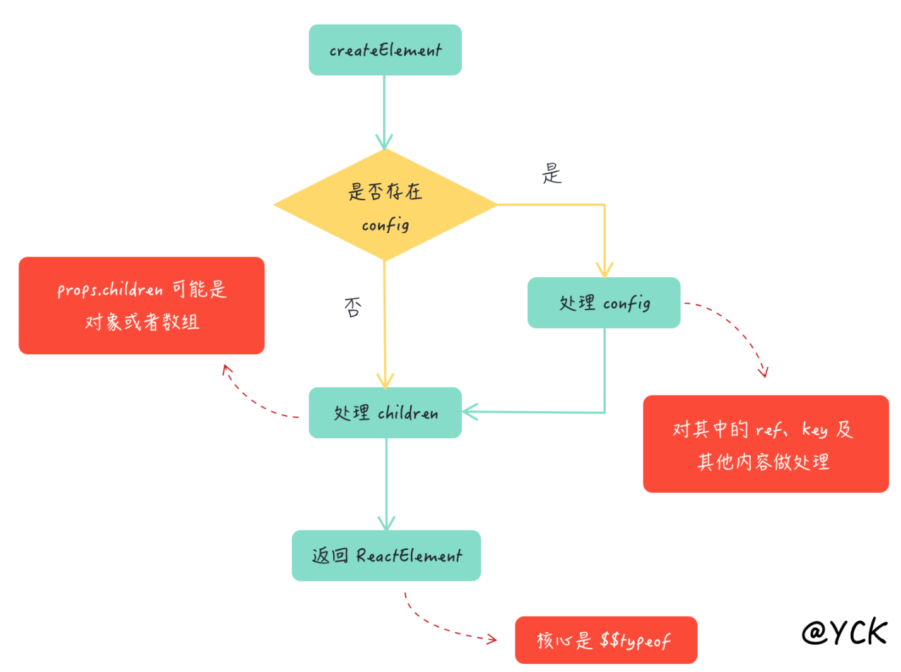

# 内容概述

1. JSX 本质是语法糖，通过 `React.createElement()` 方法转化成 js 语法。
2. 子组件作为变量，HTML 标签作为字符串。
3. `React.createElement()` 的参数分别是：
   1. type：标签字符串/子组件变量
   2. config：属性(src、classname等)
   3. children：文本内容(通过变量渲染等方式)。
4. ==注意 patch 的时机==：首次在 `ReactDOM.render()` 时，更新在 `setState` 时。

# JSX 的本质

- jsx 语法根本无法被浏览器解析。
- 如何在浏览器运行？—— 最终转化成 js 语法来运行的。

## `React.createElement()`

react 的组件中都**需要引入 React **作为依赖。说明 React 在运行时被使用了。

**React 参数的说明：**

**render 函数的解析执行：**

## JSX 和 vdom 的关系

- `React.createElement` 和 `h` 关系

  - 本质是一样的，**都返回一个 vnode 对象**，第一个参数都是标签

- 何时 `patch`

  - 初次渲染：在 `ReactDOM.render(<App/>, container)` 的地方，执行 `patch(container, <App/>这个jsx返回的vnode)`
  - 重绘：在 setState 时，触发 `patch(vnode, newVnode)`

- 自定义组件的解析 `<NavBar />`

  

  - `‘div’` ：直接渲染 `
` ，vdom 可以做到。
  - Input 和 List，是自定义组件（class），vdom 不认识。
  - **所以 Input 和 List 定义的时候必须声明 render 函数**
  - **根据 props 初始化实例，然后执行实例的 render 函数**
  - render 函数最终还是返回 vnode 对象

## 渲染流程

# 总结

- JSX 就是语法糖，需要被解析成 js 才能运行。
  - vue 中的模板也需要被解析成 js。
  - **react 中，形式是：`React.createElement()`**。
  - 类似于 vdom 中的 h 函数。
- jsx 是独立的标准，可以被其他项目使用。**可扩展性强，作为插件。**
- 为什么需要 vdom：JSX 需要渲染成 html，数据驱动视图。
- `React.createElement` 和 `h` 函数都会生成 vnode，区别是：`React.createElement` 的第一个参数也可以是变量 —— 自定义自组件。
- patch 的时机：`ReactDOM.render()` 和 `setState`
- 自定义组件的解析：初始化实例，然后执行 render。

