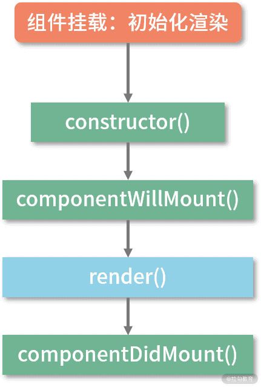
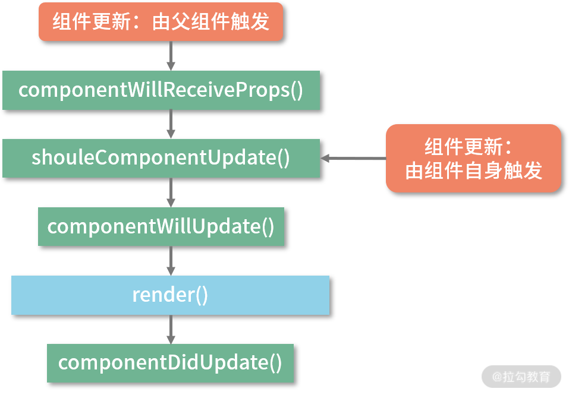
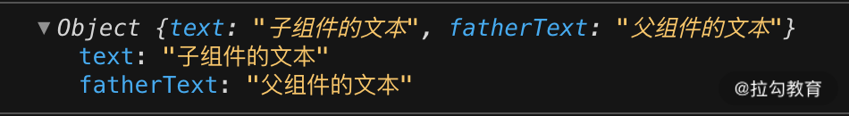
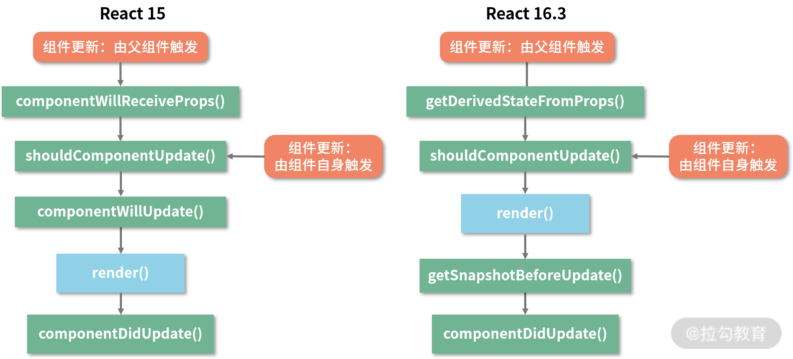

# React 15 渲染时机

## 首次挂载时




## 更新时



### 1. `componentWillReceiveProps`

> **这样的说法不够严谨：这个生命周期函数在组件的 props 内容发生改变时触发。**
>
> 官方文档的说法是：==如果父组件导致组件重新渲染，即使 `props` 没有更改，也会调用该方法。如果只想处理更改，请确保进行当前值和变更值的比较。==该函数接收 `nextProps` 参数。
>
> 所以，触发不是由 `props` 变化导致的，而是由父组件的更新触发的。

为什么不够严谨呢？

我们来看场景：

1. 父组件传递给子组件的 `props` 中只有 `text` 一个内容，如果父组件点击按钮改变这个 `text`。这种情况一定会触发子组件的 `componentWillReceiveProps` 函数。

   ```js
   <Son text={this.state.text} />
   ```

2. 父组件的状态多了其他的内容，当父组件触发方法改变状态中的其他内容 `otherText` 时，当前传给子组件的 `text` 并没有改变，但还是触发了该方法：

   ```js
   this.state={
     otherText: 'other',
     text: 'text'
   }
   <Son text={this.state.text} />
   ```

上述证明了，这个函数的调用取决于父组件，父组件的更新会触发，子组件更新不触发。

==可以理解为：父组件的重新渲染就会触发所有子组件的该方法。==


### 2. `shouldComponentUpdate`

该方法默认值就是 `true` ，会触发无条件的渲染。

```js
shouldComponentUpdate(nextProps, nextState){}; // return true => re-render
```


### 3. `componentWillMount`


# ✨React16 废除一些生命周期的原因

具体废除了一下三个生命周期：

- `componentWillMount`
- `componentWillUpdate`
- `componentReceiveProps`

## Fiber 机制

React 16 最大的改变就是 `Fiber` 机制。它将同步渲染变为异步渲染。把大的更新任务拆分成了许多小任务。当执行完一个小任务是，**把控制权交给主线程，主线程按照优先级再进行下一个任务。**

## 废除原因

### 1. 完全可以转移到 `componentDidxxx` 里面做

不难发现，这些被废除的生命周期都是处在 render 阶段中的行为，在异步渲染中，这些 API 可能会被重复执行，会有很大的风险。

比如你会经常在 `componentWillMount` 中做下面三件事：

- `setState()` 
- ajax 异步请求
- 操作真实 DOM

比如很多人以为在该函数中进行 ajax 异步请求会会让内容来得早一点，避免首次白屏。但是天真了哈。

1. `componentWillMount` 执行完成后会立马执行 `render` 。这个间隙很短暂，所以**首次渲染依然会在数据返回之前执行**。
2. 这让会导致服务端渲染场景下冗余请求等问题。

所以这些完全可以放在 `componentDidMount` 中去做。


### 2. Fiber 异步机制带来的严重问题

比如：你想要在 `componentWillxxx` 中发起一个付款请求，由于这些 render 阶段的函数都能重复执行，所以这个请求会被多次打断+重启，就会出现多个付款请求。

又比如：操作 DOM 时，如果执行了两次，就会一口气删除两个元素。

结合这些，我们还能想到为什么 `getDerivedStateFromProps` 方法会被设计成静态方法，无法碰到 `this`，可以避免很多问题。


### 3. React 15 中滥用`componentWill` 也会出问题

在 `componentWillReceiveProps` 和 `componentWillUpdate` 中滥用 `setState` 导致重复渲染死循环。 

  

==永远不要在 `shouldComponentUpdate` 和 `componentWillUpdate` 中调用 `setState`！==

调用 `setState` 时，实际会执行 `enqueueSetState` 方法，对该方法会对 `partialState` 和 `_pendingStateQueue` 更新队列进行合并操作。最红通过 `enqueueUpdate` 执行 state 的更新。

如果在这两个函数中调用 `setState` 。此时，`_pendingStateQueue!==null` 则又回调用 `updateComponent` 进行组件更新，组件更新的时候又回调用这个 `shouldComponentUpdate` 方法。这样就会导致循环。

==简单来说：在这两个函数中调用 `setState` => 导致组件更新 => 组件更新又回调用 `shouldComponentUpdate` 方法，又执行一次 `setState`。==


# React 16 渲染时机


## 初次渲染时


`getDerivedStateFromProps` 直译过来的意思就是：从 props 中派生 state。

1. **该方法是静态方法，不依赖组件实例而存在，访问不到 this。**
2. 接受两个参数：父组件的 props 和 当前组件自身的 state。
3. `getDerivedStateFromProps` 需要一个对象格式的返回值，如果不是就会警告。


可以看到，挂载阶段输出的 props 是初始化时父组件传进来的 `this.props` 对象，而 state 是本身子组件的 `state` 对象。

**这个返回值对象是用来更新组件的 state 的。**

```js
static getDerivedStateFromProps(props, state){
  return {
    fatherText: props.text,
  }
}
```



这时的 `state` 就多了一个 `fatherText` 属性。


### 为什么是静态方法？

静态方法拿不到组件实例的 `this` 。所以在 `getDerivedStateFromProps` 方法中，你无法做类似 `this.fetch()` 或者 `this.setState` 这种容易产生副作用的操作。很好的规避了之前废弃生命周期中对于 Fiber 异步渲染的违规操作。


## 更新时





### 为什么用 `getDerivedStateFromProps` 代替 `componentWillReceiveProps` ?

`getDerivedStateFromProps` 方法会更专注于一件事情，就是把 `props` 派生到 `state` 中。

它会避免滥用的各种行为。


### `getSnapshotBeforeUpdate` 代替 `componentWillUpdate`

```js
getSnapshotBeforeUpdate(prevProps, prevState){
  return ...
  // 这个返回值会作为 componentDidUpdate 的第三个参数
};
```

**它的执行时机是在 render 方法之后，真实 DOM 更新之前。**

在这个阶段中，我们可以同时获取到更新前的真实 DOM 和更新前后的 state&props 信息。

有一个很有代表性的例子：实现一个内容会发生变化的滚动列表，要求我们根据滚动列表的内容是否发生变化，来决定是否要记录滚动条的当前位置。


# 参考

1. [弄懂setState](https://segmentfault.com/a/1190000018615027)


