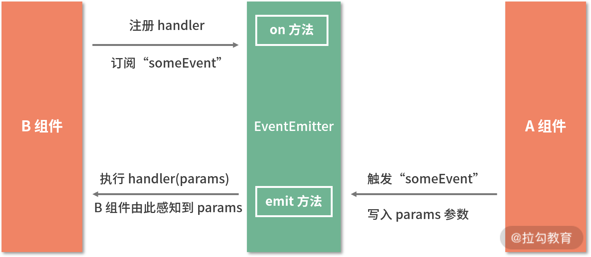

- 父传子：props。
- 子传父：props 传递一个 callback。
- 兄弟之间：也是通过父子之间的桥梁。
- ==基于发布订阅模式实现全局通信。==
- `Context`


以上都是传统的方式进行通信。那么远端通信都有哪些实现方式呢？

重点介绍一下发布订阅模式。


# 发布订阅模式

发布订阅模式可谓是解决通信类问题的万金油，例如：

- `socket.io` ：实现 `websocket` 通信的模块，就是基于跨域发布订阅模式实现。
- `EventEmitter` ：这些模块都是这样实现。

发布订阅模式的 API 主要有三个：

- `on()` ：负责注册时间监听器，指定回调函数。
- `emit()`：负责触发事件，可以通过传参使其在触发的时候携带数据。
- `off()` ：负责删除监听器。


## 手动实现一个监听对象

```js
class EventEmitter {
  constructor() {
    // 哈希表存储事件和对应的监听函数
    this.eventMap = {};
  }

  on(type, handler) {
    if (!handler instanceof Function) throw new TypeError('记得传函数哈');

    // type事件是否存在，不存在=>新建；存在，就添加的监听函数队列中
    if (!this.eventMap[type]) this.eventMap[tyepe] = [];
    this.eventMap[type].push(handler);
  }

  // params是传递给监听函数的数据
  emit(type, params) {
    if (this.eventMap[type]) {
      this.eventMap[type].forEach(handler => handler(params));
    }
  }

  off(type, handler) {
    // 这里的 >>>0 右移符号可以防止indexOf是-1，右移会变成一个超大的数，对数组无任何影响
    if (this.eventMap[type]) this.eventMap[type].splice(this.eventMap[type].indexOf(handler) >>> 0, 1);
  }
}
```

这种通信方式的精髓就是，在触发 `emit` 监听时，可以把数据传递给监听函数。

这种全局的监听方式，能轻松传递数据：

```js
const globalEvent = window.myEvent;
class A extends React.Component {
  state = { newParams: '' };
  handler = params => {
    this.setState({ newParams: params });
  };
  bindHandler = () => {
    globalEvent.on('changeParamsEvent', this.handler);
  };

  render() {
    return <div>something...</div>;
  }
}
class B extends React.Component {
  state = { infoToA: '我来自B，可以传给A' };

  dataToA = () => globalEvent.emit('changeParamsEvent', this.state.infoToA);

  render() {
    return <button onClick={this.dataToA}>点击后，可以把数据传给A</button>;
  }
}
```




