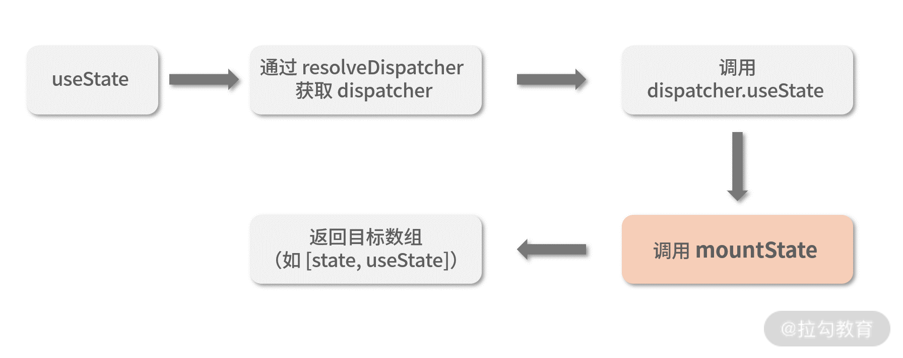

# 常见问题

1. useEffect 是异步的，要等到浏览器将所有变化渲染到屏幕后才会被执行。而 `useLayoutEffect` 是同步的。所以 `useEffect` 并不会阻塞渲染，但是如果进行 DOM 操作的话，会造成重渲染。


# Hooks 优势

- 告别难以理解的 Class。
- 解决业务逻辑难以拆分的问题。
- 使状态逻辑复用变得简单可行。
- 函数组件从设计上更契合 React。

## 1. Class 难理解

主要是 `this` 和生命周期两个东西最难理解。

## 2. 拆分逻辑

```js
componentDidMount() {
  // 1. 这里发起异步调用
  // 2. 这里从 props 里获取某个数据，根据这个数据更新 DOM
  // 3. 这里设置一个订阅
  // 4. 这里随便干点别的什么 
  // ...
}

componentWillUnMount() {
  // 在这里卸载订阅
}

componentDidUpdate() {
  // 1. 在这里根据 DidMount 获取到的异步数据更新 DOM
  // 2. 这里从 props 里获取某个数据，根据这个数据更新 DOM（和 DidMount 的第2步一样）
}
```

我们通过 `Hooks` 可以进行拆分：

- 专门管理订阅的函数组件。
- 专门处理 DOM 的函数组件。
- 专门获取数据的组件
- ....


## 3. Hooks 状态复用

HOC 的组件复用方式会破坏组件的结构，有可能导致==嵌套地狱==现象。

未完待续。。。


# Hooks 原理

以 `useState` 为例，分析 hooks 的调用链路：

## 首次渲染




