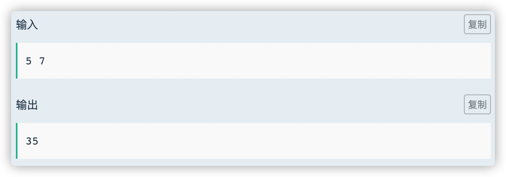
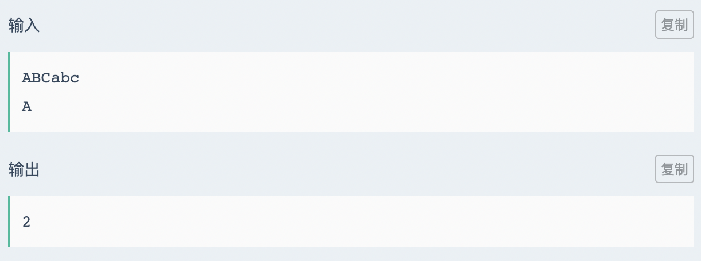
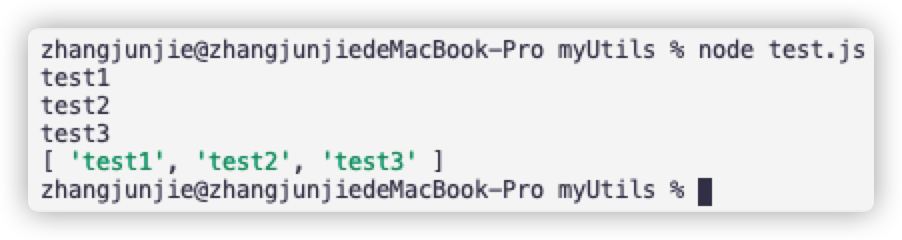

牛客网的笔试属于 ACM 模式，有两种模式，一种是浏览器 v8 模式，一种是 node 模式。下面来介绍一下这两种模式下的输入和输出。

对于笔试题目，大致分为两种类型。

1. 只输入一个数据，然后经过处理后输出，类似下面这样：

   

2. 输入未知的数据，用换行来代替，类似下面这样：

   

# Node版本

nodejs 依赖 readline 库，接收到输入数据，用 `console.log()` 进行输出。


## 单行输入

```js
const readline = require('readline');
const rl = readline.createInterface({
  input: process.stdin,
  output: process.stdout,
});
rl.on('line', line => {
  console.log(line);
});
```


## 多行输入

```js
const readline = require('readline');
const rl = readline.createInterface({
  input: process.stdin,
  output: process.stdout,
});
let arr = [];
rl.on('line', line => {
  arr.push(line);
});
rl.on('close', () => {
  console.log(arr);
});
```


nodejs 可以在本地进行调试，在终端输入 `node test.js`，就可以进入输入：

1. 单行输入时，按回车就能查看结果
2. 多行输入时，回车代表移入下一行。**结束输入按 ctrl + C**



# V8 版本

## 单行输入


## 多行输入


