布局的传统解决方案，基于[盒状模型](https://developer.mozilla.org/en-US/docs/Web/CSS/box_model)，依赖 [`display`](https://developer.mozilla.org/en-US/docs/Web/CSS/display) 属性 + [`position`](https://developer.mozilla.org/en-US/docs/Web/CSS/position)属性 + [`float`](https://developer.mozilla.org/en-US/docs/Web/CSS/float)属性。它对于那些特殊布局非常不方便，比如，[垂直居中](https://css-tricks.com/centering-css-complete-guide/)就不容易实现。

2009年，W3C 提出了一种新的方案----Flex 布局，可以简便、完整、响应式地实现各种页面布局。目前，它已经得到了所有浏览器的支持，这意味着，现在就能很安全地使用这项功能。

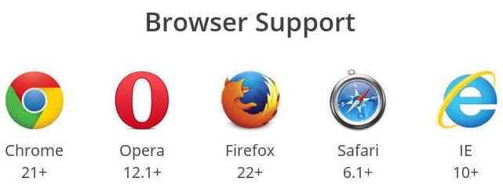

```css
.box{
  display: flex;
}
/* 行内元素也可以使用 Flex */
.box{
  display: inline-flex;
}
```

**Webkit 内核的浏览器，必须加上 `-webkit `前缀。**

```css
.box{
  display: -webkit-flex; /* Safari */
  display: flex;
}
```

**注意，设为 Flex 布局以后，子元素的 `float`、`clear `和 `vertical-align` 属性将失效。**


# 基本概念

Flex 布局首先要有个一个大的容器，称为 Flex 容器（flex container）。所有的子元素自动称为容器成员（flex item）。

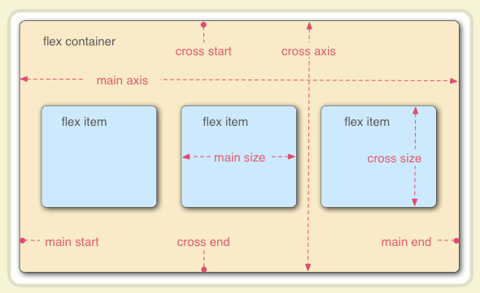

容器默认存在两根轴：水平的主轴（main axis）和垂直的交叉轴（cross axis）。主轴的开始位置（与边框的交叉点）叫做 `main start`，结束位置叫做 `main end`；交叉轴的开始位置叫做 `cross start`，结束位置叫做 `cross end`。

项目默认沿主轴排列。单个项目占据的主轴空间叫做 `main size`，占据的交叉轴空间叫做 `cross size`。

**Flex 布局以后，子元素的 `float` 、`clear` 和 `vertical-align` 属性将失效。**


## 自适应布局常用单位

### vw 和 vh

这两个是视口单位中的”视口“。视口单位主要包括四个：

1. `vw`：1vw 等于视口宽度的 1%。
2. `vh`：1vh 等于视口高度的 1%。
3. `vmin` : 选取 vw 和 vh 中最小的那个。
4. `vmax`: 选取 vw 和 vh 中最大的那个。


单位度量，视口宽度为100vw，高度为100vh（左侧为竖屏情况，右侧为横屏情况） 例如，在桌面端浏览器视口尺寸为650px，那么 1vw = 650 * 1% = 6.5px（这是理论推算的出，如果浏览器不支持0.5px，那么实际渲染结果可能是7px）。

**举个例子：浏览器宽度1200px, 1 vw = 1200px/100 = 12 px。**

**vw、vh与 % 的区别**：

1. % 是相对于父元素的大小设定的比率，vw、vh 是视窗大小决定的。
2. vw、vh 优势在于能够直接获取高度，而用 % 在没有设置 body高度的情况下，是无法正确获得可视区域的高度的，所以这是挺不错的优势。


### em

参考物是父元素的 font-size，具有继承的特点。


### rem

相对于根元素 html。可以设置 HTML 大小为 10px。则 1.2rem = 12px。

**如何设置 1rem=10px？在 HTML { font-size：62.5%；} 即可。**


# API 总结

容器有以下 6 个属性：

1. [flex-direction](#1-flex-direction-属性)
2. [flex-wrap](#2-flex-wrap-属性)
3. [justify-content](#3-justify-content-属性)
4. [align-items](#4-align-items-属性)
5. [align-content](#5-align-content-属性)
6. [flex-flow](#6-flex-flow-属性)

项目的 6 个属性：

1. [order](#1-order-属性)
2. [flex-grow](#2-flex-grow-属性)
3. [flex-shrink](#3-flex-shrink-属性)
4. [flex-basis](#4-flex-basis-属性)
5. [align-self](#5-align-self-属性)
6. [flex](#6-flex-属性)


## 容器属性

### 1. flex-direction属性

**flex-direction 属性决定主轴的方向（即项目的排列方向）。**

```css
.box {
  flex-direction: row | row-reverse | column | column-reverse;
}
```

| 属性名           | 属性描述                   | 详情                                                         |
| ---------------- | -------------------------- | ------------------------------------------------------------ |
| `row`（默认值）  | 主轴为水平方向，起点在左端 | 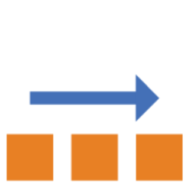 |
| `row-reverse`    | 主轴为水平方向，起点在右端 | 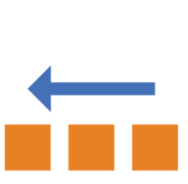 |
| `column`         | 主轴为垂直方向，起点在上沿 | 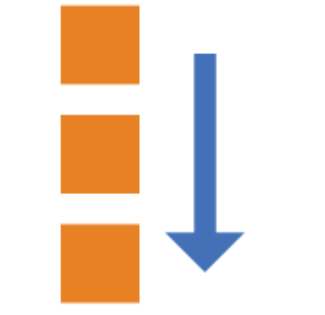 |
| `column-reverse` | 主轴为垂直方向，起点在下沿 | 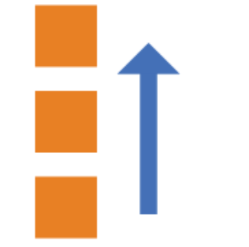 |


### 2. flex-wrap 属性

默认情况下，项目都排在一条线（又称"轴线"）上。**`flex-wrap` 属性定义，如果一条轴线排不下，如何换行。**

```css
.box{
  flex-wrap: nowrap | wrap | wrap-reverse;
}
```

| 属性名          | 属性描述               | 详情                                                         |
| --------------- | ---------------------- | ------------------------------------------------------------ |
| `nowrap` (默认) | 不换行                 | 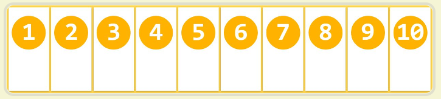 |
| `wrap`          | 换行，第一行在上方     | 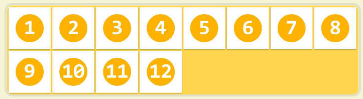 |
| `wrap-reverse`  | **换行，第一行在下方** | 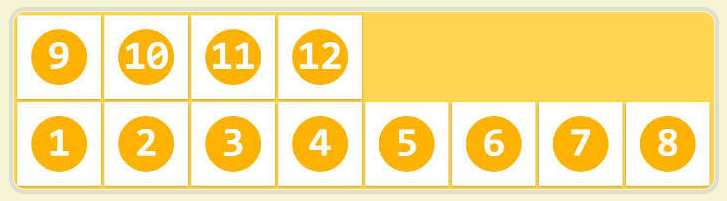 |


### 3. justify-content 属性

`justify-content` 属性定义了项目在主轴上的对齐方式。

```css
.box {
  justify-content: flex-start | flex-end | center | space-between | space-around;
}
```

| 属性名                 | 属性描述                                                     | 详情                                                         |
| ---------------------- | ------------------------------------------------------------ | ------------------------------------------------------------ |
| `flex-start`（默认值） | 左对齐                                                       | 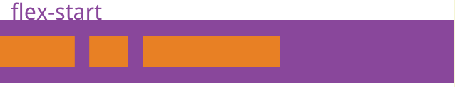 |
| `flex-end`             | 右对齐                                                       | 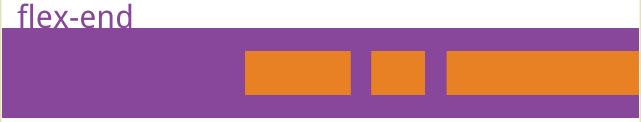 |
| `center`               | 居中                                                         | 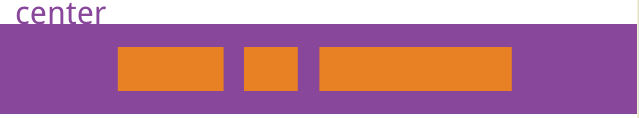 |
| `space-between`        | 两端对齐，项目之间的间隔都相等                               | 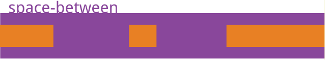 |
| `space-around`         | 每个项目两侧的间隔相等。**所以，项目之间的间隔比项目与边框的间隔大一倍** | 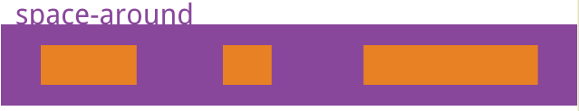 |


### 4. align-items 属性

`align-items` 属性定义项目在交叉轴上如何对齐（也就是另一个方向！）。

```css
.box {
  align-items: flex-start | flex-end | center | baseline | stretch;
}
```

| 属性名             | 属性描述                                           | 详情                                                         |
| ------------------ | -------------------------------------------------- | ------------------------------------------------------------ |
| `stretch` (默认值) | 如果项目未设置高度或设为auto，将占满整个容器的高度 | 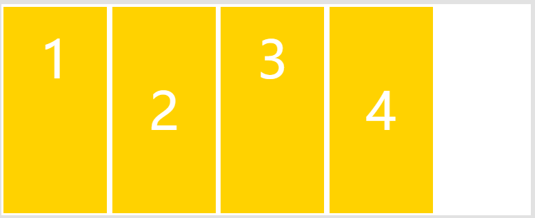 |
| `flex-start`       | 交叉轴的起点对齐                                   | 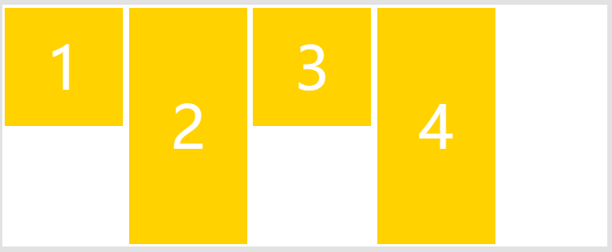 |
| `flex-end`         | 交叉轴的起点对齐                                   | 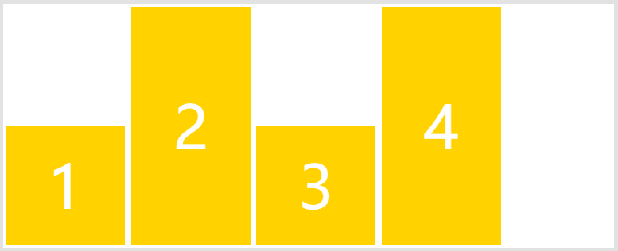 |
| `center`           | 交叉轴的中点对齐                                   | 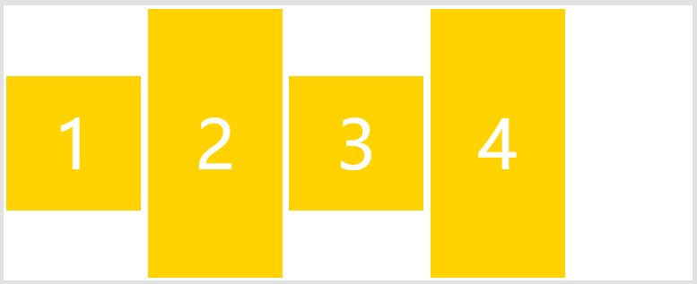 |
| `baseline`         | **项目的第一行文字的基线对齐**                     | 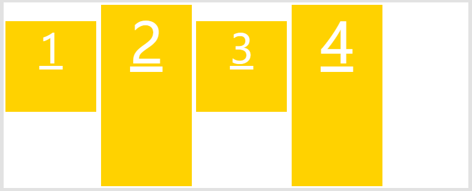 |


### 5. align-content 属性

`align-content` 属性定义了多根轴线的对齐方式。**如果项目只有一根轴线，该属性不起作用**。**实际上指的是每一行作为一个整体，位置的定义。**

```css
.box {
  align-content: flex-start | flex-end | center | space-between | space-around | stretch;
}
```

| 属性名             | 属性描述                                                     | 详情                                                         |
| ------------------ | ------------------------------------------------------------ | ------------------------------------------------------------ |
| `stretch` (默认值) | 轴线占满整个交叉轴                                           | 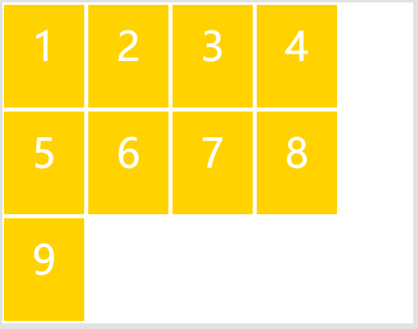 |
| `flex-start`       | 与交叉轴的起点对齐                                           | 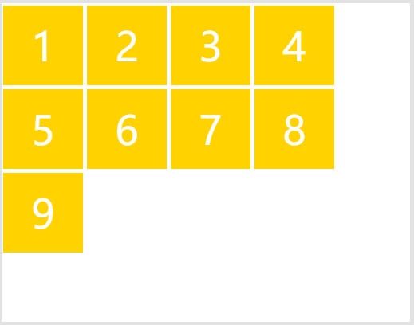 |
| `flex-end`         | 与交叉轴的终点对齐                                           |  |
| `center`           | 与交叉轴的中点对齐                                           | 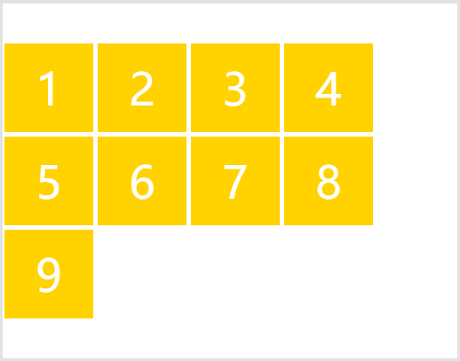 |
| `space-between`    | 与交叉轴两端对齐，轴线之间的间隔平均分布                     | 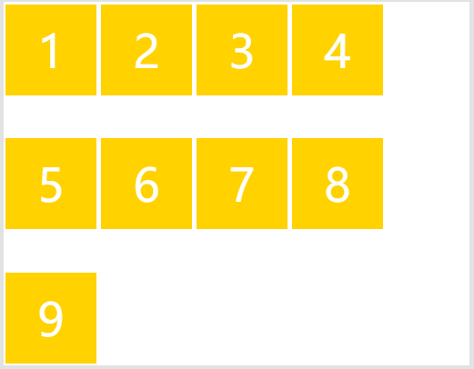 |
| `space-around`     | 每根轴线两侧的间隔都相等。所以，轴线之间的间隔比轴线与边框的间隔大一倍 | 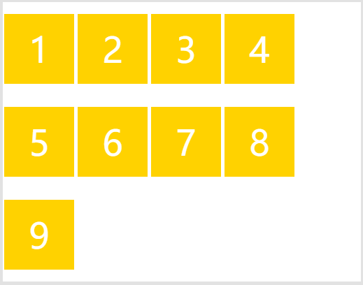 |


### 6. flex-flow 属性

`flex-flow` 属性是 `flex-direction` 属性和 `flex-wrap` 属性的简写形式，默认值为 `row nowrap` 。

```css
.box {
  flex-flow: <flex-direction> || <flex-wrap>;
}
```


## 项目属性

### 1. order 属性

`order` 属性定义项目的排列顺序。数值越小，排列越靠前，默认为0。

```css
.item {
  order: <integer>;
} /* 表示该项目在当前行的位次。如果是 -1 就在第一个 */
```

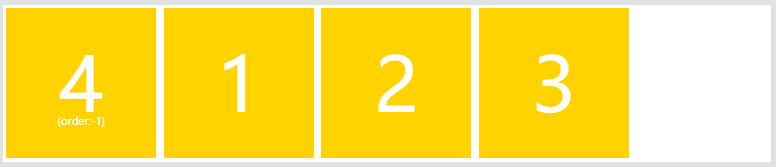                                                                               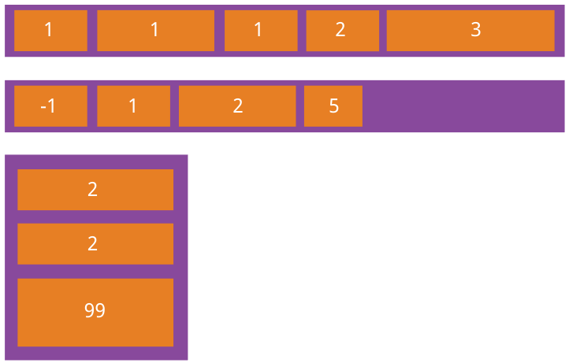     

### 2. flex-grow 属性

`flex-grow` 属性定义项目的放大比例，默认为 `0`，即如果存在剩余空间，也不放大。

**如果所有项目的 flex-grow 属性都为1，则它们将等分剩余空间（如果有的话）。如果一个项目的 flex-grow 属性为2，其他项目都为1，则前者占据的剩余空间将比其他项多一倍。**

```css
.item {
  flex-grow: <number>; /* default 0 */
}
```

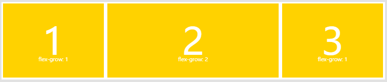


### 3. flex-shrink 属性

`flex-shrink` 属性定义了项目的缩小比例，默认为1，即如果空间不足，该项目将缩小。

```css
.item {
  flex-shrink: <number>; /* default 1 */
}
```

如果所有项目的 `flex-shrink` 属性都为1，当空间不足时，都将等比例缩小。如果一个项目的 `flex-shrink` 属性为0，其他项目都为1，则空间不足时，前者不缩小。**负值对该属性无效。**


### 4. flex-basis 属性

`flex-basis` 属性定义了在分配多余空间之前，项目占据的主轴空间（main size）。浏览器根据这个属性，计算主轴是否有多余空间。它的默认值为`auto`，即项目的本来大小。

```css
.item {
   flex-basis: <length> | auto; /* default auto */
 }
```

**它可以设为跟 `width` 或 `height` 属性一样的值（比如350px），则项目将占据固定空间。**


### 5. align-self 属性

`align-self` 属性允许单个项目有与其他项目不一样的对齐方式，可覆盖 `align-items` 属性。默认值为 `auto`，表示继承父元素的 `align-items` 属性，如果没有父元素，则等同于 `stretch`。**也就是自定自己的对齐方式。**

```css
.item {
  align-self: auto | flex-start | flex-end | center | baseline | stretch;
}
```


### 6. flex 属性

`flex` 属性是 `flex-grow` ,  `flex-shrink` 和 `flex-basis` 的简写，默认值为 `0 1 auto`。后两个属性可选。

```css
.item {
  flex: none | [ <'flex-grow'> <'flex-shrink'>? || <'flex-basis'> ]
}
```


# 实例

## 1. 骰子布局

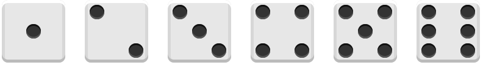

HTML：

```html
<!DOCTYPE html>
<html lang="en">
<head>
  <meta charset="UTF-8">
  <meta name="viewport" content="width=device-width, initial-scale=1.0">
  <link rel="stylesheet" href="style.css"/>
  <title>Document</title>
</head>
<body>
  <div class="first-face">
    <span class="pip"></span>
  </div>
  <div class="second-face">
    <span class="pip"></span>
    <span class="pip"></span>
  </div>
  <div class="third-face">
    <span class="pip"></span>
    <span class="pip"></span>
    <span class="pip"></span>
  </div>
  <div class="fourth-face">
    <div class="column">
      <span class="pip"></span>
      <span class="pip"></span>
    </div>
    <div class="column">
      <span class="pip"></span>
      <span class="pip"></span>
    </div>
  </div>
  <div class="fifth-face">
    <div class="column">
      <span class="pip"></span>
      <span class="pip"></span>
    </div>
    <div class="column">
      <span class="pip"></span>
    </div>
    <div class="column">
      <span class="pip"></span>
      <span class="pip"></span>
    </div>
  </div>
  <div class="sixth-face">
    <div class="column">
      <span class="pip"></span>
      <span class="pip"></span>
      <span class="pip"></span>
    </div>
    <div class="column">
      <span class="pip"></span>
      <span class="pip"></span>
      <span class="pip"></span>
    </div>
  </div>
</body>
</html>
```

CSS：

```css
.first-face {
  display: flex;
  justify-content: center;
  align-items: center;
}

.second-face {
  display: flex;
  justify-content: space-between;
}
.second-face .pip:nth-of-type(2) {
  align-self: flex-end;
}

.third-face {
  display: flex;
  justify-content: space-between;
}
.third-face .pip:nth-of-type(2) {
  align-self: center;
}
.third-face .pip:nth-of-type(3) {
  align-self: flex-end;
}

.fourth-face,
.sixth-face {
  display: flex;
  justify-content: space-between;
}
.fourth-face .column,
.sixth-face .column {
  display: flex;
  flex-direction: column;
  justify-content: space-between;
}

.fifth-face {
  display: flex;
  justify-content: space-between;
}
.fifth-face .column {
  display: flex;
  flex-direction: column;
  justify-content: space-between;
}
.fifth-face .column:nth-of-type(2) {
  justify-content: center;
}

/* PUBLIC STYLES */
* {
  box-sizing: border-box;
}
html,
body {
  height: 100%;
}
body {
  display: flex;
  align-items: center;
  justify-content: center;
  vertical-align: center;
  flex-wrap: wrap;
  align-content: center;
  font-family: 'Open Sans', sans-serif;

  /* background: linear-gradient(top, #222, #333); */
}
[class$='face'] {
  margin: 16px;
  padding: 4px;
  background-color: #e7e7e7;
  width: 104px;
  height: 104px;
  object-fit: contain;
  /* 
  * object-fit 属性指定元素的内容应该如何去适应指定容器的高度与宽度。
  * object-fit 一般用于 img 和 video 标签，一般可以对这些元素进行保留原始比例的剪切、缩放或者直接进行拉伸等。
  * object-fit: fill默认|contain|cover|scale-down|none|initial|inherit;
  */

  box-shadow: inset 0 5px white, inset 0 -5px #bbb, inset 5px 0 #d7d7d7, inset -5px 0 #d7d7d7;
  border-radius: 10%;
}
.pip {
  display: block;
  width: 24px;
  height: 24px;
  border-radius: 50%;
  margin: 4px;
  background-color: #333;
  box-shadow: inset 0 3px #111, inset 0 -3px #555;
}

```


## 2. 网格布局

### 2.1 基本网格布局

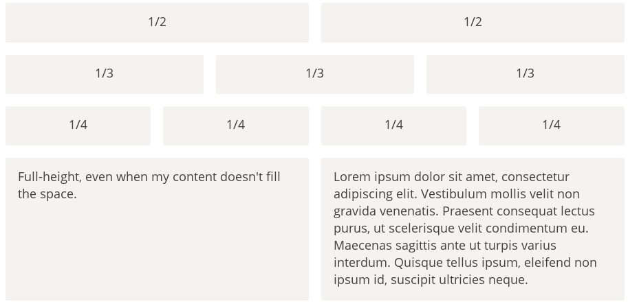

**要利用到 `flex-grow` 属性** => **如果所有项目的 flex-grow 属性都为1，则它们将等分剩余空间（如果有的话）。**

HTML：

```html
<div class="Grid">
  <div class="Grid-cell">...</div>
  <div class="Grid-cell">...</div>
  <div class="Grid-cell">...</div>
</div>
```

CSS：

```css
.Grid {
  display: flex;
}
.Grid-cell {
  flex: 1; 
  /* flex-grow  flex-shrink  flex-basis */
}
```


### 2.2 百分比布局

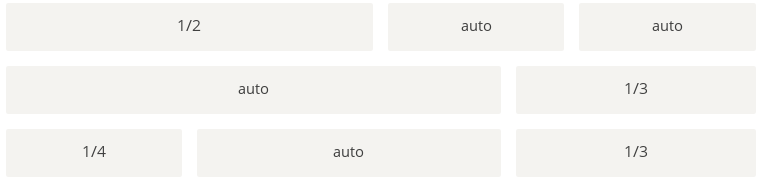

HTML：

```html
<div class="Grid">
  <div class="Grid-cell u-1of4">...</div>
  <div class="Grid-cell">...</div>
  <div class="Grid-cell u-1of3">...</div>
</div>
```

CSS：

```css
.Grid {
  display: flex;
}
.Grid-cell {
  flex: 1;
}
.Grid-cell .u-full {
  flex: 0 0 100%;
}
.Grid-cell .u-1of2 {
  flex: 0 0 50%;
}
.Grid-cell .u-1of3 {
  flex: 0 0 33.3333%;
}
.Grid-cell .u-1of4 {
  flex: 0 0 25%;
}
```


### 2.3 圣杯布局

[圣杯布局](https://en.wikipedia.org/wiki/Holy_Grail_(web_design))（Holy Grail Layout）指的是一种最常见的网站布局。页面从上到下，分成三个部分：头部（header），躯干（body），尾部（footer）。其中躯干又水平分成三栏，从左到右为：导航、主栏、副栏。**如果是小屏幕，躯干的三栏自动变为垂直叠加。**

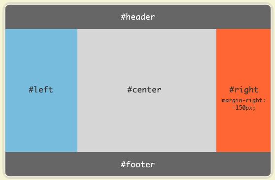


HTML：

```html
<body class="HolyGrail">
  <header>...</header>
  <div class="HolyGrail-body">
    <main class="HolyGrail-content">...</main>
    <nav class="HolyGrail-nav">...</nav>
    <aside class="HolyGrail-ads">...</aside>
  </div>
  <footer>...</footer>
</body>
```

CSS：

```css
@media (max-width: 768px) {
  .HolyGrail-body {
    flex-direction: column;
    flex: 1;
  }
  .HolyGrail-nav,
  .HolyGrail-ads,
  .HolyGrail-content {
    flex: auto;
  }
}

.HolyGrail {
  display: flex;
  min-height: 100vh;
  flex-direction: column;
}
header,
footer {
  flex: 1;
}
.HolyGrail-body {
  display: flex;
  flex: 1;
}
.HolyGrail-content {
  flex: 1;
}
.HolyGrail-nav, .HolyGrail-ads {
  /* 两个边栏的宽度设为12em */
  flex: 0 0 12em;
}
.HolyGrail-nav {
  /* 导航放到最左边 */
  order: -1;
}
```


## 3. 输入框布局

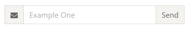

```html
<!DOCTYPE html>
<html lang="en">
  <head>
    <meta charset="UTF-8" />
    <meta name="viewport" content="width=device-width, initial-scale=1.0" />
    <title>Document</title>
    <style>
      .InputAddOn {
        display: flex;
      }

      .InputAddOn-field {
        flex: 1;
      }
    </style>
  </head>
  <body>
    <div class="InputAddOn">
      <span class="InputAddOn-item">图标</span>
      <input class="InputAddOn-field" />
      <button class="InputAddOn-item">按钮</button>
    </div>
  </body>
</html>
```


## 4. 流式布局

类似于电商网站的商品陈列，一个一个挤下去。

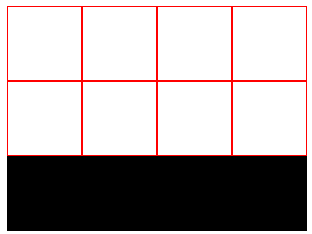  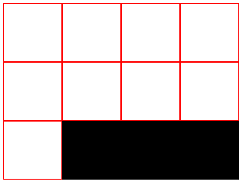 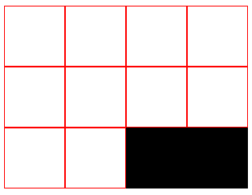


```css
.parent {
  width: 200px;
  height: 150px;
  background-color: black;
  display: flex;
  flex-flow: row wrap;
  align-content: flex-start; /* 重点 */
}

.child {
  box-sizing: border-box;
  background-color: white;
  flex: 0 0 25%;
  height: 50px;
  border: 1px solid red;
}
```


原文参考：[阮一峰博客](http://www.ruanyifeng.com/blog/2015/07/flex-grammar.html)


