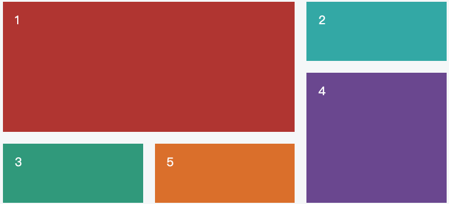
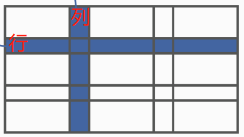
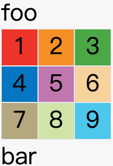
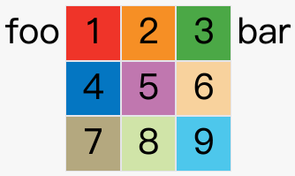
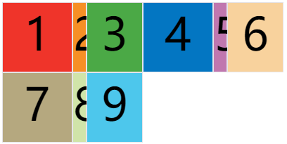
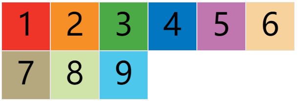

# 基本概念

网格布局（Grid）是最强大的 CSS 布局方案。它将网页划分成一个个网格，可以任意组合不同的网格，做出各种各样的布局。以前，只能通过复杂的 CSS 框架达到的效果，现在浏览器内置了。



Flex 布局是轴线布局，只能指定"项目"针对轴线的位置，可以看作是**一维布局**。Grid 布局则是将容器划分成"行"和"列"，产生单元格，然后指定"项目所在"的单元格，可以看作是**二维布局**。Grid 布局远比 Flex 布局强大。

**注意，设为网格布局以后，容器子元素（项目）的 `float`、`display: inline-block`、`display: table-cell`、`vertical-align` 和  `column-*` 等设置都将失效。**


## 1. 概念

- 必须要有**容器（container）**和**项目（item）**。

- 容器里面的水平区域称为**"行"（row）**，垂直区域称为**"列"（column）**。



- **单元格cell**：行和列的交叉区域，称为单元格。 `n `行和 `m` 列会产生 `n x m` 个单元格。比如，3行3列会产生9个单元格。

- **网格线grid line**：正常情况下，`n` 行有 `n + 1` 根水平网格线，`m `列有 `m + 1` 根垂直网格线，比如三行就有四根水平网格线。


# API总结

**容器属性：**

1. [`display` 属性](#1-display-属性)
2. [`grid-template-columns` 和 `grid-template-rows` 属性](#2-grid-template-columns-和-grid-template-rows-属性)
   - [repeat](#1-repeat)
   - [auto-fill](#2-autofill)
   - [fr](#3-fr)
   - [minmax()](#4-minmax())
   - [auto](#5-auto)
   - [网格线设置名称](#6-网格线设置名称)
3. [ `grid-row-gap` 和`grid-column-gap` 和 `grid-gap` 属性](#3. `grid-row-gap` 和`grid-column-gap` 和 `grid-gap` 属性)
4. [`grid-template-areas` 属性](#4. `grid-template-areas` 属性)
5. [`grid-auto-flow` 属性](#5. `grid-auto-flow` 属性)


## 容器属性

### 1. display 属性

分为 grid 和 inline-grid。

          

```html
<body>
  <span>foo</span>
<div id="container">
  <div class="item item-1">1</div>
  <div class="item item-2">2</div>
  <div class="item item-3">3</div>
  <div class="item item-4">4</div>
  <div class="item item-5">5</div>
  <div class="item item-6">6</div>
  <div class="item item-7">7</div>
  <div class="item item-8">8</div>
  <div class="item item-9">9</div>
</div>
<span>bar</span>
</body>
<style>
  #container{
  display: grid;
  grid-template-columns: 50px 50px 50px; 控制每一列的宽度
  grid-template-rows: 50px 50px 50px; 控制每一行的高度
	}

	.item {
  	font-size: 2em;
  	text-align: center;
	  border: 1px solid #e5e4e9;
	}
</style>
```


### 2. `grid-template-columns` 和 `grid-template-rows` 属性

容器指定了网格布局以后，接着就要划分行和列。`grid-template-columns` 属性定义每一列的列宽，`grid-template-rows` 属性定义每一行的行高。

```css
.container {
  display: grid;
  grid-template-columns: 100px 100px 100px;
  grid-template-rows: 100px 100px 100px;
}
/* 除了用固定值，还可以用百分比 */
.container {
  display: grid;
  grid-template-columns: 33.33% 33.33% 33.33%;
  grid-template-rows: 33.33% 33.33% 33.33%;
}
/* 这样写很麻烦，可以用到repeat() */
.container {
  display: grid;
  grid-template-columns: repeat(3, 33.33%);
  grid-template-rows: repeat(2, 100px 20px 80px); /* 这里代表重复两次这个结果 */
}
/* auto-fill自动填充，填充的是列的个数！ */
.container {
  display: grid;
  grid-template-columns: repeat(auto-fill, 100px);
}
```

#### 1. `repeat`



```css
#container{
  display: grid;
  grid-template-columns: repeat(2, 100px 20px 80px);
  grid-template-rows: repeat(3, 100px);
}

.item {
  font-size: 4em;
  text-align: center;
  border: 1px solid #e5e4e9;
}
```

上面代码表示，列宽度按照 100px 20px 80px 重复两次。

#### 2. `auto-fill`



```css
#container{
  display: grid;
  grid-template-columns: repeat(auto-fit, 100px);
  grid-template-rows: repeat(3, 100px);
}

.item {
  font-size: 4em;
  text-align: center;
  border: 1px solid #e5e4e9;
}
```

上面代码表示，item 的列宽固定100px，但不确定有多少个 item，所以放多少个都行，放多了会掉下来。

#### 3. `fr`

如果两列的宽度分别为 `1fr` 和 `2fr` ，就表示后者是前者的两倍。

`fr` 可以与绝对长度的单位结合使用，这时会非常方便。

```css
.container {
  display: grid;
  grid-template-columns: 150px 1fr 2fr;
}
```

上面表示：第一列宽度 150px，第二列宽度是第三列的一半，三个一起占据了整行。

#### 4. `minmax()`

`minmax()` 函数产生一个长度范围，表示长度就在这个范围之中。它接受两个参数，分别为最小值和最大值。

```css
grid-template-columns: 1fr 1fr minmax(100px, 1fr);
```

上面代码中，`minmax(100px, 1fr)` 表示列宽不小于 `100px`，不大于 `1fr`。

#### 5. `auto`

`auto` 关键字表示由浏览器自己决定长度。

```css
grid-template-columns: 100px auto 100px;
```

上面代码中，第二列的宽度，基本上等于该列单元格的最大宽度，除非单元格内容设置了 `min-width`，且这个值大于最大宽度。

#### 6. `网格线设置名称`

`grid-template-columns` 属性和 `grid-template-rows` 属性里面，还可以使用方括号，指定每一根网格线的名字，方便以后的引用。

```css
.container {
  display: grid;
  grid-template-columns: [c1] 100px [c2] 100px [c3] auto [c4];
  grid-template-rows: [r1] 100px [r2] 100px [r3] auto [r4];
}
```

上面代码指定网格布局为3行 x 3列，因此有4根垂直网格线和4根水平网格线。方括号里面依次是这八根线的名字。

网格布局允许同一根线有多个名字，比如 `[fifth-line row-5]`。

### 3. `grid-row-gap` 和`grid-column-gap` 和 `grid-gap` 属性

`grid-row-gap` 属性设置行与行的间隔（行间距），`grid-column-gap` 属性设置列与列的间隔（列间距）。

```css
.container {
  grid-row-gap: 20px;
  grid-column-gap: 20px;
}
/* 也可以合并写法 一个意思 如果grid-gap省略了第二个值，浏览器认为第二个值等于第一个值。 */
.container {
  grid-gap: 20px 20px;
}
```

根据最新标准，上面三个属性名的 `grid-` 前缀已经删除，`grid-column-gap` 和 `grid-row-gap` 写成 `column-gap` 和 `row-gap` ，`grid-gap` 写成 `gap`。


### 4. `grid-template-areas` 属性

网格布局允许指定"区域"（area），一个区域由单个或多个单元格组成。`grid-template-areas`属性用于定义区域。

```css
container {
  display: grid;
  grid-template-columns: 100px 100px 100px;
  grid-template-rows: 100px 100px 100px;
  grid-template-areas: 'a b c'
                       'd e f'
                       'g h i';
}
```

上面代码先划分出9个单元格，然后将其定名为 `a` 到 `i` 的九个区域，分别对应这九个单元格。

下面是一个布局实例。

```css
grid-template-areas: "header header header"
                     "main main sidebar"
                     "footer footer footer";
```

上面代码中，顶部是页眉区域`header`，底部是页脚区域`footer`，中间部分则为`main`和`sidebar`。

如果某些区域不需要利用，则使用"点"（`.`）表示。

```css
grid-template-areas: 'a . c'
                     'd . f'
                     'g . i';
```

上面代码中，中间一列为点，表示没有用到该单元格，或者该单元格不属于任何区域。

> 注意，区域的命名会影响到网格线。每个区域的起始网格线，会自动命名为 `区域名-start`，终止网格线自动命名为 `区域名-end`。
>
> 比如，区域名为 `header`，则起始位置的水平网格线和垂直网格线叫做 `header-start`，终止位置的水平网格线和垂直网格线叫做 `header-end`。


### 5. `grid-auto-flow` 属性

划分网格以后，容器的子元素会按照顺序，自动放置在每一个网格。默认的放置顺序是"先行后列"，即先填满第一行，再开始放入第二行。

这个顺序由 `grid-auto-flow` 属性决定，默认值是 `row` ，即"先行后列"。也可以将它设成 `column` ，变成"先列后行"。

```css
grid-auto-flow: column;
```

- `row dense`：表示"先行后列"，并且尽可能紧密填满，尽量不出现空格。
- `column dense`：表示"先列后行"，并且尽量填满空格。


### 6. `justify-items` 和 `align-items` 和 `place-items` 属性

`justify-items` 属性设置单元格内容的水平位置（左中右），`align-items` 属性设置单元格内容的垂直位置（上中下）。

```css
.container {
  justify-items: start | end | center | stretch;
  align-items: start | end | center | stretch;
}
```

这两个属性的写法完全相同，都可以取下面这些值。

> - start：对齐单元格的起始边缘。
> - end：对齐单元格的结束边缘。
> - center：单元格内部居中。
> - stretch：拉伸，占满单元格的整个宽度（默认值）。

`place-items` 属性是 `align-items` 属性和 `justify-items` 属性的合并简写形式。

```css
place-items: <align-items> <justify-items>;
```

下面是一个例子。

```css
place-items: start end;
```

如果省略第二个值，则浏览器认为与第一个值相等。


# 布局实例

## 1. 两栏式布局

左边栏设为 70%，右边栏设为 30% 。

```css
.wrapper {
  display: grid;
  grid-template-columns: 70% 30%;
}
```

## 2. 十二网格布局

```css
grid-template-columns: repeat(12, 1fr);
```


