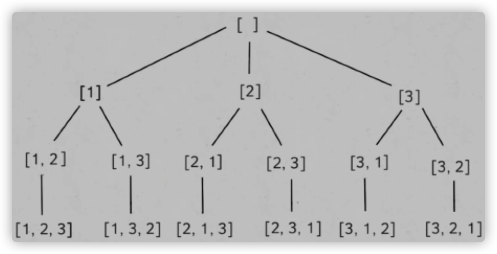

# 全排列问题

## 1. 无重复的全排列

**题目描述：**

[Leetcode46 全排列](https://leetcode-cn.com/problems/permutations/)

```js
给定一个 没有重复 数字的序列，返回其所有可能的全排列。
示例：
输入: [1,2,3]
输出:
[
  [1,2,3],
  [1,3,2],
  [2,1,3],
  [2,3,1],
  [3,1,2],
  [3,2,1]
]
```

**思路：**

这是一道经典的回溯算法问题。

可以画出一颗回溯树：



每次一个递归就相当于进入了下一层，以 1 为例：

1. 循环到 1，将 1 加入 track，然后进入 backtrack 递归 => 回溯树第二层。
2. 判断发现不满足长度为 n，所以开始新一轮的遍历，用 `arr.includes()` 把重复的 1，给舍弃掉，然后将 2 和 3 分别推入 track => 回溯树第三层。
3. 继续判断长度，不满足后，再将最后一个数推入到 track => 回溯树第四层。
4. 这是满足条件了，加入到结果中，然后 return，一层一层进行 `track.pop()` 把路径数组 track 变为空，然后反复这个过程。

**代码：**

JS 版：

```js
/**
 * @param {number[]} nums
 * @return {number[][]}
 */
var permute = function(nums) {
  const n = nums.length;
  const res = [];
  backtrack([]);
  return res;

  function backtrack(track){
    if(track.length === n) {
      res.push(track.slice());
      return;
    }

    for(let i=0;i<n;i++){
      if(track.includes(nums[i])) continue;
      track.push(nums[i]);
      backtrack(track);
      track.pop()
    }
  }
};
```


## 有重复数字的全排列

[Leetcode47 全排列2](https://leetcode-cn.com/problems/permutations-ii/)

**题目描述：**

```js
给定一个可包含重复数字的序列 nums ，按任意顺序 返回所有不重复的全排列。
示例：
输入：nums = [1,1,2]
输出：
[[1,1,2],
 [1,2,1],
 [2,1,1]]
```

**思路：**

这道题实际和第一道全排序是一个类型。第一道题利用不重复性来进行筛选，加入到路径 track 中，在这道题中无法使用。所以我们要思考一下，什么样的数才有资格加入到路径中。


总结一下，我们需要通过情况判断来枝剪下面的几种情况：

1. 同一路径下，每个元素不能重复使用。 

   ```js
   const used = new Array(n); // 默认undefined => false, 没有使用过
   if(used[i]) continue;
   ```

2. 重复的元素在同一层需要跳过第二个。比如第一轮第 2 次选了 1，第一轮第 2 次就不能选 1。

   ```js
   为了简化，我们把nums从小到大排序，来保证如果有重复，重复元素都是挨着的，所以就能利用 nums[i-1] === nums[i] 来判断同层重复元素：
   nums.sort((a,b) => a-b)
   if(nums[i-1]===nums[i] && i-1>=0 && !used[i-1]) continue;
   ```


**代码：**

```js
/**
 * @param {number[]} nums
 * @return {number[][]}
 */
var permuteUnique = function(nums) {
  const res = [];
  const n = nums.length;
  const used = new Array(n);
  nums.sort((a,b)=>a-b)
  backtrack([]);
  return res;

  function backtrack(track){
    if(track.length === n) {
      res.push(track.slice());
      return;
    }
    for(let i=0;i<n;i++){
      if(used[i]) continue;
      if(nums[i]===nums[i-1] && i-1>=0 && !used[i-1]) continue;  
      used[i] = true;
      track.push(nums[i]);
      backtrack(track);
      used[i] = false;
      track.pop();
    }
  }
};
```


## 字符串排列

**题目：**

```js
输入一个字符串，打印出该字符串中字符的所有排列。你可以以任意顺序返回这个字符串数组，但里面不能有重复元素。
示例：
输入：s = "abc"
输出：["abc","acb","bac","bca","cab","cba"]
```


**思路：**

**方法一：利用 `Set` 的不重复特性，简化重复性筛选。**

```js
var permutation = function(s) {
  const n = s.length;
  const res= new Set();
  const visited = {};
  backtrack('');
  return [...res];

  function backtrack(track){
    if(track.length === n) {
      res.add(track);
      return 
    }
    for(let i=0;i<n;i++){
      if(visited[i]) continue;
      visited[i] = true;
      track += s[i];
      backtrack(track);
      track = track.substring(0, track.length-1);
      visited[i] = false;
    }
  }
};
```


**方法二：普通方法筛选。**


