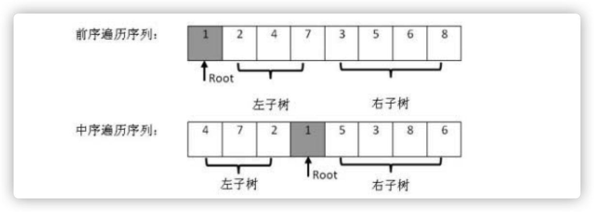

# 题目

```js
输入某二叉树的前序遍历和中序遍历的结果，请重建该二叉树。假设输入的前序遍历和中序遍历的结果中都不含重复的数字。
示例：
给出
前序遍历 preorder = [3,9,20,15,7]
中序遍历 inorder = [9,3,15,20,7]
返回二叉树的根节点
```


# 思路

这道题最重要的是通过前序遍历和中序遍历确定出位置关系。如图所示：



1. 前序遍历的第一个数是根节点
2. 该根节点对应在中序遍历的位置上，左边是左子树，右边是右子树
3. 把属于左右子树的元素分别划分后进行递归


# 代码

```js
/**
 * Definition for a binary tree node.
 * function TreeNode(val) {
 *     this.val = val;
 *     this.left = this.right = null;
 * }
 */
/**
 * @param {number[]} preorder
 * @param {number[]} inorder
 * @return {TreeNode}
 */
var buildTree = function(preorder, inorder) {
  if(!preorder.length || !inorder.length) return null;
  const rootVal = preorder[0];
  const root = new TreeNode(rootVal);
  const i = inorder.indexOf(rootVal);

  root.left = buildTree(preorder.slice(1,i+1), inorder.slice(0, i));
  root.right = buildTree(preorder.slice(i+1), inorder.slice(i+1));
  return root;
};
```


