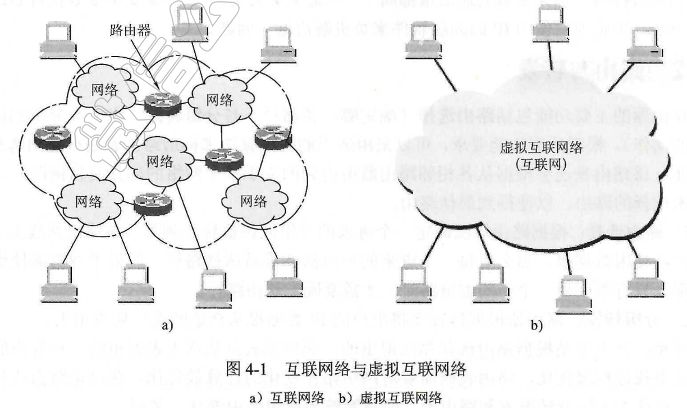

# 1. 网络层的功能

## 1.1 异构网络互联

虚拟互联网络：用户需求多种多样 => 网络多样 => 通过一种协议将路由器连接的网络进行通信。这是一种逻辑上的概念，实际上通过各种中继系统来进行实现。

网络互联需要的中间设备：

1. 物理层：中继器或集线器
2. 数据链路层：网桥或交换机
3. **网络层：路由器**
4. 网络层以上：网关

**优势：互联网上的主机通信时，就好像在同一个网络上通信，暴露更少的网络异构细节。**

**"尽最大努力交付" => 路由器保证不故意丢弃 IP 数据。**

## 1.2 路由与转发

路由器的功能主要包括：**路由选择**（确定哪条路径）和**分组转发**。

### 问题

1. 交换机和路由器的功能和区别？

2. 在一个互联网中，能否使用一个很大的交换机来代替互联网中的很多路由器？

> 1. 交换机可在单个的网络中和若干台计算机相连，把帧转发给另一台计算机 => **是集线器的转发帧功能**
>
> 2. 交换机比集线器多的功能：能同一时间允许多台进行通信。
> 3. 路由器可以连接两个或多个网络，在网络间转发分组（IP 数据报）=> 支持异构网络

3. 路由器中路由表只给出目的网络的下一跳路由器 IP 地址，有什么好处？

> **使得路由选择变成动态的。如果网络情况有变化（网络拥塞），中途的路由器可以改变路径，实现动态路由选择**

## 1.3 拥塞控制

计算机网络在一个子网或子网的一部分出现太多分组时，网络性能开始下降，成为拥塞。控制拥塞来确保网络保持良好性能。

1. **开环控制**：**在事先就考虑各种因素。**系统启动运行后，不需要中途修改，开环控制手段包括：确定何时接受新流量，何时丢弃分组等。**特点：做决定时不考虑当前网络状态。**
2. **闭环控制**：监视系统进行监控，将信息传到合适的地方来调整运行，措施：检测拥塞、报告拥塞、调整措施。

**问题：**

拥塞控制和流量控制之间的关系？

> 拥塞控制必须确保通信子网能够传送待传送的数据，是一个全局性问题，涉及到所有主机、路由器等导致网络传输能力下降的所有因素。
>
> 流量控制只在发送端和接收端之间点对点通信量有关，其任务是发送端发送数据的速率不得快得让接收端来不及接收。

# 2. 路由算法

## 2.1 距离 — 向量算法

## 2.2 链路状态算法

## 2.3 层次路由

# 3. IPv4

1. 版本：该 IP 数据报时 IPv6 还是 IPv4，双方通信版本必须一致。
2. 首部长度
3. 区分服务：不用管，不使用。
4. 总长度：包括首部和数据部分。
5. 标识：用来产生 IP 数据报的标识，是个计数器。
6. 标志：只有前 2 位有意义，即 MF 和 DF。MF 来合并数据报，DF：1⃣️ DF=1 时，来判断是否长度超过了最大长度，超过路由器就丢弃该数据报，并且发送一个 ICMP 报文给发送端，说数据报太长过不去，并且传如最大传输单位，让主机考虑怎么传。2⃣️ DF=0 时，即使数据报太大，仍然可以继续分片传送。
7. 片偏移：分片传输时候，设定每一次的偏移量。
8. 生存时间：不能让一个数据报一直在网络中转圈，浪费资源。生存时间=> 数据报在网络中可通过的路由器数的最大值。
9. 协议：规定传输层的 TCP/UDP。
10. 首部校验和：**只检验数据报的首部，不检验数据部分**。
11. 源地址：发送端主机 IP 地址。
12. 目的地址：接受端主机 IP 地址。

**注意：**

1. 得到下一跳的路由器 IP 地址，不是将该地址填入待发送的数据报，而是将 IP 地址转化成 MAC 地址，将其放到 MAC 帧首部，然后根据这个地址来找到下一跳。
2. **IP 地址是路线，**一个人站到三楼，能看到去对面三楼的路线，但是不知道怎么走过去（需要下到一楼，走到对面楼栋，再上三楼）。**MAC 地址就是数据链路层和物理层使用的地址。**只有通过 MAC 地址才能找到路由器。

3. IP 地址是唯一的，每个主机有一个 IP 地址。IPv4 长度一律是 32 位，IPv6 长度一律为 128 位。

## 3.1 子网划分和子网掩码

以前，IP 地址都是两级（网络号+主机号）。**空间利用率很低**，比如只有 200 台主机的公司，分配一个 A 类网络，利用率极低。**给每个物理网络分配一个网络号使路由表太大导致网络性能变坏。**

划分子网的思路：从主机号借用若干个比特作为子网号，主机号减少，网络号不变：

**IP 地址 = 网络号 + 子网号 + 主机号**

**子网掩码：**一串 1 和 0 组成的 IP 地址相对应的 32 位二进制串。不管网络是否划分子网，只要将子网掩码和 IP 地址进行逐位与运算，就能得出网络地址。

## 3.2 ARP

在网络层转发分组用的是 IP 地址，但最终要转成 MAC 地址才能在实际网络链路层进行传送数据帧。**ARP 就能将 IP 装成 MAC。**

每个主机都有个 ARP 高速缓存，里面存放所在局域网上个主机和路由器的 IP 地址到硬件地址的映射表，ARP 的职责就是动态维护该表。

当主机向某个目标发送 IP 分组时，现在其 ARP 高速缓存中查看有无目标主机的 IP 地址，如果有将硬件地址写入 MAC 帧。如果没有，先通过广播 ARP 请求分组，在获得目标主机的 ARP 响应分组后，将目标主机的硬盘地址写入 ARP 高速缓存中，建立了映射关系。

## 3.3 DHCP

**动态主机配置协议（DHCP）**，用于给主机动态地分配 IP 地址。

