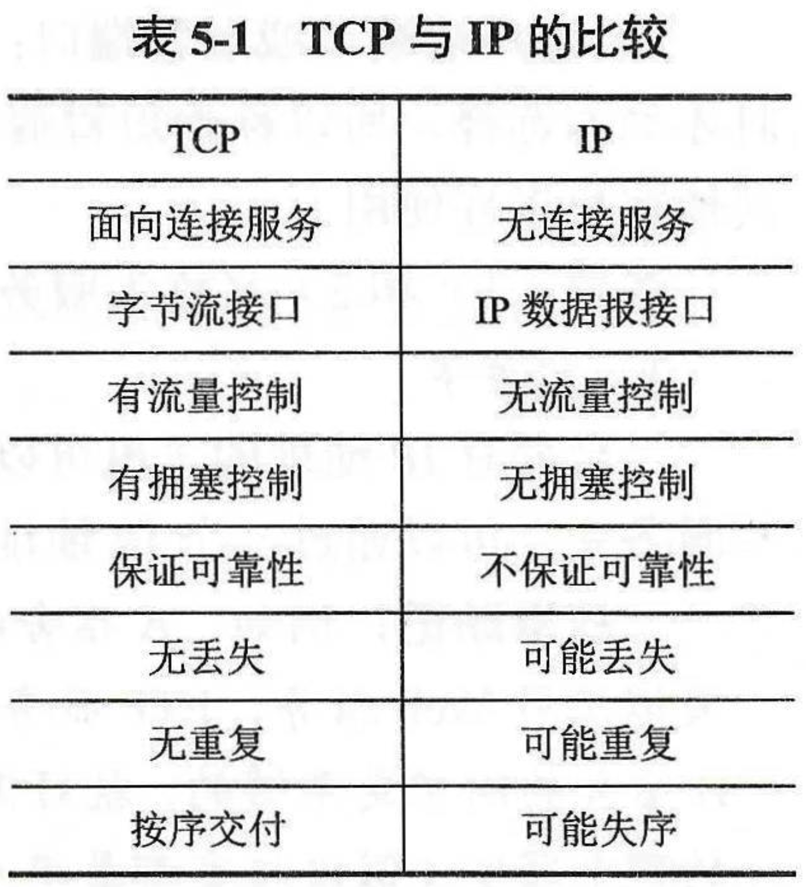
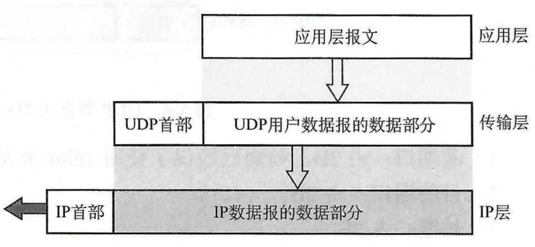
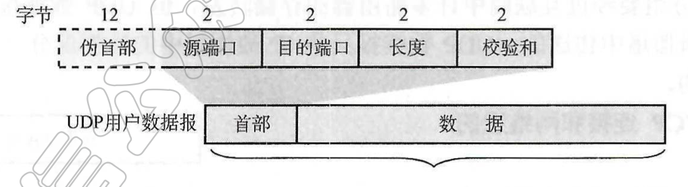
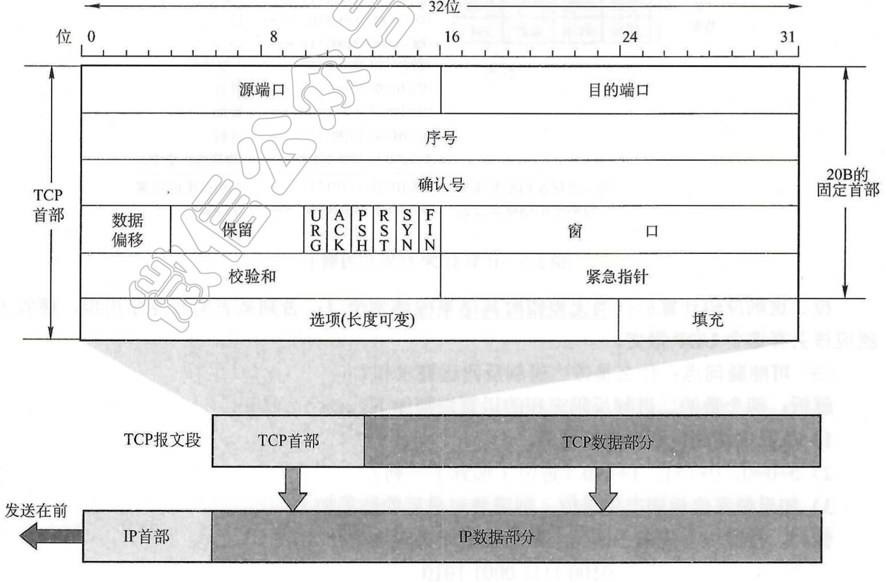

# 传输层概述

传输层为两台主机提供应用进程之间的通信，==端到端通信==。

**疑问点：既然 UDP 不可靠，为什么说传输层可靠？**

**解析：**因为传输层是优化了数据链路层和网络层，比这两个至少靠谱。==UDP是无连接的==。但是 UDP 确实不靠谱。UDP 发现错误后可以选择丢弃，也可以选择向应用层报告错误，由用户自己做选择。TCP 会更靠谱，所以用在传输文件之类上。

## 传输层的功能

1. 提供应用进程间的逻辑通信(网络层提供主机之间的逻辑通信)：逻辑通信意思是不是真正的物理连接，而是通过实际路径串联起来的虚拟路径。==逻辑通信的本质是不给对方展示细节，好像两人之间是直接相连的==
2. 差错检测：网络层只检查 IP 数据报首部，不检查数据部分。而传输层两个都检查。
3. 提供无连接和面向连接的服务：
   - UDP：高效率、无连接、不靠谱。音视频点播等用。
   - TCP：高可靠性，面向连接。FTP 等文件传输要求可靠，用。
4. 复用和分用：复用是发送方不同应用进程都可以使用同一传输层协议传送数据。分用是指接收方剥去报文首部后把正确的数据交付到目的应用进程。

## TCP 和 IP 比较



**疑问：TCP 是面向连接的，但是 TCP 使用的 IP 却是无连接的，怎么理解？**

**解析：**TCP 是面向连接的，也可以是无连接的(使用 IP 网络)。选择无连接网络会更灵活。


## 寻址

数据链路层用 MAC 地址寻址，网络层按 IP 地址寻址，==传输层用端口号寻址==。

==端口号==：同一时刻一台主机由大量网络应用进程，所以用端口号来表示不同的进程。


# 连接服务

- 无连接服务
- 面向连接服务


## 数据报




### 1. UDP 数据报和 IP 分组区别

IP 分组要见过互联网中 各种路由器存储转发，但 UDP 数据报是在端到端的逻辑信道传送的，UDP 数据报就是加了 UDP 首部的 IP 数据报。对路由器不可见。


### 2. TCP 连接和网络层的虚电路的区别

> ==TCB(Transmit Control Block)==
>
> - 记录 TCP 运行中的变量。对于多个连接的 TCP，每个连接都有一个 TCB。
>
> - 结构包括：源端口、目的端口、目的 IP、序号、TCP 状态等。

TCP 报文是在传输层抽象的端到端逻辑信道中传送的，对路由器不可见。TCP 中的连接只是在 TCB 中存储了对端的地址信息，并且记录了连接状态。通过重发之类的来保证可靠传输，比那个没有整整物理连接。虚电路也不是真正物理连接。


# UDP

其实就是在 IP 数据报服务至上增加了端口功能(找进程)和差错检测功能。

### 优点

1. 发送前不需要建立连接。
2. UDP 主机不需要维持复杂的连接状态表。
3. UDP 用户数据报只有 8 个字节的首部开销。
4. 网络拥堵时不会是源主机的发送速率较低(没有拥塞控制)。
5. 支持一对一、一对多、多对一和多对多交互通信。


## 数据报组成



有两个字段：数据字段和首部字段。首部字段 8 个 Bit。有

- 源端口
- 目的端口
- 长度(描述 UDP 数据报长度)
- 校验和：==检验范围：伪首部、UDP 数据报首部和数据==。如果有错直接丢弃，也可以选择不检验(全填0)。


## UDP 校验

只提供差错检测。计算校验和时，在 UDP 用户数据报之前临时加上 12B 的伪首部。==伪首部有：IP 地址、目的 IP、全 0 字段、协议字段、UDP 长度字段==。**伪首部只用来验证校验和，不进行传输。**


# TCP

## TCP 报文首部



1. 源端口和目的端口
2. `序号 seq`：TCP 传输的是字节流，要编号才能保证==按序交付==。
3. `确认号 ack`：
4. 。。。
5. `紧急比特 URG`：URG=1 时，表示时紧急的报文。类似于救护车在路上不用等红灯，直接走。等救护车过去了，其他依旧排队进行。
6. `确认比特 ACK`：ACK=1 时，确认号字段才有效。ACK=0则无效。所以一旦连接建立了，所有报文段把 ACK=1。
7. `推送比特 PSH`：TCP 收到 PSH=1 的报文，就尽快交付给接收的应用进程，不再等到整个缓存都填满后再向上交付。
8. `复位比特 RST`：当 RST=1 时，表明 TCP 连接中出现严重差错(主机崩溃等)，必须释放连接，然后在重新建立传输连接。
9. `同步比特 SYN`：SYN=1 时表示这是一条连接请求或连接接收报文。
10. `终止比特 FIN`：FIN=1 时表示发送端的数据发送完毕，要求释放传输连接。

。。。感觉不重要


> ==PSH 和 URG 都是紧急标识，有什么区别？==
>
> TCP 一般是要等到整个缓存都填满了再向上交付。
>
> 如果 `推送比特 PSH=1` 不用等到整个缓存填满就直接向上交付。
>
> 如果 `紧急比特 URG=1` ，表示从数据第一字节到当前字节就是紧急数据，不经过缓存区，直接交付。优先级更高些。


## TCP 连接管理

TCP 的传输连接分为三个阶段：连接建立、数据传送和连接释放。

TCP 连接和建立都是采用客户/服务器方式。主动发起建立的应用进程 叫客户(Client)，被动等待连接建立的应用进程叫服务器(Server)。

### 三次握手


1. `Client A` 向 `Server B` 发出连接请求报文段。其中首部的同步为 `SYN=1 seq=x` 表明传送数据时的第一个数据字节的序号 `seq=x` 。
2. `Server B` 收到数据报，从 `SYN=1` 得知是一个建立连接的请求，同意则发回确认。`Server B` 发送确认报文时，使 `SYN=1 ACK=1` ，确认号是 `ack=x+1` ，序号 `seq=y` 。
3. `Client A` 收到报文段后向 `Server B` 发出确认。`ACK=1` ，确认号 `ack=y+1` 。`Server B` 收到后，也通知其上层应用进程，已经连接成功。`ACK` 报文可以携带数据，如果不携带数据则不消耗序号。==此时没有同步比特字段==


### 四次挥手


数据传输结束后，双方都可以释放连接。

1. `Client A` 向 `Server B` 发出连接释放报文段，并==停止再发送数据，主动关闭 TCP 连接==。报文段中 `seq=u FIN=1` ，等待 B 确认。

   > 注意：TCP 是双工的，两条数据都在这个连接上跑动。所以当 FIN 的时候，发送 FIN 的一端就不能再发送数据了，关闭了它的那条数据通路，但对方可以发送。
   
2. `Server B` 通知自己的高层应用进程，发送给 A 报文段中 `seq=v ack=u+1`。从 A 到 B 的连接就释放了，TCP 连接处于半关闭状态。

3. `Server B` 可以继续发送些数据。如果 `Server B` 没什么要发给 A 的数据了，B 的应用进程就通知 TCP 释放连接。

4. `Client A` 收到释放报文段后，必须发出确认。报文段中，`ACK=1 ack=w+1 seq=u+1` 。 

==注意：TCP 连接必须经过 2MSL(2 Maximum Segment Lifetime 报文最大生存时间) 后才真正释放。==


### 问题汇总

#### 1. 为什么 TCP 连接每次不选择相同的、固定的初始序号？

1. 假设 A 和 B 频繁建立连接，传递 TCP 报文段，再释放连接。
2. 每次连接时，如果主机 A 都选择相同、固定的初始序号 1 。
3. 如果某些 TCP 报文段因为网络问题滞留，导致 A 超时重传了这个报文。
4. 滞留的报文段终于到达 B，但这个报文段的连接早就释放了，正在建立的是新的 TCP 连接。

这种情况下，==B 发现不了这是旧的、没有意义的报文段，因为这个序号有可能刚好处在新连接所使用的序号范围内，会导致错误。==

#### 2. 为什么是三次握手？

==三次握手最重要的功能就是彼此都知道对方准备好了，协商好双方的初始序列号。==

如果两次握手，B 没有传给 A 他的初始序号，A 就会忽略 B 发来的任何数据分组，只等待连接确认应答分组。B 在超时后，一直重复发送同样分组。==形成死锁== 


####  3. 为什么是四次挥手

如果是三次挥手，没有最后一次 A 发送最后一个确认数据报给 B，或者如果 A 不等待 2MSL。A 已经关闭，不重传，但是 B 一直在等待确认，不能正常进入关闭状态。


## TCP 可靠传输

### 滑动窗口机制

==只有在接受窗口向前滑动时(此时同时也发送了确认)，发送窗口才有可能向前滑动==

> 为什么不管发送窗口多大，只要当接受窗口为 1 时，可保证帧按序接收？
>
> **解析：**因为接受窗口为 1 ，所以里面有一个唯一的帧序号，不管发送窗口一次性可以发送多少字节，接收窗口只能选择接受窗口里的帧序号接受，只有等到该帧，接受窗口才能往后移动，所以按照这个顺序接受的帧一定是有序的。


规则：

1. 凡是已经发送过的数据，在未收到确认之前，都必须暂时保留，用来超时重传。
2. 发送方收到了接收方的确认报文后，发送方窗口才可以向前滑动对应序号。
3. 发送方发送的数据经过一段时间后没有收到确认要用到 `Go Back N` 协议回退到最后接收到确认号的地方。


### ARQ 协议

ARQ 协议，即自动重传协议(Automatic Repeat-reQuest)。通过使用**确认**和**超时**两个机制来达到。

#### 停止等待 ARQ

> **确认帧**：没有数据部分的控制帧，用来告诉发送方某帧以及接收到了。
>
> 可靠传输就是通过**确认帧和超时重传**两个机制来共同完成的。
>
> 有时为了提高效率，将确认捎带在一个回复帧中，称为捎带确认。
>
> **累计确认**：接收方每收到 K 个帧就发一个 ACK 告知发送方我已经收到前 K-1 帧并期待第 K 帧。如果累计时候第一帧超时了这种情况，就会单独发送超时帧的 ACK，以免对方一直发送。

停止等待协议的基本思想：发送方传输一个帧后，等待对方的确认才能发送下一帧，如果超时，重新发。

这种情况下可能发生两种错误：

1. 发送数据帧被破坏或丢失：接收方差错检测时发现后直接丢弃。这时，要等待超时后，发送方重发，知道数据帧无错误，接收方返回接受帧。
2. 确认帧被破坏或丢失：发送方没收到回应，会一直发送。但是接收方也会不断发送确认帧。接收方会收到很多个相同的帧，为了判断是新帧还是重复帧，每个帧头部都有序号，进行识别。注意：确认帧也有序号。

              


#### 连续 ARQ 协议

停止等待 ARQ 协议对信道利用率太低，我们可以利用连续 ARQ 改善这个问题。这个协议会连续发送一组数据包，然后等待这些数据包的 ACK。

连续 ARQ 协议结合滑动窗口来使用的。


以 5 个为一个分组连续发送出去，发送方每收到一个确认都把滑动窗口向前滑动一个分组的位置。上图也就是说，已经发送了前 5 个分组，收到了第 1 个分组的确认，准备发送第 6 个分组。

==这种累积确认的缺点是：不能正确向发送方反应出一句正确收到的分组信息。比如第 3 分组丢失了，这是接收方只能反馈前 2 个确认。所以发送方只能把后面 3 个分组都重传一次，这叫 Go-back-N(回退 N)。==


#### 选择重传协议

在上面的基础上，为了不 `Go back N` ，我们用缓冲区存入后面有序的帧，如果前面的帧失序到达，一起按序交付。


### 问题汇总

#### 1. TCP 传送数据时，如果有一个确认报文段丢失，会不会一定重传？

在累计确认中不一定。比如发送了1、2、3、4、5，但是 3 丢失了，会返回 ACK3 来期待收到3，但是累计确认会过一段时间去确认。当收到这个 ACK3 的时候有可能 3 因为网络原因已经到达了。接收方又发送了一个 ACK6 ，表明全收到了，所以就不许需要重发了。

#### 2. TCP 和 UDP 都需要计算往返时间 RTT 么？

UDP 不要，UDP 没有确认和重发机制。 


#### 3. 在一个很靠谱的链路段中，TCP 会不会显得多余？

不会。TCP 的可靠交付至关重要，必不可少。

1. 每个 IP 数据报都独立选择路由，所以到达时可能失序。
2. 由于路由选择计算错误可能导致 IP 报在互联网转圈，最后因为生存时间的原因丢失。
3. 当某个路由器出现大通信量时，路由器来不及处理到达的数据报也会造成丢失。

所以网络层的 IP 协议很容易出错，只能靠 TCP 来靠谱交付。


## TCP 流量控制


1. TCP 为每个连接都设有持续计时器。只要接收方收到对方的零窗口通知，就启动持续计时器。如果持续计时器设置的时间到期，就发送一个零窗口探测报文段(1 B 数据量)，而对方就在确认这个探测报文段时给出现在的窗口值。如果窗口


# HTTP 首部

```js
你说一下HTTP首部有哪些(一共说了20多个),content-Type你平常post是什么，我说基本都是 formdata
```

> ==代理服务器==
>
> 代理服务器是介于浏览器和 Web 服务器之间的服务器。客户端不是直接去服务器取到页面和交互信息，而是向代理服务器发送请求。代理服务器类似于一个大 `Cache` 池。不断取得新数据包存到本机的存储器。好处是提高浏览速度和效率。
>
> ==当代理服务器收到资源请求，先去自己的 `Cache` 池中看，如果有就不需要向源服务器请求。==

HTTP 首部是 `Cache-Control` 。除去请求行和状态行的剩余部分统称为请求报头。

通过这些 `Cache-Control` 填充指令能操纵缓存的工作机制，指令间用 `,` 隔开。

### 通用首部字段

- `public` 和 `private`：服务器使用此指令，`public` 时，其他用户也可以利用服务器发来的缓存，`private` 时缓存服务器只会对特定用户提供缓存服务，对其他用户发来的请求，代理服务器不会返回缓存。
- `no-cache` ：客户端使用此指令时表示不要代理服务器缓存，这是为了防止代理返回已经过期的资源。服务器使用时，表示代理不能对资源进行缓存，而且禁止对响应资源进行缓存操作。
- `no-store` ：表示请求或响应中有机密信息，不能缓冲请求或响应的任意部分。`no-store` 才是真正意义的不缓存，`no-cache` 只是不缓存过期资源。
- `max-age` ：客户端设置表示缓存资源的最长生存时间，`http 1.1` 中如果出现 `expires` 会优先处理 `max-age` ，忽略 `expires` 。`http 1.0` 相反。==超过时间时，如果向服务器发送新请求失败了，还是返回缓存数据==。
- `min-fresh` ：==只能客户端设置==。表示缓存资源时间没有超过该值时可以直接返回。
- `max-stale`：客户端在==请求==中设置，在响应中设置无效。表示客户端可以接收超出 `max-age` 时间的响应消息，否则服务端重新发起请求。==所以同时使用 `max-fresh` 和 `max-stale` 时，缓存时间可以是两者之和。==
- `on-if-cached` ：客户端仅仅在缓存服务器缓存目标资源的情况下才会要求其返回。
- `Date` ：创建该报文的时间。


### 请求首部字段

这些字段用来补充请求附加信息。

- `Accept` ：通知服务器，客户端能处理的媒体类型和相对优先级。有很多格式。优先级从 `0-1` 。
- `Accept-Charset` ：通知服务端支持的字符集和优先顺序。
- `Accept-Encoding` ：通知服务器支持的内容编码。
- `Accept-Language` ：支持的语言集和优先级。
- `Authorization` ：填写用户代理的认证信息。如果请求时返回 `401(Noauthorized)` 会把这个字段放入请求中。
- `Host` ：重要。告诉服务器，请求的资源所处的互联网主机名字和端口号。
- `Range` ：资源的范围。


### 响应首部字段

用于补充响应的附加信息、服务端信息以及客户端的附加要求等。

- `Accept-Ranges` ：告诉客户端能处理的范围。
- `Age` ：告诉客户端，服务器在多久之前创建了响应。如果是代理服务器创建的响应。`Age` 就是指缓存的响应再次发起到认证完成的时间。


### 实体首部字段

- `Content-Type` ：申明主体对象的媒体类型，和 `Accept` 填入格式相同。
- `Content-Encoding`
- `Content-Language`

