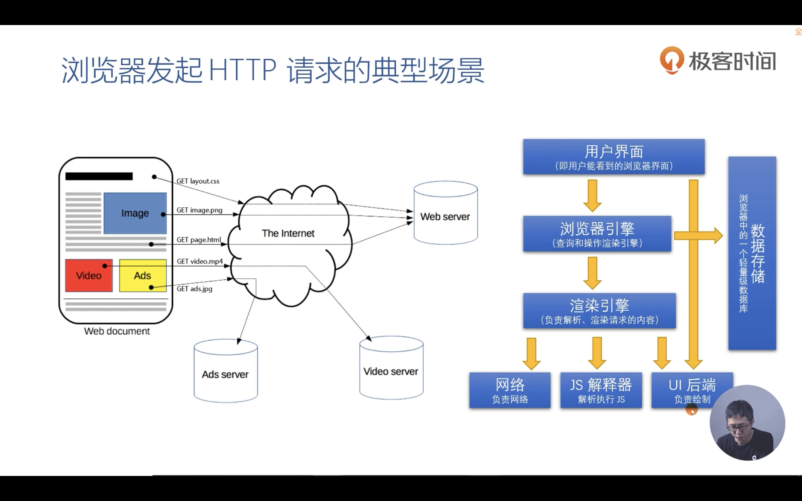
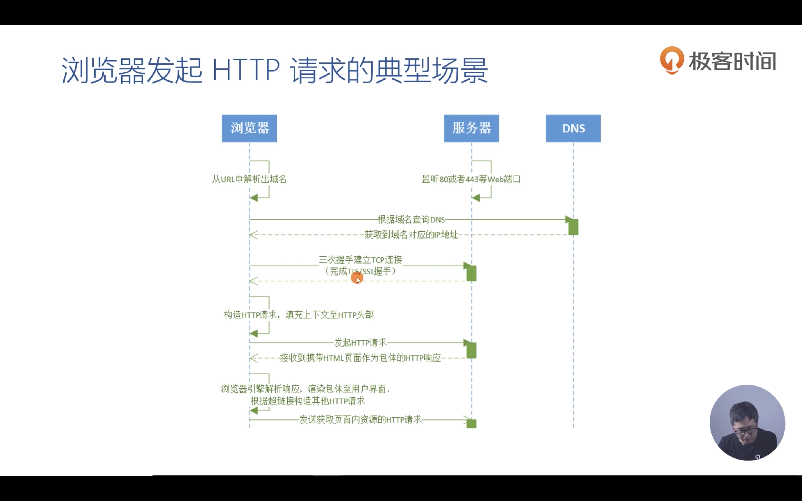
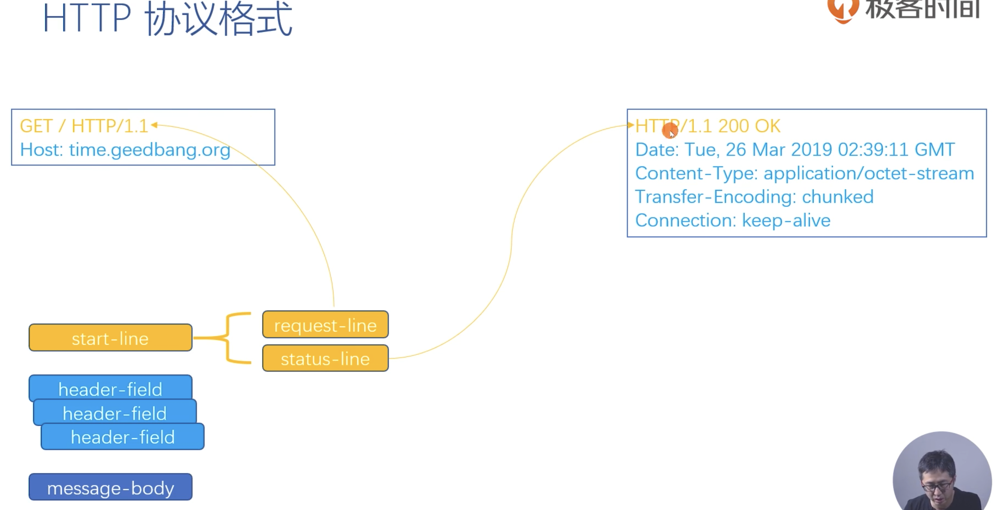
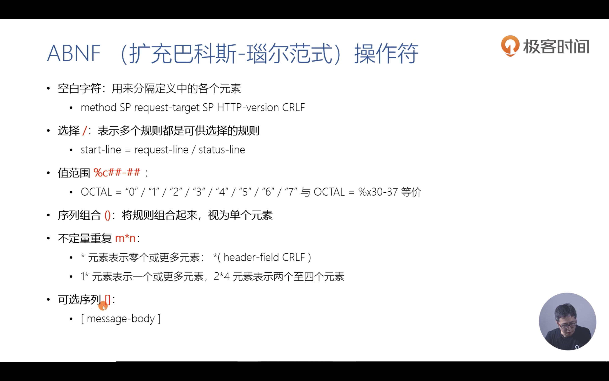
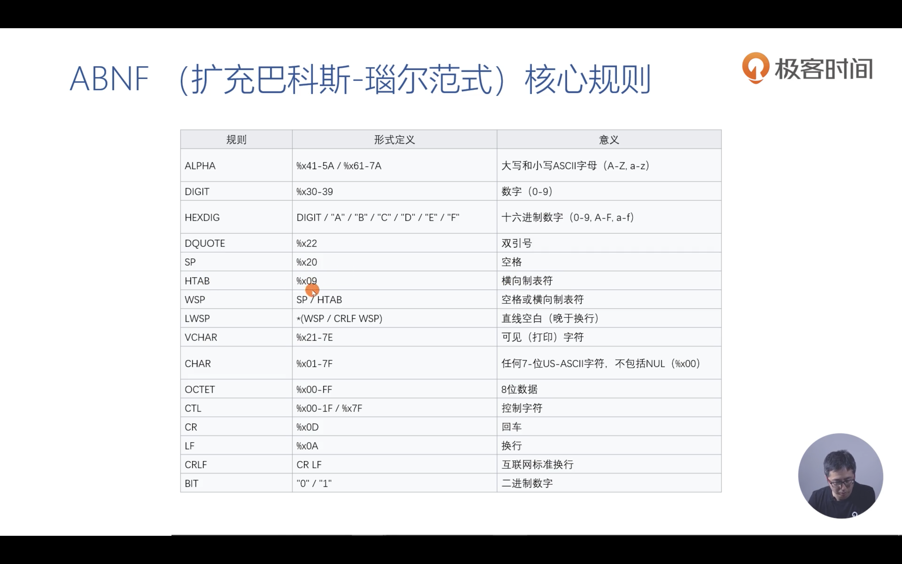

# 内容概述

# HTTP 请求

**浏览器响应 HTTP 请求的过程：**

1. 用户在界面输入 URL，输入过程中，浏览器引擎通过自己的轻量数据中的历史记录查询来联想填充完整 URL，等待用户敲回车。
2. 浏览器调用渲染引擎，首先发送第一个请求，通过网络模块。然后加载 HTML。HTML 中有很多 JS 文件的超链接。
3. 通过这些超链接，发起新的请求，获取 JS 文件。
4. 获得完整内容后，通过 UI 后端绘制完整的内容。

**内部具体运作：**

1. 浏览器从 URL 中解析域名：根据域名查询 DNS，获取到域名的 IP 地址。
2. 浏览器和对应服务器三次握手建立 TCP 连接，**如果是 HTTPs 协议，需要完成 TLS/SSL 握手。**
3. 构造 HTTP 请求，填充上下文和头部。
4. 向服务器发送 HTTP 请求，接收到 HTML 页面作为 HTTP 响应。
5. 浏览器引擎解析这个 HTML，根据其中的超链接发送其他 HTTP 请求（图片、JS 文件、视频等）。

## HTTP 协议

Hypertext Transfer Protocol 超文本传输协议。

**无状态、应用层的、以请求/应答方式运行的协议。可以传输图片、视频、音频等大文档文件。**

## HTTP 协议格式

**ABNF 规则**

