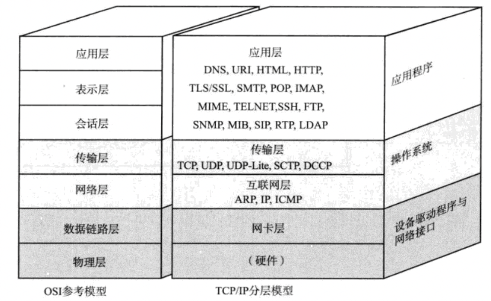
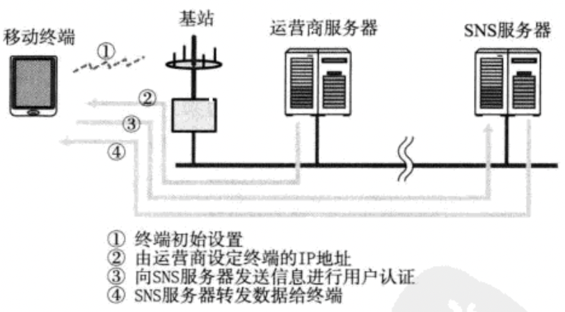

分组交换技术的产生：某一点的通信受阻时，也能通过迂回线路保持通信无阻。

互联网通信时，需要相应的网络协议，TCP/IP 就是互联网的协议。

连接互联网时，需要向 **ISP(Internet Service Provider)** 或区域网提出申请，签约后，接入总网。

# TCP/IP 协议分层模型

OSI 模型注重**通信协议必要的功能是什么**，TCP/IP 模型注重**在计算机上实现协议应该开发哪种程序。**

- **硬件（物理层）**

  主要考虑数据传输媒介（网线/无线）。**注意，TCP/IP 是在网络互联的设备之间能够通信的前提下才被提出的协议。**

- **网络接口层（数据链路层）**

  网络接口层利用以太网中的数据链路层进行通信。类似于电脑上的驱动软件，不装驱动不能使用这些附加的硬件。

- **互联网层（网络层）**
  
  
- 互联网层使用 IP 协议，基于 IP 地址转发分包数据。
  
- **连接互联网的主机和路由器必须要实现 IP 功能。其他连接设备（网桥、中继器或集线器）不需要具备 IP 或 TCP 的功能。**
  
  - **注意：IP 协议不具有重发机制。即使未到达对端主机也不会重发，所以是非可靠性传输协议。**
  - ICMP：IP 数据包途中发送异常未到达对端地址时，用 ICMP 给发送端发送一个异常通知。ICMP 还能用来诊断网络的健康状况。
  
- ARP：将 IP 地址解析为物理地址（MAC 地址）的一种协议。
  
- **传输层**

  

  - 最主要的功能：让应用程序之间实现通信。通常计算机内部多个程序在运行，**所以用端口号来识别应用程序。**=> 通过端口号找到对端主机的具体应用程序。
  - **TCP：是面向有连接的传输层协议。**它能正确处理传输过程中的丢包、传输顺序错误等，也能有效利用带宽，缓解网络拥堵。**为了提高网络利用率，TCP 协议不利于视频会议（音视频的数据量既定）等场合。**
  - **UDP：面向无连接的传输层协议。**不关注对端是否收到了数据，常于分组数据较少或多播、广播通信以及视频通信等多媒体领域。

- **应用层（会话层及以上）**

  

  - **WWW：浏览器和服务端之间通信使用 HTTP 协议。**主要传输的是 HTML 格式，WWW 中的 HTTP 协议属于 OSI 应用层协议，HTML 属于表示层协议。

## TCP/IP 中几种表示层协议

- 电子邮件：MIME 协议，属于表示层，能发送声音、图像等各种信息。
- 文件传输（FTP）：指将保存在其他计算机硬盘上的文件转移到本地的硬盘中，采用二进制或文本方式传输。**FTP 传输时，会建立两个 TCP 连接，分别是发出传输请求时所要用到的控制连接和实际传输数据时所要用到的数据连接。**
- 远程登录（TELNET 和 SSH）：
	
	
- 网络管理（SNMP）：
	

# TCP/IP 通信示例

## 1. 数据包首部

每个分层都会对发送的数据附加一个首部。

## 2. 发送数据包实例

场景：甲给乙发送邮件，内容为“早上好”。计算机 A 向计算机 B 发送电子邮件的过程。

1. 应用程序处理：将内容写好，点击发送按钮后，开始 TCP/IP 通信了。

   - 应用程序进行编码处理（utf8等）=> OSI 表示层功能。
   - 不会立马发出去，因为有些邮件的软件有一次同时发送多个邮件的功能。也可能会有用户点击“收信”按钮以后才接收邮件。=> **属于何时建立通信连接何时发送数据的管理功能** => OSI 会话层功能。
   - 建立 TCP 连接，首先将有用的数据发送给下一层的 TCP，在进行转发处理。

2. TCP 模块处理：TCP 根据指示，负责建立连接、发送数据以及断开连接。

   - 将应用层接收到的数据前端附加 TCP 首部，包括源端口号和对端口号、序号（该包数据在整个数据中的序列号）以及校验和。
   - 将 TCP 包发送给 IP。

3. IP 模块处理：

   - 加上自己的 IP 首包，包含接受端 IP 地址以及发送端 IP 地址，还有判断后面数据是 TCP 还是 ICP 的信息。
   - 由路由控制决定接受此 IP 包的路由或主机，IP 包被发送给连接这些路由器或主机网络接口的驱动程序，实现真正发送数据。
   - 寻找接受端 MAC 地址，找不到利用 ARP 查找。
   - 知道了接收端 MAC 地址和 IP 地址后，交给以太网的驱动程序，实现数据传输。

4. 网络接口（以太网驱动）处理：

   - 加上自己的以太网首部包，包括接收端的 MAC 地址、发送端 MAC 地址，以太网类型、协议等。
   - 加上 FCS(Frame Check Sequence)，用来判断数据包是否由于噪声被破坏
   - 通过以太网电缆传给对方的数据链路层。

   

## 3. 数据包的处理

每个包至少包括两个信息：发送端和接收端的地址，以及上一层的协议类型。

## 4. 手机网络示例

手机在首次开机时，已经由通信运营商设定了具体的 IP 地址。每次通过微信等应用程序发送文本动画时，都是 TCP/IP 连接。 

