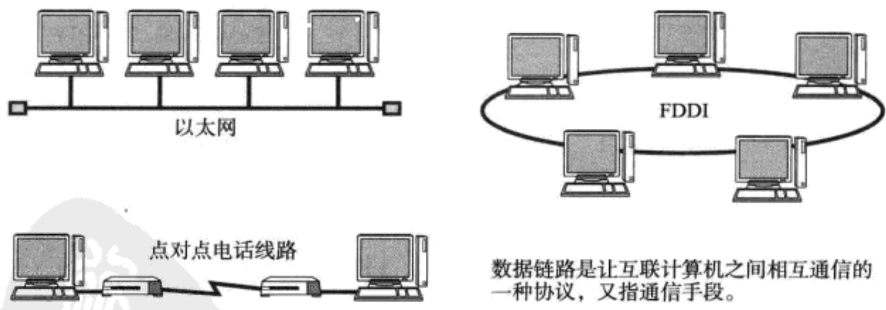

# 主要内容

- **相关技术**：MAC 寻址、介质共享、分组交换、非公有网络、环路检测、VLAN(Virtual Local Area Network) 虚拟局域网
- **相关传输方式**：以太网、WLAN(Wireless Local Area Network) 无线局域网、PPP(Point to Point Protocol) 点对点协议
- **相关协议**：FDDI(Fiber Distributed Data Interface) 光纤分布式数据接口

# 基本概念

## 数据链路的段

**数据链路的段是指一个被分割的网络**。引入中继器将两条网线相连组成一个网络。

## 网络拓扑

**网络的连接和构成的形态**。

# 相关技术

## 1.1 MAC 地址

在总线型和环路型网络中，先暂时获取所有目标站的帧，然后通过 MAC 寻址方式，如果是自己就接收，不是就舍弃。

**MAC 地址不是唯一的，只是在同一个数据链路中是唯一的。**

## 1.2 共享介质型网络

> **半双工与全双工通信：**
> 
> - 半双工：只发送或只接收的通信方式，类似于无线电收发器。
> - 全双工：类似于打电话，有交互。

 

设备间使用同一个载波信道进行发送和接收。=> **基本采用半双工通信**

共享介质型网络有两种介质访问控制方式：

1. 争用方式：==先到先得== => 所有站点都同时发送帧，导致网络拥堵和性能下降

   - CSMA:

     

   - CD:

     

2. 令牌传递方式：获得令牌(报文)才能发送 => 平等、不冲突、但是网络不拥堵时利用率不能到 100% 。

   

## 1.3 非共享介质网络

**通过交换机转发数据帧。**所以采用全双工通信。

**这种方式的致命的弱点：一旦交换机发生故障，与之相连的所有计算机间都将无法通信！**

## 1.4 MAC 寻址

