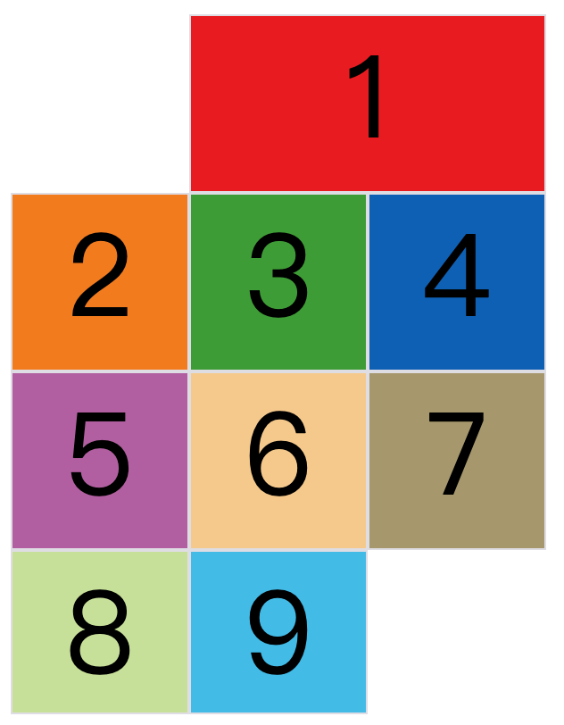

# 参考链接

1. [阮一峰博客](http://www.ruanyifeng.com/blog/2019/03/grid-layout-tutorial.html#h5o-21)

# 基本概念

`grid` 布局属于==二维布局==，它将容器划分为行(row)和列(column)，项目处在单元格中。

==注意，设为网格布局以后，容器子元素（项目）的 `float` 、`display: inline-block` 、`display: table-cell` 、`vertical-align` 和`column-*` 等设置都将失效。==


## 网格线 grid line


水平网格线划分出行，垂直网格线划分出列。所以 `n` 行有 `n+1` 个水平网格线，`m` 列有 `m+1` 个垂直网格线。


# 容器 API

## `display`

```css
display: grid | inline-grid;
```


## `grid-template-rows/columns`

定义每一行或每一列的宽度。


```css
.container{
  display: grid;
  grid-template-columns: 100px 50px 10px; 每一列的宽度, 也可以用 25% 百分比
  grid-template-rows: 10px 20px 30px; 每一行的高度
}
```

### 1. repeat()

```css
.container {
  display: grid;
  /* 参数：1.重复次数 2.重复的值 */
  grid-template-columns: repeat(2, 100px 20px 80px); 说明有6列，三个一组重复
  grid-template-rows: repeat(3, 33.33%);
}
```

### 2. auto-fill 自动填充

`auto-fill` 代表自动填充。==用于固定单元格大小但是不知道有多少个单元格和容器大小。==

```css
.container {
  display: grid;
  grid-template-columns: repeat(auto-fill, 100px); 自动填充100px宽度的列，直到容器无法塞下
}
```


### 3. fr 比例关系

`fr` (fraction 的缩写)。

```css
.container {
  display: grid;
  grid-template-columns: 1fr 2fr; 1fr占1的宽度，2fr占2的宽度，按比例占满。
}
```

例如实现 1:2:3 的栅格布局：

```css
.container{
  display: grid;
  grid-template-columns: 1fr 2fr 3fr;
}
```


当 `fr` 与绝对长度混合使用时，就可以满足固定左侧，右侧自适应这种操作。

```css
.container {
  display: grid;
  grid-template-columns: 150px 1fr 2fr;
}
```


### 4. minmax()

```css
grid-template-columns: 1fr 1fr minmax(100px, 1fr); 100px<=列宽<=1fr 自适应
```


### 5. auto 自适应

```css
grid-template-columns: 100px auto 100px; 代表第二列占满中间剩余空间，除非设置了min-width
```


### 6. 设置网格线名称

```css
.container {
  display: grid;
  /* 可以设置多个名字！！！[c1 row-1] */
  grid-template-columns: [c1 row-1] 100px [c2] 100px [c3] auto [c4];
  grid-template-rows: [r1] 100px [r2] 100px [r3] auto [r4];
}
```


### 7. 实例

1. 两栏布局：

   ```css
   .container {
     display: grid;
     grid-template-columns: 70% 30%;
   }
   ```

2. 传统 12 网格布局

   ```css
   .container{
     display: grid;
     grid-template-columns: repeat(12, 1fr);
   }
   ```


## `(row/column)-gap`

这个 API 之前是 `grid-(row/column)-gap` ，现在最新标准中省略了 `grid-` 。用于设置行与行或者列与列间的间距。

```css
.container{
  display: grid;
  row-gap: 20px;
 	column-gap: 30px;
  /* 用grid-gap简写 */
  gap: <grid-row-gap> <grid-column-gap>; 省略第二个代表两个相同
}
```


## `grid-template-areas`

用于指定区域：

```css
.container {
  display: grid;
  grid-template-columns: 100px 100px 100px;
  grid-template-rows: 100px 100px 100px;
  grid-template-areas: 'a b c'
                       'd e f'
                       'g h i';
}

2. 多个单元格合并成一个区域的写法：
grid-template-areas: 'a a a'
                     'b b b'
                     'c c c';

3.用.代表该区域不利用，不用到该区域
grid-template-areas: 'a b c'
                     'd . f'
                     'g . i';
```

上述区域的命名会对网格线产生影响。例如：`header` 网格区域，这个区域的起始网格线为 `header-start` ，终止网格线为 `header-end` 。


## `grid-auto-flow`

用来指定子元素默认的放置顺序。

            

```css
.container{
  grid-auto-flow: row(Default 先行后列)｜column(先列后行)
    							row dense(紧密型，如果有空余找后面的小元素先补上去)
    							column dense 同理
}
```


## `justify/align-items` 和 `place-items`

==描述的是每个网格内容的对齐状态。=> 对应项目的属性 `justify/align-self`，修饰单个单元格 。==

- `justify-items` ：水平位置(左中右)的排布方式。每个格子内容的左对齐｜居中｜右对齐。如图左。
- `align-items` ：垂直位置的排布方式。每个格子内容的上对齐｜居中｜下对齐。如图右。
- `place-items` ：上面两个的简写 `<align-items> <justify-items>`

     

```css
start：对齐单元格的起始边缘。
end：对齐单元格的结束边缘。
center：单元格内部居中。
stretch：拉伸，占满单元格的整个宽度（Default）。
```


## `justify/align-content` 和 `place-content`

==描述的是整体容器的对齐状态。==

以 `justify-content` 为例，我们看看水平方向的排列方式。


```css
注意一下：
justify-content: space-evenly; 代表都是等距，space-around 边框1倍元素间间距2倍
place-content: <align-content> <justify-content>
```


## `grid-auto-columns/rows`


上面的样式，8 和 9 号盒子用 `grid-row/column-start` 属性被单独指定在第 4 行和第 5 行。我们可以用 `grid-auto-rows/columns` 属性来设置这个单独盒子的行高度和列宽度。

```css
.container{
  display: grid;
  grid-template-columns: 100px 100px 100px;
  grid-template-rows: 100px 100px 100px;
  grid-auto-rows: 50px; 
}
.item-8{
  grid-row-start: 4;
  grid-column-start: 2;
}
.item-9{
  grid-row-start: 5;
  grid-column-start: 3;
}
```

## `grid-template` 和 `grid`

```css
grid-template: <grid-template-columns> <grid-template-rows> <grid-template-areas>
grid: <grid-template> <grid-auto-rows> <grid-auto-columns> grid-auto-flow>
```


# 项目属性

## `grid-column/row-start/end`

     

```css
// 左图效果
.item-1 {
  grid-column-start: 2;
  grid-column-end: 4;
}
// 右图效果，通过container设置flex-auto-flow
.container {
  grid-auto-flow: row dense;
}
```

### `span`

`span` 关键字能够从项目的左边框跨域到 `span` 个网格。


```css
.item-1 {
  grid-column-start: span 2; 从1网格线出发横跨2个网格。
}
```

如果这种设置产生了重叠，用 `z-index` 解决顺序问题。


## `grid-column/row`

这两个属于简写形式。

```css
.item {
  grid-column: <grid-column-start> / <grid-column-end>;
  grid-row: <grid-row-start> / <grid-row-end>;
}

.item-1 {
  grid-column: 1 / 3;
  grid-row: 1 / 2;
}
/* 等同于 */
.item-1 {
  grid-column-start: 1;
  grid-column-end: 3;
  grid-row-start: 1;
  grid-row-end: 2;
}
```


## `grid-area`

可以指定项目的位置。如图，把项目 1 放在 e 的位置。


```css
#container{
  display: grid;
  grid-template-columns: 100px 100px 100px;
  grid-template-rows: 100px 100px 100px;
  grid-template-areas: 'a b c'
                     'd e f'
                     'g h i';
}
.item-1 {
  background-color: #ef342a;
  grid-area: e;
}
```


==`grid-area` 还可以作为 `grid-row-start / grid-column-start / grid-row-end / grid-column-end` 的简写==


```css
.container {
	display: grid;
  grid-template-columns: repeat(3, 100px);
  grid-template-rows: repeat(3, 100px);
}
.item-1 {
  grid-area: 1 / 1 / 3 / 3;
}
```


## `justify/align-self` 和 `place-self`

单元格的内容的水平垂直排布：start｜end｜center｜stretch(Default)。

```css
place-self: <align-self> <justify-self>;
```


