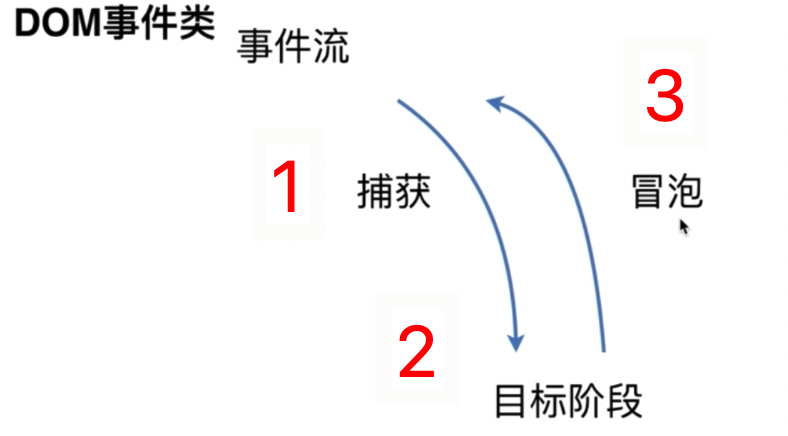

## DOM 事件级

| DOM0     | Element.onclick = function(){}                             |
| -------- | ---------------------------------------------------------- |
| **DOM2** | **Element.addEventListener('click', function(){}, false)** |
| **DOM3** | **Element.addEventListener('keyup', function(){}, false)** |

**true 表示捕获阶段触发，false 表示冒泡阶段触发，默认 false。**

## DOM 事件模型


## DOM 事件流

比如，鼠标点击，是怎么传入到页面上的，通过事件流。

1. 第一阶段是捕获，**捕获 click 等事件。**
2. 第二阶段是目标阶段，**事件从捕获到达目标元素。**
3. 第三阶段是冒泡，**事件从目标元素上传到 window 对象。**



**描述 DOM 事件的捕获具体流程：**

js 表示 HTML 节点：`document.documentElement`。


## Event 对象常见应用

- `event.preventDefault()` ：阻止默认事件，比如 `<a>` 如果绑定 click 事件，设置阻止默认，会不发生跳转。

- `event.stopPropagation()` ：**阻止冒泡事件发生。**子元素和父元素同时有 click 事件，点击子元素只产生子元素的效果，就需要设置阻止冒泡

- `event.stopImmediatePropagation()`：**关于事件响应优先级。**当一个元素绑定了两个点击事件时，如果想要第一个作为优先级，可以添加这个方法，使得执行点击事件时，只进行当前优先的事件，不做其他的。

  ```js
  son.addEventListener('click', function (e) {
    e.stopImmediatePropagation();
    this.style.backgroundColor = 'black';
  }); // 只执行这个事件
  son.addEventListener('click', function (e) {
    this.style.width = '300px';
  }); // 这个事件不执行
  ```

- `event.currentTarget` 和 `event.target` 。事件委托：

  - ul 有很多 li 需要被点击时，不可能 for 循环来让所有的 li 都绑定上事件，这时需要用到事件委托，绑定在父元素上，用到 `event.target` 来获取到具体点击的是哪个 li。
  -  `event.target` 表示当前被点击的元素——上述的小 li。
  - `event.currentTarget` 表示当前绑定事件的元素——上述的父元素。

  ```js
  const ul = document.querySelector('ul');
  const lis = document.querySelectorAll('li');
  ul.addEventListener('click', e => {
    for (let k of lis) {
      k.style.color = 'black';
    }
    e.target.style.color = 'red';
  });
  ```


## 自定义事件

```html
<div class="textArea">test</div>
<script>
  const textArea = document.querySelector('.textArea');
  // 1.自定义事件
  const changeText = new Event('custome');
  textArea.addEventListener('custome', function () {
    this.innerHTML = Math.random();
  });
  setInterval(() => textArea.dispatchEvent(changeText), 500);
</script>
```

`CustomEvent` ：第二个参数可以指定自定义的参数，其他用法和 `Event` 一模一样。


