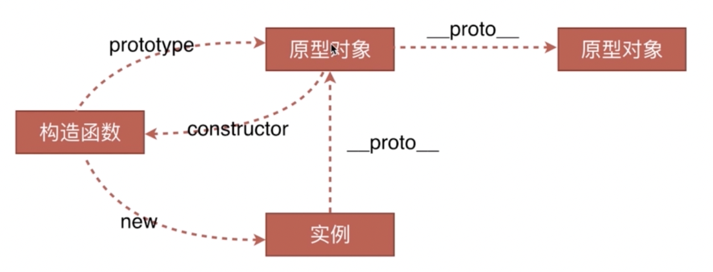
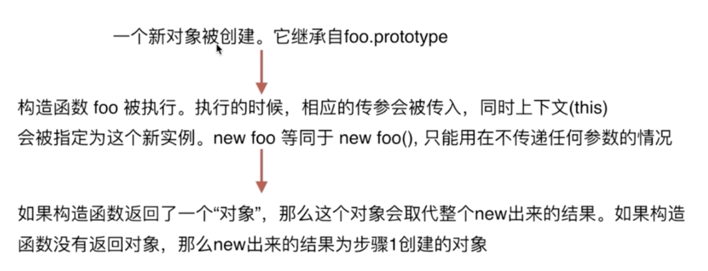

# 问题

1. 创建对象有几种方法?
2. 原型、构造函数、实例、原型链
3. instanceof 的原理
4. new 的过程


# 1. 创建对象的方法

```js
// 1 => 原型链指向 Object
let a1 = { name: 'lalala' };
const a11 = new Object({name: 'hehehe'});
// 2 => 原型链指向 A
let B = function(name){this.name = name};
let b = new B('lalala');
// 3 输出：Object{}, 无法直接看到name属性，但是可以得到 p.name = 'lala'
let C = {name: 'lala'};
let c = Object.create(C);
```

**`Object.create()` 和其他两种不一样，不能直接拿到属性。因为这个方法创造的对象是通过原型链连接的。**

```js
// 上面c和C的关系：
c.__proto__ = C;// C就是原型对象
c本身没有C的属性，是通过原型链往上找到name这个属性的。
```


# 2. 原型链



- 实例：上述 o1、o11、b 都属于实例，**只要是个对象就是实例。**
- 构造函数：凡是通过 new 来操作，后面的函数就是构造函数。

上述过程描述：

```js
let B = function (name) {this.name = name;};
let b = new B('lalala');

// 1.原型对象包括constructor和__proto__
>> B.prototype => 原型对象
<< 对象：{constructor: f(name), __proto__: Object}

// 2.构造函数指向了函数本身
>> B.prototype.constructor === B
<< true

// 3.实例的__proto__指向构造函数的原型对象
>> b.__proto__ === B.prototype
<< true

// 4.在原型对象上增加方法，不同实例共有。=> 通过原型链往上查找
__proto__能访问到上一级的原型对象。
```


**注意：**

1. 函数才有 `prototype` ，对象没有！

2. 只有实例对象有 `__proto__` 方法，函数也是对象！

   ```js
   B.__proto__ === Function.prototype // true
   ```


## `instanceof` 原理


原理：判断  `instanceof` 左边的实例对象的 `__proto__` 和右边的构造函数的 `prototype` 是否指向同一个引用。**(只要是在原型链上，都返回 true)**

```js
>> b instanceof B
<< true
>> b instanceof Object
<< true
```

这种情况下，实际 b 也是 Object 的实例对象。如何查看具体 b 是谁的构造出来的实例呢？ **这种方式更严谨。**

```js
>> b.__proto__.constructor === B
<< true
```

**实现 `instanceof`** :

```js
 function instanceof(L, R){
   const O = R.prototype;
   L = L.__proto__;
   while(true){
     if(L === null) return false;
     if(O === L) return true;
     L = L.__proto__;
   }
 }
```


# new 运算符



**实现 new 过程**

```js
// 构造函数
const func = function(){};
// new 过程
const new1 = function(func){
  // 1.创造一个新对象，继承自func.prototype
  const o = Object.create(func.prototype);
  // 2.执行func并转移this的上下文到o对象
  const k = func.call(o);
  // 3.判断k是否是对象，如果是直接返回k；不是就返回o
  if(typeof k === 'object') return k;
  else return o
}
```


# 面向对象问题

## 继承

**继承的本质就是原型链**

**继承的几种方式：**

1. ES5 借助构造函数实现继承。

   ```js
   function Dad(){
   	this.name = 'Dad'
   }
   function Son(){
   	Dad.call(this); // 实现继承
     this.username = 'Son';
   }
   ```

   - 为什么能实现继承：将父函数的 this 指向子函数。

   - **缺点：**Parent 上原型链上的方法没法继承到，只能继承到构造函数中的方法。**因为**

2. 借助原型链实现继承：

   ```js
   function Dad(){
   	this.name = 'Dad'
   }
   function Son(){
     this.username = 'Son';
   }
   Son.prototype = new Dad();
   // 此时，Dad是Son的原型对象
   Son.__proto__ = Dad
   ```

   **缺点：**实例对象间不隔离。原因：实例的原型链上的原型对象是共用的，都是引用同一个  `new Dad()` 实例。

   ```js
   function Dad() {
     this.name = 'dad';
     this.arr = [1, 2, 3];
   }
   function Son() {
     this.username = 'son';
   }
   Son.prototype = new Dad();
   
   const son1 = new Son();
   const son2 = new Son();
   son1.arr.push(4);
   console.log(son2.arr); // [1,2,3,4]
   ```

   **改进方式：**

   ```js
   function Dad(){
   	this.name = 'Dad'
   }
   function Son(){
     Dad.call(this);
     this.username = 'Son';
   }
   Son.prototype = new Dad();
   ```

   **仍然有缺点！**父函数执行了两次。

   **继续改进：**

   ```js
   function Dad(){
   	this.name = 'Dad'
   }
   function Son(){
     // 拿到构造体内的属性
     Dad.call(this);
     this.username = 'Son';
   }
   // 拿到原型链上的属性和方法
   Son.prototype = Dad.prototype;
   ```

   **还是有缺点！**

   ```js
   // 上面的问题，实例函数的constructor应该指向Son，但是实际指向了Dad，因为Son的原型对象就是Dad原型对象的引用。
   let son = new Son();
   console.log(son.constructor); // func Dad 
   ```

   **本质原因：`Son.prototype` 拿到的是 Dad 的实例或者是 `Dad.prototype` 的引用，都不是自己有一个新的构造函数。**

   **解决 => 自己去构造 `Object.create()` ，并且这个方法有一个好处，作为一个中间对象，还能拿到 Dad 的原型链。**

   ```js
   function Dad(){
   	this.name = 'Dad'
   }
   function Son(){
     // 拿到构造体内的属性
     Dad.call(this);
     this.username = 'Son';
   }
   // 拿到原型链上的属性和方法
   Son.prototype = Object.create(Dad.prototype);
   ```

   `Object.create()` 方法用于创建一个新对象。**被创建的对象继承另一个对象的原型**， 在创建新对象时可以指定一些属性。

**继续改进！**虽然是成功创建了一个新的原型对象，使得修改数组的时候，两个实例之间不会受影响，但是 `son.constructor === func Dad` 。因为

```js
// 这种情况能满足 __proto__ 原型链正确
son.__proto__ === Son
// 但不能满足 constructor 正确
son.constructor === Dad
```

修改方法，覆盖 `constructor`

```js
function Dad(){
	this.name = 'Dad'
}
function Son(){
  // 拿到构造体内的属性
  Dad.call(this);
  this.username = 'Son';
}
// 拿到原型链上的属性和方法
Son.prototype = Object.create(Dad.prototype);
// 覆盖 constructor
Son.prototype.constructor = Son;
```

**上面就是完美写法。**


