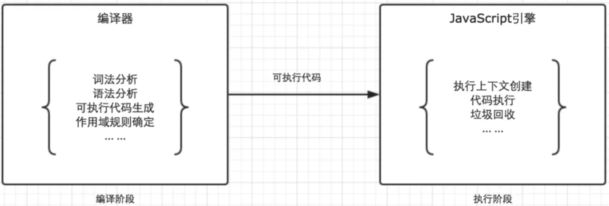
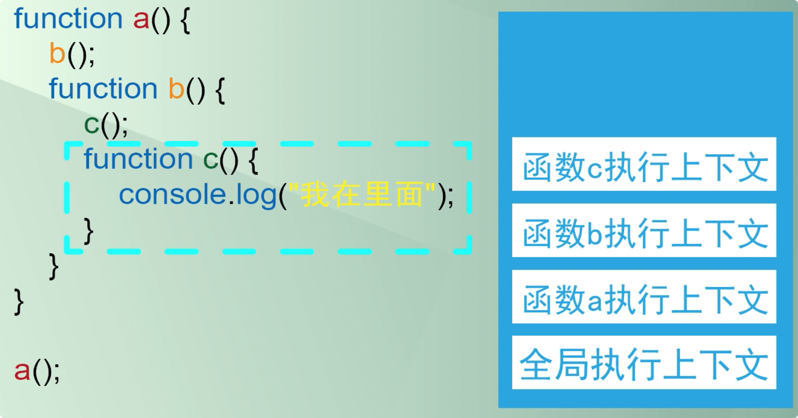
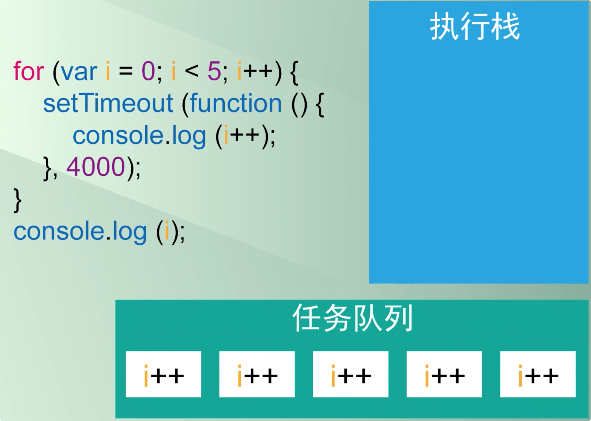

# 1. 0.1 + 0.2 === 0.3？

JS 遵循 IEEE 754 标准，通过 64 位来表示一个数，所以存在最大值，超过最大值发生截断。

加法计算先要转成二进制，0.1 和 0.2 转成二进制都是无限循环的，但是 JS 的数有最大数字，超过就截断。截断之后再进行加法运算，所以存在精度损失。

## 解决办法

1. 将数字转成整数。将小数乘相应倍数变成整数，例如：0.076 => 76；

   ```js
   function add(num1, num2) {
    const num1Digits = (num1.toString().split('.')[1] || '').length;
    const num2Digits = (num2.toString().split('.')[1] || '').length;
    const baseNum = Math.pow(10, Math.max(num1Digits, num2Digits));
    return (num1 * baseNum + num2 * baseNum) / baseNum;
   }
   ```

2. 用库。

## 参考

1. https://juejin.cn/post/6844903680362151950

# 2. instanceof、constructor、Object.prototype.toString

## 1. 实现 `instanceof`

```js
instanceof (A,B) = {
    var L = A.__proto__;
    var R = B.prototype;
    if(L === R) {
        //A的内部属性__proto__指向B的原型对象
        return true;
    }
    return false;
}
```

## 2. `construtor`

`constructor` 作用是，得知某个实例对象的构造函数是哪个。

```js
var f = new F();
f.constructor === F;// true
```

但是不够可靠，因为 `construtor` 可能发生改变，比如重写 `prototype` 时。**所以为了规范，重写时必须要重新给 `construtor` 赋值。**

所以规范的继承写法中要记得赋值 `construtor`：

```js
function Dad(){
	this.name = 'Dad'
}
function Son(){
  // 拿到构造体内的属性
  Dad.call(this);
  this.username = 'Son';
}
// 拿到原型链上的属性和方法
Son.prototype = Object.create(Dad.prototype);
// 覆盖 constructor
Son.prototype.constructor = Son;
```


## 3. `Object.prototype.toString()`

乍一看以为是把对象转换成字符串的方法，其实不是。这个方法用来 ==精确判断对象的类型==。

```js
Object.prototype.toString.call('') ;   // [object String]
Object.prototype.toString.call(1) ;    // [object Number]
Object.prototype.toString.call(true) ; // [object Boolean]
Object.prototype.toString.call(undefined) ; // [object Undefined]
Object.prototype.toString.call(null) ; // [object Null]
Object.prototype.toString.call(new Function()) ; // [object Function]
Object.prototype.toString.call(new Date()) ; // [object Date]
Object.prototype.toString.call([]) ; // [object Array]
Object.prototype.toString.call(new RegExp()) ; // [object RegExp]
Object.prototype.toString.call(new Error()) ; // [object Error]
Object.prototype.toString.call(document) ; // [object HTMLDocument]
Object.prototype.toString.call(window) ; //[object Window]
```

**值得注意的地方：**

```js
> Object.prototype.toString.call(arr)
< "[object Array]"
> Object.prototype.toString(arr)
< "[object Object]"
```

这里的 `call` 是什么作用呢？JS 对象都继承自 Object ，当我们调用 toString 方法时，首先查找该具体对象是否有这个方法，没有再进入 `prototype` 原型链中查找，最终找到顶端 `Object.prototype` 才停止。例如：`arr.toString()=Array.prototype.toString()` 。但是，通过 `toString.call(arr)` 将 this 指向更改为这个 `arr` ，所以==这句话的意思是把 `Object.prototype.toString` 方法更改 `this` 指向，将方法赋予给 `arr` 让 `arr` 有这个方法，然后再执行==。

## 总结

- `typeof` ：判断基本类型，对于引用类型除了 function 以外都是 object 。
- `instanceof` ：基于原型链，能判断上层构造函数、原型对象等。
- `constructor` ：不可信赖，注意重写时重新赋值。
- `Object.prototyp.toString.call()` ：能准确判断属于具体什么类型的对象。注意加 `call` 。

## 参考

1. https://juejin.cn/post/6844903623231537159


# 3. `Symbol`

`Symbol` 能生成一个全局唯一的值。

```js
var race = {
  protoss: Symbol(),
  terran: Symbol(),
  zerg: Symbol()
}
race.protoss !== race.terran // true
race.protoss !== race.zerg // true
```

也可以给 `Symbol` 一个名字，不过这个名字就是注释没有任何实际意义。

```js
var race = {
  protoss: Symbol('protoss'),
  terran: Symbol('terran'),
  zerg: Symbol('zerg')
}
```

**优势：代替字符串，把内容转变成变量形式，并且独一无二不用担心有重复性。**

## 其他特点

1. `symbol` 不会被常规的方法(除了 `Object.getOwnPropertySymbols` 外)遍历到，==可以用于模拟私有变量==。

   ```js
   var obj = {};
   obj[Symbol("a")] = "a";
   obj[Symbol.for("b")] = "b";
   obj["c"] = "c";
   obj.d = "d";
   for (var i in obj) {
      console.log(i); // logs "c" and "d"
   }
   ```

2. `symbol.iterator` 对象可以使用 `for...of` 循环。使用 `next` 获得下一个迭代器，迭代器有 `value` 和 `done` 方法。

3. `symbol.for()` 能全局访问 `symbol` 。


# 4. 深克隆

```js
function deepCopy(obj) {
  if (typeof obj === 'object') {
    var result = obj.constructor === Array ? [] : {};
    
    for (var i in obj) {
      result[i] = typeof obj[i] === 'object' ? deepCopy(obj[i]) : obj[i];
    }
  } else {
    var result = obj;
  }
  
  return result;
}
```


# 5. 事件流

单个事件执行顺序：

1. 事件捕获阶段
2. 目标元素接收事件
3. 事件冒泡阶段

同一事物通过 `addEventListener` 设置多个事件时顺序执行，但是满足先捕获后冒泡的原则。

```js
<body>
  <div>
   <p id="parEle">我是父元素    <span id="sonEle">我是子元素</span></p>
  </div>
<script type="text/javascript">
	var sonEle = document.getElementById('sonEle');
	var parEle = document.getElementById('parEle');

	parEle.addEventListener('click', function () {
    alert('父级 冒泡');
	}, false);
	parEle.addEventListener('click', function () {
    alert('父级 捕获');
	}, true);

	sonEle.addEventListener('click', function () {
    alert('子级冒泡');
	}, false);
	sonEle.addEventListener('click', function () {
    alert('子级捕获');
	}, true);
</script>
</body>
```

上述的打印顺序为：

- 父级捕获
- 子级冒泡
- 子级捕获
- 父级冒泡


# 6. 事件如何实现

==基于发布订阅模式==

浏览器加载时会读取事件的相关代码，但只有等到事件触发时才会执行。


# 7. `new` 的过程

```js
// 构造函数
const func = function(){};
// new 过程
const new1 = function(func){
  // 1.创造一个新对象，继承自func.prototype
  const o = Object.create(func.prototype);
  // 2.执行func并转移this的上下文到o对象
  const k = func.call(o);
  // 3.判断k是否是对象，如果是直接返回k；不是就返回o
  if(typeof k === 'object') return k;
  else return o
}
```


# 8. 闭包

JS 执行过程分为编译阶段和执行阶段。




- 编译阶段：将代码翻译成可执行代码，这个阶段作用域会确定。
- 执行阶段：编译器寻找该作用域中变量的位置，找不到就通过作用域链往上找到 `window` 上的变量，没找到才报错。

## 作用域

Javascript 的特殊之处在于能在函数内部读取到全局变量。

```js
var test = 'test';
function books(){
  let book = "书本";
  console.log('window test', test);
}
console.log(book); // 是无法访问到book变量
```

上面的例子是因为作用域的存在。==全局环境==｜==函数环境==｜==Eval环境==

==执行时是栈的顺序。==



可以再看一个例子：

```js
var test = 'test';
function books(){
  var book = "书包";
  // 匿名函数的this指向window，但是它处在books函数中，通过作用域链能访问到books中的book变量
  return function(){
    console.log(this); // [object Window]
    console.log(book); // OK
    console.log('window.test', test); // OK
  }
}
var bag = books();
bag();
```

###  经典面试题

```js
for (var i = 0; i < 5; i++) {
  setTimeout(function () {
    console.log(i++);
  }, 1000);
}
console.log(i);
// 先输出5，1秒后输出5 6 7 8
```

为什么会造成这种情况呢？`setTimout` 的内容需要放在任务队列中，**放在任务队列中的结果不是立即执行，所以 `i++` 一直放在那里不去执行**，我们先看一下执行的上下文。



造成 1 秒后输出 5 6 7 8 的本质原因是，每个 `setTimeout` 没有创造自己的作用域，保存起来当时的 `i`。解决这个问题很简单。每次都即使地拿到 `i` 并且立马执行，就不会出现这个问题，也就是在 `setTimeout` 中产生一个作用域。

1. 立即执行函数：

   ```js
   for (var i = 0; i < 5; i++) {
     // 立即执行函数自己有一个作用域，将参数i存起来
     (function (x) { // 形参x
       setTimeout(function () {
         console.log(x++);
       }, 1000);
     })(i); // 实参i
   }
   console.log(i);
   // 输出5，1秒后输出 0 1 2 3 4
   ```

2. 使用 `let` 创造一个块级作用域：

   ```js
   for ( let i=1; i<=5; i++) {
   	setTimeout( function timer() {
   		console.log( i );
   	}, i*1000 );
   }
   ```

## 闭包产生的本质

当前环境中存在指向父级作用域引用。

```js
function foo() {
    var a = 20;
    var b = 30;

    function bar() {
        return a + b;
    }

    return bar;
}

var bar = foo();
bar();
// 当前执行的bar函数汇总存在的a和b在父级元素foo中存在，所以产生闭包。
```

## 闭包的应用场景

闭包最大的用处是：

### 1. 可以读取函数内部的变量

### 2. 让这些变量的值始终保存在内存中

```js
function f1() {
  var n = 999;
  nAdd = function () {
    n += 1;
  };
  function f2() {
    alert(n);
  }
  return f2;
}
var result = f1();
result(); // 999
nAdd();
result(); // 1000
```

上面的例子可以看出，`result` 执行了两次但是结果不一样，本质是因为 `n` 的状态没有在内存中及时被清理，所以 `nAdd()` 能继续累加。

**因为 `f1` 是 `f2` 的父函数，而 `f2` 是全局变量 `result` 的引用。如果 `result` 没有被清理，那么 `f1` 也不会被清理。所以调用结束时候，`f1` 依然存在在内存中，其内部变量 `n` 保持 `n+=1` 的值，这造成变量 n 一直存在于内存中。**

==所以，滥用闭包会造成内存消耗很大。解决办法是：退出函数之前把不使用的局部变量全部删除。==


### 3. 柯里化和 bind

```js
function _add(a) {
    return function(b) {
        return function(c) {
            return a + b + c;
        }
    }
}
_add(1)(2)(3); // 6
```

这种方法自由度偏低，所以我们要进行封装，柯里化的本质就是把参数收集起来。

#### 1. 简单封装柯里化的 add 方法

```js
function add(){
  //将数组的slice方法给arguments，slice不传参数代表复制一份数组。
  let _args = Array.prototype.slice.call(arguments);
  let _add = function(){
    _args.push(...arguments);
    return _add;
  }
  // return fn 会隐式调用fn.toString()方法形成字符串然后再返回，所以我们利用这个特性改写_add函数的toString方法，让他具有一定的功能。
  _add.toString = function(){
		return _args.reduce((a,b)=>a+b, 0);
  }
  
  return _add;
}
```


#### 2. 实现柯里化

```js
function createCurry(func, args){
	const len = func.length;
  const args = args || [];
  
  return function(){
    const _args = Array.prototype.slice.apply(arguments);
    args.push(..._args);
    if(args.length < len) return createCurry.call(this, func, args);
    
    return func.apply(this, args);
  }
}
```


#### 3. 封装一个能兼容的监听事件

```js
// 立即执行
const whichEvent = (function(){
  if(window.addEventListener){
    return function(element, type, listener, useCapture){
      element.addEventListener(type, function(e){
        listener.call(element, e);
      }, useCapture);
    }
  }else if(window.attachEvent){
    return function(element, type, handler){
      element.attachEvent('on'+type, function(e){
        handler.call(element, e);
      })
    }
  }
})();
```


## 参考

1. ruanyifeng.com/blog/2009/08/learning_javascript_closures.html

# 9. this 指向问题汇总

解决 `this` 问题非常简单，就一句话：==this 永远指向它的左邻调用对象。== 举几个例子就能立马懂了。

1. 单层嵌套类型：

   ```js
   //浏览器环境
   var name = "outer windows";
   function a() {
       var name = "inner function";
       console.log(this.name); 
       console.log("inner:" + this);
   }
   a();
   console.log("outer:" + this)
   // output
   outer windows
   inner: [object Window]
   outer: [object Window]
   ```

   思考一下那个句话。`a()` 就相当于 `window.a()` ，所以左邻是 `window` 对象。

2. 多层嵌套类型：

   这里要注意区分 ==变量赋值== 和 ==函数执行== 两个概念。`var b = a.fn` 是对全局变量 b 进行赋值操作，所以变量 b 代表的函数处在 `window` 环境下，自然指向 `window` 。另外一种更容易的理解方式，==b 相当于函数的指针，`a.fn` 也是这个函数的指针，所以没有任何区别，`this` 没法在编译时确认 `this` ，只能选择执行的时候确认==。当调用时(b 由 `window` 调用)，执行是在 `window` 下面的。所以自然指向 `window` 。

   ```js
   //浏览器环境
   var name = "outer windows";
   var a = {
       name: "1 inner function",
       fn : function () {
           var name = "2 inner function"
           console.log(this.name); 
       }
   }
   var b = a.fn;
   b();
   // output 依然看到，window作为调用者
   "out windows"
   
   > b
   < ƒ () {
             var name = '2 inner function';
             console.log(this.name);
           }
   ```


另外注意:

1. 箭头函数的 `this` 取决于他外面第一个不是箭头函数的函数的 `this` 。

2. 匿名函数的 `this` 指向 `window` 。

   ```js
   // 1.匿名函数
   function a() {
     (function () {
       console.log('匿名函数', this);
     })();
   }
   let b = { a: a };
   b.a();
   // output [object Window]
   
   // 2.普通函数
   function a() {
     console.log(this);
   }
   let b = { a: a };
   b.a();
   // output [function a]
   ```

   


# 10. 实现 call、apply、bind

## `call`

```js
const obj = { name: 'abb' };
function person(age) {
  console.log(this.name);
  console.log(age);
}

Function.prototype.myCall = function (targetObj) {
  // console.log(this); 当前的this指向Function的调用者person
  targetObj.p = this;
  const newArguments = [];
  for (let i = 1; i < arguments.length; i++) {
    newArguments.push(arguments[i]);
  }
  const res = targetObj.p(...newArguments);
  delete targetObj.p;
  return res;
};
person.myCall(obj, 18);
```

要点：

1. 原型对象的方法中，`this` 指向这个当前调用的函数，所以我们就可以通过这种方式把 `person` 函数作为 `obj` 的一个 `p` 方法，**相当于当前的 `person` 函数在 `obj` 下执行，就能用到 `obj` 的 `this` 了。**
2. 一定要有返回值，因为 `call` 方法可以赋值给其他变量，增加健壮性。

## `apply`

```js
const obj = { name: 'abb' };
function person() {
  console.log(this.name);
  for (let i = 0; i < arguments.length; i++) {
    console.log(arguments[i]);
  }
}

Function.prototype.myApply = function (targetObj, arr) {
  const obj = targetObj || window;
  let res;
  obj.p = this;
  if (!arr) res = obj.p();
  else res = obj.p(...arr);
  delete obj.p;
  return res;
};
person.myApply(obj, [1, 23, 45, 2, 3]);
```


## `bind`

`bind` 返回的是一个函数，并且要满足函数柯里化。

```js
const obj = { name: 'abb' };
function person(a, b, c) {
  console.log(this.name);
  console.log(a, b, c);
}

Function.prototype.myBind = function (targetObj) {
  console.log(arguments); //第一个括号的所有参数
  const that = this;
  const newArguments1 = Array.prototype.slice.call(arguments, 1);
  return function () {
    console.log(arguments); // 第二个括号的所有参数
    const newArguments2 = Array.prototype.slice.call(arguments);
    that.apply(targetObj, [...newArguments1, ...newArguments2]);
  };
};
person.myBind(obj, 18)(19, 203); // 满足函数柯里化
```

### 注意要点

> **用 `bind` 的构造函数创建实例函数，不会继承绑定对象的属性：根据 `this` 绑定的四大规则：**
>
> 1. 全局环境，绑定到 `window` 。
> 2. 函数独立调用时，绑定到 `window` 。
> 3. 被嵌套的函数独立调用时，绑定到 `window` 。
> 4. ...  [参考](https://www.cnblogs.com/goloving/p/7806930.html)
>
> `new` 绑定的优先级高于 `bind` ，所以通过 `new` 构造实例时，会创建一个新对象，所以不会继承绑定对象的原型，而是构造函数的原型。

`bind` 方法可以使用 `new` 操作，只不过用了之后 `this` 指向就失效了：

```js
const obj = { name: 'abb' };
function person(a, b, c) {
  console.log(this.name);
  console.log(a, b, c);
}

let F1 = person.bind(obj, 1, 2);
let f1 = new F1(3);
// 输出 undefined 1 2 3 因为this失效，所以this.name=undefined
```

所以判断是否使用了 `new` 之后要进行两步优化，失效 `this` 和绑定原型对象：

1. 如何判断是否使用了 `new` ：上面的 `f1` 是 `F1` 的实例函数，所以 `f1` 的构造函数是 `F1` 。在 `myBind` 内部，首先 `this` 应该指向 `F1` ，而 `f1` 充当的是 `myBind` 的返回函数(它指向 `bind` 函数构造好之后执行的的结果)。所以我们很容易通过 `instanceof` 判断出来：

   ```js
   Function.prototype.myBind = function (targetObj) {
     console.log("myBind's this", this); // person
     const newFunc = function () {
       console.log(this instanceof newFunc); // true
     };
     return newFunc;
   };
   let F1 = person.myBind(obj, 1, 2);
   let f1 = new F1(3);
   ```

2. 当用到 `new` 时，如何使 `this` 失效：不去进行 `this` 指向就好，把指向赋给 `person` ，也就是 `myBind` 中的 `this`，这个很简单：

   ```js
   const obj = { name: 'abb' };
   function person(a, b, c) {
     console.log(this.name);
     console.log(a, b, c);
   
   Function.prototype.myBind = function (targetObj) {
     const that = this;
     const newArguments1 = Array.prototype.slice.call(arguments, 1);
     const newFunc = function () {
       const newArguments2 = Array.prototype.slice.call(arguments);
       const newArr = [...newArguments1, ...newArguments2];
       if (this instanceof newFunc) that.apply(this, newArr);
       else that.apply(obj, newArr);
     };
     return newFunc;
   };
   let F1 = person.myBind(obj, 1, 2);
   let f1 = new F1(3);
   ```

3. 修改原型对象：将 `f1` 的原型对象指向 `F1` ，在 `newBind` 内部，`f1` 就是返回体的函数 `newFunc` ，`F1` 也就是 `person` 就是 `myBind` 的 `this` 指向。

   ```js
   newFunc.prototype = that.prototype;
   ```

   上述修改方式有弊端，详细可以看继承的多种方式。简单来说，如果有两个实例都是通过 `F1` 构造的，那么他们的引用类型的属性将共用，修改时对方的也改变。换句话说，这种方式只是把 `newFunc` 的引用指向了父函数的 `prototype` ，没有真正继承到原型链。所以我们要用更严谨的方式，通过一个空函数，把父函数 `F1` 的原型对象赋给这个空函数。这样，每次实例化一个实例函数时，都是重新开辟一个空间，一个新的空函数，所以不存在内存泄漏，原型对象互相引用的情况。

   ```js
   const o = function(){};
   o.prototype = that.prototype;
   newFunc.prototype = new o;
   ```

### 完整版

```js
Function.prototype.myBind = function (targetObj) {
  const that = this;
  const o = function () {};
  const newArguments1 = Array.prototype.slice.call(arguments, 1);
  const newFunc = function () {
    const newArguments2 = Array.prototype.slice.call(arguments);
    const newArr = [...newArguments1, ...newArguments2];
    if (this instanceof o) that.apply(this, newArr);
    else that.apply(obj, newArr);
  };
  o.prototype = that.prototype;
  newFunc.prototype = new o();
  return newFunc;
};
```


# 11. NaN 是什么？

NaN 代表 Not a Number

```js
typeof NaN === 'number'; // true
```


# 12. 什么是JS隐式转换

## 1. 作为返回值时的隐式转换

```js
Function.prototype.toString = function () {
  return '改写函数的toString方法';
};
function test() {
  return function () {
    return 1 + 2;
  };
}
console.log(test()); // f 改写函数的toString方法
```

非基本类型首先调用 `valueOf` 方法，如果没有 `valueOf` 方法，就会调用 `toString` 方法。非基本类型都有自己原型链的 `toString` 方法，如果要进行返回，会自动隐式调用原型链上的 `toString` 方法。例如数组，就是调用了 `valueOf` 的方法，这个方法实际绑定在 `Object` 的原型对象上。

```js
let arr = [1, 2, 3];
console.log(arr.valueOf());
console.log(arr);
// 输出同样的内容
```

## 2. 数据类型间转换

1. 字符串 => 数字：+/-
2. 布尔值 => 数字：
   - 1 + true = 2
   - 1 + false = 1
3. 逻辑判断中的布尔值：
   - 三元表达式
   - if
   - || 和 && 中的左边操作符

## 3. 宽松相等和严格相等

- 宽松相等时，可以进行强制转换：

  ```js
  1 == true; // true
  ```

- 严格相等时，不允许：

  ```js
  1 === true; // false
  ```


# 13. 手写 Promise

```js
class MyPromise {
  constructor(fn) {
    this.resolvedCallbacks = [];
    this.rejectedCallbacks = [];
    
    this.state = 'PENDING';
    this.value = '';
    
    fn(this.resolve.bind(this), this.reject.bind(this));
    
  }
  
  resolve(value) {
    if (this.state === 'PENDING') {
      this.state = 'RESOLVED';
      this.value = value;
      
      this.resolvedCallbacks.map(cb => cb(value));   
    }
  }
  
  reject(value) {
    if (this.state === 'PENDING') {
      this.state = 'REJECTED';
      this.value = value;
      
      this.rejectedCallbacks.map(cb => cb(value));
    }
  }
  
  then(onFulfilled, onRejected) {
    if (this.state === 'PENDING') {
      this.resolvedCallbacks.push(onFulfilled);
      this.rejectedCallbacks.push(onRejected);
      
    }
    
    if (this.state === 'RESOLVED') {
      onFulfilled(this.value);
    }
    
    if (this.state === 'REJECTED') {
      onRejected(this.value);
    }
  }
}
```


# 14. 类的私有、静态方法

```js
function Cat(name){
  this.name = name; // 公有属性：继承的实例能访问到
  var cry = "喵喵喵"; // 私有属性：继承的实例无法访问
  var laugh = function(){
    console.log("哈哈");
  } // 私有方法，实例调用报错，Cat自己只能在内部调用，不能再外部通过 Cat.laugh 调用
  this.fight = function(){}; // 共有方法，直接显示在继承的小cat对象上(和Cat.prototype.fight区别)
}
Cat.drawing = function(){}; // 静态方法：只能Cat自己调用，实例会报错
Cat.prototype.wc = function(){}; // 在原型对象上的方法，实例也能调用，但是不直接显示在实例和Cat
```


## `Object` 方法访问属性

```js
const cat = new Cat('cute');
// 1.for...in 能拿到所有的属性和方法(自身和原型链上的)
for (const key in cat) console.log(key);
// 2.Object.keys() 只能拿到对象自身的(原型链上的不行) 输出属性名数组
console.log(Object.keys(cat));
// 3.Object.getOwnPropertyNames() 和 keys 方法一模一样
console.log(Object.getOwnPropertyNames(cat));
// 4.cat.hasOwnProperty() 检测是否是自身属性和方法
console.log(cat.hasOwnProperty('name')); // true
```


## 总结

1. 私有：在构造函数上定义的变量或方法，只能在构造函数内部进行调用，出了函数用不了。
2. 静态：只能构造函数调用 `Cat.fight()` ，实例使用会报错。
3. 原型对象上的方法和 `this.cry` 两种属于公有，都能访问。区别是是否直接显示在函数上。 


# 14. Babel 是如何编译 Class 的

## Babel

 先简单介绍一下 `Babel` 。`Babel` 是代码转换器，比如将 ES6 转成 ES5，JSX 转成 JS 等。其中有两个重要的 API—— `plugin` 和 `preset` 。


### `plugin`

实现 `Babel` 代码的核心功能就是 Babel 插件(plugin)。

> 原始代码 => [Babel Plugin] => 转换后的代码

举个例子：

```js
[1, 2, 3].map(n => n + 1);
// 通过安装插件例如：npm install --save-dev babel-plugin-transform-es2015-arrow-functions
// 转换结果
[1, 2, 3].map(function(n){
  return n + 1;
})
```


### `preset`

`Babel` 插件需要开发者按需引入，例如上面的箭头函数就是一个小插件，关于 ES6 转ES5 的插件有 20 多个。这样能提高性能和扩展性。但是，这样插入也有效率低的问题，所以 `Preset` 就是用来解决这个问题的。简单来说，我们可以吧 `Babel Preset` 视为 `Babel Plugin` 的集合。例如：`babel-preset-es2015` 就是有关 ES6 转 ES5 的插件集合。


### 两者混用

在开发中，需要对 `Babel` 文件进行配置，实际就是配置 `Preset` 和 `Plugin` 。

```js
{
    "presets": [ 
        presetName01, // 没有配置
        [ presetName02, presetOptions02 ] // 有配置
    ],
    "presets": [
    	["es2015", {
      	"loose": true,
      	"modules": false
    	}]
  	],
}
```


## `Class` 编译过程

1. `Class` 会封装成一个 `IIFE` 立即执行函数。
2. 立即执行函数返回的是一个与类同名的构造函数。
3. 实例属性和方法定义在构造函数内 ( 如 `name` 和 `getSex()` )
4. 类内部声明的属性方法( `getName` )和静态属性方法( `getLook` )是会被 `Object.defineProperty` 所处理，将其可枚举属性设置为 `false`

> `Object.defineProperty` 方法：
>
> ```js
> Object.defineProperty(Cat, 'defPro', { 
>   value: 13,
>   writable: false,
>   enumerable: true/false,
>   
> });
> const cat = new Cat();
> console.log(Cat.defPro); // 13
> console.log(cat.defPro); // undefined
> ```
>
> 从上面可以看出，==该方法创造的是对象的静态属性，实例无法访问到。==


# 15. JS 的三种加载方式

## 正常模式

```js
<script src='index.js'></script>
```

这种情况，JS 加载会阻塞浏览器向下执行，==必须等待加载和执行完毕才能去做其他事情==。

## `async` 异步模式

```js
<script async src="index.js"></script>
```

`async` 模式下，JS 不会阻塞浏览器做其他事情。==加载时异步的，加载结束后 JS 立即执行==。

## `defer` 延缓模式

```js
<script defer src="index.js"></script>
```

`defer` 模式下，JS 加载时异步的，并且执行要等到文档全部解析完、DOMContentLoaded 事件触发时才执行。


# 16. 宏任务和微任务


**先执行宏任务队列，然后执行微任务队列，然后开始下一轮事件循环，继续先执行宏任务队列，再执行微任务队列。**

- 宏任务：script/setTimeout/setInterval/setImmediate/ I/O / UI Rendering
- 微任务：process.nextTick()/Promise


# 17. 手写数组扁平化

```js
function flatten(arr){
  const res = [];
  
  for(let i=0;i<arr.length;i++){
    if(Array.isArray(arr[i])) res = res.concat(flatten(arr[i]));
    else res = res.concat(arr[i]);
  }
  return res;
}
```


