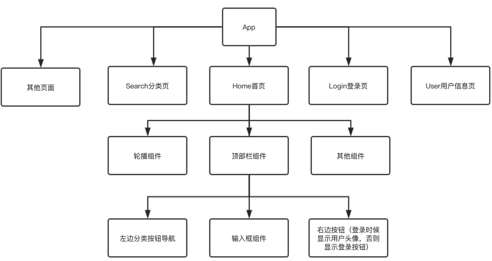

==组件跨层级通信==

例如：APP 更换主题色，色彩就要放在 `Context` 中；用户的登录信息在全文拿到。`props` 只能逐层传递。



# 常用 API

- `React.createContext`：创造者，生产物品。
  - 创造一个 `Context` 对象。
  - ==组件通过组件树离自身最近的 Provider 提供的 context 值==
- `Context.Provider`：供应商。
  - ==多个 Provider 可以嵌套使用，里面覆盖外层的数据==
  - ==当 `value` 发生变化时，Provider 内部所有消费组件都会重新渲染。==
  - `Provider` 及其内部 `consumer` 组件都不受制于 `shouldComponentUpdate` 函数，因此当 `consumer` 组件在其祖先组件退出更新的情况下也能更新。
- 内部组件 => 就是消费者。

- `Class.contextType` ：类组件中的属性，能通过 `this.context` 访问到最近 `context` 上的值。
  - ==任何生命周期中都能访问到，包括 render 函数。==
  - ==只能订阅单一 `context` ，离最近的那个。==
  - 是静态值 `static contextType` ，优势：子类不能继承到，所以不能对其修改。
- `Context.Consumer` ：函数是组件可以用的订阅。
  - 这个函数接收 `context` 值，返回一个。


# 流程

## 1. 一个 Context

```react
保存Context信息的组件
// 1.创建Context对象,如果没有匹配到Provider，则匹配默认值
export const ThemeContext = React.createContext({themeColor: 'red'}); //默认值red
// 2.创造供应商Provider
export const ThemeProvider = ThemeContext.Provider;
// 3.创造消费者
export const ThemeConsumer = ThemeContext.Consumer;

提供者组件
class ProviderPage extends Component {
  this.state = {
    theme: {
      themeColor: red
    }
  }
	render(){
    const {theme} = this.state;
    return (
    <div className='App'>
        <ThemeProvider value={theme}>
          {/* 类组件消费者使用contextType */}
        	<ContextTypePage />
          {/* 函数组件用Context.Consumer拿到 */}
          <ConsumerPage />
        </ThemeProvider>
    </div>
    )
  }
}

消费者1——类组件用 contextType
class ContextTypePage extends Component {
  static contextType = ThemeContext;
	render(){
    const {themeColor} = this.context;
    return ...
  }
}

消费者2——函数组件用 Context.Consumer 类组件也可以用！
function ConsumerPage(){
  <ThemeConsumer>
    接收一个函数！
  	{ ctx => <div className={ctx.themeColor}></div>}
  </ThemeConsumer>
}
```


## 2. 多个 Context

```react
<div className="border">
  <h3>MultipleContextsPage</h3>
  <ThemeConsumer>
    {theme => (
      <UserConsumer>
        {user => <div className={theme.themeColor}>{user.name}</div>}
      </UserConsumer>
    )}
  </ThemeConsumer>
</div>
```


# 注意事项

## 1. 传入 `state` 减少渲染

``` react
 
class App extends React.Component {
  render() {
    return (
      <Provider value={{something: 'something'}}>
        <Toolbar />
      </Provider>
	); }
}
```

我们知道两个一样的对象比较的时候，结果肯定是 `false` ，它不像普通数据结构，只要值相等就行，它看的时候引用地址。所以我们要传递一个引用地址，这样父组件渲染时，才不会造成子组件的重复渲染。

```js
> {something: 'something'} === {something: 'something'};
< false
```

我们可以把 `value` 提升到父节点的 `state` 中去。


