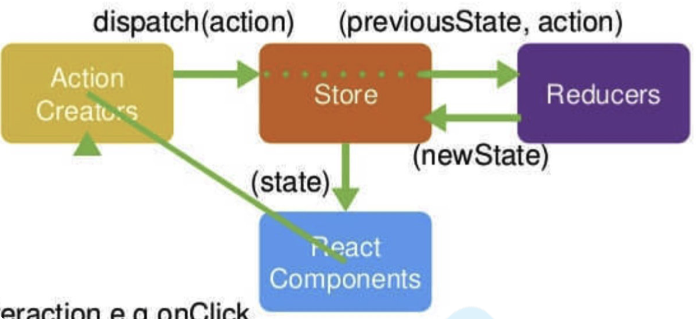

# 什么是reduce

给定一个场景，如何实现 `f1` 函数的返回值作为 `f2` 的参数，然后 `f2` 返回值作为 `f3` 参数：

```js
function f1(arg){
  ...
  return res;
}
function f2(arg){
  ...
  return res;
}
function f3(arg){
  ...
  return res;
}
// 实现
let res = f1(f2(f3('some')));
我们通过一个函数compose来实现
compose(f1, f2, f3);
```

这就想到数组的 `reduce` 方法。

```js
function compose(...func){
  if (funcs.length === 0) return () => {};
  if (funcs.length === 1) return funcs[0];
  // reduce(function(accumulator, currentState)=>...)
	return func.reduce((a, b) => (...args) => a(b(...args))); // => a(b(c(...args)))
}
compose(f1, f2, f3)('哈哈哈')
```


# Redux 流程



1. `store` 来存储数据。
2. `store` 中的 `reducer` 用来初始化`state` 并定义 `state` 修改规则。
3. 通过 `dispatch` 一个 `action` 来提交对数据的修改
4. `action` 提交到 `reducer` 函数中，根据 `action` 的 `type` 返回新的 `state` 。
5. `store.subscribe()` 订阅。


# 实现Redux

```js
export function createStore(reducer) {
  let currentState = undefined;
  let currentListeners = [];

  function getState() {
    return currentState;
  }
  // 每次dispatch的时候更新
  function dispatch(action) {
    currentState = reducer(currentState, action);
    // 当dispatch更新时执行监听
    currentListeners.map(listener => listener());
  }
  // 可以多次订阅，每次订阅把回调放入数组
  function subscribe(listener) {
    currentListeners.push(listener);
  }

  // 首次加载时需要初始值，所以先进行一次dispatch
  // 取值一定要保证不和项目中会重复 => 随机生成字符串
  dispatch({ type: '@INIT/REDUX' });

  return { getState, dispatch, subscribe };
}
```


# 中间件

```js
// 普通操作
add = () => {
    store.dispatch({type: "ADD"});
  };

// 异步操作
asyAdd = () => {
  store.dispatch(dispatch => {
    setTimeout(() => {
      dispatch({type: "ADD"});
}, 1000); });
};
```


## 实现中间件

如何把 `enhancer` 放在 `createStore(store, enhancer)` 第二个参数中。

1. 最终执行发生在 `createStore` 中。
2. 在 `Middlewares` 函数中执行。

```js
function createStore(store, enhancer){
	if(enhancer) return enhancer(createStore)(reducer);
}

function applyMiddleware(...middlewares){
  return createStore => (...args) => {
    const store = createStore(...args);
  }
  return {
    ...store,
  }
}
```


==`Middleware` 的本质是：改写 `dispatch` ，每次发生动作时，产生更多的效果。==

```js
// applyMiddleware(logger, thunk)
// 中间件作用的本质：改写了dispatch，每次dispatch的时候发生不一样的事情。
export function applyMiddleware(...middlewares) {
  return createStore => (...args) => {
    const store = createStore(...args);

    let dispatch = store.dispatch;

    const middleApi = {
      getState: store.getState,
      dispatch: (...args) => dispatch(...args),
    };

    // 1.给每个middleware参数;middlewareChain也是数组，是每个中间件执行之后的结果数组
    const middlewareChain = middlewares.map(middleware => middleware(middleApi));

    // 2.聚合compose，顺序执行，第一个的返回值作为第二个的参数
    dispatch = compose(...middlewareChain)(dispatch);

    return {
      ...store,
      dispatch,
    };
  };
}

function compose(...func) {
  if (func.length === 0) return () => {};
  if (func.length === 1) return func[0];
  return func.reduce((a, b) => (...args) => a(b(...args)));
}
```


## 实现 `redux-logger`

```js
function logger() {
  return dispatch => action => {
    console.log(action.type + '执行了');
    return dispatch(action);
  };
}
```


## 实现 `redux-thunk`

```js
function thunk({ getState }) {
  return dispatch => action => {
    if (typeof action === 'function') return action(dispatch, getState);
    else return dispatch(action);
  };
}
```


# React-Redux

## API

### `<Provider store>`

### `connect()`

#### `mapStateToProps`

`mapStateToProps(state, [ownProps])()` 定义该参数，组件将监听 `Redux store` 的变化。

- `ownProps` ：当前组件自身的 `props` 。如果指定了，那么组件接收到新的 `props` 时，`mapStateToProps` 就会被调用，重新计算。==注意性能！==


