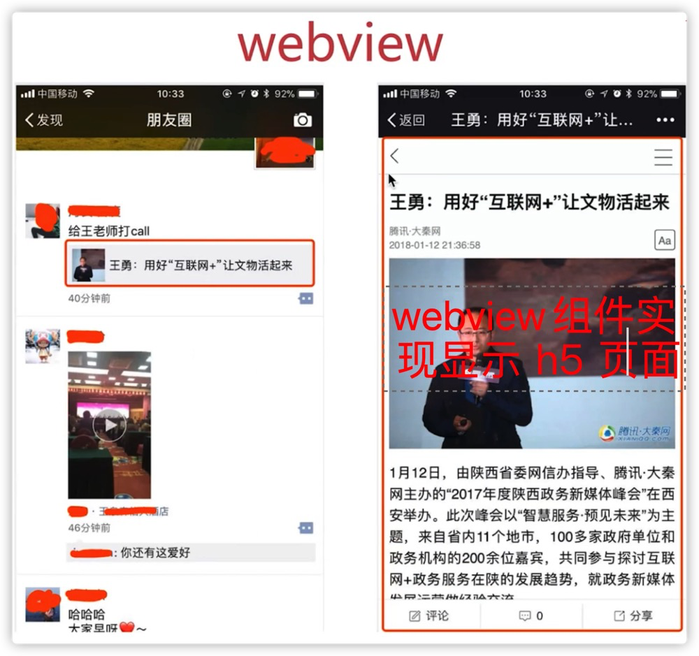
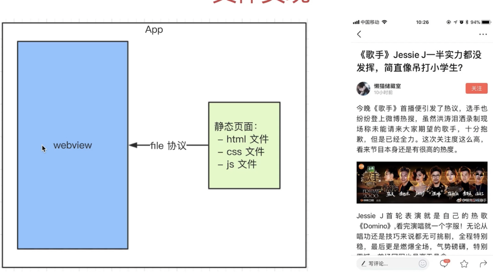
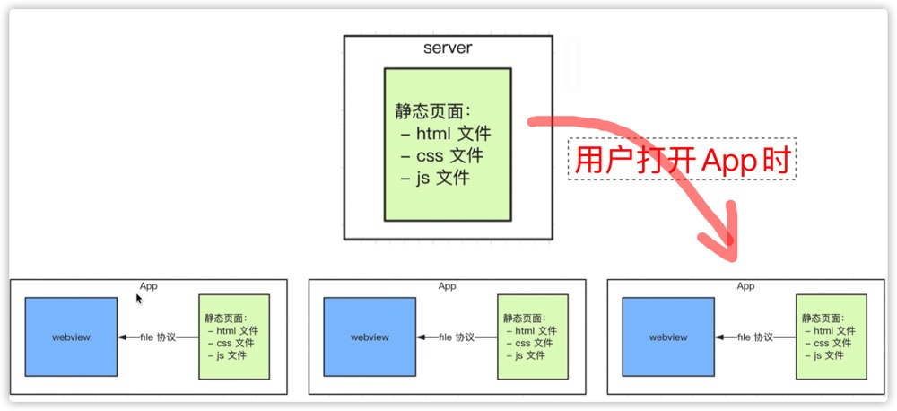
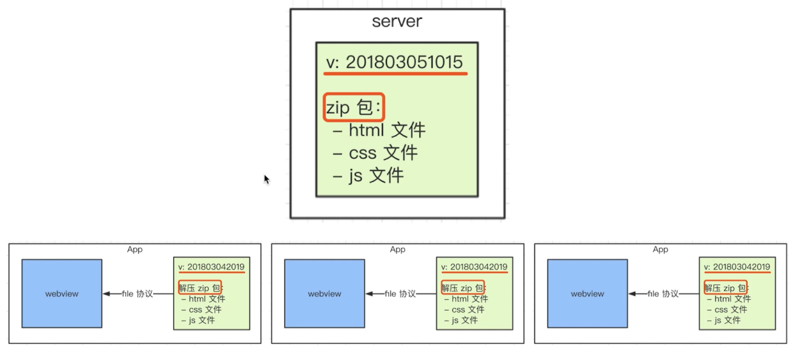

**移动端占大部分流量，远超 PC。App 中有大比例的前端代码：例如微信文章都是前端开发。**

# 面试问题

- hybrid 是什么？为何用？
- 介绍一下 hybrid 更新和上线的流程
- hybrid 和 H5 的区别
- 前端 js 和客户端如何通讯？

# hybrid 概述

- webview
- fill:// 协议
- hybrid 实现流程

hybrid 即混合，即前端和客户端的混合开发，某些环节需要 server 端开发。

## hybrid 优势

- 🌟**可以快速迭代更新，无需 app 审核。**
  - 不需要更新 app 的代码，文章内容快速上线。
  - app 的代码，会访问手机深层的权限，横屏竖屏、摄像头等。如果更新 app 的代码，必须要进行审核。
  - 前端代码没有这些访问权限，所以存在的价值就是为了更新这些不需要审核的部分。
- 体验流畅，和 NA 体验基本类似。
- 减少开发和沟通成本，这部分代码基本通用安卓和 ios 端。

## webview

**就是用来显示 h5 页面的组件。**

像安卓和 ios 开发，都需要视图软件来查看代码实时的效果，例如 Xcode 等都自带。是因为 webview 的存在 —— **就是浏览器内核，显示页面用的。**

- **是 app 中的一个组件（app 可以有个 webview ，也可以没有）**
- **用于加载 h5 页面，即小型的浏览器内核**

**就是用来显示 h5 页面的组件。**

## file 协议

**协议和标准的重要性！** —— W3C 标准、Promise 标准！

- file 协议：本地文件，快
- http(s) 协议：网络加载，慢

**file:// 和 url 的关系**

## hybrid 具体实现

**不是所有场景都适用hybrid**

- 使用 NA：变化不频繁，体验要求极致（头条的首页）
- 使用 hybrid：体验要求高，变化频繁（头条详情页）
- 使用 h5：体验无要求，不常用（举报、反馈页面）

**流程：**

1. 前端做好静态页面（js html css），文件交给客户端。
2. 以文件形式存储在 app 中。
3. **客户端在 webview 中，使用 file 协议加载静态页面。**

### 存在的问题

- app 发布之后，静态文件如何实时更新？
- 静态页面如何获取内容？

**解决问题的思路：从服务端下载文件替换每个客户端的静态文件。**

- 客户端去 server 端下载最新的静态文件
- 我们维护 server 端的静态文件

1. 要点一 —— 通过时间戳对静态文件分版本打 zip 包
2. 要点二 —— **客户端通过版本进行对比，一致则不进行下载，不一致才下载（保证效率）**

# hybrid 和 H5 的区别

hybrid 优点：

- 体验更好，跟 NA 基本一致
- 无需审核就能快速迭代。

hybrid 缺点：

- 开发成本高。联调、测试、查 bug 涉及到三方
- 运维成本高。需要搭建一个平台，支持打包、支持上传等等。

**适用场景：**

- hybrid：**产品型**。产品稳定的功能，迭代频繁的
- H5：**运营型**。单次运营活动或不常用功能（红包活动、法律条款等等）

