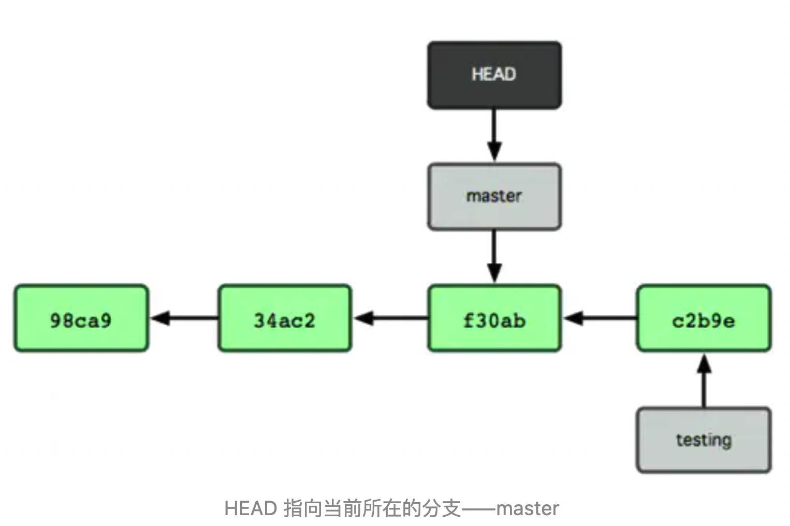

# 01. 商业化前端实习面 

[原文链接](https://www.nowcoder.com/discuss/594794)

## 一面 

### 1. html块级/行内标签；行内元素 margin/padding 值有效吗 

- 块级元素：宽高有效，独占一行。有：`div` | `h1` | `p` | `hr` | `br` | `ul` | `ol` | `dl` 等。
- 行内块元素：宽高有效，内外边距也有效。有： `img` | `textarea` | `button` 等。
- 行内元素：宽高无效，`margin` 和 `padding` 水平有效。有：`span` | `b` | `i` 等。 

### 2. css实现布局：左侧固定右侧自适应；比例1：2：3的栅格布局（grid布局没看） 

#### 1. 左侧固定右侧自适应

1. `grid` 布局：

   ```css
   .box {
     display: grid;
     grid-template-columns: 25% 1fr;
   }
   .left {
     background-color: yellow;
   }
   .right {
     background-color: red;
   }
   ```

   

2. 利用 `flex` 布局：

   ```css
   .box {
     display: flex;
     width: 1000px;
   }
   .left {
     /* flex: 0 0 25%; flex-basis默认值就是width */
     width: 25%;
     background-color: yellow;
   }
   .right {
     flex: 1;
     background-color: red;
   }
   ```

   

3. 左侧用浮动，右侧用 `overflow: auto` 作为 BFC 盒子，左侧不影响到右侧。

   ```css
   .left {
     float: left;
     width: 50%;
     background-color: yellow;
   }
   .right {
     overflow: auto;
     background-color: red;
   }
   ```

   

4. 左侧绝对定位，右侧自适应：

   ```css
   .left {
     position: absolute;
     top: 0;
     left: 0;
     width: 50%;
     background-color: yellow;
   }
   .right {
     background-color: red;
   }
   ```

   

#### 2. 1:2:3 栅格布局

用到 `grid` 布局方式：

```css
.box {
  display: grid;
  grid-template-columns: 1fr 2fr 3fr;
}
.items1 {
  background-color: yellow;
}
.items2 {
  background-color: red;
}
.items3 {
  background-color: blue;
}
```


### 3. 考察flex：由哪几个属性合并的 

### 4. 幽灵字符了解吗（不了解） 

[参考文章](https://blog.csdn.net/yin_ol/article/details/105401553)

零宽度字符是隐藏不显示的，也是不可打印的，也就是说这种字符用大多数
程序或编辑器是看不到的。最常见的是零宽度空格，它是Unicode字符空格，就像如果在两个字母间加一个零宽度空格，该空格是**不可见的**，表面上两个字母还是挨在一起的。比如这两个 **(​​​​​)** 括号中间我放了5个零宽字符,你们能看见吗?

==这种字符的出现是为了文字控制排版作用的，但是由于它拥有肉眼无法观察到的特性，零宽度字符可作为识别某些用户身份的“指纹”数据，也可非常方便地追溯到某些秘密数据的泄露源。==

- 不换行空格：`&#8203` 零宽空白。
- 零宽不连字
- 零宽连字


### 5. let var const 区别

1. 作用域不同。`var` 是函数作用域，`let` 是块作用域。

   ```js
   function fn1(){
     for(var i=0;i<10;i++){};
     console.log(i); // 9
   }
   function fn2(){
     for(let i=0;i<10;i++){};
     console.log(i); // Error: i is not defined
   }
   
   // 什么是块级作用域，简单说有大括号的就是
   {
     var i = 2;
     let j = 2;
   }
   console.log(i); // 2
   console.log(j); // Error: i is not defined
   ```

2. `var` 可以在定义前访问这个变量，但是 `let` 就会报错。==因为 var 有变量提升的过程，整个作用域在编译阶段就被创建，所以 var 变量在此时就会被创建，如果没有初始化，就默认为 undefined。==

   ```js
   console.log(a); // undefined
   console.log(b); // Error: b is not defined
   var a = 10;
   let b = 1;
   ```

   

3. `var` 可以重新被定义，但是 `let` 不可以。

   ```js
   var a = 1;
   var a = 2; // 合法
   
   let b = 1;
   let b = 2; // Error
   ```


### 6. 解构赋值基本用法 

适用于对象和数组。

```js
let arr = [1, 2, 3, 4];
// 1.可以通过, 跳过找到目标元素
const [,,third,] = arr;
console.log(third); // 3
// 2.通过扩展运算符解构
const [first, ...rest] = arr;
console.log(rest); // [2, 3, 4]
// 3.可以迭代
function* fibs() {
  var a = 0;
  var b = 1;
  while (true) {
    yield a;
    [a, b] = [b, a + b];
  }
}
var [first, second, third, fourth, fifth, sixth] = fibs();
console.log(sixth); // 5
// 4.可以修改属性名称，旧名：新名
const obj = {name: '123', age: 18};
const {name: username, age} = obj;
console.log(username); // '123'
// 5.设置默认值, 如果没有赋值，就用默认值
const {name, age, location: 'beijing'} = obj;
console.log(location); // 'beijing'

// 实际用处: 函数的参数定义，可以用对象定义，就能避免记住独立参数的顺序
function test({url, host = 'http://', ...rest}){};

// 其他数据类型的解构
// 1. Map 用[key, value]获得
const map = new Map();
map.set(window, 'global');
map.set(document, 'doucument');
for(let [key] of map){}; // 可以做到只遍历key或value
// 2. 函数多返回值时可以用数组或者对象
function test(){return [1, 2]};
function test(){return {a:1, b:2}};

```


### 7. 数组的 map/forEach 方法区别

- `map` 会返回一个新数组，不对原数组产生影响。`forEach` 只是遍历，不能修改每一项的值，只能通过 `arr[index]` 来修改，且没有返回值。
- `function(index, value, array){}`
- `map` 返回值是数组，所以可以链式操作。
- `forEach` 中的 `return`，不起作用，返回 `undefined` ，`forEach` 中不能用 `break` 。

```js
// 1.forEach就是for的语法糖，只起到遍历作用，所以不能直接修改value
const arr = [1, 2, 3];
arr.forEach((value, index) => value += 1); // 无效
arr.forEach((value, index) => arr[index] += 1); // arr: [2, 3, 4]，并且没有返回值，返回undefined

// 2. map可以直接操作value，它不再原数组上操作，在返回的新数组上操作
const arr2 = arr.map((value, index) => value += 1); 
console.log(arr2); // [2, 3, 4]
console.log(arr); // [1, 2, 3]
```


### 8. 箭头函数/组件中 `data(){}` 可以换成 `data: ()=>` 吗 

箭头函数与普通函数最大区别是：箭头函数禁用 `new` 实例化对象，==箭头函数没有 `arguments` 对象==。箭头函数使用 `call` | `apply` | `bind` 时，改变 `this` 不起作用。

```js
类组件中，如果使用箭头函数，箭头函数的this指向window
class Demo{
  constructor() {
    this.name = "123";
  }
  data(){
    console.log(this); // [object Demo]
  };
}
```


### 9. 原型链；es5父子类实现一个继承；new的具体过程

#### ES5 实现继承

```js
function Father(name) {
  this.name = name;
  this.arr = [1, 2, 3];
  this.value = function () {
    console.log('Father构造函数中的公共方法');
  };
}
Father.prototype.call = function () {
  console.log('call me father');
};
function Son(name) {
  this.age = 18;
  // 1.继承到父级的构造函数的方法
  Father.call(this, ...arguments);
}
// Son.prototype = new Father(); 这样有问题，父函数执行了两次，浪费性能，而且son的构造函数指向Father
// Son.prototype = Father.prototype; 同样构造函数的问题没解决
// 2.继承原型链 => 深拷贝一份父级的原型链，才能保证实例不共用一个原型链
Son.prototype = Object.create(Father.prototype);
// 3.再把构造函数的指向修改过来
Son.prototype.constructor = Son;

const son = new Son('Curry');
```

#### `new` 的过程

```js
function myNew(func) {
  // 1.创建一个对象, 继承func.prototype
  const obj = Object.create(func.prototype);
  // 2.处理一下剩余参数
  const newArgs = Array.prototype.slice.call(arguments, 1);
  // 3.在obj的环境下执行func
  const res = func.call(obj, ...newArgs);
  // 4.判断res是否是对象，如果是返回k，不是就返回o
  if (typeof res === 'object') return res;
  else return obj;
}

function Father(name) {
  this.name = name;
  this.arr = [1, 2, 3];
  this.value = function () {
    console.log('Father构造函数中的公共方法');
  };
}
const son = myNew(Father, 'Curry');
```


### 10.手写：Promise.all()/race()  


### 11. 手写：reduce() 

```js
Array.prototype.myReduce = function (callback, initVal = 0) {
  for (let i = 0; i < this.length; i++) {
    initVal = callback(this[i], initVal);
  }
  return initVal;
};
console.log([1, 2, 3].myReduce((accumulator, currentValue) => accumulator + currentValue, 10));
```


### 12. git基本使用：git reset /revert区别； git rebase 

#### 参考

1. [文章](https://blog.csdn.net/weixin_44781409/article/details/107560533)


#### git 分支如何工作的？



git 中的分支，本质上是指向 commit 对象的可变指针。可以将 HEAD 想象成当前分支的别名，==git 的分支中就保存着这些 HEAD==。

```js
$ git checkout master // checkout就是在改变HEAD的指向
Switched to branch 'master'

$ cat .git/HEAD
ref: refs/heads/master // 存的是master的引用

$ cat .git/refs/heads/master
89d496d44f93d107a7eb404890cd15a14ba8845d
```


GitHub 出现错误提交时使用 `reset` 回退、`revert` 反做、`rebase` 回扣三种方法解决问题。

#### git reset

**原理：** `git reset` 的作用是修改 HEAD 的位置，将 HEAD 指向的位置改变为之前存在的某个版本。

**具体实现：**

1. 用 `git log` 查看版本号。
2. 用 `git reset --hard 目标版本号` 命令将版本回退。
3. 再用 `git log` 查看版本信息，此时本地的 HEAD 已经指向之前的版本。
4. 使用 `git push -f` 提交，用 `git push` 会报错，因为==本地库 HEAD 指向的版本比远程库旧==。


#### git revert

**原理：**`git revert` 用于 ==反做== 某一版本，以达到撤销该版本的修改的目的。比如，我们 commit 了三个版本（版本一、版本二、 版本三），突然发现版本二不行（如：有 bug），想要撤销版本二，但又不想影响撤销版本三的提交，就可以用 `git revert` 命令来反做版本二，生成新的版本四，这个版本四里会保留版本三的东西，但撤销了版本二的东西。==总结来说：保留版本三，撤销版本二，从而生成版本四。==

**具体实现：**

1. `git log` ：查看 commit 提交记录。
2. `git revert 版本号` 反做，并用 `git commit -m 版本名` 提交。
3. `git push` 推上去。

#### git rebase

通过 `git rebase` 将本地多次提交合并为一个，来简化提交历史。

```js
$ git log // 查看commit提交记录
$ git rebase -i (版本号) //选择回退版本之前的一次commit版本
// 编辑文件，输入a切换到编辑模式，将要删除的commit之前的pick单词改为drop
// 按下 Esc 退出编辑模式，:wq保存并退出
$ git push -f // 提交

```


### 13. 跨域解决方案 


### 14. 手写 `instanceof`

```js
function instanceof(L, R){
   const O = R.prototype;
   L = L.__proto__;
   while(true){
     if(L === null) return false;
     if(O === L) return true;
     L = L.__proto__;
   }
 }
```


##   二面 

1. [前端]()性能优化相关（回流重回. 缓存. 网络协议相关. 怎么减少请求次数等等） 
2. vue数据绑定原理.  
3. vue内置key属性作用 
4. 编程题 实现一个函数 根据给定字符串获取对象属性值 
5. 实现普通树（非二叉）的深度和广度优先遍历