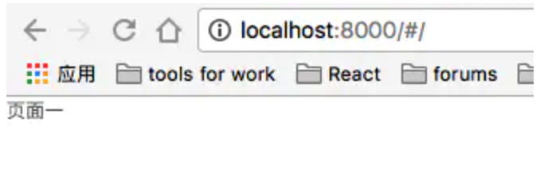

[原文链接](https://www.nowcoder.com/discuss/595028?source_id=profile_create_nctrack&channel=-1)


# 一面(50min)

## 1. 你什么时候开始学前端的，什么方法。

## 2. 爬虫问题

```js
爬虫在爬取页面前，需要对url列表进行标准化，实现一个处理url列表的函数：对缺少http前缀的url添加前缀，返回的url不能重复。
示例：
["nodejs.org", "http://nodejs.org", "http://bytedance.com"] => ["http://nodejs.org", "http://bytedance.com"]
签名函数：
function formaturl(urllist){}
```

自己的实现，不知有没有更好的方法或者有什么漏洞：

```js
function formaturl(urlList) {
  const set = new Set();
  for (let i = 0; i < urlList.length; i++) {
    if (urlList[i].indexOf('http://') === 0) set.add(urlList[i]);
    else set.add('http://' + urlList[i]);
  }
  return [...set];
}
console.log(formaturl(['nodejs.org', 'http://nodejs.org', 'http://bytedance.com']));
```


## 3. 算法题

```js
A、B从一个石子堆里抓石子，交替进行，一个人可以抓1或者2颗，A先走，几种可能性。（我写的走梯子。。。但面试官让我对比一下
```

和 [Leetcode 爬楼梯](https://leetcode-cn.com/problems/climbing-stairs/submissions/)是一个类型。

```js
/**
 * @param {number} n
 * @return {number}
 */
var climbStairs = function(n) {
  if(n<3) return n;
  const dp = new Array(n+1).fill(0);
  dp[0] = 0, dp[1] = 1, dp[2] = 2;
  for(let i=3;i<n+1;i++){
    dp[i] = dp[i-1] + dp[i-2];
  }
  return dp[n];
};
```

我个人认为，应该是爬梯子的结果✖️2，因为考虑 A 先手还是 B 先手，所以情况✖️2。

## 4. 算法题

```js
接着第四题: 最后抓的算负，16颗的情况下，A、B有必胜可能么(谁先抓，怎么抓，谁必胜)。
```


## 5. 路由模式

```js
问题：Vue路由的两种模式的区别。(主要是一些改变url不发送请求，然后hashchange,pushState之类的)
```

因为我只学过 React，所以在这里整理一下关于 React Router 的内容。

参考文档：

1. https://zhuanlan.zhihu.com/p/101129994?from_voters_page=true

### 1. 使用说明

`React Router` 通过 `react-router-dom` 或者 `react-router-native` 来引入。


### 2. 使用场景

#### 2.1 结合 `react-media` 响应式路由

```react
import Media from 'react-media';

function App(){
  return(
    <AppLayout>
    	<Route path="/invoices" component={Invoices} />
  	</AppLayout>
  )
}

const Invoices = () => (
  <Layout>
    {/* always show the nav */}
    <InvoicesNav />

    <Media query={PRETTY_SMALL}>
      {screenIsSmall =>
        screenIsSmall ? (
          // small screen has no redirect
          <Switch>
            <Route
              exact
              path="/invoices/dashboard"
              component={Dashboard}
            />
            <Route path="/invoices/:id" component={Invoice} />
          </Switch>
        ) : (
          // large screen does!
          <Switch>
            <Route
              exact
              path="/invoices/dashboard"
              component={Dashboard}
            />
            <Route path="/invoices/:id" component={Invoice} />
            <Redirect from="/invoices" to="/invoices/dashboard" />
          </Switch>
        )
      }
    </Media>
  </Layout>
);
```

#### 2.2 与 `Redux` 集成

可以将 `React router` 和 `Redux` 集成。路由信息就可以同步到 `Redux` 统一管理，并且路由组件也可以通过 `Redux` 获取路由信息，实现导航功能。

1. 路由信息同步到 `store` 中。
2. 可以使用 `dispatch action` 来导航。
3. 支持在 `Redux devtools` 中路由改变的时间进行调试。

#### 集成方法

##### 1. 用`<Provider>` 包裹 `<Router>` 。

所有的路由组件都能访问到 `redux` 中的 `store` 了。

```react
ReactDOM.render(
	<Provider store={store}>
  	<APPRouter />
  </Provider>,
	document.getElementById('root')
);
```

##### 2. 使用 `withRouter`

用 `withRouter` 将路由信息更新结果（`match`、`history`、`location`）传给组件。

==为什么这种方法 `withRouter` 一定要在最外层？==

`withRouter` 只是用来处理数据更新问题。`redux` 需要依赖于路由的更新来重新渲染。最外层包裹 `withRouter` 让 `redux` 能访问到路由信息，从而进行渲染。


#### 2.3 利用 `react-router-config`

`react-router-config` 这个库可以用来配置静态路由。

```js
import { matchRoutes, renderRoutes } from "react-router-config"

const routes = [
  {
    component: Root,
    routes: [
      {
        path: '/',
        component: Home,
        exact: true
      },
      {
        path: '/article/:articleTitle',
        component: Article,
      },
      {
        path: '/project',
        component: Project,
      },
      {
        component: NoMatch
      }
    ]
  }
]
function Root({route}) {
  return(
    <div>
      {renderRoutes(route.routes)}
    </div>
  )
}
```


### 3. `<Switch>`

`<Switch` 是唯一的，仅仅只会渲染一个路径。例如：

```react
<Route path="/about" component={About} />
<Route path="/:user" component={User} />
<Route component={404} />
```

如果 URL 是 `/about` ，那么这三个组件都会被渲染，因为他们的 `path` 全都被匹配。

==`<Switch>` 只匹配寻找到的第一个。==

```react
<Switch>
  <Route path="/" component={Home} />
	<Route path="/about" component={About} />
  <Route path="/:user" component={User} />
  <Route component={404} />
</Switch>
```

看下面几个例子：

##### 1. 只用 `<Router>` 包裹

```react
<Router>
	<div>
  	<Route path="/" component={Page1} />
    <Route path="/second/" component={Page2} />
  </div>
</Router>
```

运行结果：

   

可以看到，不用 `<Switch>` 会匹配所有带 `'/'` 的。

##### 2. 用 `<Switch>` 只匹配一个

```react
<Router>
	<Switch>
  	<Route path="/" component={Page1} />
    <Route path="/second/" component={Page2} />
  </Switch>
</Router>
// url="/" 此时path="/"可以直接匹配
// url="/second" 此时可以匹配第一个字符，所以 "/" 也匹配上去了
```

运行结果：

    

可以发现，`path='/second'` 路径能同时匹配 `'/'` 和 `'/second'` ，因为`<Switch` 的唯一性，所以都去匹配第一个了。注意，`<Switch>` 的唯一性还体现在，如果我先匹配了 `'/second'` ，那么我的 `'/'` 就会正常匹配。

```react
<Router>
	<Switch>
  	<Route path="/second/" component={Page2} />
    <Route path="/" component={Page1} />
  </Switch>
</Router>
// 因为Switch只能匹配一个。所以
// url="/"时，此时的path="/second"没法匹配。跳到下一个匹配
```

所以当前顺序下能正常匹配，但是得靠顺序来区分，不妥。

##### 3. 用 `exact` 

```react
<Router>
	<Switch>
  	<Route path="/" exact component={Page1} />
    <Route path="/second/" component={Page2} />
  </Switch>
</Router>
```

当前的 `"/"` 路由必须要精准匹配。所以成功解决问题。不需要靠顺序。


## 6. 说一说vue的响应式原理

## 7.说一说vue的虚拟Dom

## 8.说一说Diff[算法]()(简单讲了一下patch的过程，和4种优化策略，节点移动，双端指针这种)

## 9.我看你用了express，你知道express的一些中间件吗?(我说，简单使用，没有深入了解，然后就没问了)

## 10. HTTP首部

```js
你说一下HTTP首部有哪些(一共说了20多个),content-Type你平常post是什么，我说基本都是 formdata
```

> ==代理服务器==
>
> 代理服务器是介于浏览器和 Web 服务器之间的服务器。客户端不是直接去服务器取到页面和交互信息，而是向代理服务器发送请求。代理服务器类似于一个大 `Cache` 池。不断取得新数据包存到本机的存储器。好处是提高浏览速度和效率。
>
> ==当代理服务器收到资源请求，先去自己的 `Cache` 池中看，如果有就不需要向源服务器请求。==

HTTP 首部是 `Cache-Control` 。除去请求行和状态行的剩余部分统称为请求报头。

通过这些 `Cache-Control` 填充指令能操纵缓存的工作机制，指令间用 `,` 隔开。

### 通用首部字段

- `public` 和 `private`：服务器使用此指令，`public` 时，其他用户也可以利用服务器发来的缓存，`private` 时缓存服务器只会对特定用户提供缓存服务，对其他用户发来的请求，代理服务器不会返回缓存。
- `no-cache` ：客户端使用此指令时表示不要代理服务器缓存，这是为了防止代理返回已经过期的资源。服务器使用时，表示代理不能对资源进行缓存，而且禁止对响应资源进行缓存操作。
- `no-store` ：表示请求或响应中有机密信息，不能缓冲请求或响应的任意部分。`no-store` 才是真正意义的不缓存，`no-cache` 只是不缓存过期资源。
- `max-age` ：客户端设置表示缓存资源的最长生存时间，`http 1.1` 中如果出现 `expires` 会优先处理 `max-age` ，忽略 `expires` 。`http 1.0` 相反。==超过时间时，如果向服务器发送新请求失败了，还是返回缓存数据==。
- `min-fresh` ：==只能客户端设置==。表示缓存资源时间没有超过该值时可以直接返回。
- `max-stale`：客户端在==请求==中设置，在响应中设置无效。表示客户端可以接收超出 `max-age` 时间的响应消息，否则服务端重新发起请求。==所以同时使用 `max-fresh` 和 `max-stale` 时，缓存时间可以是两者之和。==
- `on-if-cached` ：客户端仅仅在缓存服务器缓存目标资源的情况下才会要求其返回。
- `Date` ：创建该报文的时间。


### 请求首部字段

这些字段用来补充请求附加信息。

- `Accept` ：通知服务器，客户端能处理的媒体类型和相对优先级。有很多格式。优先级从 `0-1` 。
- `Accept-Charset` ：通知服务端支持的字符集和优先顺序。
- `Accept-Encoding` ：通知服务器支持的内容编码。
- `Accept-Language` ：支持的语言集和优先级。
- `Authorization` ：填写用户代理的认证信息。如果请求时返回 `401(Noauthorized)` 会把这个字段放入请求中。
- `Host` ：重要。告诉服务器，请求的资源所处的互联网主机名字和端口号。
- `Range` ：资源的范围。


### 响应首部字段

用于补充响应的附加信息、服务端信息以及客户端的附加要求等。

- `Accept-Ranges` ：告诉客户端能处理的范围。
- 


11.UDP和TCP的区别
12.TCP怎么实现一个可靠传输的(说一了下停止等待协议，滑动窗口，连续ARQ的过程)
13.我看你写了聊天室，能说说websocket握手的过程吗(101状态码，upGrade, set-websocket-key, connection: upgrade,sec-websocket-value等)
14.html解析的时候遇到script标签会阻塞吗？（会 ，然后提到script的位置，和async,defer，继续追问defer和async的区别）
15.实现instanceOf

反问:我有哪些做的不好的。（都挺好的），如果要给一些建议的话，可能就是去接触一些其他的知识。
（有时间吗，马上给你安排二面）

# 二面(55min)

1.说一说$nextTick。(提到了异步更新，微任务，一些降级选择--promise,setInmidiate,setTimeOut，面试官补充了一个mutationOberser)。
2.用过[keep]()-alive吗，说说怎么实现的。
3.接着上一题：如果我在当前展示的页面去改变其他页面组件的数据，这个组件能实时拿到最新的吗？什么时候能拿到？(这个我不太知道，就简单的说了一下自己的理解)
4.Vue有几类Watcher? 3 （扯到computed和watch选项去了，后来面试官提示我，我才缓过来，但还是没什么思路，猜了渲染函数Watcher,组件watcher。。。。用户自定义watcher没想到）。

## 5. 数据结构题

**第一道：**

```js
var a = [0];
if (a) {
  console.log(a == true);
} else {
  console.log(a);
}
```

分析：

- JS 在做 `if(condition)` 判断的时：会把 `condition` 转成 `boolean` ，`[0]` 是一个有值的数组，所以应该被转成 `true` 。

- JS 在做 `A==B` 的时候，如果 A 和 B 的类型不一样，会先转成一样的，通常转成 `number` 。

  ```js
  // 1.处理true
  true => 1
  // 2.处理[0]
  [0] => 原型链往上找 Array => Object(valueOf()/toString())
  [0].valueOf() = [0] 没用
  [0].toString() = "0" 所以结果是"0"
  "0" => 0
  1 !== 0
  // 答案
  所以答案是 false
  ```


**第二道：**

```js
var a = 10;
(function () {
    console.log(a);
    a = 5;
    console.log(window.a);
    console.log(a);
    var a = 20;// 如果var a=20改成let a = 20;打印什么
    console.log(a);
})()
```

很简单的变量提升问题。首先立即执行函数的 `this` 指向 `window` 。

```js
var a = 10;
(function () {
    console.log(a); // undefined 变量提升，可以在作用域内访问到
    a = 5;
    console.log(window.a); // 10
    console.log(a); // 5 a可以访问到，因为已经赋值为5，所以可以访问到
    var a = 20;
    console.log(a); // 相当于重新定义了
})()
```

用 `let` 后，会在这个立即执行函数中产生一个块级作用域，所以函数中的 `a` 已经变成了块级作用域的 `a` 变量与全局变量 `a` 无关，所以提前访问 `a` 会报错。


## 6. 算法题

[Leetcode原题：二叉树的右视图](https://leetcode-cn.com/problems/binary-tree-right-side-view/)

```js
给定一棵二叉树，想象自己站在它的右侧，按照从顶部到底部的顺序，返回从右侧所能看到的节点值。
```

用到广度优先搜索，也就是层序遍历，返回每一层中最右边的数就好。

```js
var rightSideView = function(root) {
  if(!root) return []
  const res = [];
  const q = [root];
  
  while(q.length){
    res.push(q[q.length-1].val);
    const n = q.length;
    for(let i=0;i<n;i++){
      const current = q.shift();
      if(current.left!==null) q.push(current.left);
      if(current.right!==null) q.push(current.right);
    }
  }
  return res;
};
```


s7.说一说盒子模型。你说IE盒模型用的多，你用这个解决了什么?(我说400px的盒子，我装两个width:200px宽度的盒子(然后加了border)，标准模型的话就会因为宽度不够换行，IE就不会)
8.你css用的多吗?(不多，平常就简单的布布局)
9.flex实现一个盒子里面包着一个盒子，让里面的盒子水平居中，贴着底部。(送分，开心)。
10.做题:求一个字符串 最长的 没有重复字符的 连续子串。leetCode的。做了后发现没比较最大长度、然后就卡住了一会儿。然后不让用slice,indexOf这些api去实现。
11.进程和线程的区别(一些基本的，然后补充了创建PCB，进程之间的通信方式(ipc,信号量等))
12.js基本数据类型有哪些。
13.ul下很多li li里有内容，事件代理打印li的内容。 (这里注意一下currentTarget和target的区别)
14.讲一下闭包(从作用域讲起)
15.CDN，CDN怎么查找最近的那个(没答上来)
没录音，二面有一些题忘了。。。

反问:我想请教一下您，Watcher有几类(我。。。我为什么要问，我下来[百度]()不久好了。。)，面试官很和谐的给我说三类。我说我下来[百度]()一下。
最后面试官问我:还有什么你觉得你擅长但没问到的呢？我说HTTP，TCP吧，或者输入URL到渲染的整个过程。回应:上一个面试官问过了。(好吧)。
（马上准备三面，但是面试官没时间，时间再定。）

两个面试官都超级好！！面试前让我不要紧张。感觉有些时候就是像在平常聊天一样（这道题你确定吗？我说：本来确定的，你这么一笑。。。我就不确定了。。）我也不知道为什么会说出来。。。。。

# 三面

2.说一下团队[项目]()
3.([项目]()内容)下拉加载，加载很多次，数据很多了。滑动卡顿怎么优化？
4.打包后app.6e54c72e.js为什么是这种形式？怎么得到的？有什么作用？
5.涉及一个类似于[百度]()的搜索框，后用节流优化。（直接就在js里写.vue了，没代码提示）
6.64匹马 8个赛道 前四名 最少多少次(我一波分析后说12次，后来面试官很耐心的给我讲解，赞！)
7.你在做博客的时候遇到了什么问题？怎么解决的？
8.做团队[项目]()的时候遇到什么问题？怎么解决的？
(提到并发问题，然后又说了用乐观锁去解决问题的方法。)
9.说一下[前端]()知识体系

10.怎么学习[前端]()的

11.最近有什么打算？(我打算有时间好好学学webpack和nodejs)
12.能实习多久？

反问：我有什么回答的不好的地方，那些方面欠缺