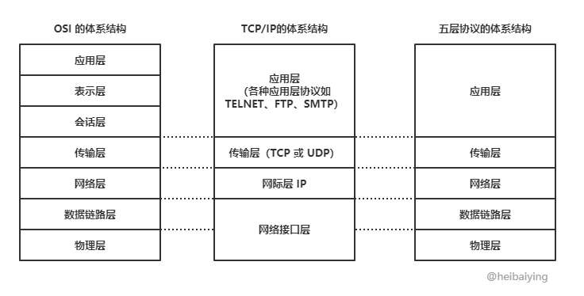

# 1. Reac组件通信方式

1. 父传子：用 `props` 。
2. 父传子一个 `callback`，子组件通过 `callback` 更改父组件状态。
3. `Context` 。
4. `redux` 。
5. 组件见共享同一个 `hook` 。


# 2. Context 导致组件不必要渲染

## 1. 如何更新 `value`

`Comsumer` 的子组件是没办法直接修改 `value` 的。需要通过父组件传递过来的函数来修改：

```js
const redTheme = { color: 'red' };
const greenTheme = { color: 'green' };

class App extends React.Component {
  state = {
    theme: redTheme;
  }
	switchTheme = theme => this.setState({theme});

	render() {
    return (
    	<Context.Provider value={{theme: this.state.theme, switchTheme: this.switchTheme}}>
      	<div className="App">
      		<Header />
      		<Content />
      		<Somethingelse />
      	</div>
      </Context.Provider>
    )
  }
}
```


## `Context` 渲染过程

1. 点击按钮，调用了 `switchTheme` 函数。
2. 该函数调用了顶层组件 App 的 `setState` ，修改了其中的 `theme` 。
3. 因为 App 状态被改变，所以 App 也要被重新渲染。
4. App 重新渲染，所以 `Context.Provider` 也被重新渲染。
5. `Context.Provider` 渲染时发现 `value` 有变化，所以所有的子组件都要重新渲染。

明显看出，渲染过度了，不应该所有的子组件都被渲染，真正用到 `value` 的子组件被渲染就好。


## 改进方法

上面会过度渲染的本质原因是：`<Context.Provider>` 的子组件内容每次都给 `React.createElement` 创建对象，即使内容没完全改变，但是引用变了。这个 JSX 转成 js 对象是这样转化的，所以每次都要生成新内容。

```js
React.createElement(Context.Provider, {value: ...},
  React.createElement('div', {className: ...},
    React.createElement(Header),
    React.createElement(Content),
  )
)
```

所以，我们要想办法把这个引用给定死，更新时只改变地址中的内容。这样，不改变的组件就不会重绘。制造一个 `ThemeProvider` 组件，然后把子组件都放在 `this.props.children` 中。这样会让父组件 `App` 变成一个无状态的组件，也就是它的状态不会绑定在 `Context` 上，所以分离开之后，就不会收到影响。

```js
class ThemeProvider extends React.Component {
  state = {
    theme: redTheme,
  }
  switchTheme = (theme) => {
    this.setState({theme});
  }
  render() {
    console.log('render ThemeProvider');
    return (
      <Context.Provider value={{theme: this.state.theme, switchTheme: this.switchTheme}}>
        {this.props.children}
      </Context.Provider>
    );
  }
}

function App () {
  console.log('render App');
  return (
    <ThemeProvider>
      <div className="App">
        <Header />
        <Content />
      </div>
    </ThemeProvider>
  )
}
```


# 3. Hooks 的好处

1. 函数都有自己的作用域，所以会开辟独立空间保存状态。
2. ==更好复用==：复用逻辑时类组件需要写高阶组件函数，hooks 可以通过 `useHooks` 函数就能直接把内容传递给复用的组件。
3. 副作用 `useEffect` 可以替代 `componentDidMount` 、`componentDidUpdate` 、`componentWillUnmount` 三个生命周期函数。


## 缺点

1. `useEffect` 闭包陷阱：

```js
const [count, setCount] = useState(0);
useEffect(() => {
  window.addEventListener('resize', handleResize);
  return () => window.removeEventListener('resize', handleResize);
}, [count]);
const handleResize = () => console.log('count', count);
```

 上面的案例必须要在 `useEffect` 总加入 `count` 才能实时打印出来正确的 `count` 。这就是闭包陷阱，乍一看通过闭包能访问到 `count` 。但实际上现在的 `count` 和更新后的 `count` 已经不一样了，是新的状态。这就是由函数的作用域造成的。但是 `hooks` 函数中仍然保存着上一次的记忆。所以我们要记住这种，闭包陷阱。


## `memo`|`useMemo`|`useCallback` 最佳场景

`useCallback` 和 `useMemo` 的区别：

共同点：都是第一个参数接收函数，第二个参数接收数组。用来缓存数据，优化性能。

不同点：

- `useCallback` 缓存的是函数，如果每次更新时这个函数只依赖其中一个变量，当这个变量发生变化时才执行这个函数，这就是 `useCallback` 的使用场景。
- `useMemo` 缓存的是数据，是第一个参数返回的返回值。


`React.memo` 方法就相当于 `PureComponent` 。`React.memo` 很好解释。如下，子组件没必要去渲染时在子组件上套上 `memo()` 就好：

```js
function Dad(){
  const [count, setCount] = useState(0);
	return (
  	<div>
    	<button onClick={()=>setCount(count+1)}>add</button>
			<MemoChild />
    </div>
  )
}

const MemoChild = React.memo(Child);

function Child(){
	console.log('i am renderer');
  return (
  	<div>我是子组件</div>
  )
}
```


下面看看 `useCallback` 和 `useMemo` 的实践场景。还是同样的场景，多增加一个 `name` 状态和改变方法。这时候就有两个状态了，互相的方法如果一个调用一个没调用，就应该分别渲染，不能过度。

```js
function Dad(){
  const [count, setCount] = useState(0);
  const [name, setName] = useState('123')
	return (
  	<div>
    	<button onClick={()=>setCount(count+1)}>add</button>
			<MemoChild name={name} onClick={newName => setName(newName)} />
    </div>
  )
}

const MemoChild = React.memo(Child);

function Child(props){
	console.log('i am renderer');
  return (
    <div>
  		<h1>我是子组件</h1>
    	<div>{props.name}</div>
    	<button onClick={props.onClick('456')}>changeName</button>
    </div>
  )
}
```

如上，当我点击 `add` 按钮时，子组件还是会渲染，因为子组件的点击事件函数也跟着执行了。所以我们通过 `useCallback` 包裹 `setName` 的方法就可以解决。

```js
function Dad(){
  const [count, setCount] = useState(0);
  const [name, setName] = useState('123')
	return (
  	<div>
    	<button onClick={()=>setCount(count+1)}>add</button>
			<MemoChild name={name} onClick={useCallback(newName => setName(newName), [])} />
    </div>
  )
}
```

轻松解决。

那么 `useMemo` 如何用呢？把这个 `name` 换成一个对象。

```js
function Dad(){
  const [count, setCount] = useState(0);
  const [name, setName] = useState('123')
	return (
  	<div>
    	<button onClick={()=>setCount(count+1)}>add</button>
			<MemoChild 
				childData={{name, color: name==='123' ? 'red' : 'green'}} 					onClick={useCallback(newName => setName(newName), [])}
      />
    </div>
  )
}
```

这时，用了 `useCallback` 失效的原因是：传入的对象也有一个计算，每次渲染都会重新计算。所以我们要用到 `useMemo` ，缓存的是数据。对象如果发生改变才渲染子组件。

```js
childData={useMemo(()=>({name, color: name==='123' ? 'red' : 'green'}))};
```


# 4. 线程和进程的区别

根本区别：进程是操作系统资源分配的基本单位，线程是任务调度和执行的基本单位。

另一种说法：进程是资源分配的最小单位，线程是 CPU 调度的最小单位。

进程=火车，线程=车厢。

- 一个进程可以包含多个线程。
- 不同进程间数据很难共享(两个火车之间乘客很难换车，但是乘客在同一辆车的车厢中很容易换。所以线程间通信简单)。
- 进程间不会相互影响，但是线程中一个线程挂了会导致整个进程挂掉。


## 进程间通信方式

1. **匿名管道**：半双工方式。只能在父子进程中使用。
2. **高级管道**：将另一个程序当作一个新的进程在当前程序进程中启动，算作当前程序的子进程。
3. **有名管道**：半双工，允许无亲缘关系进程间通信。
4. **消息队列**：由消息的链表构成，存放在内核中由消息队列标识符标识。
5. **信号量**：是一个计数器，可以控制多个进程对共享资源的访问。是一种锁机制，防止某进程正在共享资源时，其他进程也访问该资源。
6. **信号**：用于通知接收进程某个事件已经发生。
7. **共享内存**：映射一段能被其他进程访问的内存。这段共享内存由一个进程创建，但多个进程都可以访问。
8. **Socket**：可用于不同机器间的进程通信。


## 参考

1. https://blog.csdn.net/weixin_44653395/article/details/99686244


# 5. 为什么 Chrome 使用多进程架构

多进程安全性更好，如果有什么错误，只会在那一个进程中出错，不影响其他进程。

## Chrome 进程

Chrome 有三种类型的进程：浏览器进程、渲染器进程、插件进程。

- 浏览器进程：只有一个，用于管理标签页、窗口和浏览器本身。这个进程同时负责处理所有跟磁盘、网络、用户输入和显示的交互，不负责分析和渲染页面内容。
- 渲染器进程：会创建多个进程，每个都负责渲染页面。包括 HTML、Javscript、CSS和图片等文件的处理。每个渲染器进程都运行在沙箱内，所以它没有对磁盘、网络和显示器的直接访问权限。
- 插件进程：为每个插件创建一个进程。


## 参考

1. https://blog.csdn.net/ithzhang/article/details/7917754


# 6. Chrome 垃圾回收

基本类型的数据都是保存在“栈”中的，引用类型的数据都是保存在“堆”中的。

## 栈内存回收

当执行完栈中的函数后，就进行上下文切换，然后栈顶的空间会自动被回收，释放内存。

## 堆内存回收

V8 把内存分为新生代和老生代：

- 新生代：临时分配的内存，存活时间短。
- 老生带：常驻内存，存活时间长。

## 新生代回收

1. 将新生代内存空间一分为二，`From` 部分是正在使用的内存，`To` 是限制的内存。


2. 先把 `From` 部分对象检查一遍，如果是存活对象就放置在 `To` 内存中，非存活对象之间回收。
3. 然后 `From` 和 `To` 身份对调，`From` 中的作为闲置，`To` 中的作为正在使用的。

按照上述循环。为什么不直接删除非存活的？

==这样对调是为了让内存连续，解决内存碎片的问题。==
用这种 `Scavenge` 算法的好处是：新生代内存变量很少，所以时间性能很优秀。

 =>        


## 老生代内存回收

如果上述的新生代内存中，有些变量经过多次对调回收操作后依然存在，就把这种变量放到老生代中。老生代中对象非常多，用这种复制操作工程量太大。所以采用下面的策略：

1. 进行==标记—清除==。遍历堆中所有对象，做标记。删除没有标记的。这样肯定会造成大量的内存碎片。
2. 整理内存碎片。在清除阶段接收后，把存活的对象向一端靠拢。由于移动，所以执行速度很慢的。

为了改善性能问题，在上述基础上使用==增量标记算法==。也就是垃圾回收标记和 JS 应用逻辑交替进行，闲时回收，直到标记阶段完成。


# 7. 内存泄漏

## 内存泄漏的情况

1. 定时器中引用没有清除：

   ```js
   var someDate = getData();
   setInterval(() => {
     var node = document.getElementById('Node');
     if(node) node.innerHTML = JSON.stringify(someData);
   })
   ```

   当定时器没有清除，并且这个 Node 节点被删除后，这个逻辑就不需要了。但是计时器中的回调函数却无法被回收，`someData` 数据也没法回收。

2. 全局变量：

   ```js
   function foo(){
   	this.a = "something";
   }
   foo();
   ```

   这里的 `foo` 在全局环境调用，所以实际上是 `window.bar=xxx` 。产生的全局变量无法回收。

3. 闭包产生互相引用。

## 避免内存泄漏

1. 少用全局变量，避免意外产生全局变量。
2. 使用闭包要注意，有 DOM 元素引用要及时清除。
3. 计时器中的没用的回调要及时下亏。
4. 可以用 `WeakSet` 和 `WeakMap` 结构，他们都是弱引用，不计入垃圾回收机制。


# 8. OSI 七层模型都有哪些协议




- 数据链路层：PPP 协议(点对点连接传输数据单元)。
- 网络层：

  - IP 协议：所有互联的计算机都需要遵循该协议，两个 IP 之间的逻辑通信。
  - ARP 协议：ARP 缓存表，存储 IP 地址和 MAC 地址映射关系的。
  - ICMP(Internet Control Message Protocol) ：**互联网控制消息协议**。为了提高 IP 报交付率，ICMP 允许主机或路由器报告差错情况和提供异常报告给发送者。
  - IGMP(Internet Group Management Protocol) ：**网络群组管理协议。**用于管理网络协议多播组成员的通信协议。IP 主机和相邻路由器可以利用 IGMP 建立多播组的组成员。
- 传输层：
	- UDP
  - TCP
- 应用层
  - FTP：文件传输协议。
  - TELNET：远程终端协议。
  - WWW：万维网协议。其中包括 URL、HTTP、HTML 三种协议。

  

## 参考

1. https://juejin.cn/post/6844904049800642568


# 9. TCP 可靠传输的原理

## 1. 停止等待协议

如果是 A 发送数据给 B 时丢失，则 B 无法收到数据，程序一直等待。

**解决方案：超时重传。**


B 收到了数据，发送的确认数据出现丢失或很长时间到达 A。

**解决方案：**

1. 如果是确认丢失了，当超时重传后，B 丢弃重复收到的数据。
2. 如果是确认延迟到达，A 会收到两次确认消息。A 就丢弃延时到达的确认，不做其他处理。


## 2. 连续 ARQ 协议

按照窗口长度把连续分组发送出去，发送方每收到一个确认时就把发送窗口向前滑动一个分组的位置。

接收方也是通过累积确认的方式。

如果有丢失的分组，没收到确认会进行回退 `Go Back N` 。


## 拥塞控制

TCP 采用慢启动、拥塞避免、快重传和快恢复四种算法来进行拥塞控制。

### 1. 慢启动

慢开始和拥塞避免都是基于窗口的拥塞控制：发送方维持一个拥塞窗口，其长度取决于网络的拥塞程度，并动态变化，同时发送方会让自己的发送窗口等于拥塞窗口。

==慢启动：由于不知道网络的负载能力，所以最好选择逐步探测，由小到大成倍地增大发送窗口。==


 

拥塞避免就是利用每次结果一个往返时间后把发送方的窗口 + 1，达到某个值时稳定尝试。


### 2. 快重传和快恢复

快重传算法要求接收方不要等待自己发送数据时才稍带确认，要立刻发送确认。即使收到了失序报文段，也要立即发出对已收到报文段的重复确认。发送方收到连续 3 个同一分组确认报后会立即快重传它的下一段。


# 10. DNS 递归查询和迭代查询

## 递归查询

DNS 服务器收到客户端请求后，必须使用一个准确的查询结果回复客户。如果本地没查到，就询问其他服务器，并将返回的查询结果提交给客户端。

==主机向本地域名服务器的查询一般用递归。==


## 迭代查询

DNS 服务器查询不到本地到其他服务器查询后并不直接回复查询结果，而是告诉客户端另一台 DNS 服务器的地址，让那个客户端再向那一台 DNS 服务器提交请求。

简单来说递归客户端只会发送一次请求，要求对方给结果。迭代的话，发出请求后如果没有授权回答，就会返回一个能解答这个查询的服务器列表，客户端需要再发请求给该列表。


# 11. React和VUE区别

## 1. 监听数据的原理不同

- Vue 通过 getter/setter 等函数劫持，得到数据的精确变化。
- React 强调数据的不可变，是通过 diff 算法比较引用来进行的，所以如果不优化就会造成大量不必要的 vDOM 渲染。


## 2. 数据流不同

 


React 一直不支持双向绑定，提倡数据单向流，是 `onChange/setState` 模式。Vue 是双向绑定。


## 3. HoC 和 mixins

Vue 通过 mixins 方式包装函数。React 用高阶组件。


## 4. 组件通信区别

 

## 5. 框架本质不同

- Vue 本质是 MVVM 框架，由 MVC 发展而来。
- React 是前端组件化框架，由后端组件化发展而来。


# 12. BFC

触发 BFC 条件：

- body 根元素
- 浮动元素：float 除 none 以外的值
- 绝对定位元素：position (absolute、fixed)
- display 为 inline-block、table-cells、flex
- overflow 除了 visible 以外的值 (hidden、auto、scroll)


# 13. 数据的大小端存储

**大端模式**：数据的高字节保存在内存的低地址中，而数据的低字节保存在内存的高地址中。

**小端模式**：数据的高字节保存在内存的高地址中，而数据的低字节保存在内存的低地址中。

计算机中以字节为单位，每个地址单元就是一个字节，一字节是 8 bit。C 语言中，char 类型是 8 bit，short 类型是 16 bit，long 类型是 32 bit。

对于位数大于 8 位的处理器，16 位或 32 位的处理，由于寄存器宽度大于一个字节，必然存在着一个如果将多个字节安排的问题。


# 14. cors请求

## 简单请求

- GET、POST、HEAD(和 get 本质一样，不含数据只有头部)。
- 头部信息不超过下面内容：
  - 无自定义头部。
  - Accept｜Accept-Language｜Content-Languag
  - Last-Event-ID
  - Content-Type 只能是：`text/plain` ｜`multipart/form-data` ｜`application/x-www-form-urlencoded`

## 非简单请求

- PUT｜PATCH｜DELETE
- 自定义头部字段
- ==发送 json 数据==

==正式通信前，浏览器先发送 OPTIONS 请求，进行预检请求。服务器成功响应预检请求后，才会发送真正请求，带着真正数据。==

```js
$.ajax({
  url: 'http://...',
  type: put,
  success: data => console.log(data);
})
```


浏览器自己先发送一个 OPTIONS。


## 服务端设置

```js
res.header("Access-Control-Allow-Origin", "*");
res.header("Access-Control-Allow-Methods", "PUT,POST,...")
res.header("Access-Control-Allow-Headers", "X-Request-With")
```


## 参考

1. jianshu.com/p/ebd498cc3c52


# 15. SSE和webSocket

## SSE(Server-Sent Events) ：

- HTTP协议严格说==无法做到服务器主动推送消息==。
- 变通方法：告诉客户端，接下来发送的流信息。SSE 就是通过流信息的方式推送的。
- IE/Edge：不支持。
- WebSocket 是全双工，可以双向通信。SSE 是单向通信：服务器 => 浏览器。
- 流信息的方式，完成一次用时很长的下载。

### 优点

- 使用 HTTP 协议。而 WebSocket 是另一个独立的协议。
- SSE 是轻量级。WebSocket 协议相对复杂。
- SSE 默认支持断线重连，WebSocket 需要自己实现。
- SSE 一般用来传送文本，二进制需要自己编码后发送。WebSocket 默认二进制。
- SSE 支持自定义发送消息类型。


## WebSocket优缺点

==缺点==

- 是长连接，所以受网络限制大，要处理好断网重连的场景。
- webSocket 是 push 一个消息，http 轮询是 pull 一个消息。所以 webSocket 要注意每个消息只推送一次，处理好连接。


==优点==

- 支持长连接，http 不能持久连接。

- 握手就是基于 HTTP 协议的。多了的字段：

  ```js
  Sec-WebSocket-Key: xxxxxxxxx // 浏览器随机生成的Base64 encode值
  Sec-WebSocket-Protocol: chat, superchat // 记录所使用的协议
  Upgrade: websocket
  Connection: Upgrades
  
  // 客户端
  Sec-WebSocket-Accept: xxxxxx // 是上面的key加密后的字段
  ```


## 长轮询和 ajax 轮循区别

ajax 会一直问问问：有消息没｜没。。｜有消息没｜没。。。

long poll：它采用的是：客户端发起连接，如果没消息，服务端就一直不返回 response 给客户端。直到有消息之后才返回，返回完之后，客户端再次建立连接。


### 使用

```js
// 1.检测是否有EventSource对象
if(window.EventSource){}

var source = new EventSource(url, {withCredentials: true});
source.readyState=>{
  0: EventSource.CONNECTING
  1: EventSource.OPEN 可以接受数据
  2: EventSource.CLOSED 断开且不会重连。
}

// onerror|source.close()关闭
source.onmessage = function(e){
  var data = e.data;
  // handle message
}
```

==服务端实现==

```js
// 1.HTTP头部：
Content-Type: text/event-stream
Cache-Control: no-cache
Connection: keep=alive
```


# 🌟16. 手写并发控制

```js
实现一个批量请求函数 multiRequest(urls, maxNum)，要求如下：
• 要求最大并发数 maxNum
• 每当有一个请求返回，就留下一个空位，可以增加新的请求
• 所有请求完成后，结果按照 urls 里面的顺序依次打出
```

用到 `Promise.all` ，该方法保证所有的请求都达到 `resovle` 才执行 `then` 回调。

并发限制是指：

- HTTP 请求时，如果有好多好多个同时一起，就会堆积无数调用栈导致内存溢出。
- 所以我们用 `Promise.all` 让每一时刻的并发执行的 `promise` 数量是固定的。


==思路==

```js
function PromiseLimit(fnArr, limit=5) {
  let i = 0;
  const res = []; //保存每个promise的执行结果
  const executing = []; //保存正在执行的promise对象
  return queue().then(() => Promise.all(res));
  
  const queue = () => {
    if(i === fnArr.length) return Promise.all(executing);
    const p = fnArr[i++]();
    res.push(p);
    const e = p.then(() => executing.splice(executing.indexOf(e), 1));
    executing.push(e);
    if(executing.length >= limit){
			return Promise.race(executing).then(() => queue(), err => reject(err));
    }
    return Promise.resolve().then(() => queue());
  }
}
```


==测试案例：==设置一个随机生成成功和失败的延时启动器

```js
const res = [];
for(let i=0;i<10;i++){
  res.push(function(){
    return new Promise(resolve, reject){
      console.log('开始'+i, new Date().toLocaleString());
      setTimeout(() => {
        if(Math.random() > 0.3) resolve(i);
        else reject(i+"  error!!!!");
      }, parseInt(Math.random()*10000));
    }
  })
}

PromiseLimit(res).then(data => console.log(data), err => console.log(err));
```


## 参考

1. https://blog.csdn.net/qq_20282263/article/details/103686738


# 🌟17. 实现带并发限制的异步调度器

```js
class Scheduler {
  add(promiseCreator) {  }
  // ...}const timeout = (time) => new Promise(resolve => {
  setTimeout(resolve, time);
}
const scheduler = new Scheduler()
const addTask = (time, order) => {
  scheduler.add(() => timeout(time))
    .then(() => console.log(order))
}

addTask(1000, '1')
addTask(500, '2')
addTask(300, '3')
addTask(400, '4') // output: 2 3 1 4
// 一开始，1、2两个任务进入队列
// 500ms时，2完成，输出2，任务3进队
// 800ms时，3完成，输出3，任务4进队
// 1000ms时，1完成，输出1// 1200ms时，4完成，输出4
```


==实现==

```js
class Scheduler {
  constructor (limit) {
    this.limit = limit;
    this.queue = [];
  }
  add = (promiseCreator) => {
    return new Promise((resolve, reject) => {
      if(this.limit > 0) {
        resolve(promiseCreator());
        this.limit--;
      } else this.queue.push([resolve, promiseCreator]);
    }).then(() => {
      if(this.queue.length) {
        let task = this.queue.shift();
        task[0](task[1]());
      }else this.limit++;
     	return Promise.resolve();
    });
    
  }
}

// 测试代码
const scheduler = new Scheduler(2);
const addTask = (time, order) => {
  scheduler.add(function(){
    return new Promise((resolve) => setTimeout(resolve, time))
    	.then(() => console.log('time', time, 'order', order))
  })
}
```


# 18. 无序数组构建二叉搜索树

```js
要求：输入一个无序数组，构建一个二叉搜索树，然后在遍历二叉搜索树获得递增序列。
```

实现：

```js
function TreeNode(val) {
  this.val = val;
  this.left = null;
  this.right = null;
}

function constructTree(arr){
  const root = new TreeNode(arr[0]);
  // 把所有的数字插入root中变成二叉搜索树
  for(let i=1;i<arr.length;i++){
    insert(arr[i]);
  }
  const res = [];
  traverse(root); //中序遍历二叉搜索树把val按序放入res
  return res;
  
  function insert(val){
    const newNode = new TreeNode(val);
    insertNode(root, newNode);
  }
  function insertNode(node, newNode){
		if(node.val > newNode.val) {
      if(!node.left) node.left = newNode;
      else insertNode(node.left, newNode);
    }else{
      if(!node.right) node.right = newNode;
      else insertNode(node.right, newNode);
    }
  }
  
  function traverse(node){
		if(node.left) traverse(node.left);
    if(!node) return null;
    res.push(node.val);
    if(node.right) traverse(node.right);
  }
}
```


# 19. 图片懒加载

```js
var imgs = document.querySelectorAll('img');
// 到浏览器顶部的距离
function getTop(e) {
  return e.offsetTop; //目标距离浏览器顶部的距离
}
function lazyLoad(imgs) {
  let h = document.body.clientHeight; // 浏览器窗口高度
  // 滚动过的宽度
  var s = document.documentElement.scrollTop || document.body.scrollTop;
  for (let i = 0; i < imgs.length; i++) {
    if (h + s > getTop(img[i])) {
      // 模拟请求过程，所以加了定时器2s
      setTimeout(() => {
        const tmp = new Image();
        tmp.src = imgs[i].getAttribute('data-src');
        tmp.onload = function () {
          imgs[i].src = imgs[i].getAttribute('data-src');
        };
      }, 2000);
    }
  }
}
lazyLoad(imgs);
```


# 20.实现vDom对象渲染页面

```js
const vDom = {
  tag: 'ul',
  attrs: {
    id: 'list',
  },
  children: [
    {
      tag: 'li',
      attrs: { className: 'item' },
      content: 'Item1',
    },
    {
      tag: 'li',
      attrs: { className: 'item' },
      content: 'Item2',
    },
  ],
};
function render(vDom) {
  const { tag, attrs = {}, children = [], content = '' } = vDom;
  if (!tag) return null;
  let elem = document.createElement(tag);
  for (const key in attrs) {
    elem.setAttribute(key, attrs[key]);
  }
  elem.innerHTML = content;
  children.forEach(item => {
    elem.appendChild(render(item));
  });
  return elem;
}

console.log(render(vDom));
const div = document.querySelector('div');
div.appendChild(render(vDom));
```


