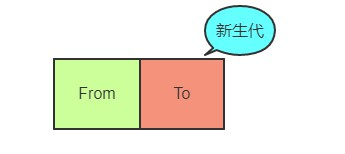
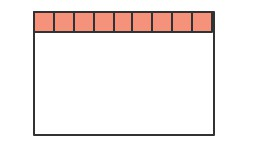

# 1. Reac组件通信方式

1. 父传子：用 `props` 。
2. 父传子一个 `callback`，子组件通过 `callback` 更改父组件状态。
3. `Context` 。
4. `redux` 。
5. 组件见共享同一个 `hook` 。


# 2. Context 导致组件不必要渲染

## 1. 如何更新 `value`

`Comsumer` 的子组件是没办法直接修改 `value` 的。需要通过父组件传递过来的函数来修改：

```js
const redTheme = { color: 'red' };
const greenTheme = { color: 'green' };

class App extends React.Component {
  state = {
    theme: redTheme;
  }
	switchTheme = theme => this.setState({theme});

	render() {
    return (
    	<Context.Provider value={{theme: this.state.theme, switchTheme: this.switchTheme}}>
      	<div className="App">
      		<Header />
      		<Content />
      		<Somethingelse />
      	</div>
      </Context.Provider>
    )
  }
}
```


## `Context` 渲染过程

1. 点击按钮，调用了 `switchTheme` 函数。
2. 该函数调用了顶层组件 App 的 `setState` ，修改了其中的 `theme` 。
3. 因为 App 状态被改变，所以 App 也要被重新渲染。
4. App 重新渲染，所以 `Context.Provider` 也被重新渲染。
5. `Context.Provider` 渲染时发现 `value` 有变化，所以所有的子组件都要重新渲染。

明显看出，渲染过度了，不应该所有的子组件都被渲染，真正用到 `value` 的子组件被渲染就好。


## 改进方法

上面会过度渲染的本质原因是：`<Context.Provider>` 的子组件内容每次都给 `React.createElement` 创建对象，即使内容没完全改变，但是引用变了。这个 JSX 转成 js 对象是这样转化的，所以每次都要生成新内容。

```js
React.createElement(Context.Provider, {value: ...},
  React.createElement('div', {className: ...},
    React.createElement(Header),
    React.createElement(Content),
  )
)
```

所以，我们要想办法把这个引用给定死，更新时只改变地址中的内容。这样，不改变的组件就不会重绘。制造一个 `ThemeProvider` 组件，然后把子组件都放在 `this.props.children` 中。这样会让父组件 `App` 变成一个无状态的组件，也就是它的状态不会绑定在 `Context` 上，所以分离开之后，就不会收到影响。

```js
class ThemeProvider extends React.Component {
  state = {
    theme: redTheme,
  }
  switchTheme = (theme) => {
    this.setState({theme});
  }
  render() {
    console.log('render ThemeProvider');
    return (
      <Context.Provider value={{theme: this.state.theme, switchTheme: this.switchTheme}}>
        {this.props.children}
      </Context.Provider>
    );
  }
}

function App () {
  console.log('render App');
  return (
    <ThemeProvider>
      <div className="App">
        <Header />
        <Content />
      </div>
    </ThemeProvider>
  )
}
```


# 3. Hooks 的好处

1. 函数都有自己的作用域，所以会开辟独立空间保存状态。
2. ==更好复用==：复用逻辑时类组件需要写高阶组件函数，hooks 可以通过 `useHooks` 函数就能直接把内容传递给复用的组件。
3. 副作用 `useEffect` 可以替代 `componentDidMount` 、`componentDidUpdate` 、`componentWillUnmount` 三个生命周期函数。
4. 


## 缺点

1. `useEffect` 闭包陷阱：

```js
const [count, setCount] = useState(0);
useEffect(() => {
  window.addEventListener('resize', handleResize);
  return () => window.removeEventListener('resize', handleResize);
}, [count]);
const handleResize = () => console.log('count', count);
```

 上面的案例必须要在 `useEffect` 总加入 `count` 才能实时打印出来正确的 `count` 。这就是闭包陷阱，乍一看通过闭包能访问到 `count` 。但实际上现在的 `count` 和更新后的 `count` 已经不一样了，是新的状态。这就是由函数的作用域造成的。但是 `hooks` 函数中仍然保存着上一次的记忆。所以我们要记住这种，闭包陷阱。


## `memo`|`useMemo`|`useCallback` 最佳场景

`useCallback` 和 `useMemo` 的区别：

共同点：都是第一个参数接收函数，第二个参数接收数组。用来缓存数据，优化性能。

不同点：

- `useCallback` 缓存的是函数，如果每次更新时这个函数只依赖其中一个变量，当这个变量发生变化时才执行这个函数，这就是 `useCallback` 的使用场景。
- `useMemo` 缓存的是数据，是第一个参数返回的返回值。


`React.memo` 方法就相当于 `PureComponent` 。`React.memo` 很好解释。如下，子组件没必要去渲染时在子组件上套上 `memo()` 就好：

```js
function Dad(){
  const [count, setCount] = useState(0);
	return (
  	<div>
    	<button onClick={()=>setCount(count+1)}>add</button>
			<MemoChild />
    </div>
  )
}

const MemoChild = React.memo(Child);

function Child(){
	console.log('i am renderer');
  return (
  	<div>我是子组件</div>
  )
}
```


下面看看 `useCallback` 和 `useMemo` 的实践场景。还是同样的场景，多增加一个 `name` 状态和改变方法。这时候就有两个状态了，互相的方法如果一个调用一个没调用，就应该分别渲染，不能过度。

```js
function Dad(){
  const [count, setCount] = useState(0);
  const [name, setName] = useState('123')
	return (
  	<div>
    	<button onClick={()=>setCount(count+1)}>add</button>
			<MemoChild name={name} onClick={newName => setName(newName)} />
    </div>
  )
}

const MemoChild = React.memo(Child);

function Child(props){
	console.log('i am renderer');
  return (
    <div>
  		<h1>我是子组件</h1>
    	<div>{props.name}</div>
    	<button onClick={props.onClick('456')}>changeName</button>
    </div>
  )
}
```

如上，当我点击 `add` 按钮时，子组件还是会渲染，因为子组件的点击事件函数也跟着执行了。所以我们通过 `useCallback` 包裹 `setName` 的方法就可以解决。

```js
function Dad(){
  const [count, setCount] = useState(0);
  const [name, setName] = useState('123')
	return (
  	<div>
    	<button onClick={()=>setCount(count+1)}>add</button>
			<MemoChild name={name} onClick={useCallback(newName => setName(newName), [])} />
    </div>
  )
}
```

轻松解决。

那么 `useMemo` 如何用呢？把这个 `name` 换成一个对象。

```js
function Dad(){
  const [count, setCount] = useState(0);
  const [name, setName] = useState('123')
	return (
  	<div>
    	<button onClick={()=>setCount(count+1)}>add</button>
			<MemoChild 
				childData={{name, color: name==='123' ? 'red' : 'green'}} 					onClick={useCallback(newName => setName(newName), [])}
      />
    </div>
  )
}
```

这时，用了 `useCallback` 失效的原因是：传入的对象也有一个计算，每次渲染都会重新计算。所以我们要用到 `useMemo` ，缓存的是数据。对象如果发生改变才渲染子组件。

```js
childData={useMemo(()=>({name, color: name==='123' ? 'red' : 'green'}))};
```


# 4. 线程和进程的区别

根本区别：进程是操作系统资源分配的基本单位，线程是任务调度和执行的基本单位。

另一种说法：进程是资源分配的最小单位，线程是 CPU 调度的最小单位。

进程=火车，线程=车厢。

- 一个进程可以包含多个线程。
- 不同进程间数据很难共享(两个火车之间乘客很难换车，但是乘客在同一辆车的车厢中很容易换。所以线程间通信简单)。
- 进程间不会相互影响，但是线程中一个线程挂了会导致整个进程挂掉。


# 5. 为什么 Chrome 使用多线程架构

单线程的缺点：

- 把所有的东西放进一个进程会面临响应速度、安全性等多方面的挑战。如果浏览器中一个网络应用崩溃，单线程下会波及所有打开的应用。
- 单线程的应用经常相互竞争以获得 cpu 时间，有时会导致整个浏览器无法响应。
- 安全性方面：利用页面渲染引擎的某个漏洞就可以获得整个计算机的控制权。

当然，安全性方面。网络应用在设计时候就在浏览器中相互独立并行的运行，他们不需要对磁盘和设备有访问权。

Chrome 的优势：

1. 多线程：能够并发运行网络应用来提高响应速度。
2. 有自己的任务管理器，不需要重启浏览器关闭停止响应的网络应用或插件，只需要通过任务管理器来终止进程。健壮性更好。


## Chrome 进程

Chrome 有三种类型的进程：浏览器进程、渲染器进程、插件进程。

- 浏览器进程：只有一个，用于管理标签页、窗口和浏览器本身。这个进程同时负责处理所有跟磁盘、网络、用户输入和显示的交互，不负责分析和渲染页面内容。
- 渲染器进程：会创建多个进程，每个都负责渲染页面。包括 HTML、Javscript、CSS和图片等文件的处理。每个渲染器进程都运行在沙箱内，所以它没有对磁盘、网络和显示器的直接访问权限。
- 插件进程：为每个插件创建一个进程。


## 参考

1. https://blog.csdn.net/ithzhang/article/details/7917754


# 6. Chrome 垃圾回收

基本类型的数据都是保存在“栈”中的，引用类型的数据都是保存在“堆”中的。

## 栈内存回收

当执行完栈中的函数后，就进行上下文切换，然后栈顶的空间会自动被回收，释放内存。

## 堆内存回收

V8 把内存分为新生代和老生代：

- 新生代：临时分配的内存，存活时间短。
- 老生带：常驻内存，存活时间长。

## 新生代回收

1. 将新生代内存空间一分为二，`From` 部分是正在使用的内存，`To` 是限制的内存。



2. 先把 `From` 部分对象检查一遍，如果是存活对象就放置在 `To` 内存中，非存活对象之间回收。
3. 然后 `From` 和 `To` 身份对调，`From` 中的作为闲置，`To` 中的作为正在使用的。

按照上述循环。为什么不直接删除非存活的？

==这样对调是为了让内存连续，解决内存碎片的问题。==
用这种 `Scavenge` 算法的好处是：新生代内存变量很少，所以时间性能很优秀。

 =>        


## 老生代内存回收

如果上述的新生代内存中，有些变量经过多次对调回收操作后依然存在，就把这种变量放到老生代中。老生代中对象非常多，用这种复制操作工程量太大。所以采用下面的策略：

1. 进行==标记—清除==。遍历堆中所有对象，做标记。删除没有标记的。这样肯定会造成大量的内存碎片。
2. 整理内存碎片。在清除阶段接收后，把存活的对象向一端靠拢。由于移动，所以执行速度很慢的。

为了改善性能问题，在上述基础上使用==增量标记算法==。也就是垃圾回收标记和 JS 应用逻辑交替进行，闲时回收，直到标记阶段完成。


