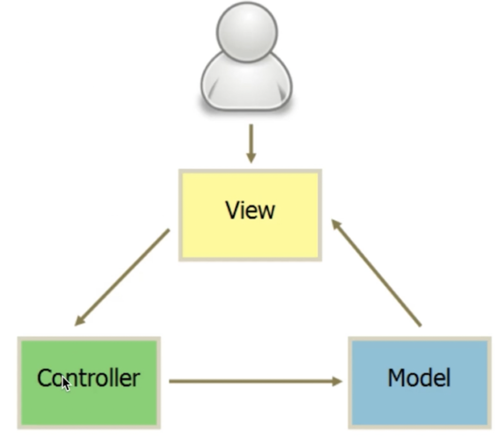
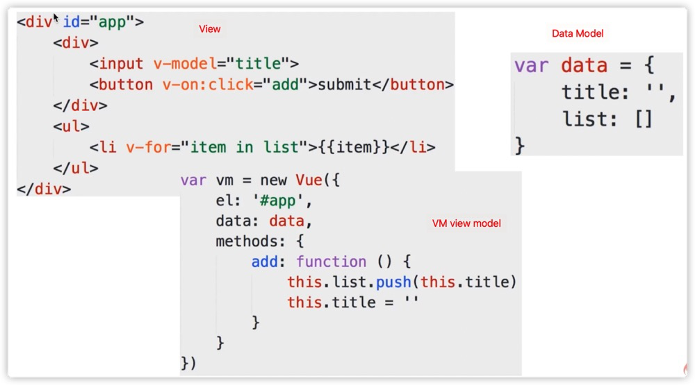
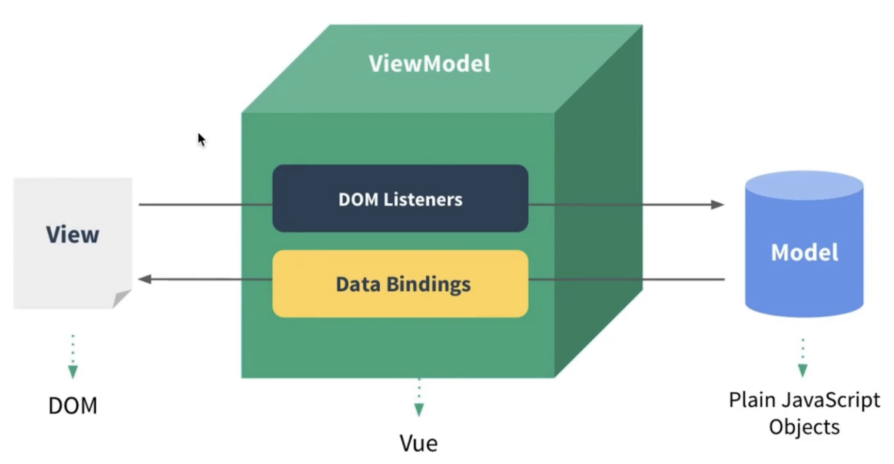

- 如何理解 MVVM
- **如何实现 MVVM**
- 解读 vue 源码——**看源码注重流程！！！**
- 说一下使用 jQuery 和使用框架的区别
- vue 如何实现响应式——改变了代码，浏览器立刻发生变化
- vue 如何解析模板
- vue 整体实现流程——**核心部分，核心部分之间的关系**

# jQuery 和框架的区别

**jquery 实现 todo-list**

```html
<body>
  <input type="text" id="input" />
  <button id="submit">submit</button>
  <div>
    <ul id="list"></ul>
  </div>
  <script src="https://cdn.bootcdn.net/ajax/libs/jquery/3.5.1/jquery.min.js"></script>
  <script>
    $('#submit').click(() => {
      let text = $('#input').val();
      let $li = $(`<li>${text}</li>`);
      $('#list').append($li);
      $('#input').val('');
    });
  </script>
</body>
```

## 区别

- 数据和视图分离，解耦（开放封闭原则）。
- 以数据驱动视图，只关心数据变化，DOM 操作被封装。


# MVVM 的理解

## MVC



用户修改视图 view 的按钮之类的 => 发送给 controller 控制器 => 修改数据模型 => 更改显示视图

## MVVM



**通过 view model 绑定数据和事件。**




## MVVM 框架的三要素

1. **响应式**：监听到 data 变化，页面立马发生变化。
2. **模板引擎**：模板如何被解析，指令如何处理。
3. **模板如何渲染成 html：**渲染过程，重绘过程。


## 总结

- MVVM — Model View ViewModel（连接器）
- ViewModel：联系 View 和 Model
  - view 可以通过**事件绑定**的方式影响到 model
  - model 可以通过**数据绑定**的形式影响 view


