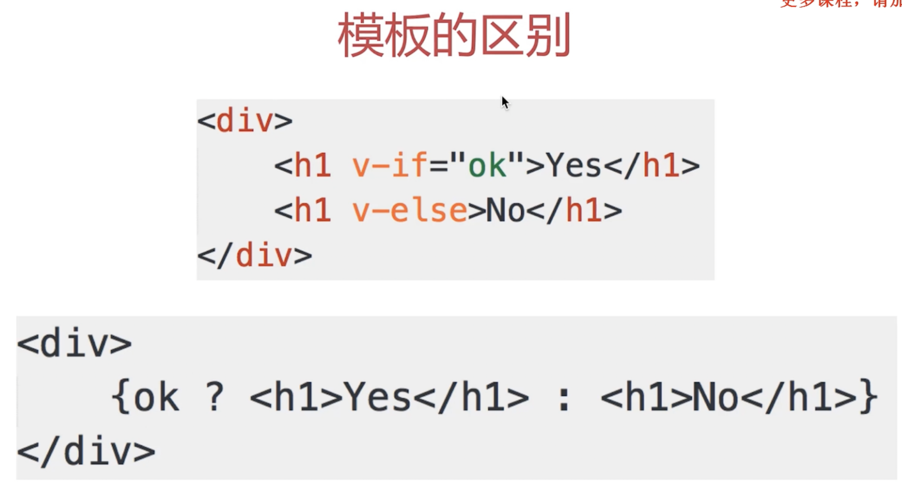
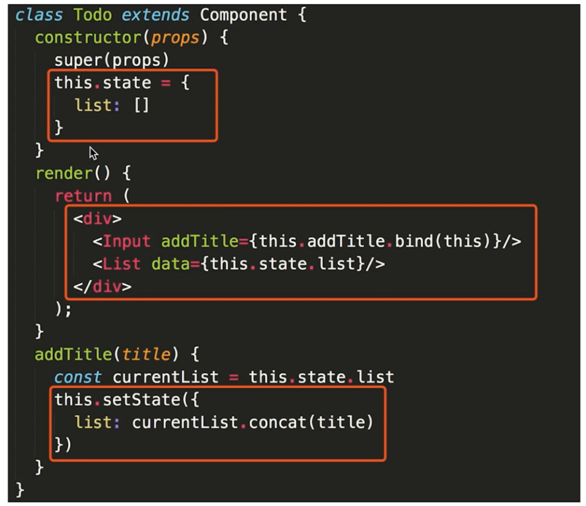

# React vs VUE

- 两者本质区别

  - vue —— 本质是 MVVM 框架，由 MVC 发展而来 —— 组件化属于扩展性的东西。
  - React —— 本质是前端组件化框架，由后端组件化发展而来

- 看模板和组件化的区别

  - vue —— 使用模板（最初是 angular 提出）=> 模板分离性更好

    

  - React —— 用 JSX 实现 => 语法上更好

- 两者共同点

  - 都支持组件化
  - 都是数据驱动视图

- 国内使用，vue 文档更易学，社区够大。
- 团队水平高使用 react，组件化和 JSX 好。

# 组件化的理解

## 组件的封装

需要封装的三个部分：

- 视图
- 数据
- 变化逻辑

## 组件的复用

- **props 的传递**
- 通过传不同的属性，达到复用

