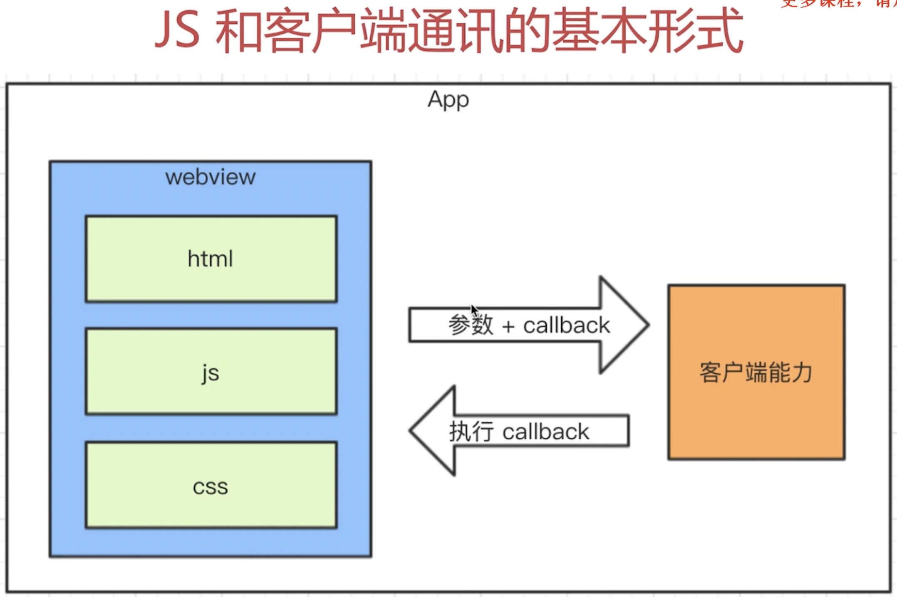
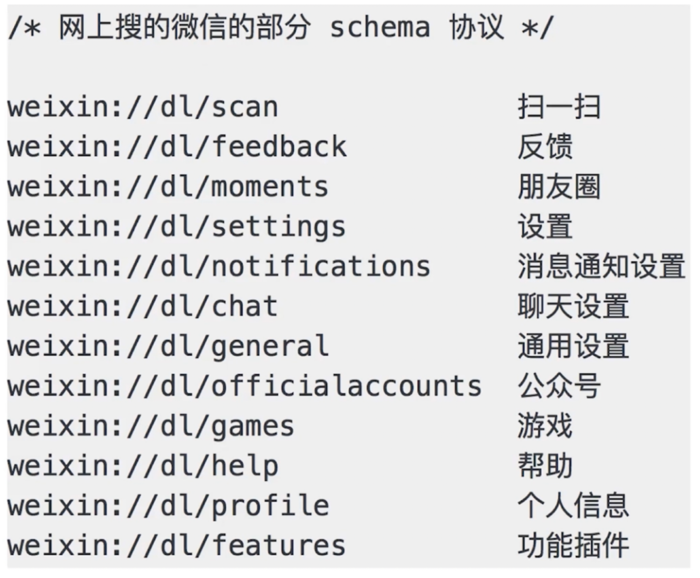
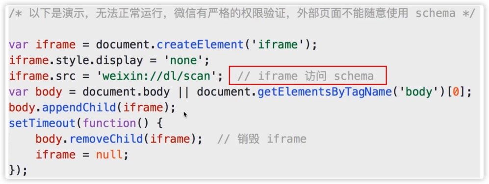
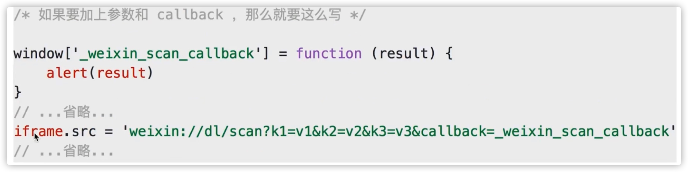

**问题：**

- 之前遗留的问题
- js 和客户端通讯的基本形式
  - 调用能力，传递参数，监听回调。
- schema 协议的简介和使用
- schema 使用的封装

# 之前的问题

- 新闻详情页使用 hybrid，前端如何获取新闻内容？
- **不能用 ajax。跨域且速度慢**

**解决办法：客户端来获取新闻内容，然后 js 进行通讯，拿到内容，渲染。**

**客户端获取新闻的好处 —— 更快**

- 传统 html，只能先加载页面然后 js 来获取内容，再加入。
- 客户端可以在用户点击发生时，甚至点击之前就先获取信息，然后加载。

# Schema 协议

- 前端 ajax 请求这些，都遵循网络请求 http/https 协议。
- 前端和客户端遵循 schema 协议来进行通讯

**schema 属于内部协议，外部无法访问。**

如果要加 callback，实际就是一个参数。

# 内置上线

**如何内置自己的封装函数，类似于把库引用进来。—— 内置到 app 中。**

- 封装的代码打包，内置到客户端。
- 客户端每次启动 webview，都默认执行 invoke.js
- 本地加载，更快。没有网络请求，黑客看不到 schema 协议，很安全。

