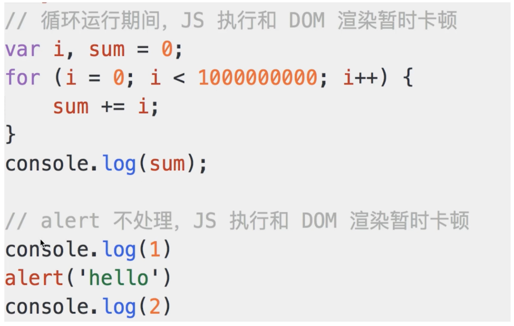
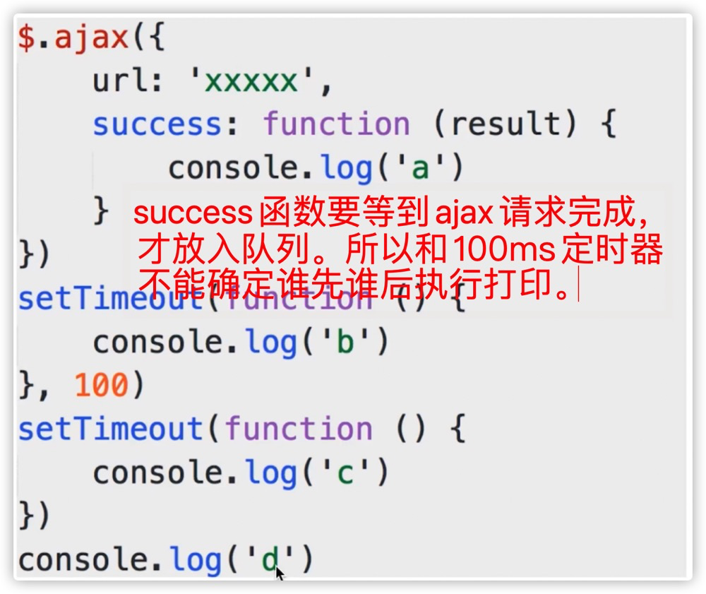

# 问题

- 什么是单线程，和异步有什么关系？
- 什么是 event-loop
- 何时被放入异步队列？
  1. 立即被放入（没有延时的 setTimeout 等）
  2. 等待一定时间，能够有确定时间
  3. **无法确定，ajax 请求类**
- 是否用过 jQuery的 Deferred（jquery中的异步解决方案）
- Promise 原理
- 介绍一下 async/await（和 Promise 的区别和联系）
- 总结一下当前 js 的解决异步的所有方案


# 单线程

单线程：同一时间只能做一件事情。**原因：避免 DOM 渲染的冲突。**所以这不是 js 的缺陷，这是为了配合 DOM。

解决单线程的方案：**异步。**



上述的循环和 alert 都会造成 DOM 的卡顿。执行之后，才能进行下一步。


## 原因

- 浏览器需要渲染 DOM，JS 也可以修改 DOM 结构
- 所以 JS 执行的时候，浏览器 DOM 只能选择暂停，因为同时修改，会冲突。
- 两端 JS 也不能同时执行（玩意都修改 DOM，就会冲突）。
- webworker 支持多线程，但是不能访问 DOM。

**但是，js 自己执行的时候，也不能就让耗时间的东西卡在那里，所以就诞生了异步。**

```js
console.log(100);
// 反正1000ms之后执行，就先执行其他的，再执行它
setTimeout(()=>console.log(200), 1000); 
console.log(300); 
console.log(400);
```


# 异步

- 问题1：没按照书写方式执行，可读性差。
- 问题2：**需要写 callback，不容易模块化。**

**各种异步方案就是为了解决上述问题的！**


# event-loop

知识串联：

- 单线程 —— 同时间只做一件事情
- 原因 —— 避免 DOM 渲染冲突
- 解决方案 —— 异步
- **实现方式 —— event loop**


event loop：

- 同步代码直接执行
- 异步函数放在**异步队列**中
- 带同步函数执行完毕，**轮询**执行**异步队列**的函数

轮询可以理解为，有个哨兵，一直在主进程和异步队列之间穿梭，一旦异步队列有东西，看到主进程没有可执行的函数了，立马拿过去。

所以下面这段代码的执行是：

1. **看到 1，要100 ms 之后执行，先跳过（注意不进入队列）**
2. 看到 2，不需要等待就执行的异步，放入队列
3. 3，同步事件，立马去执行
4. **来回观察**，等到100 ms 后发现了 1 函数，放入队列
5. 然后主进程执行 1

```js
// 注意是100ms之后放入异步队列中去
setTimeout(()=>console.log(1), 100);
// 立即放入异步队列总去
setTimeout(()=>console.log(2));
console.log(3);

// 执行顺序：3，2，等待100ms后，1
```

**像 ajax 类型的异步，无法预测到执行时间，所以不能确定** => 所以 js 只有执行的时候才能知道结果。




