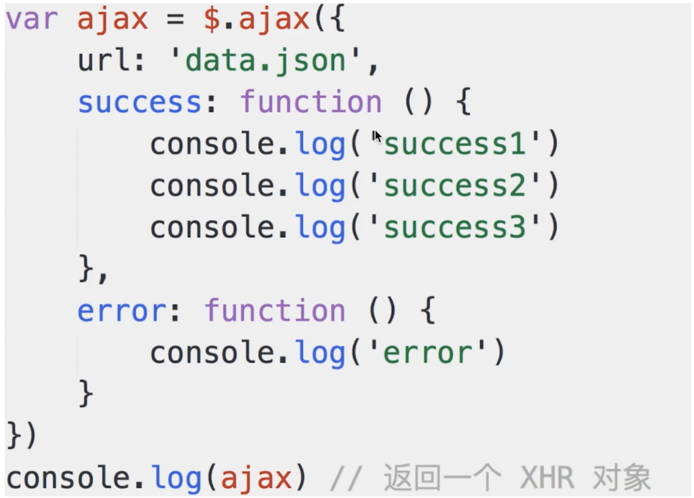
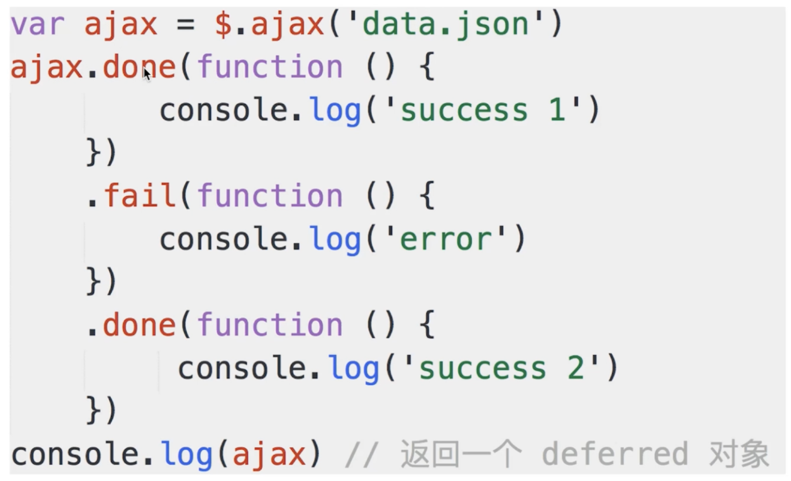
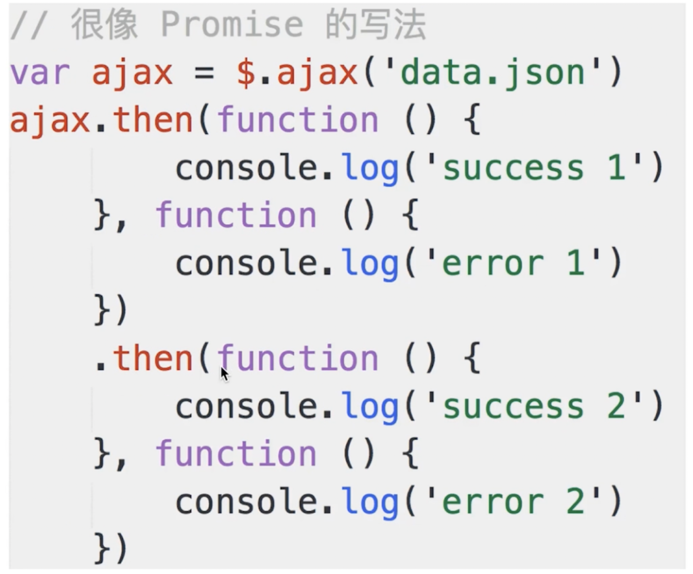

# 问题

- jQuery 1.5 的变化
- 使用 jQuery Deferred
- Promise 也是从 jQuery Deferred 转化过来的。


# jQuery 1.5 前后

**1.5 之前**




**1.5之后 => 链式操作**



**也可以这么写，很像 Promise**

 


**这个改变是因为 deferred 对象的引入。**


## 开放封闭原则

不管怎么变化，异步和单线程无法避免。**所以只能从写法上杜绝 callback 这种形式。改为 .then 能更清晰结构**

- 本质：**语法糖的形式，但是解耦了代码**
- 很好体现了，**开放封闭原则 => 对扩展开放，对修改封闭**

**如何体现开放封闭原则？**

1. 传统 callback，固定了 callback 的内容，没法扩展，不能有多个 callback	

   ```js
   // 以前传统的 callback 方式
   $.ajax({
     url:'...',
     success: function(){
       // 如果我想要在成功后多打印一个3，只能通过修改，不满足修改封闭
       console.log(1);
       console.log(2);
     }
     error: function(){
     	console.log('error')
   	}
   })
   ```

2. 链式调用方法：可以后面加多个链式，想加什么就加什么

   ```js
   let ajax = $.ajax('url');
   ajax.done(function(){
     	console.log('success 1')
   	})
   	.fail(function(){
   	  console.log('error')
   	})
   	.done(function(){
     	console.log('more')
   	})
   	// ... 这就是扩展。
   ajax => deferred 对象
   ```


# deferred 对象

## deferred 的形成

1. 下面是一段很简单的异步操作代码

   ```js
   let wait = function(){
   	let task = function(){
   		console.log('执行完成')
     };
     setTimeout(task, 1000);
   }
   wait();
   ```

2. 需求：执行 wait 函数之后，进行某些复杂操作，代码可能很多，有好几个步骤。=> **增强扩展性**

   ```js
   function waitHandle(){
     let dtd = $.Deffered(); // 创建一个 deffered 对象
     let wait = function(){
   		let task = function(){
   			console.log('执行完成');
         dtd.resolve(); // 表示异步任务成功完成
         // dtd.reject()
     	};
     	setTimeout(task, 1000);
       return dtd
   	}
   	return wait(dtd);
   }
   ```

   **相当于把 dtd 函数在 wait 中加工了一下，然后再 return 出去。**

   ```js
   let w = waitHandle();
   w.then(成功函数， 失败函数).then().then...
   ```


## 总结

Deferred 对象有两类 API：

- 主动触发：dtd.resolve()、dtd.reject()
- 被动监听：dtd.then、dtd.done、did.fail
- **两者应该分开！否则后果很严重。**
- 解决可以主动控制成功失败的 bug => 使用 `dtd.promise()`


